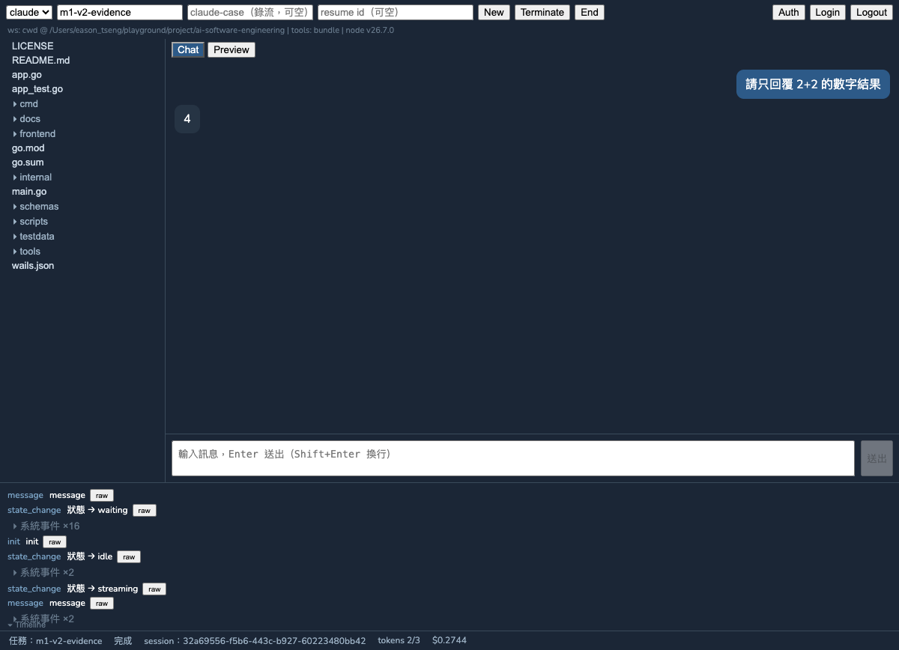
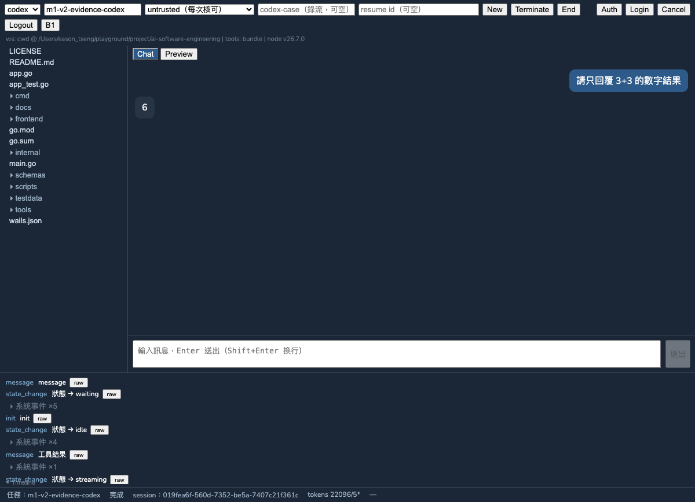
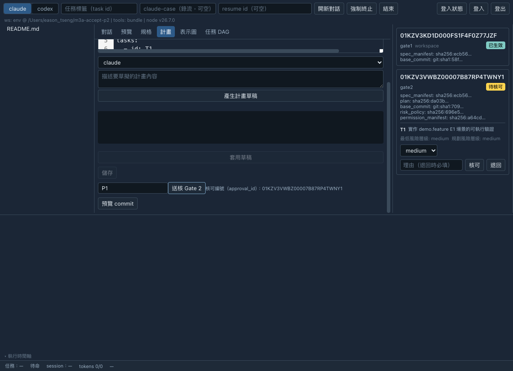
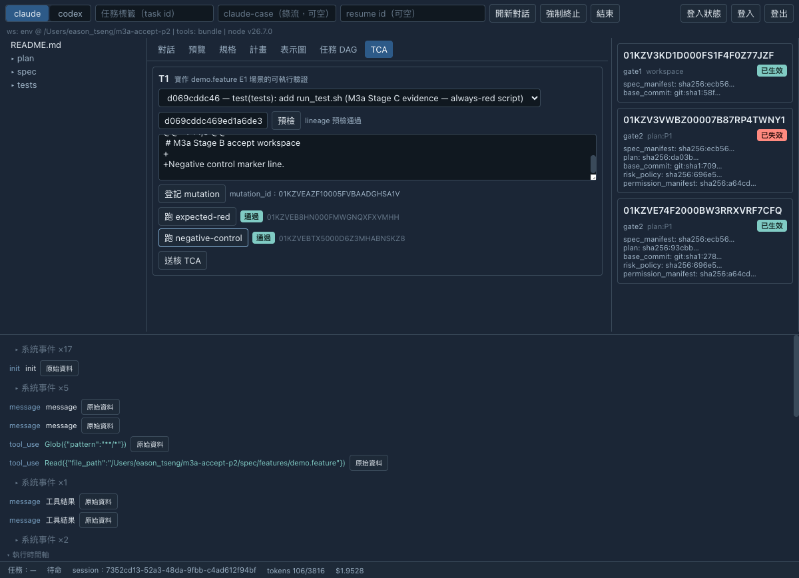
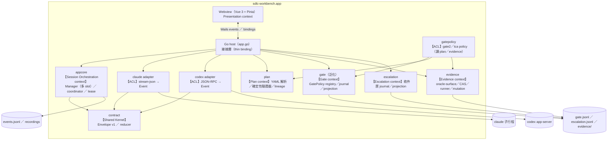
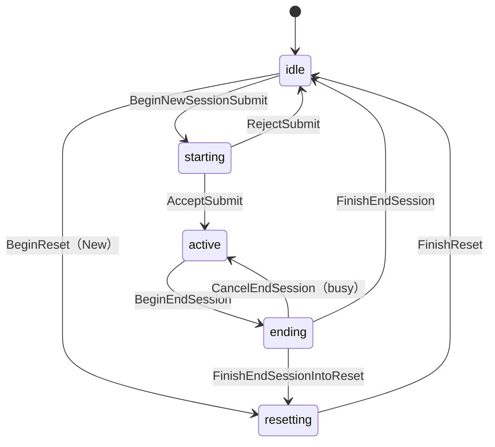

# SDLC Workbench

<div align="center">


**一套整合 Claude Code 與 Codex 的桌面 AI 開發工作台**

SDLC Workbench 可在同一個桌面介面中操作 Claude Code CLI 與 Codex CLI，支援多輪對話、統一的工具核可（approval）流程、
即時 session 狀態、完整稽核事件與 wire 錄流（原始通訊紀錄）。本專案以 Go、Wails v2、Vue 3 與 TypeScript 實作，
固定 CLI 版本並凍結事件契約，且依里程碑完成自動化測試與實機驗收。

</div>

---

## 截圖

<div align="center">

**Claude session** — 多輪對話、事件 Timeline、SC2 StatusBar（累計 token 與 cost）


**Codex session** — 同一介面、provider 最新 usage（`*` 標示）、長駐 app-server


**Gate 2 主控台** — 逐 task risk 決議（selected < planner 需 override_reason）


**TCA workspace** — Stage C 測試契約核可入口，expected-red／negative-control 兩型 evidence


</div>

---

## 功能

### 雙 provider session（可並存）
- **Claude Code**（固定版本 `2.1.223`）— `claude -p` stream-json 多輪子行程：stdin 保持開啟逐輪送訊息、
  自然收尾 exit 0；session id 綁定 workspace，跨 app 重啟可 resume（異 cwd 拒絕）
- **Codex**（固定版本 `0.146.1`）— 長駐 `codex app-server` JSON-RPC：thread/turn 模型、
  `thread/resume` 引用前文、單一 server 跨 session 重用
- **雙 provider session 並存**——切換 provider 時對話視窗跟著切、session 保留，一邊 turn 進行中另一邊仍可送訊息；
  切回零丟失，背景以 unread 計數提示
- 每個 provider 各自維持一個 active session；按下「開新對話」（New）只會結束並重設目前 provider 的 session，
  不影響另一個 provider（先 quiesce 舊 session、等事件收乾與錄流收尾，再開新）

### 重啟自動恢復
- 未按 New 的 view 於 app 重啟後還原對話（重放 `events.jsonl`），並在下一輪自動 resume 接續前文
- 不新增第二種持久化格式；稽核事件流即恢復來源

### 工具核可（approval）
- 兩個 provider 共用同一個 ApprovalDialog，決定與理由全程稽核
- **Claude** — 經 MCP permission-prompt-tool（app 內建 `mcp-approval` 子命令 + unix socket broker）
- **Codex** — 經 app-server `requestApproval`；`approvalPolicy` 可選 `untrusted`（每次核可）/
  `on-request` / `never`（不核可，風險自負）
- 逾時時採 fail-closed，自動拒絕核可請求；過期的對話框會自動關閉，多個視窗也會同步移除

### 規格工作區與 Gate 1（M2 Stage A）
- **規格工作區** — 在 app 內編輯 `spec/`（CodeMirror 6，Gherkin 語法標示）；三個 AI 輔助按鈕（草擬 Gherkin、
  歧義偵測、oracle 覆蓋檢查）輸出進草稿區、由人 accept 後才寫檔
- **兩階段 scoped commit** — 先預覽 diff、確認後才 commit，且保證「確認的內容就是實際 commit」，不影響納管範圍外的變更
- **Gate 1 主控台** — 送核（綁定 spec manifest digest ＋ base commit）、核可／退回＋理由欄；核可後規格變更即時觸發
  STALE 失效（gate_op 稽核只追加，狀態由 projection 重算）
- **SpecAssist（隔離 one-shot）** — AI 輔助以獨立 one-shot 執行，provider 端強制零 workspace 變更
  （Claude `--tools ""`、Codex `sandboxPolicy=readOnly`）；輸出不進一般對話、不污染 provider 用量
- **表示圖層** — 瀏覽／監看 `spec/context-map/*.mmd`，變更自動重渲染（重用 mermaid strict 設定）

### 計畫工作區與 Gate 2（M3a Stage B）
- **Plan Workspace** — 結構化 plan YAML 編輯（CodeMirror 6）＋PlannerAssist 唯讀 one-shot 產草稿進草稿區、人 accept 才寫檔；
  沿用 SpecWorkspace 的兩階段 Preview／Confirm scoped commit（產生 `plan_commit`，dirty-tree 拒核）
- **DagPane** — plan 解析為 mermaid flowchart 的唯讀 projection，plan 檔變更自動重渲染
- **確定性驗證器** — plan schema／DAG 無環／依賴存在／task ID 唯一／risk floor（`minimum_risk_tier` 依 risk policy 重算、
  `planner_risk_tier ≥ minimum`）／scenario ref 存在於 active Gate 1 spec manifest
- **Lineage 封閉** — `analysis_base_commit..plan_commit` 只能改 `plan/**`，混入其他 code 變更即拒核
- **Gate 2 主控台** — 送核綁定 spec_manifest／plan／base_commit（＝plan_commit）／risk_policy／permission_manifest；
  核可時逐 task 選定 `selected_risk_tier`（低於 planner 建議需 `override_reason`、低於 minimum 一律拒絕），
  核可記錄含依 task_id 排序的完整 `risk_decisions`
- **STALE** — spec／plan／risk policy／權限清單變更即失效；`base_commit` 為歷史錨點，HEAD 前移不觸發失效

### Test Contract Approval（本機 evidence runner）
- **Oracle-surface 宣告** — path patterns 與每個 task 的 test contract descriptor（command／matcher）在 Stage B、
  Gate 2 送核前完成宣告，隨 plan 一併核可
- **Evidence runner** — 每次執行使用唯一 detached worktree（系統暫存目錄）、結構化 `executable+argv[]`（不接受 shell 字串）、
  清理敏感環境變數、輸出上限與 timeout（超限／逾時判定為 `result: error`）
- **兩型 evidence** — `expected_red`（紅燈特徵匹配已核可 descriptor）／`negative_control`（登記 mutation 後在同一
  `test_commit` 套用，驗證同一組測試能抓到回歸）；判定一律依已核可 test contract descriptor，不接受臨場輸入
- **TCA 核可** — 七＋條一致性 validator（role 與 kind 相符、兩筆皆 passed、snapshot 一致、descriptor 精確相符、
  mutation 綁定對齊等）拒收不相干證據；綁定所依 `gate2_approval` 的完整記錄 digest 與 `plan_commit`，
  Gate 2 STALE／superseded 時連動 STALE
- **誠實邊界** — 本機可重建、可稽核的記錄，**非 CI enforcement**；runner **不宣稱 sandbox**，不限制測試程式的網路與
  檔案系統能力

### 升級收件匣
- **三態處置** — `open → acknowledged → resolved`，append-only transition＋projection；resolved 必填
  resolution／reason／actor
- **系統自動來源** — risk 無法分類、binding 缺漏、Gate 2／TCA 綁定 STALE、evidence runner 錯誤／逾時／輸出超限、
  negative-control 未抓到 mutation、journal degraded 等（condition key 只對尚未 resolved 的項目去重）
- **阻擋規則** — 每項有 `block_scope`；未 resolve 的 blocking 項目擋下對應核可（`GateDecide` 固定順序：
  reconcile → 硬性 validator → 修正版核可解除同 scope 舊 stale blocker → blocking 檢查 → append）
- **硬性項目** — STALE／缺 binding／journal degraded 等使用者不能手動 resolve，只能修復後由系統重新驗證解除；
  可 acknowledge 但不解除阻擋

### 繁體中文介面（i18n）
- 以 vue-i18n（Composition API）語系化，預設繁體中文並保留完整英文 locale
- 技術術語（provider、session、token、Gherkin、oracle、commit）與資料契約欄位名維持原文；
  後端原始錯誤內容不翻譯

### SC2 StatusBar
單一狀態列可同時回答四個問題：目前是哪個任務、進行到哪個狀態、使用哪個 session，以及已耗用多少資源。

| 欄位 | 內容 |
|---|---|
| 任務 | 使用者標記的 task label |
| 狀態 | reducer 推導：waiting / streaming / tool_running / **awaiting_approval**（醒目顯示）/ done / failed |
| Session | Claude session id 或 Codex thread id |
| Token | 累計（`session_total`）或 provider 最新值（`provider_latest`，以 `*`＋tooltip 明示，不標示為累計值） |
| Cost | Claude 累加 USD；Codex 無回報時顯示 `—` |

### Chat 與 Timeline
- **Streaming 逐 token** 渲染＋游標；thinking 內容摺疊於預設收合的 `<details>`
- **Follow-tail** — 上捲即停止自動跟隨，回到底部或送出訊息恢復（BAT 慣例）
- **Tool 卡片** — 工具名＋參數節錄（80-rune 截斷）＋best-effort 狀態（Codex `inProgress → completed`）
- **雜訊摺疊** — 連續系統事件自動收合為一列，可展開；每筆事件可看原始 JSON
- Timeline 面板可整個收合、可拖曳調整高度（記憶設定），Chat 區域隨之擴大

### 檔案樹與預覽
- Workspace 採懶載入樹狀瀏覽，並以 canonical path 檢查限制存取範圍；指向 workspace 外部的 symlink 一律拒絕，
  單一檔案大小上限為 1 MB
- Markdown 預覽：使用 DOMPurify 清理 HTML ＋ mermaid `strict` 渲染（```mermaid``` 區塊 → SVG）
- `.mmd` 檔案存檔 1 秒內自動重渲染（fsnotify 監看）

### 稽核與錄流
- 所有事件都會以 **Envelope v1** 格式寫入 `events.jsonl`：event_id（ULID）嚴格遞增，
  且每輪的使用者訊息一定先於 provider 事件寫入（submission coordinator）；稽核寫入失敗 fail-loud 直達 UI
- 可選的每個 session 的 **wire 錄流**（Claude ndjson／Codex jsonl）＋ meta
  （argv、cwd、exit code、stderr tail）；收尾由 RecordingLease 保證恰一次

### 官方登入
- App 不收密碼、不保管 token
- Claude：開系統終端機跑 `claude auth login` ＋ 背景輪詢登入狀態
- Codex：app-server `account/login/start` 開瀏覽器 OAuth，可取消

---

## 快速開始

### 從原始碼建置

需求：macOS、Go 1.26+、Node.js、[Wails CLI v2](https://wails.io/docs/gettingstarted/installation)

```bash
git clone https://github.com/slam0504/ai-software-engineering.git
cd ai-software-engineering

# 開發模式（原生視窗 + http://localhost:34115 browser devserver）
wails dev

# 產出 .app
wails build                  # → build/bin/sdlc-workbench.app
./scripts/bundle-clis.sh     # 把固定版本的 CLI 裝進 .app 的 Resources/tools/
```

> **固定 CLI 版本**：claude `2.1.223`、codex `0.146.1`。wire 行為以此版本實測凍結，
> 請勿隨意升級；升級版本需重跑 live probe 與驗收矩陣。Codex CLI 是 node script，
> 執行期需要 node（GUI 啟動時會自動探測 `/usr/local/bin`、`/opt/homebrew/bin`）。

### 測試

```bash
go vet ./...
go test -race ./... -count=1     # 全 package，含 production-path barrier 測試
npm --prefix frontend run test   # vitest（store／scroll／sanitizer／i18n／元件）
npm --prefix frontend run build  # vue-tsc typecheck + vite build
```

---

## 架構

參考 ports & adapters（hexagonal）慣例，核心邏輯與 wire／UI 隔離：

```
frontend/                Vue 3 + TS + Pinia（Wails webview）
  src/stores/session.ts    唯一事件入口 apply(envelope)：chat／timeline／totals／state 路由
  src/i18n/                vue-i18n：locale（zh-TW／en）、狀態 key 映射、非元件 t() 入口
  src/components/          ChatPanel／Timeline／StatusBar／FileTree／PreviewPane／
                           SettingsBar／ApprovalDialog／GateConsole／SpecWorkspace／DiagramPane
app.go                   薄綁定層：workspace／CLI 解析、Wails 事件出口、provider 接線、
                         Spec／Gate／SpecAssist 綁定、spec/ 遞迴 watcher
internal/
  contract/              Envelope v1（凍結契約）：ULID、Wrap、state reducer、workspace event lane
  appcore/               可測核心：Manager（單一序列化 emit 入口）、submission coordinator、
                         session lifecycle 狀態機、RecordingLease、EmitWorkspace／EmitAssist
  spec/                  規格庫：canonical manifest、committed snapshot、git repo、兩階段 SpecCommit
  gate/                  Gate 引擎（泛化 gate1／gate2／tca）：GatePolicy registry、ApprovalRecord v2／
                         transition、projection reducer、gate_op 單交易 journal（append-only ＋ tail 修復）
  plan/                  Plan 領域（純核心）：YAML 解析、確定性驗證器（schema／cycle／依賴／risk floor）、
                         lineage 驗證、risk policy 重算
  gatepolicy/            Gate2／TCA policy（讀 plan／evidence 的 ACL）：bindings schema、decision
                         validator、STALE resolver
  evidence/              Test Contract 證據鏈：oracle-surface 宣告、CAS store、mutation 登記、
                         detached worktree runner、matcher／結果分類
  escalation/            升級收件匣：item journal、append-only transition、projection、
                         block_scope 查詢
  assist/                SpecAssist／PlanAssist 隔離 one-shot（Claude／Codex，provider-enforced 零變更）
  ports/                 consumer-owned 介面（Turns、Exit）
  claude/                Claude CLI adapter：stream-json decode、多輪 session、resume registry
  codex/                 Codex app-server adapter：JSON-RPC conn、ThreadRunner、錄流 tee
  proc/                  子行程 supervisor（process group、TERM→KILL、stderr tail）
  approval/              Claude 核可 broker（unix socket、逾時 fail-closed）
  recorder/              wire 錄流（ndjson／jsonl + meta）
```

關鍵設計約束（詳見 [`docs/architecture/`](docs/architecture/)）：

- **單一序列化事件入口** — 所有 provider 事件經 `appcore.Manager.Emit`（同一 mutex 完成
  wrap→totals→sink→emit→state_change），輸出 event_id 嚴格遞增，稽核失敗 fail-loud；
  workspace／assist 事件走獨立出口，不進 provider slot
- **Submission coordinator** — 送訊息採 Begin→provider 呼叫→Accept／Reject 三段 ownership 交易；
  provider 事件會在 Accept 前暫存於 queue，保證 UI 與稽核都是 user message 先行
- **Usage 語意雙軌** — Claude per-turn 累加（`session_total`）、Codex snapshot 覆寫
  （`provider_latest`）；UI 以 `*` 區分，不把最新值標示為累計值
- **STALE 權威判定** — Gate 1 的失效以讀取時重算 spec manifest 為權威、watcher 僅為通知層；
  gate_op journal append-only、狀態一律由 projection 重算，STALE 後不復活
- **收尾 ownership** — 錄流收尾多來源併發時由 `RecordingLease` 保證恰一次；
  Claude 收尾走 `CloseSequence`（關 stdin→quiesce→必要時 terminate→exit 證據），
  未知結局不偽裝 exit 0

### 架構圖

依 SDLC v2 流程（BDD→DDD→TDD），每個里程碑的領域模型以 mermaid diagram-as-code 維護於
[`docs/architecture/diagrams/`](docs/architecture/diagrams/)、行為規格（Gherkin）於
[`docs/architecture/features/`](docs/architecture/features/)；圖與實作偏差同 PR 修正。

**Bounded Context Map**



**Session lifecycle（per provider slot）**



其餘圖（C4 Context、Manager aggregate、SendMessage／provider 切換 sequence）見 diagrams 目錄。

### 技術組合

| 層 | 技術 |
|---|---|
| Host | Go 1.26、Wails v2 |
| Frontend | Vue 3、TypeScript、Pinia、Vite、vue-i18n、CodeMirror 6 |
| 渲染 | marked + DOMPurify（Markdown）、Mermaid（圖表，strict） |
| 測試 | `go test -race`、vitest + @vue/test-utils、wire replay fixtures |
| Agent CLIs | claude 2.1.223（native binary）、codex 0.146.1（node script） |

---

## 設定

### 環境變數

| 變數 | 用途 |
|---|---|
| `WORKBENCH_WORKSPACE` | 覆寫 workspace 根目錄（預設：可寫的 cwd → home） |
| `WORKBENCH_TOOLS_DIR` | 覆寫 CLI tools 目錄（預設：bundle Resources/tools → repo tools/） |
| `WORKBENCH_APPROVAL_TIMEOUT` | 核可逾時（Go duration，如 `5s`；逾時自動 deny） |
| `WORKBENCH_MCP_COMMAND_OVERRIDE` | 測試用：覆寫 MCP approval server 指令 |

### 執行期狀態（workspace 的 `.workbench/`）

| 檔案 | 內容 |
|---|---|
| `events.jsonl` | Envelope v1 稽核事件流（UI 所見即所錄） |
| `gate.jsonl` | Gate（gate1／gate2／tca 泛化）的 gate_op 稽核（append-only：gate_request／approval_record／transition） |
| `escalation.jsonl` | 升級收件匣稽核（append-only：escalation_item／escalation_transition） |
| `evidence/` | evidence journal（evidence.jsonl）＋mutation／stdout／stderr 的 CAS 內容定址儲存 |
| `audit.jsonl` | App 層稽核（啟動資訊、核可決定、登入事件） |
| `recordings/` | wire 錄流與 meta |
| `sessions.json` | Claude resume registry（session id ↔ cwd 綁定） |

---

## 開發藍圖

| 里程碑 | 狀態 | 內容 |
|---|---|---|
| **M0** spike | ✅ merged | 雙 CLI wire 打通、核可 E2E、錄流／replay、驗收矩陣 A／B／N／R（[結果](docs/spikes/m0-results.md)） |
| **M1** MVP | ✅ merged | Envelope v1 契約、序列化 Manager＋coordinator、多輪雙 provider、三欄 UI、驗收矩陣 V0–V6（[結果](docs/spikes/m1-results.md)） |
| **M1.5** 雙 session | ✅ merged | Provider 切換時對話視窗跟著切、雙 session 並存、重啟自動恢復、design token＋視覺 polish（[結果](docs/spikes/m1.5-results.md)） |
| **M2** Stage A 閉環 | ✅ merged | 規格工作區、Gate 1 主控台、ApprovalRecord／manifest／STALE、SpecAssist 隔離 one-shot（SC1、SC3） |
| **i18n** 繁中介面 | ✅ merged | vue-i18n 語系化，預設繁體中文＋完整英文 locale |
| **M3a** 計畫與測試契約閉環 | ✅ merged | 任務 DAG、Gate 2、Test Contract Approval（本機 evidence runner）、升級收件匣、STALE 契約（SC3 擴及 Gate 2／TCA；多 session 並看延後至 **M3b**） |
| **M4** 完整任務路徑 | 未開始 | 證據鏈、Gate 3 主控台、forge adapter（SC4：單任務全程不切出 app） |
| 後續候選：ACP／多 Agent Runtime | 主線完成後再規劃 | ACP client adapter（OpenCode 首個目標）、保留 Claude／Codex 原生 adapter、capability negotiation（詳見 [`docs/architecture/`](docs/architecture/sdlc-workbench-app-plan.md) §7.1；**不在近期交付範圍**） |

每個里程碑的執行計畫經外部審核後凍結於 [`docs/architecture/`](docs/architecture/)（`SHA256SUMS` 可驗證），
實作偏差與殘餘風險記錄於對應的驗收結果文件。

---

## 授權

[MIT](LICENSE) © 2026 slam0504

## 致謝

- UI 互動慣例參考 [Better Agent Terminal](https://github.com/tony1223/better-agent-terminal)（MIT）
  與 VS Code 的佈局慣例（sidebar／editor／panel／status bar）
- [Wails](https://wails.io/) — Go 桌面應用框架
