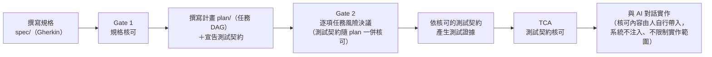

# SDLC Workbench

<div align="center">


**一套整合 Claude Code 與 Codex 的桌面 AI 開發工作台——可將規格、計畫與測試證據納入人類核可，全程留下稽核紀錄**

</div>

AI 寫程式碼很快，但「規格理解對不對、計畫的風險誰承擔、測試證據可不可信」仍需要人把關。
SDLC Workbench 把這些把關點做成明確的關卡（gate）：AI 負責草擬，人類審核後核可，每個決定都寫入
只允許附加的稽核紀錄——從撰寫規格、核可計畫、驗證測試證據，到與 AI 多輪對話實作，
全部在同一個桌面 app 內完成。

適合想把 Claude Code／Codex 納入有紀律開發流程的工程師：既要 AI 的速度，也要每一步可追溯、可稽核。
也可以只把它當成雙 provider 的 AI 對話工作台使用——多輪對話、統一的工具核可（approval）流程、
即時 session 狀態、完整稽核事件與 wire log（原始通訊紀錄），不必走流程關卡。

本專案以 Go、Wails v2、Vue 3 與 TypeScript 實作，固定 CLI 版本並凍結事件契約，
且依里程碑完成自動化測試與實機驗收。

---

## 截圖

<div align="center">

**Claude session** — 多輪對話、事件 Timeline、SC2 StatusBar（累計 token 與費用）


**Codex session** — 同一介面、provider 最新用量（以 `*` 標示）、長駐 app-server


**Gate 2 主控台** — 逐項任務的風險決議（所選風險等級低於規劃器建議時必須填寫 `override_reason`）


**TCA workspace** — Stage C 測試契約核可入口，expected-red 與 negative-control 兩類測試證據


</div>

---

## 運作流程

Workbench 有兩層，各自獨立可用：

**對話工作台（隨開即用）**——雙 provider、多 session 的 AI 對話環境：送訊息、看串流輸出、
核可工具呼叫、重啟後自動恢復。不需要走任何流程關卡就能使用。

**SDLC 流程關卡**——把「規格 → 計畫 → 測試契約」的每一步變成明確的核可節點。
AI 協助草擬與實作，核可決定由人作成、並留有紀錄：

> **Enforcement 邊界**——Gate 1、Gate 2 與 TCA 約束的是規格、計畫、測試契約及其證據。
> 一般 Claude／Codex session **不會**自動取得已核可內容，也不會依 `permissions_ref` 或
> 計畫範圍限制檔案操作；工具核可只決定單次呼叫是否放行。目前版本尚無
> implementation-output gate——Gate 3 與平台 enforcement 屬未開始的 M4（見里程碑）。



每個關卡各擋一類問題：

- **Gate 1（規格核可）**——規格內容經人確認才生效；核可後規格一有變更，狀態立即轉為
  **STALE**（失效，需重新送核），避免「核可的是舊版、實作的是新版」。
- **Gate 2（計畫風險決議）**——計畫先通過確定性驗證（schema、依賴、無循環），再由人逐項任務決定風險等級；
  選得比規劃器建議低就必須填寫理由，低於政策底線一律拒絕。
- **TCA（測試契約核可）**——測試證據要同時通過兩類驗證：預期失敗特徵相符（expected-red），
  以及刻意植入的錯誤能被同一組測試偵測（negative-control）——證明這組測試確實能偵測目標行為被破壞，證據才算數。
- **阻擋事項收件匣**——風險無法分類、綁定失效、證據執行異常等情況會自動建立阻擋項目，
  未解決前擋下對應的核可。

所有核可、狀態轉移與 AI 對話事件都寫入只允許附加的稽核檔（workspace 的 `.workbench/`）；
Gate、TCA 與阻擋事項的目前狀態一律由既有紀錄重新計算（projection），
這三類紀錄沒有可直接修改的「目前狀態」欄位。

---

## 快速開始

### 從原始碼建置

需求：macOS、Go 1.26+、Node.js、[Wails CLI v2](https://wails.io/docs/gettingstarted/installation)

```bash
git clone https://github.com/slam0504/ai-software-engineering.git
cd ai-software-engineering

# 開發模式（原生視窗 + http://localhost:34115 瀏覽器開發伺服器）
wails dev

# 建置 .app
wails build                  # → build/bin/sdlc-workbench.app
./scripts/bundle-clis.sh     # 把固定版本的 CLI 封裝至 .app 的 Resources/tools/
```

> **固定 CLI 版本**：claude `2.1.223`、codex `0.146.1`。CLI 的通訊行為以此版本實測凍結，
> 請勿隨意升級；升級版本需重跑實際 CLI 連線探測（live probe）與驗收矩陣。Codex CLI 是 node script，
> 執行期需要 node（GUI 啟動時會自動偵測 `/usr/local/bin`、`/opt/homebrew/bin`）。

### 第一次使用

1. **啟動 app 並確認 workspace**——workspace 決定 AI 操作與稽核紀錄的落點
   （執行期狀態都寫在 workspace 的 `.workbench/` 內），依啟動方式而不同：
   - `wails dev`：repo 目錄就是 workspace。
   - **從 Finder 開啟 .app：通常會退回使用者家目錄**（Finder 啟動時工作目錄是 `/`，不可寫）。
   - 指定專案目錄啟動：
     `WORKBENCH_WORKSPACE=/path/to/project ./build/bin/sdlc-workbench.app/Contents/MacOS/sdlc-workbench`
     （開發模式則是 `export WORKBENCH_WORKSPACE=/path/to/project && wails dev`）。

   第一次送出訊息前，先確認畫面頂端的 `ws: <source> @ <path>` 是你要的目錄——
   否則 AI 會在家目錄而不是你的專案內操作。
2. **登入 provider**——在設定列操作：Claude 會開啟系統終端機執行 `claude auth login`；
   Codex 走瀏覽器 OAuth。App 不接收密碼、不保管 token。
3. **建立第一個 session**——左欄 SessionList 選擇 provider 建立 session，在輸入框送出第一句訊息，
   即可看到串流回覆、Timeline 事件與狀態列的 token 統計。
4. **核可第一個工具呼叫**——AI 要求執行工具（改檔案、跑指令）時會跳出核可對話框，
   核可或拒絕都會寫入稽核紀錄；逾時預設拒絕（fail-closed）。
5. **重啟驗證**——直接關掉 app 再開：未按「開新對話」的 session 會還原對話內容，下一輪自動接續前文。

流程關卡（規格／計畫／測試契約）的入口是介面中的 Spec、Plan、TCA 工作區與 Gate 主控台，
整體順序見上方[運作流程](#運作流程)。

### 測試

從乾淨 checkout 依序執行（順序有意義：root 套件 `go:embed` 需要 `frontend/dist`，所以 frontend 先建）。**下列為主要本機檢查**，每條對應 CI 的同名 job；**完整 CI 步驟以 [`.github/workflows/ci.yml`](.github/workflows/ci.yml) 為準**：

```bash
npm --prefix frontend ci
npm --prefix frontend run test                          # CI job: frontend — vitest（store／scroll／sanitizer／i18n／元件）
npm --prefix frontend run build                         # CI job: frontend — vue-tsc typecheck + vite build → frontend/dist
test -z "$(gofmt -l .)"                                 # CI job: go — 格式檢查；未通過會使該 job 中止，其後步驟不會執行
go build ./...                                          # CI job: go
go vet ./...                                            # CI job: go
go test -race ./... -count=1                            # CI job: go — 所有 package，含 production path 的同步與競態測試
(cd schemas/codex && shasum -a 256 -c SHA256SUMS)       # CI job: checksums — Codex app-server schema 凍結
(cd docs/architecture && shasum -a 256 -c SHA256SUMS)   # CI job: checksums — 里程碑 plan 凍結（m0／m1／m1.5）
```

上列不涵蓋第四個 job `wails-build`——該 job 由 Wails CLI 安裝、`wails build -s`、CLI 工具安裝、`scripts/check-cli.sh` 檢查、`scripts/bundle-clis.sh` 封裝與 artifact 上傳等**各自獨立的步驟**組成，逐步內容見 [`ci.yml`](.github/workflows/ci.yml) 的 `wails-build` job。

四個 job（`frontend`／`go`／`wails-build`／`checksums`）是 `main` 的 required checks：合併規則（ruleset、rebase-only、紅燈處置與維護程序）見 [`docs/architecture/ci-merge-policy.md`](docs/architecture/ci-merge-policy.md)；CI 的耗時分布量測見 [`docs/architecture/wall-clock-test-register.md`](docs/architecture/wall-clock-test-register.md) A-1 段。

> **牆鐘相依測試的紅燈怎麼判**：Go 六條與前端兩條具名測試已由 Pre-M4 B1 系列處置完畢，有效名單與規則以
> [`docs/architecture/wall-clock-test-register.md`](docs/architecture/wall-clock-test-register.md) 為準——
> 這八條紅燈**先分類**（命中契約斷言或契約路徑卡死＝回歸，不得單獨重跑吸收；setup／資源失效＝該次無效並揭露），
> 其他前端測試依同文件 B 段的一般規則。`docs/spikes/m3b-results.md` §7 為 2026-08-21 的歷史觀察，§7.1 為處置快照。

### Browser E2E（B3a-1）

用真實 `wails dev`＋系統 Chrome 跑一條端到端 smoke（規格分頁 → 開檔 → 編輯 → 存檔 → 核對磁碟），
涵蓋 Vue UI、Go backend、Wails 開發伺服器的 IPC 與事件；不呼叫真的 claude／codex（用 tripwire 型
假 CLI）。**只是本機開發用的驗證入口，目前不是 CI 的一部分**（CI 可行性另立票）。

**與 native GUI 驗收的界線**：Browser E2E 不涵蓋 WKWebView 渲染、native window、打包後的
`.app`（`tools: bundle`）與 macOS 權限（TCC）。**E2E 通過不代表 native GUI 驗收通過**，兩者是
不同的驗證面。

```bash
npm --prefix frontend ci                          # 準備階段（可用外部網路）：安裝相依套件
npm --prefix frontend run test:e2e                # 執行階段（設計上不需外部網路）：跑一次 smoke
E2E_KEEP_ARTIFACTS=1 npm --prefix frontend run test:e2e   # 成功也保留證據目錄
E2E_BROWSER=chromium npm --prefix frontend run test:e2e   # 改用 Playwright 內建 Chromium
                                                            # （需先 `npx playwright install chromium`）
npm --prefix frontend run test:e2e:controls        # 存檔判定受控對照（對照 A／B，見 §2.5）
```

- **證據目錄**：`frontend/e2e/.artifacts/<run-id>/`（已加入 `.gitignore`）。成功預設清除，失敗一律
  保留並在終端機印出路徑。內容包含 `harness.log`（預檢第一步就開始寫，啟動失敗也一定有）、
  `wails-dev.log`、`invocations.log`／`preflight-invocations.log`（假 CLI 呼叫紀錄）、
  `network-samples.log`（每秒一次的 `lsof` 取樣，含分類標頭：wails／app／viteNode／chrome／
  selfTool／other）、`browser-network-violations.log`（browser 層 HTTP／WebSocket 攔截違規）、
  `chrome-argv.txt`（Chrome 主程序實際完整命令列，取自 `ps`，不是猜測）、`run-state.json`（追蹤到
  的自家程序樹，含 `observationFailures`）、`artifact-integrity-baseline.json`（執行前的受版控產物
  內容快照，見下方「受版控產物執行前後檢查」）、fixture 的 `fixture-git-log.txt`／
  `fixture-git-status.txt`／`glossary-final-content.md`，以及 Playwright 自己的 `playwright/`
  （trace／screenshot，只在失敗時保留）。
- **執行期環境變數**：對 `wails dev` 設 `WORKBENCH_WORKSPACE`／`WORKBENCH_TOOLS_DIR`（指向本次
  執行的隔離 fixture 與假 CLI 目錄）、`GOFLAGS=-mod=readonly`（取代會改寫 go.mod 的
  `-mod=mod`）、`GOPROXY=off`、`npm_config_offline=true`；已驗證與 `wails dev`（含其內部的
  `go mod tidy` 步驟）相容，前提是 `go.mod`／`go.sum`／`node_modules` 在準備階段就已經是最新、
  齊全的狀態（這幾項只是讓已知的下載路徑明確失敗的輔助設定，不等於完整網路隔離）。也會帶
  `WORKBENCH_E2E_START_HIDDEN=1`（見下方「原生視窗隱藏（StartHidden）」）。
- **原生視窗隱藏（StartHidden）**：owner 有雙螢幕，每次 E2E 啟動 `wails dev` 都會開出原生視窗並
  跳到當下使用中的螢幕、干擾作業。`main.go` 的 `e2eStartHidden()` 讀取
  `WORKBENCH_E2E_START_HIDDEN`（值必須恰好是 `"1"` 才啟用），只由 E2E 測試啟動器
  （`frontend/e2e/support/processTree.ts` 的 `spawnWailsDev`）帶入這個環境變數給 `wails dev` 子
  程序；一般開發／正式使用不會設這個變數，維持現行行為（正常開窗）。
  - **已知限制（照實記錄，不誇大）**：`StartHidden` 只是不顯示視窗，**不是不建立視窗**。macOS 端
    `AppDelegate.applicationDidFinishLaunching` 仍然無條件呼叫
    `[NSApp activateIgnoringOtherApps:YES]`（已在本機模組快取
    `~/go/pkg/mod/github.com/wailsapp/wails/v2@v2.13.0/internal/frontend/desktop/darwin/AppDelegate.m:54`
    確認，這個呼叫沒有被 `startHidden` 條件包住）——**不能假設隱藏視窗＝不搶焦點**，兩者是不同的事。
    實測（`frontend/e2e/.artifacts/20260916T040406Z-ce1219/`，hidden 模式）觀察到：`sdlc-workbench`
    行程存在、`System Events` 讀到的視窗數為 0（視窗確實沒有顯示）；同一次執行前後用
    `osascript` 讀取 frontmost app 皆為原本的前景 App，沒有觀察到切換。**這只是單一時間點的
    事後觀察，不是連續監控**，無法排除呼叫本身仍有觸發但极短暫、或本機視窗伺服器行為與一般互動
    桌面環境不同——因此只能記錄「這次觀察到視窗未顯示、frontmost 表面上沒有變」，**不能寫成
    「已解決搶焦點」**。若之後仍觀察到搶焦點，這是已知、documented 的限制，不在本次修改範圍內
    解決。
  - `E2E_VERIFY_NO_START_HIDDEN=1`（測試專用旗標，非一般用途）：驗證「未設定
    `WORKBENCH_E2E_START_HIDDEN`＝維持正常開窗」這條路徑，harness 連 `process.env` 繼承的同名
    變數都會清掉，確保子程序的 env 裡真的沒有這個變數。實測
    （`frontend/e2e/.artifacts/20260916T041425Z-7623ce/`）：`sdlc-workbench` 視窗數為 1（正常
    開窗），完整存檔 smoke 通過，收尾正常。
- **網路判定分兩層**：
  1. **程序取樣**（`network-samples.log`）：每秒對自家程序樹（wails／app／vite／已辨識的
     Chrome）跑一次 `lsof`。已辨識為本次 Playwright 啟動的 Chrome 的非 loopback 連線只記錄為
     診斷（不計入失敗判定，因為系統 Chrome 本身會有少量背景服務連線）；其他來源一律嚴格判定。
  2. **browser 層攔截**（`browser-network-violations.log`）：在任何 `page.goto` 之前對
     `BrowserContext` 安裝 `route`／`routeWebSocket`，非 loopback 一律攔下並讓整次執行失敗，
     loopback（Wails／Vite 用得到）維持真實連線透通轉發。Service Worker 用
     `use.serviceWorkers: 'block'` 關掉，避免繞過這兩層攔截。
  - `sandbox-exec` 全程阻斷外網的單次驗證仍未執行（見下方已知限制）。
- **受版控產物執行前後檢查**：啟動前預檢的第 5 步（`預檢 5/5`）與收尾判定都會核對
  `frontend/wailsjs/**`（受版控的部分）、`go.mod`、`go.sum`、`frontend/package.json`、
  `frontend/package-lock.json`、`frontend/package.json.md5` 這幾個檔案：
  - **mode**：一律跟 HEAD 記錄的 mode 比（git 只存 644／755 兩種）——不管內容有沒有跟 HEAD 不同，
    mode 意外變動永遠是錯的。`wails dev` 重新產生 bindings／runtime 時偶爾會把
    `frontend/wailsjs/runtime/` 這三個檔案的 mode 從 644 改成 755（內容不變）；一旦偵測到，預檢
    直接失敗、不啟動 app；收尾也會再核對一次。**不在 teardown 自動還原**——這是修改受版控檔案的
    行為，還原與否需要人工核對後决定。
  - **內容**：只比對「這次執行前」跟「這次執行後」是否相同（不是跟 HEAD 比，因為
    `frontend/package.json`／`package-lock.json`／`package.json.md5` 本來就可能是這張票自己的正當
    改動）——執行本身不該去動這些檔案的內容。
  - 執行前的內容快照落地成 `artifact-integrity-baseline.json`；任何違規都完整記在 `harness.log`。
- **負控制注入點**：

  | 環境變數 | 對應負控制 | 行為 |
  |---|---|---|
  | `E2E_STARTUP_TIMEOUT_MS` | N7 | 覆寫啟動逾時上限（預設 300000） |
  | `E2E_FAKE_CLI_BAD_VERSION_AFTER_PREFLIGHT=1` | N5 | 通過啟動前預檢之後，假 CLI 才開始回不符版本 |
  | `E2E_FORCE_FAIL_BEFORE_READY=1`（可搭配 `E2E_FORCE_FAIL_DELAY_MS`） | N10 | spawn 後（預設 2s，可調）強制 SIGKILL `wails dev`，模擬 ready 前失敗 |
  | `E2E_TREAT_LOOPBACK_AS_EXTERNAL=1` | N9a | 程序取樣把 loopback 連線也算違規，用來驗證判定機制本身有作用 |
  | `E2E_INJECT_N9B_FETCH=1` | N9b | 頁面對保留測試網域（`example.invalid`）發出 fetch，驗證 browser 層攔截 |
  | `E2E_INJECT_N9B_WS=1` | N9b | 頁面對保留測試網域（`test.example`）開 WebSocket，驗證 browser 層攔截 |
  | `E2E_INJECT_BAD_CLI_CALL=1` | N1 | 假 CLI 被以非 `--version` 參數呼叫 |
  | `E2E_INJECT_DELETE_INVOCATIONS_LOG=1` | N2 | 刪除 `invocations.log` |
  | `E2E_INJECT_MISSING_TOOLS_DIR_ENV=1` | N3 | 模擬 `WORKBENCH_TOOLS_DIR` 未設定 |
  | `E2E_INJECT_FIXTURE_READONLY=1` | N4 | fixture 根目錄設成唯讀 |
  | `E2E_INJECT_PS_FAILURE=1` | N12 | `ps`／`lsof` 指向永遠 exit 2 的替身，驗證觀測失敗不會被誤判成通過 |
  | `E2E_INJECT_PS_EXIT1_STDERR=1` | N12（擴充） | `ps`／`lsof` 指向 exit 1 但印 stderr 的替身，驗證 exit 1 不會被無條件當成合法空結果 |
  | `E2E_INJECT_IGNORE_TERM=1` | N13 | 額外啟動一個忽略 `SIGTERM` 的自家 fixture 程序，驗證會升級到 `SIGKILL` |
  | `E2E_N10_FAKE_STARTER=1`（搭配 `E2E_FORCE_FAIL_BEFORE_READY=1`） | N10 | 用可控假啟動器取代真的 `wails dev`（永遠不 ready），讓「vite-like 後代出現、且尚未 ready」這個觸發條件變成決定性的 |
  | `E2E_INJECT_N14A_WRITE_FAILURE=1` | N14a | 把 `browser-network-violations.log` 設成唯讀，驗證證據寫入失敗不會被靜默吞掉（worker 行程內的 in-memory 檢查會直接讓測試本體失敗） |
  | `E2E_INJECT_N14B_DELETE_EVIDENCE=1` | N14b | 測試本體結束前刪除 `browser-network-violations.log`，驗證 globalTeardown 讀不到證據檔時不會誤判成沒有違規 |

  N6（埠已被佔用）、N8（執行中收到 `SIGINT`）、N11a–c（前次殘留辨識／清理／損毀，`N11c` 涵蓋
  state 遺失、空陣列、欄位缺失三種損毀情境）、控制組反證（`E2E_CONTROLS_REVERSE_CHECK=1`，
  見 `frontend/e2e/controls/reverse-check.spec.ts`）不是環境變數注入，而是外部手動構造前置狀態
  （dummy listener／`.active-run.json`＋`run-state.json`），細節見
  `docs/superpowers/plans/2026-09-14-b3a-1-browser-e2e-design.md` §3。

- **純函式 selftest（不需要真的啟動 `wails dev`，秒級完成）**：`frontend/e2e/support/*.selftest.ts`
  用 Node 原生 TS 支援直接執行，**不放進 vitest 預設 suite**（`vitest.config.ts` 排除
  `e2e/**`，避免跟 Playwright 專用的 harness／spec 檔混在一起）。沿用既有工具（Node 內建 TS
  strip 支援＋內建 `node:assert/strict`），**沒有新增任何測試框架**。

  ```bash
  npm --prefix frontend run selftest:all                    # 依序跑全部 selftest（共 32 項：Q3 版本整合 4 項＋
                                                              # F2 lsof 解析 14 項＋停止程序契約 14 項），任一失敗即中止
  npm --prefix frontend run selftest:artifact-integrity      # Q3：受版控產物 mode／內容檢查
  npm --prefix frontend run selftest:network-line-parser     # F2：lsof 輸出逐行解析
  npm --prefix frontend run selftest:stop-procedure          # 停止程序契約（A1–A5＋L1，見下方）
  ```

  - **Node 版本**：本機用 `v26.8.1` 驗證過（原生 TS 型別剝除支援）。
  - **`selftest:stop-procedure` 額外需要一個 loader**：`stopProcedure.ts` 本身用專案慣例的
    `./foo.js` 寫法匯入其他 `.ts` 檔（給 Playwright 的 esbuild-based loader 用），純
    `node file.ts` 不會自動把 `.js` 解回真正存在的 `.ts`。`package.json` 的 script 已經帶上
    `--experimental-loader=./e2e/support/selftestJsToTsLoader.mjs`（只供這支 selftest
    用的最小 resolve hook，不影響 `test:e2e`／`test:e2e:controls` 或任何正式執行路徑）；
    這個旗標目前仍是 Node 的 experimental API，執行時會印一則警告，不影響測試結果。
  - `stopProcedure.selftest.ts` 用 `stopProcessGroup` 的第四個參數（只供 selftest 用，正式
    呼叫端一律不傳）注入假的 `ps` 快照與 `kill`，涵蓋：初次／等待期間身分不符或觀測不完整
    （A1／A2／A4）、四要素身分比對含開始時間（A3）、診斷寫入失敗不中斷清理（A5）、
    `ps` 語系造成 `lstart` 解析失敗必須 fail loud、不得誤判成「已清乾淨」（L1，含實際切換
    `LC_ALL=zh_TW.UTF-8` 重現 reviewer 原始情境的兩項測試）、原始的「dead-root＋存活
    escaped child」與正常路徑，共 14 項。
  - **這不取代 `test:e2e:controls`**：`test:e2e:controls` 驗證的是存檔判定受控對照（真的啟動
    `wails dev`），selftest 驗證的是不需要真實行程樹就能決定性重現的契約邏輯；兩者互補，
    各自跑各自的失敗情境，不要互相取代。
  - **負控制（N 系列）不會進預設 smoke**：`npm run test:e2e` 預設路徑不會觸發任何
    `E2E_INJECT_*`／`E2E_FORCE_FAIL_*` 這類環境變數注入，selftest 新增也沒有改變這一點——
    負控制／selftest 都需要明確指定對應指令或環境變數才會執行。

- **E2E offline 驗證模式（`E2E_OFFLINE_SANDBOX=1`，opt-in，reviewer 授權實作，
  2026-09-16）**：明確設這個旗標才會啟用，**預設路徑（不設這個旗標）完全不受
  影響**。啟用時，`wails dev`／app 後代與正式系統 Chrome 後代都會被包在同一個
  只允許 loopback 對外連線的 macOS `sandbox-exec` profile
  （`frontend/e2e/support/sandboxProfiles/loopback-only.sb`）內；harness／
  observer（Node 主行程本身，含它呼叫的 `ps`／`lsof`）維持在 sandbox 外——
  這是因為 `ps` 在 sandbox 內會因為 `execvp Operation not permitted` 失效
  （reviewer 複核 #34 第四次的實測發現），只有把 observer 放在 sandbox 外
  才能正常追蹤與收尾。Chrome 用專用的 wrapper（`chromeWrapper.sh`，用 `exec`
  疊上 `sandbox-exec` 再疊上正式系統 Chrome，不用字串拼接、安全處理含空白的
  路徑），前置條件（profile／wrapper 是否存在可執行、`sandbox-exec` 是否
  存在）在啟動前同步檢查，**不滿足就直接失敗，不會靜默回退成無 sandbox 的
  瀏覽器**。目前只支援已驗證的系統 Chrome，`E2E_BROWSER=chromium` 搭配這個
  模式會在啟動前明確失敗（不嘗試執行，不擴大到跨瀏覽器／跨平台）。`wails
  dev` 在這個模式下額外帶 `-viteservertimeout 60`（reviewer 併案核准的候選
  值，只在這個模式生效）；TERM 10s／KILL 5s／啟動逾時／埠與觀測失敗判定／
  網路 guard／artifact 規則全部維持不變，沒有放寬。完整驗證證據見
  `frontend/e2e/.artifacts/1b-evidence-20260916/`。

- **已知限制（照實記錄，未折衷；本票尚待完成）**：
  - `sandbox-exec` 全程阻斷外網的單次驗證（§2.7 完整隔離驗證方式）尚未執行。
  - 預設 suite 連跑三次尚未執行（目前是多次個別執行皆通過，不是同一批連續三次）。
  - N1–N13 的負控制皆已個別執行並確認紅在正題（過程見施工紀錄），但尚未在同一批次內完整重放
    一次全部負控制＋一次連跑三次的最終驗收組合。
  - Chrome 的 sandbox 設定（`chromiumSandbox`）維持 Playwright 對 `channel:'chrome'` 的預設值
    （`false`，即帶 `--no-sandbox`），本輪未修改；`chrome-argv.txt` 留有每次執行的實際佐證。

---

## 功能

### 雙 provider session（可並存）

在同一個視窗操作兩個 AI CLI，各自獨立對話、互不干擾。

- **Claude Code**（固定版本 `2.1.223`）— `claude -p` stream-json 多輪子行程：stdin 保持開啟、逐輪送出訊息，
  自然結束時回傳 exit code 0；session id 綁定 workspace，app 重啟後可恢復既有 session（cwd 不一致時拒絕恢復）
- **Codex**（固定版本 `0.146.1`）— 長駐 `codex app-server` JSON-RPC：thread／turn 模型、
  `thread/resume` 引用前文、多個 session 共用同一個 server
- **雙 provider session 並存**——切換 provider 時對話視窗跟著切、session 保留，一邊 turn 進行中另一邊仍可送訊息；
  切回時內容不會遺失，背景 session 以未讀計數提示
- 按下「開新對話」（New）只會結束並重設目前焦點所在的 session，不影響其他 session
  （先讓舊 session 停止接受新工作並完成收尾，等待事件處理完成並關閉 wire log，再開啟新的 session）

### 多 session 工作區（M3b）

同時保留多個進行中的對話、雙 pane 並排檢視；重啟後內容不會遺失，載入成本不隨歷史事件量增加。

- **每個 provider 最多 4 個 session slot**（共 8）——同時保留並可並行執行，每個 session 至多一個進行中的 turn；
  超出上限時明確拒絕並回報錯誤（fail loud），左欄 SessionList 顯示 `n / 4`，不會自動終止任何 session
- **workspace session id（WSID）** 是 Workbench 端的穩定身分，provider 自己的 session／thread id 只是附掛資訊；
  建立 session 採三段交易（保留名額 → 寫入 registry → 正式建立），任一步失敗都會退回名額，不會留下殘缺的 session
- **雙 pane 同時檢視**——固定 50/50 並排，兩邊都持續接收串流、Timeline、狀態與未讀計數；任一時刻恰有一個 pane
  取得焦點可操作（訊息輸入框、快捷鍵、End／Terminate／New 只作用於它），點另一邊即切換焦點，
  不會卸載內容也不會重設捲動位置
- **核可請求依 WSID 路由**——來源在另一個 pane 時會自動切換焦點；來源 session 沒有被釘選時，
  以暫時檢視顯示在次要 pane，做出決定、逾時或關閉後自動還原原本的釘選
- **重啟成本與事件量脫鉤**——只有兩個釘選的 pane 會重建對話（各載入最近 20 個完整 turn 與尚未結束的那一輪），
  其餘 session 只載入 metadata；向上捲到頂會以每次 20 個 turn 分頁載入。背後是 per-WSID 的 replay index
  （`events.jsonl` 仍是唯一權威來源，index 只是可重建的快取；損壞修復的分級行為見
  [內部架構文件](docs/architecture/internals.md#稽核事件流與重啟恢復)）
- **關閉 session 等於保留稽核紀錄的 tombstone**——不刪除任何事件與 wire log；名額要等收尾與寫檔全部成功後才釋放，
  已關閉的 session 不會在重啟或索引重建後復活

### 重啟自動恢復
- 未按下 New 的對話檢視會在 app 重啟後還原（重放 `events.jsonl`），並在下一輪自動 resume 接續前文
- 不新增第二種持久化格式；稽核事件流即是恢復來源

### 工具核可（approval）

AI 要求變更檔案或執行指令之前，由你決定是否放行，核可與拒絕都留有紀錄。

- 兩個 provider 共用同一個 ApprovalDialog，核可結果與理由都會寫入稽核紀錄
- **Claude** — 經 MCP permission-prompt-tool（app 內建 `mcp-approval` 子命令 + unix socket broker）
- **Codex** — 經 app-server `requestApproval`；`approvalPolicy` 可選 `untrusted`（每次都要核可）/
  `on-request` / `never`（不需核可，風險自負）
- 採 fail-closed（逾時或異常時預設拒絕），逾時會自動拒絕核可請求；已失效的核可對話框會自動關閉，多個視窗也會同步移除

### 規格工作區與 Gate 1（M2 Stage A）

在 app 內撰寫行為規格（Gherkin），AI 只協助草擬；經人核可後，規格才成為後續計畫與測試的依據。

- **規格工作區** — 在 app 內編輯 `spec/`（CodeMirror 6，Gherkin 語法標示）；三個 AI 輔助按鈕（草擬 Gherkin、
  歧義偵測、oracle 覆蓋檢查）輸出至草稿區，由使用者確認後才寫入檔案
- **手動編輯與儲存** — 直接在編輯器打字後按「儲存」寫回檔案。儲存的是按下當下的內容；等待期間仍可繼續打字，
  之後打的內容不會被誤標成已儲存。若檔案在此期間被其他來源改動，儲存會被明確擋下並指出是版本衝突，
  **目前編輯中的內容原樣保留、不會被覆蓋，也不會自動重新載入**
- **未儲存內容的保護** — 有未儲存變更時切換檔案或離開工作區，會先請你選擇**保留**（留在原處繼續編輯）或
  **捨棄變更並離開**；選擇之前畫面不會被切走。寫入進行中則直接拒絕離開，等寫入結束後才能再選一次
- **限定變更範圍的兩階段 commit** — 先預覽 diff、確認後才 commit，且保證「確認的內容就是實際 commit 的內容」，
  不影響納管範圍外的變更
- **Gate 1 主控台** — 送核（綁定 spec manifest digest 與 base commit）、核可／退回並填寫理由；核可後規格一有變更，
  狀態立即轉為 STALE（`gate_op` 稽核紀錄只允許附加寫入，狀態一律由既有紀錄重新計算，即 projection）
- **SpecAssist（隔離的 one-shot）** — AI 輔助以獨立的單次執行（one-shot）進行，由 provider 強制禁止變更 workspace 內容
  （Claude `--tools ""`、Codex `sandboxPolicy=readOnly`）；輸出不進入一般對話，也不混入一般 session 的用量統計
- **呈現層** — 瀏覽／監看 `spec/context-map/*.mmd`，檔案變更後自動重新渲染（重用 mermaid strict 設定）

### 計畫工作區與 Gate 2（M3a Stage B）

把實作拆成任務 DAG，先過確定性驗證，再由人逐項任務決定風險等級後才放行。

- **Plan Workspace** — 結構化 plan YAML 編輯（CodeMirror 6），PlannerAssist 以唯讀的 one-shot 產生草稿至草稿區、
  由使用者確認後套用至編輯器，須按儲存才寫檔；沿用 SpecWorkspace 的兩階段（預覽／確認）限定範圍 commit
  （產生 `plan_commit`，工作樹有未提交變更時拒絕核可）
- **手動編輯與儲存** — 同規格工作區：儲存的是按下當下的內容、版本衝突時保留目前編輯內容、未儲存時切換檔案或
  離開工作區會先請你選擇保留或捨棄。套用 AI 草稿與確認基準線調整都只更新編輯器內容，仍須自行按儲存才會寫檔；
  儲存或確認基準線調整的等待期間，暫停重複操作與離開
- **DagPane** — 將 plan 解析為 mermaid flowchart 的唯讀視覺化結果，plan 檔變更後自動重新渲染
- **確定性驗證器** — plan schema／DAG 不得包含循環／依賴必須存在／task ID 唯一／最低風險等級
  （`minimum_risk_tier` 依 risk policy 重算，且 `planner_risk_tier ≥ minimum_risk_tier`）／
  scenario 參照必須存在於目前有效的 Gate 1 spec manifest
- **Lineage 變更範圍** — `analysis_base_commit..plan_commit` 之間只能修改 `plan/**`，混入其他程式碼變更即拒絕核可
- **Gate 2 主控台** — 送核時綁定 spec_manifest／plan／base_commit（即 `plan_commit`）／risk_policy／permission_manifest；
  核可時逐項任務選定 `selected_risk_tier`（低於規劃器建議時必須填寫 `override_reason`，低於 `minimum_risk_tier` 一律拒絕），
  核可紀錄含依 `task_id` 排序的完整 `risk_decisions`
- **STALE** — spec、plan、risk policy 或權限清單一有變更即失效；`base_commit` 是歷史錨點，後續新增 commit 不會使核可失效

### 測試契約核可（Test Contract Approval，本機測試證據執行器）

用兩類證據證明這組測試確實能偵測目標行為被破壞，證據經人核可才算數；判定條件先核可、後執行，不接受事後補上的臨時條件。

- **測試判準涵蓋範圍（oracle surface）宣告** — 路徑模式與每項任務的測試契約描述（執行指令與結果比對規則）
  在 Stage B、Gate 2 送核前完成宣告，隨 plan 一併核可
- **測試證據執行器（evidence runner）** — 每次執行都建立獨立的 detached worktree（位於系統暫存目錄）、
  以結構化的 `executable+argv[]` 呼叫（不接受 shell 字串）、清除敏感環境變數、限制輸出大小與執行時間
  （超限或逾時判定為 `result: error`）
- **兩類測試證據** — `expected_red`（測試輸出符合預先核可的失敗特徵）與 `negative_control`
  （登記 mutation 後在同一個 `test_commit` 套用，驗證同一組測試能偵測該回歸）；
  判定一律依照已核可的測試契約描述，不接受未經核可的臨時判定條件
- **TCA 核可** — 至少七項一致性檢查（role 與 kind 相符、兩筆結果皆為 passed、snapshot 一致、
  測試契約描述精確相符、mutation 綁定對齊等）會拒收不相干的證據；核可紀錄綁定所依據的 `gate2_approval`
  完整記錄 digest 與 `plan_commit`，Gate 2 轉為 STALE 或被新版核可取代（superseded）時，TCA 也會連動轉為 STALE
- **保證範圍** — 提供的是本機可重建、可稽核的紀錄，**不提供 CI 強制管制**；執行器**不保證提供 sandbox 隔離**，
  不限制測試程式的網路與檔案系統能力

### 阻擋事項收件匣

系統偵測到的問題（風險無法分類、綁定失效、證據異常）未解決前，對應的核可會被擋下，不會靜默放行。

- **三種處理狀態** — `open → acknowledged → resolved`，狀態轉移只允許附加寫入，目前狀態由既有紀錄重新計算；
  標記為 `resolved` 時必須填寫 resolution、理由與處理人
- **系統自動建立** — 系統會在風險無法分類、binding 缺漏、Gate 2／TCA 綁定轉為 STALE、
  測試證據執行器發生錯誤／逾時／輸出超限、negative-control 未偵測到 mutation、journal 進入 degraded 狀態時，
  自動建立待處理項目（condition key 僅用來避免重複建立尚未 `resolved` 的項目）
- **阻擋規則** — 每個項目都有 `block_scope`；尚未標記為 `resolved` 的阻擋項目會擋下對應的核可，
  且核可的檢查與寫入在同一段不可插隊的流程內完成，不會有「檢查完才冒出新阻擋」的空窗
  （完整判定順序、鎖範圍與 lock ordering 見
  [架構文件 §5.6 Gate 決議一致性](docs/architecture/sdlc-workbench-app-plan.md#gate-decision-consistency)）
- **需由系統解除的項目** — STALE、binding 缺漏、journal degraded 等項目無法手動標記為已解決；
  修正原因後，系統會重新驗證並自動解除。使用者可標記為已知悉，但不會因此解除阻擋

### 繁體中文介面（i18n）
- 以 vue-i18n（Composition API）提供繁體中文與完整英文語系，預設為繁體中文
- 介面上的技術術語（例如 provider、session、token、Gherkin、oracle、commit）與資料契約欄位名維持原文，
  不強行翻譯；後端原始錯誤內容也不翻譯

### SC2 StatusBar
單一狀態列可同時回答四個問題：目前是哪個任務、進行到哪個狀態、使用哪個 session，以及已耗用多少資源。

| 欄位 | 內容 |
|---|---|
| 任務 | 使用者標記的 task label |
| 狀態 | 由 reducer 計算：waiting / streaming / tool_running / **awaiting_approval**（醒目顯示）/ done / failed |
| Session | Claude session id 或 Codex thread id |
| Token | 累計值（`session_total`）或 provider 最新值（`provider_latest`，以 `*` 與工具提示明確標示，不標示為累計值） |
| 費用 | Claude 累加 USD；Codex 未回報時顯示 `—` |

### Chat 與 Timeline
- **串流輸出** — 逐 token 顯示串流內容並附游標；thinking 內容預設收合，可展開查看
- **Follow-tail** — 向上捲動即停止自動跟隨，回到底部或送出訊息後恢復
- **Tool 卡片** — 工具名稱、參數節錄（最多顯示 80 個 Unicode 字元），以及盡可能推斷的狀態（Codex `inProgress → completed`）
- **雜訊摺疊** — 連續的系統事件自動收合為一列，可展開；每筆事件都可查看原始 JSON
- Timeline 面板可整個收合，也可拖曳調整高度（系統會保留高度設定），Chat 區域隨之擴大

### 檔案樹與預覽
- Workspace 採延遲載入的樹狀瀏覽，並以正規化路徑（canonical path）限制存取範圍；指向 workspace 外部的 symlink 一律拒絕，
  單一檔案大小上限為 1 MB
- Markdown 預覽：使用 DOMPurify 清理 HTML ＋ mermaid `strict` 渲染（```mermaid``` 區塊 → SVG）
- `.mmd` 檔案存檔後 1 秒內自動重新渲染（fsnotify 監看）

### 稽核與通訊紀錄

你在 UI 看到的一切都有對應的持久化事件，可回放、可稽核；UI 所見即所錄。

- 所有事件都會以 **Envelope v1** 格式寫入 `events.jsonl`：event_id 嚴格遞增，
  且每一輪的使用者訊息一定先於 provider 事件寫入；稽核寫入失敗時立即在 UI 顯示錯誤
- **wire log** 依 provider 而不同：Claude 可為每個 session 選擇啟用（ndjson＋metadata：
  argv、cwd、exit code、stderr tail）；Codex 則是每個 app-server generation 一份 always-on 的
  connection-wide 紀錄（jsonl），session 以 segment 歸屬對應，紀錄名稱欄位只作為顯示 label
- 寫入順序與收尾唯一性的機制見[內部架構文件](docs/architecture/internals.md)

### 官方登入
- App 不接收密碼、不保管 token
- Claude：開啟系統終端機並執行 `claude auth login`，並在背景輪詢登入狀態
- Codex：app-server `account/login/start` 開瀏覽器 OAuth，可取消

---

## 架構

採用 ports and adapters（hexagonal architecture）架構：核心邏輯（session 編排、gate 引擎、
證據鏈）與通訊層（CLI adapter）、UI（Wails webview）隔離，所有 provider 事件經單一序列化入口
寫入稽核事件流。

模組結構、關鍵設計約束（單一序列化事件入口、submission coordinator、STALE 判定權威、
收尾責任歸屬等）與領域模型圖，見開發者視角的
[`docs/architecture/internals.md`](docs/architecture/internals.md)；
依 SDLC v2 流程（BDD→DDD→TDD），各里程碑的領域模型圖維護於
[`docs/architecture/diagrams/`](docs/architecture/diagrams/)、行為規格（Gherkin）於
[`docs/architecture/features/`](docs/architecture/features/)。

### 技術組合

| 層 | 技術 |
|---|---|
| Host | Go 1.26、Wails v2 |
| Frontend | Vue 3、TypeScript、Pinia、Vite、vue-i18n、CodeMirror 6 |
| 渲染 | marked + DOMPurify（Markdown）、Mermaid（圖表，strict） |
| 測試 | `go test -race`、vitest + @vue/test-utils、wire log replay 測試資料 |
| Agent CLIs | claude 2.1.223（native binary）、codex 0.146.1（node script） |

---

## 設定

### 環境變數

| 變數 | 用途 |
|---|---|
| `WORKBENCH_WORKSPACE` | 覆寫 workspace 根目錄（預設：目前工作目錄；不可寫時改用使用者家目錄） |
| `WORKBENCH_TOOLS_DIR` | 覆寫 CLI tools 目錄（預設：bundle Resources/tools → repo tools/） |
| `WORKBENCH_APPROVAL_TIMEOUT` | 核可逾時（Go duration，例如 `5s`；逾時時自動拒絕） |
| `WORKBENCH_MCP_COMMAND_OVERRIDE` | 測試用：覆寫 MCP approval server 指令 |
| `WORKBENCH_E2E_START_HIDDEN` | E2E 測試用：值恰好為 `"1"` 時 `StartHidden`，不建立可見原生視窗（只由 E2E 測試啟動器設定，見「Browser E2E」段） |

### 執行期狀態（workspace 的 `.workbench/`）

| 檔案 | 內容 |
|---|---|
| `events.jsonl` | Envelope v1 稽核事件流（UI 所見即所錄） |
| `gate.jsonl` | Gate（Gate 1／Gate 2／TCA 共用）的 gate_op 稽核紀錄（只允許附加寫入：gate_request／approval_record／transition） |
| `escalation.jsonl` | 阻擋事項收件匣稽核紀錄（只允許附加寫入：escalation_item／escalation_transition） |
| `evidence/` | evidence journal（evidence.jsonl）＋mutation／stdout／stderr 的 CAS 內容定址儲存 |
| `audit.jsonl` | App 層稽核（啟動資訊、核可決定、登入事件） |
| `recordings/` | wire log 與 metadata |
| `sessions.json` | Claude resume registry（session id ↔ cwd 綁定，per-WSID） |
| `workspace-sessions.json` | workspace session registry（WSID、provider、resume 身分、task label、view boundary、tombstone、pane 釘選；只存需長期保留的 metadata，不存執行期狀態） |
| `replay-index/` | per-WSID 的 turn byte-offset 索引＋`checkpoint.json`（可重建的快取，不是第二份事件歷史） |
| `wire-logs/` | Codex 每個 app-server generation 一份 connection-wide wire log（transport 層完整原文） |

---

## 開發藍圖

| 里程碑 | 狀態 | 內容 |
|---|---|---|
| **M0** 技術驗證 | ✅ 已合併 | 完成 Claude Code stream-json 與 Codex app-server JSON-RPC 串接、核可流程 E2E 驗證、原始通訊紀錄與 replay，以及 A／B／N／R 驗收矩陣（[結果](docs/spikes/m0-results.md)） |
| **M1** MVP | ✅ 已合併 | Envelope v1 契約、序列化 Manager 與 coordinator、多輪雙 provider、三欄 UI、驗收矩陣 V0–V6（[結果](docs/spikes/m1-results.md)） |
| **M1.5** 雙 session | ✅ 已合併 | Provider 切換時對話視窗跟著切、雙 session 並存、重啟自動恢復、design token 與視覺調整（[結果](docs/spikes/m1.5-results.md)） |
| **M2** Stage A 完整流程 | ✅ 已合併 | 規格工作區、Gate 1 主控台、ApprovalRecord／manifest／STALE、SpecAssist 隔離的 one-shot（SC1、SC3） |
| **i18n** 繁中介面 | ✅ 已合併 | vue-i18n 語系支援，預設繁體中文並提供完整英文語系 |
| **M3a** 計畫與測試契約完整流程 | ✅ 已合併 | 任務 DAG、Gate 2、測試契約核可（本機測試證據執行器）、阻擋事項收件匣、STALE 契約（SC3 擴及 Gate 2／TCA；同時檢視多個 session 延後至 **M3b**） |
| **M3b** 多 session 工作區 | ✅ 已合併 | 每 provider 4 個 session slot、雙 pane 同時檢視與焦點語意（釘選與焦點跨重啟持久化）、WSID 建立交易與 tombstone 移除、single-instance guard、Codex connection-wide wire log 與跨 generation 的 session 級 segment 歸屬、per-WSID replay index 與視窗化載入。四個收尾 gate 與實機驗收 A1–A10 全綠、Task 0 live probe 重跑 GATE GO（[驗收結果](docs/spikes/m3b-results.md)；§10–§11 為最終樹矩陣重跑與實機補跑，三項後續票見 §11 末） |
| **Pre-M4 準備** | 🔄 進行中 | M4 前的整備工作：牆鐘測試處置（B1）、最小 CI＋main ruleset 與 CI 耗時量測（B2 系列）、TaskRun／Gate 3／forge 契約與 application seams（B5／B6a／B6b）、Spec／Plan 編輯閉環與未儲存內容保護（A1a）皆已完成；其餘票見 [`docs/architecture/pre-m4-readiness-backlog.md`](docs/architecture/pre-m4-readiness-backlog.md) |
| **M4** 完整任務路徑 | 未開始 | 證據鏈、Gate 3 主控台、程式碼代管平台 adapter（SC4：單一任務全程不需切換至 app 外）。**Gate 3 的完整介面與 SC4 端到端流程尚未實作**——B5／B6 完成的是前置契約與基礎建設，不代表 M4 的垂直切片（C1a–C1c）已施工 |
| 後續候選：ACP／多 Agent Runtime | 主線完成後再規劃 | ACP client adapter（以 OpenCode 作為第一個目標）、保留 Claude／Codex 原生 adapter、能力協商（capability negotiation）（詳見 [`docs/architecture/`](docs/architecture/sdlc-workbench-app-plan.md) §7.1；**不在近期交付範圍**） |

里程碑執行計畫（m0／m1／m1.5）經外部審核後凍結於 [`docs/architecture/`](docs/architecture/)（`cd docs/architecture && shasum -a 256 -c SHA256SUMS` 可驗證；app-plan 與治理文件為 living 文件，版本見各自 header 與修訂記錄，不在凍結清單），
實作偏差與殘餘風險記錄於對應的驗收結果文件。

---

## 授權

[MIT](LICENSE) © 2026 slam0504

## 致謝

- UI 互動慣例參考 [Better Agent Terminal](https://github.com/tony1223/better-agent-terminal)（MIT）
  與 VS Code 的佈局慣例（sidebar／editor／panel／status bar）
- [Wails](https://wails.io/) — Go 桌面應用框架
