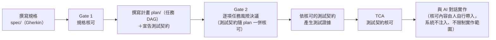
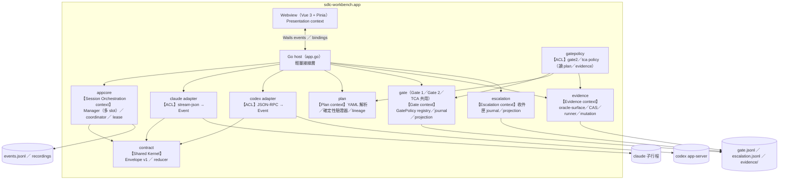
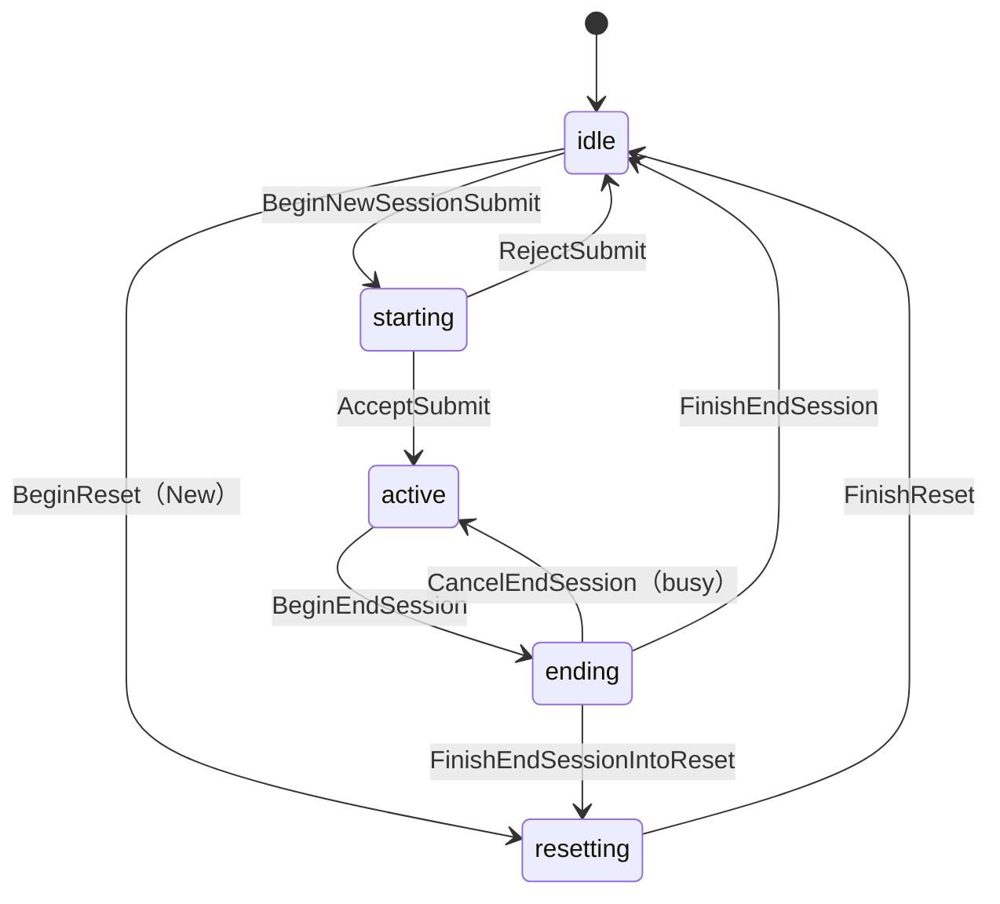

# SDLC Workbench

<div align="center">


**一套整合 Claude Code 與 Codex 的桌面 AI 開發工作台——可將規格、計畫與測試證據納入人類核可，全程留下稽核紀錄**

</div>

AI 寫程式碼很快，但「規格理解對不對、計畫的風險誰承擔、測試證據可不可信」仍需要人把關。
SDLC Workbench 把這些把關點做成明確的關卡（gate）：AI 負責草擬，人類審核後核可，每個決定都寫入
只允許附加的稽核紀錄——從撰寫規格、核可計畫、驗證測試證據，到與 AI 多輪對話實作，
全部在同一個桌面 app 內完成。

適合想把 Claude Code／Codex 納入有紀律開發流程的工程師：既要 AI 的速度，也要每一步可追溯、可稽核。
也可以只把它當成雙 provider 的 AI 對話工作台使用——多輪對話、統一的工具核可（approval）流程、
即時 session 狀態、完整稽核事件與 wire log（原始通訊紀錄），不必走流程關卡。

本專案以 Go、Wails v2、Vue 3 與 TypeScript 實作，固定 CLI 版本並凍結事件契約，
且依里程碑完成自動化測試與實機驗收。

---

## 截圖

<div align="center">

**Claude session** — 多輪對話、事件 Timeline、SC2 StatusBar（累計 token 與費用）


**Codex session** — 同一介面、provider 最新用量（以 `*` 標示）、長駐 app-server


**Gate 2 主控台** — 逐項任務的風險決議（所選風險等級低於規劃器建議時必須填寫 `override_reason`）


**TCA workspace** — Stage C 測試契約核可入口，expected-red 與 negative-control 兩類測試證據


</div>

---

## 運作流程

Workbench 有兩層，各自獨立可用：

**對話工作台（隨開即用）**——雙 provider、多 session 的 AI 對話環境：送訊息、看串流輸出、
核可工具呼叫、重啟後自動恢復。不需要走任何流程關卡就能使用。

**SDLC 流程關卡**——把「規格 → 計畫 → 測試契約」的每一步變成明確的核可節點。
AI 協助草擬與實作，核可決定由人作成、並留有紀錄：

> **Enforcement 邊界**——Gate 1、Gate 2 與 TCA 約束的是規格、計畫、測試契約及其證據。
> 一般 Claude／Codex session **不會**自動取得已核可內容，也不會依 `permissions_ref` 或
> 計畫範圍限制檔案操作；工具核可只決定單次呼叫是否放行。目前版本尚無
> implementation-output gate——Gate 3 與平台 enforcement 屬未開始的 M4（見里程碑）。



每個關卡各擋一類問題：

- **Gate 1（規格核可）**——規格內容經人確認才生效；核可後規格一有變更，狀態立即轉為
  **STALE**（失效，需重新送核），避免「核可的是舊版、實作的是新版」。
- **Gate 2（計畫風險決議）**——計畫先通過確定性驗證（schema、依賴、無循環），再由人逐項任務決定風險等級；
  選得比規劃器建議低就必須填寫理由，低於政策底線一律拒絕。
- **TCA（測試契約核可）**——測試證據要同時通過兩類驗證：預期失敗特徵相符（expected-red），
  以及刻意植入的錯誤能被同一組測試偵測（negative-control）——證明這組測試確實能偵測目標行為被破壞，證據才算數。
- **阻擋事項收件匣**——風險無法分類、綁定失效、證據執行異常等情況會自動建立阻擋項目，
  未解決前擋下對應的核可。

所有核可、狀態轉移與 AI 對話事件都寫入只允許附加的稽核檔（workspace 的 `.workbench/`）；
Gate、TCA 與阻擋事項的目前狀態一律由既有紀錄重新計算（projection），
這三類紀錄沒有可直接修改的「目前狀態」欄位。

---

## 快速開始

### 從原始碼建置

需求：macOS、Go 1.26+、Node.js、[Wails CLI v2](https://wails.io/docs/gettingstarted/installation)

```bash
git clone https://github.com/slam0504/ai-software-engineering.git
cd ai-software-engineering

# 開發模式（原生視窗 + http://localhost:34115 瀏覽器開發伺服器）
wails dev

# 建置 .app
wails build                  # → build/bin/sdlc-workbench.app
./scripts/bundle-clis.sh     # 把固定版本的 CLI 封裝至 .app 的 Resources/tools/
```

> **固定 CLI 版本**：claude `2.1.223`、codex `0.146.1`。CLI 的通訊行為以此版本實測凍結，
> 請勿隨意升級；升級版本需重跑實際 CLI 連線探測（live probe）與驗收矩陣。Codex CLI 是 node script，
> 執行期需要 node（GUI 啟動時會自動偵測 `/usr/local/bin`、`/opt/homebrew/bin`）。

### 第一次使用

1. **啟動 app 並確認 workspace**——workspace 決定 AI 操作與稽核紀錄的落點
   （執行期狀態都寫在 workspace 的 `.workbench/` 內），依啟動方式而不同：
   - `wails dev`：repo 目錄就是 workspace。
   - **從 Finder 開啟 .app：通常會退回使用者家目錄**（Finder 啟動時工作目錄是 `/`，不可寫）。
   - 指定專案目錄啟動：
     `WORKBENCH_WORKSPACE=/path/to/project ./build/bin/sdlc-workbench.app/Contents/MacOS/sdlc-workbench`
     （開發模式則是 `export WORKBENCH_WORKSPACE=/path/to/project && wails dev`）。

   第一次送出訊息前，先確認畫面頂端的 `ws: <source> @ <path>` 是你要的目錄——
   否則 AI 會在家目錄而不是你的專案內操作。
2. **登入 provider**——在設定列操作：Claude 會開啟系統終端機執行 `claude auth login`；
   Codex 走瀏覽器 OAuth。App 不接收密碼、不保管 token。
3. **建立第一個 session**——左欄 SessionList 選擇 provider 建立 session，在輸入框送出第一句訊息，
   即可看到串流回覆、Timeline 事件與狀態列的 token 統計。
4. **核可第一個工具呼叫**——AI 要求執行工具（改檔案、跑指令）時會跳出核可對話框，
   核可或拒絕都會寫入稽核紀錄；逾時預設拒絕（fail-closed）。
5. **重啟驗證**——直接關掉 app 再開：未按「開新對話」的 session 會還原對話內容，下一輪自動接續前文。

流程關卡（規格／計畫／測試契約）的入口是介面中的 Spec、Plan、TCA 工作區與 Gate 主控台，
整體順序見上方[運作流程](#運作流程)。

### 測試

```bash
go vet ./...
go test -race ./... -count=1     # 所有 package，含 production path 的同步與競態測試
npm --prefix frontend run test   # vitest（store／scroll／sanitizer／i18n／元件）
npm --prefix frontend run build  # vue-tsc typecheck + vite build
```

> **這三個 package 要分開跑，不要併跑**：`internal/codex`（`TestAppServerTerminateKillsGroup`）、
> `internal/assist`、`internal/claude` 有三處**以實際經過時間（wall clock）判定**的既有測試，
> 機器負載高時會出現偽陽性（實測：單獨跑 0.02s、負載下 30s 逾時）。這三處紅了先單獨重跑該 package 再判定，
> 詳見 [`docs/spikes/m3b-results.md`](docs/spikes/m3b-results.md) §7。

---

## 功能

### 雙 provider session（可並存）

在同一個視窗操作兩個 AI CLI，各自獨立對話、互不干擾。

- **Claude Code**（固定版本 `2.1.223`）— `claude -p` stream-json 多輪子行程：stdin 保持開啟、逐輪送出訊息，
  自然結束時回傳 exit code 0；session id 綁定 workspace，app 重啟後可恢復既有 session（cwd 不一致時拒絕恢復）
- **Codex**（固定版本 `0.146.1`）— 長駐 `codex app-server` JSON-RPC：thread／turn 模型、
  `thread/resume` 引用前文、多個 session 共用同一個 server
- **雙 provider session 並存**——切換 provider 時對話視窗跟著切、session 保留，一邊 turn 進行中另一邊仍可送訊息；
  切回時內容不會遺失，背景 session 以未讀計數提示
- 按下「開新對話」（New）只會結束並重設目前焦點所在的 session，不影響其他 session
  （先讓舊 session 停止接受新工作並完成收尾，等待事件處理完成並關閉 wire log，再開啟新的 session）

### 多 session 工作區（M3b）

同時保留多個進行中的對話、雙 pane 並排檢視；重啟後內容不會遺失，載入成本不隨歷史事件量增加。

- **每個 provider 最多 4 個 session slot**（共 8）——同時保留並可並行執行，每個 session 至多一個進行中的 turn；
  超出上限時明確拒絕並回報錯誤（fail loud），左欄 SessionList 顯示 `n / 4`，不會自動終止任何 session
- **workspace session id（WSID）** 是 Workbench 端的穩定身分，provider 自己的 session／thread id 只是附掛資訊；
  建立 session 採三段交易（保留名額 → 寫入 registry → 正式建立），任一步失敗都會退回名額，不會留下殘缺的 session
- **雙 pane 同時檢視**——固定 50/50 並排，兩邊都持續接收串流、Timeline、狀態與未讀計數；任一時刻恰有一個 pane
  取得焦點可操作（訊息輸入框、快捷鍵、End／Terminate／New 只作用於它），點另一邊即切換焦點，
  不會卸載內容也不會重設捲動位置
- **核可請求依 WSID 路由**——來源在另一個 pane 時會自動切換焦點；來源 session 沒有被釘選時，
  以暫時檢視顯示在次要 pane，做出決定、逾時或關閉後自動還原原本的釘選
- **重啟成本與事件量脫鉤**——只有兩個釘選的 pane 會重建對話（各載入最近 20 個完整 turn 與尚未結束的那一輪），
  其餘 session 只載入 metadata；向上捲到頂會以每次 20 個 turn 分頁載入。背後是 per-WSID 的 byte-offset replay index
  （`events.jsonl` 仍是唯一權威來源，index 只是可重建的快取；尾端損壞就地截斷修復、
  不另行通知，中段損壞會隔離全部既有 turn index 檔、從 `events.jsonl` 全量重建並通知）
- **關閉 session 等於保留稽核紀錄的 tombstone**——不刪除任何事件與 wire log；名額要等收尾與寫檔全部成功後才釋放，
  已關閉的 session 不會在重啟或索引重建後復活

### 重啟自動恢復
- 未按下 New 的對話檢視會在 app 重啟後還原（重放 `events.jsonl`），並在下一輪自動 resume 接續前文
- 不新增第二種持久化格式；稽核事件流即是恢復來源

### 工具核可（approval）

AI 要求變更檔案或執行指令之前，由你決定是否放行，核可與拒絕都留有紀錄。

- 兩個 provider 共用同一個 ApprovalDialog，核可結果與理由都會寫入稽核紀錄
- **Claude** — 經 MCP permission-prompt-tool（app 內建 `mcp-approval` 子命令 + unix socket broker）
- **Codex** — 經 app-server `requestApproval`；`approvalPolicy` 可選 `untrusted`（每次都要核可）/
  `on-request` / `never`（不需核可，風險自負）
- 採 fail-closed（逾時或異常時預設拒絕），逾時會自動拒絕核可請求；已失效的核可對話框會自動關閉，多個視窗也會同步移除

### 規格工作區與 Gate 1（M2 Stage A）

在 app 內撰寫行為規格（Gherkin），AI 只協助草擬；經人核可後，規格才成為後續計畫與測試的依據。

- **規格工作區** — 在 app 內編輯 `spec/`（CodeMirror 6，Gherkin 語法標示）；三個 AI 輔助按鈕（草擬 Gherkin、
  歧義偵測、oracle 覆蓋檢查）輸出至草稿區，由使用者確認後才寫入檔案
- **限定變更範圍的兩階段 commit** — 先預覽 diff、確認後才 commit，且保證「確認的內容就是實際 commit 的內容」，
  不影響納管範圍外的變更
- **Gate 1 主控台** — 送核（綁定 spec manifest digest 與 base commit）、核可／退回並填寫理由；核可後規格一有變更，
  狀態立即轉為 STALE（`gate_op` 稽核紀錄只允許附加寫入，狀態一律由既有紀錄重新計算，即 projection）
- **SpecAssist（隔離的 one-shot）** — AI 輔助以獨立的單次執行（one-shot）進行，由 provider 強制禁止變更 workspace 內容
  （Claude `--tools ""`、Codex `sandboxPolicy=readOnly`）；輸出不進入一般對話，也不混入一般 session 的用量統計
- **呈現層** — 瀏覽／監看 `spec/context-map/*.mmd`，檔案變更後自動重新渲染（重用 mermaid strict 設定）

### 計畫工作區與 Gate 2（M3a Stage B）

把實作拆成任務 DAG，先過確定性驗證，再由人逐項任務決定風險等級後才放行。

- **Plan Workspace** — 結構化 plan YAML 編輯（CodeMirror 6），PlannerAssist 以唯讀的 one-shot 產生草稿至草稿區、
  由使用者確認後才寫入檔案；沿用 SpecWorkspace 的兩階段（預覽／確認）限定範圍 commit
  （產生 `plan_commit`，工作樹有未提交變更時拒絕核可）
- **DagPane** — 將 plan 解析為 mermaid flowchart 的唯讀視覺化結果，plan 檔變更後自動重新渲染
- **確定性驗證器** — plan schema／DAG 不得包含循環／依賴必須存在／task ID 唯一／最低風險等級
  （`minimum_risk_tier` 依 risk policy 重算，且 `planner_risk_tier ≥ minimum_risk_tier`）／
  scenario 參照必須存在於目前有效的 Gate 1 spec manifest
- **Lineage 變更範圍** — `analysis_base_commit..plan_commit` 之間只能修改 `plan/**`，混入其他程式碼變更即拒絕核可
- **Gate 2 主控台** — 送核時綁定 spec_manifest／plan／base_commit（即 `plan_commit`）／risk_policy／permission_manifest；
  核可時逐項任務選定 `selected_risk_tier`（低於規劃器建議時必須填寫 `override_reason`，低於 `minimum_risk_tier` 一律拒絕），
  核可紀錄含依 `task_id` 排序的完整 `risk_decisions`
- **STALE** — spec、plan、risk policy 或權限清單一有變更即失效；`base_commit` 是歷史錨點，後續新增 commit 不會使核可失效

### 測試契約核可（Test Contract Approval，本機測試證據執行器）

用兩類證據證明這組測試確實能偵測目標行為被破壞，證據經人核可才算數；判定條件先核可、後執行，不接受事後補上的臨時條件。

- **測試判準涵蓋範圍（oracle surface）宣告** — 路徑模式與每項任務的測試契約描述（執行指令與結果比對規則）
  在 Stage B、Gate 2 送核前完成宣告，隨 plan 一併核可
- **測試證據執行器（evidence runner）** — 每次執行都建立獨立的 detached worktree（位於系統暫存目錄）、
  以結構化的 `executable+argv[]` 呼叫（不接受 shell 字串）、清除敏感環境變數、限制輸出大小與執行時間
  （超限或逾時判定為 `result: error`）
- **兩類測試證據** — `expected_red`（測試輸出符合預先核可的失敗特徵）與 `negative_control`
  （登記 mutation 後在同一個 `test_commit` 套用，驗證同一組測試能偵測該回歸）；
  判定一律依照已核可的測試契約描述，不接受未經核可的臨時判定條件
- **TCA 核可** — 至少七項一致性檢查（role 與 kind 相符、兩筆結果皆為 passed、snapshot 一致、
  測試契約描述精確相符、mutation 綁定對齊等）會拒收不相干的證據；核可紀錄綁定所依據的 `gate2_approval`
  完整記錄 digest 與 `plan_commit`，Gate 2 轉為 STALE 或被新版核可取代（superseded）時，TCA 也會連動轉為 STALE
- **保證範圍** — 提供的是本機可重建、可稽核的紀錄，**不提供 CI 強制管制**；執行器**不保證提供 sandbox 隔離**，
  不限制測試程式的網路與檔案系統能力

### 阻擋事項收件匣

系統偵測到的問題（風險無法分類、綁定失效、證據異常）未解決前，對應的核可會被擋下，不會靜默放行。

- **三種處理狀態** — `open → acknowledged → resolved`，狀態轉移只允許附加寫入，目前狀態由既有紀錄重新計算；
  標記為 `resolved` 時必須填寫 resolution、理由與處理人
- **系統自動建立** — 系統會在風險無法分類、binding 缺漏、Gate 2／TCA 綁定轉為 STALE、
  測試證據執行器發生錯誤／逾時／輸出超限、negative-control 未偵測到 mutation、journal 進入 degraded 狀態時，
  自動建立待處理項目（condition key 僅用來避免重複建立尚未 `resolved` 的項目）
- **阻擋規則** — 每個項目都有 `block_scope`；尚未標記為 `resolved` 的阻擋項目會擋下對應的核可，
  且核可的檢查與寫入在同一段不可插隊的流程內完成，不會有「檢查完才冒出新阻擋」的空窗
  （完整判定順序、鎖範圍與 lock ordering 見
  [架構文件 §5.6 Gate 決議一致性](docs/architecture/sdlc-workbench-app-plan.md#gate-decision-consistency)）
- **需由系統解除的項目** — STALE、binding 缺漏、journal degraded 等項目無法手動標記為已解決；
  修正原因後，系統會重新驗證並自動解除。使用者可標記為已知悉，但不會因此解除阻擋

### 繁體中文介面（i18n）
- 以 vue-i18n（Composition API）提供繁體中文與完整英文語系，預設為繁體中文
- 介面上的技術術語（例如 provider、session、token、Gherkin、oracle、commit）與資料契約欄位名維持原文，
  不強行翻譯；後端原始錯誤內容也不翻譯

### SC2 StatusBar
單一狀態列可同時回答四個問題：目前是哪個任務、進行到哪個狀態、使用哪個 session，以及已耗用多少資源。

| 欄位 | 內容 |
|---|---|
| 任務 | 使用者標記的 task label |
| 狀態 | 由 reducer 計算：waiting / streaming / tool_running / **awaiting_approval**（醒目顯示）/ done / failed |
| Session | Claude session id 或 Codex thread id |
| Token | 累計值（`session_total`）或 provider 最新值（`provider_latest`，以 `*` 與工具提示明確標示，不標示為累計值） |
| 費用 | Claude 累加 USD；Codex 未回報時顯示 `—` |

### Chat 與 Timeline
- **串流輸出** — 逐 token 顯示串流內容並附游標；thinking 內容預設收合，可展開查看
- **Follow-tail** — 向上捲動即停止自動跟隨，回到底部或送出訊息後恢復
- **Tool 卡片** — 工具名稱、參數節錄（最多顯示 80 個 Unicode 字元），以及盡可能推斷的狀態（Codex `inProgress → completed`）
- **雜訊摺疊** — 連續的系統事件自動收合為一列，可展開；每筆事件都可查看原始 JSON
- Timeline 面板可整個收合，也可拖曳調整高度（系統會保留高度設定），Chat 區域隨之擴大

### 檔案樹與預覽
- Workspace 採延遲載入的樹狀瀏覽，並以正規化路徑（canonical path）限制存取範圍；指向 workspace 外部的 symlink 一律拒絕，
  單一檔案大小上限為 1 MB
- Markdown 預覽：使用 DOMPurify 清理 HTML ＋ mermaid `strict` 渲染（```mermaid``` 區塊 → SVG）
- `.mmd` 檔案存檔後 1 秒內自動重新渲染（fsnotify 監看）

### 稽核與通訊紀錄

你在 UI 看到的一切都有對應的持久化事件，可回放、可稽核；UI 所見即所錄。

- 所有事件都會以 **Envelope v1** 格式寫入 `events.jsonl`：event_id（ULID）嚴格遞增，
  且每一輪的使用者訊息一定先於 provider 事件寫入（由 submission coordinator 負責排列使用者訊息與 provider 事件的寫入順序）；
  稽核寫入失敗時立即在 UI 顯示錯誤
- 可選擇為每個 session 啟用 **wire log**（Claude ndjson／Codex jsonl）與 metadata
  （argv、cwd、exit code、stderr tail）；收尾由 RecordingLease 確保只執行一次

### 官方登入
- App 不接收密碼、不保管 token
- Claude：開啟系統終端機並執行 `claude auth login`，並在背景輪詢登入狀態
- Codex：app-server `account/login/start` 開瀏覽器 OAuth，可取消

---

## 架構

採用 ports and adapters（hexagonal architecture）架構，核心邏輯與通訊層、UI 隔離：

```
frontend/                Vue 3 + TS + Pinia（Wails webview）
  src/stores/session.ts    唯一事件入口 apply(envelope)：chat／timeline／totals／state 路由
  src/i18n/                vue-i18n：locale（zh-TW／en）、狀態 key 映射、非元件 t() 入口
  src/components/          ChatPanel／Timeline／StatusBar／FileTree／PreviewPane／
                           SettingsBar／ApprovalDialog／GateConsole／SpecWorkspace／DiagramPane
app.go                   輕量接線層：workspace／CLI 解析、Wails 事件出口、provider 接線、
                         Spec／Gate／SpecAssist 綁定、spec/ 遞迴監看器
internal/
  contract/              Envelope v1（凍結契約）：ULID、Wrap、state reducer、workspace event lane
  appcore/               可測試的核心邏輯：Manager（單一序列化 emit 入口）、submission coordinator、
                         session lifecycle 狀態機、RecordingLease、EmitWorkspace／EmitAssist
  spec/                  規格庫：canonical manifest、committed snapshot、git repo、兩階段 SpecCommit
  gate/                  Gate 引擎（Gate 1、Gate 2 與 TCA 共用）：GatePolicy registry、ApprovalRecord v2／
                         transition、projection reducer、gate_op 單交易 journal（append-only ＋ 檔尾修復）
  plan/                  Plan 領域（純核心）：YAML 解析、確定性驗證器（schema／cycle／依賴／risk floor）、
                         lineage 驗證、risk policy 重算
  gatepolicy/            Gate2／TCA policy（讀 plan／evidence 的 ACL）：bindings schema、decision
                         validator、STALE resolver
  evidence/              Test Contract 證據鏈：oracle-surface 宣告、CAS store、mutation 登記、
                         detached worktree runner、matcher／結果分類
  escalation/            阻擋事項收件匣：item journal、append-only transition、projection、
                         block_scope 查詢
  assist/                SpecAssist／PlanAssist 隔離的 one-shot（Claude／Codex，由 provider 強制禁止變更 workspace）
  wsregistry/            workspace session registry（workspace-sessions.json）：durable metadata
                         白名單、legacy 遷移 marker、tombstone
  replayindex/           per-WSID turn 索引：turn boundary、checkpoint、crash 三態修復、
                         損壞分級（尾端 truncate／中段 quarantine）、runtime 重建
  wirelog/               Codex connection-wide wire log：per-generation 寫入、可重建 frame index
  ports/                 由使用端定義的介面（Turns、Exit）
  claude/                Claude CLI adapter：stream-json decode、多輪 session、resume registry
  codex/                 Codex app-server adapter：JSON-RPC conn、ThreadRunner、wire log tee
  proc/                  子行程管理器（process group、TERM→KILL、stderr tail）
  approval/              Claude 核可 broker（unix socket、逾時 fail-closed）
  recorder/              wire log（ndjson／jsonl ＋ metadata）
```

關鍵設計約束（詳見 [`docs/architecture/`](docs/architecture/)）：

- **單一序列化事件入口** — 所有 provider 事件都經過 `appcore.Manager.Emit`（在同一個 mutex 內完成
  wrap→totals→sink→emit→state_change），輸出的 event_id 嚴格遞增，稽核寫入失敗時立即在 UI 顯示錯誤；
  workspace 與 assist 事件走獨立出口，不佔用 provider slot
- **Submission coordinator** — 送出訊息採三段交易（Begin → 呼叫 provider → Accept／Reject）決定該輪由誰負責；
  provider 事件會在 Accept 之前先暫存在佇列中，確保 UI 與稽核紀錄裡都是使用者訊息先出現
- **用量語意雙軌** — Claude 每輪累加（`session_total`）、Codex 以 snapshot 覆寫（`provider_latest`）；
  UI 以 `*` 區分兩者，不把最新值標示為累計值
- **STALE 判定權威** — Gate 1 的失效以讀取時重算 spec manifest 為準，watcher 只是通知層；
  gate_op journal 只允許附加寫入，狀態一律由既有紀錄重新計算，轉為 STALE 後不會復活
- **收尾責任歸屬** — 多個來源同時要求收尾時，由 `RecordingLease` 確保只執行一次；
  Claude 收尾走 `CloseSequence`（關閉 stdin → 等待停止接受新工作並完成收尾 → 必要時終止程序 → 取得 exit 證據），
  無法確認程序結束狀態時，不會將結果記為 exit 0

### 架構圖

依 SDLC v2 流程（BDD→DDD→TDD），每個里程碑的領域模型以 mermaid diagram-as-code 維護於
[`docs/architecture/diagrams/`](docs/architecture/diagrams/)、行為規格（Gherkin）於
[`docs/architecture/features/`](docs/architecture/features/)；圖與實作偏差同 PR 修正。

**Bounded Context Map**



**Session lifecycle（per session slot；M3b 起 slot 以 WSID 定址，每 provider 至多 4 個）**



其餘圖（C4 Context、Manager aggregate、SendMessage／provider 切換 sequence）見 diagrams 目錄。

### 技術組合

| 層 | 技術 |
|---|---|
| Host | Go 1.26、Wails v2 |
| Frontend | Vue 3、TypeScript、Pinia、Vite、vue-i18n、CodeMirror 6 |
| 渲染 | marked + DOMPurify（Markdown）、Mermaid（圖表，strict） |
| 測試 | `go test -race`、vitest + @vue/test-utils、wire log replay 測試資料 |
| Agent CLIs | claude 2.1.223（native binary）、codex 0.146.1（node script） |

---

## 設定

### 環境變數

| 變數 | 用途 |
|---|---|
| `WORKBENCH_WORKSPACE` | 覆寫 workspace 根目錄（預設：目前工作目錄；不可寫時改用使用者家目錄） |
| `WORKBENCH_TOOLS_DIR` | 覆寫 CLI tools 目錄（預設：bundle Resources/tools → repo tools/） |
| `WORKBENCH_APPROVAL_TIMEOUT` | 核可逾時（Go duration，例如 `5s`；逾時時自動拒絕） |
| `WORKBENCH_MCP_COMMAND_OVERRIDE` | 測試用：覆寫 MCP approval server 指令 |

### 執行期狀態（workspace 的 `.workbench/`）

| 檔案 | 內容 |
|---|---|
| `events.jsonl` | Envelope v1 稽核事件流（UI 所見即所錄） |
| `gate.jsonl` | Gate（Gate 1／Gate 2／TCA 共用）的 gate_op 稽核紀錄（只允許附加寫入：gate_request／approval_record／transition） |
| `escalation.jsonl` | 阻擋事項收件匣稽核紀錄（只允許附加寫入：escalation_item／escalation_transition） |
| `evidence/` | evidence journal（evidence.jsonl）＋mutation／stdout／stderr 的 CAS 內容定址儲存 |
| `audit.jsonl` | App 層稽核（啟動資訊、核可決定、登入事件） |
| `recordings/` | wire log 與 metadata |
| `sessions.json` | Claude resume registry（session id ↔ cwd 綁定，per-WSID） |
| `workspace-sessions.json` | workspace session registry（WSID、provider、resume 身分、task label、view boundary、tombstone、pane 釘選；只存需長期保留的 metadata，不存執行期狀態） |
| `replay-index/` | per-WSID 的 turn byte-offset 索引＋`checkpoint.json`（可重建的快取，不是第二份事件歷史） |
| `wire-logs/` | Codex 每個 app-server generation 一份 connection-wide wire log（transport 層完整原文） |

---

## 開發藍圖

| 里程碑 | 狀態 | 內容 |
|---|---|---|
| **M0** 技術驗證 | ✅ 已合併 | 完成 Claude Code stream-json 與 Codex app-server JSON-RPC 串接、核可流程 E2E 驗證、原始通訊紀錄與 replay，以及 A／B／N／R 驗收矩陣（[結果](docs/spikes/m0-results.md)） |
| **M1** MVP | ✅ 已合併 | Envelope v1 契約、序列化 Manager 與 coordinator、多輪雙 provider、三欄 UI、驗收矩陣 V0–V6（[結果](docs/spikes/m1-results.md)） |
| **M1.5** 雙 session | ✅ 已合併 | Provider 切換時對話視窗跟著切、雙 session 並存、重啟自動恢復、design token 與視覺調整（[結果](docs/spikes/m1.5-results.md)） |
| **M2** Stage A 完整流程 | ✅ 已合併 | 規格工作區、Gate 1 主控台、ApprovalRecord／manifest／STALE、SpecAssist 隔離的 one-shot（SC1、SC3） |
| **i18n** 繁中介面 | ✅ 已合併 | vue-i18n 語系支援，預設繁體中文並提供完整英文語系 |
| **M3a** 計畫與測試契約完整流程 | ✅ 已合併 | 任務 DAG、Gate 2、測試契約核可（本機測試證據執行器）、阻擋事項收件匣、STALE 契約（SC3 擴及 Gate 2／TCA；同時檢視多個 session 延後至 **M3b**） |
| **M3b** 多 session 工作區 | ✅ 已合併 | 每 provider 4 個 session slot、雙 pane 同時檢視與焦點語意（釘選與焦點跨重啟持久化）、WSID 建立交易與 tombstone 移除、single-instance guard、Codex connection-wide wire log 與跨 generation 的 session 級 segment 歸屬、per-WSID replay index 與視窗化載入。四個收尾 gate 與實機驗收 A1–A10 全綠、Task 0 live probe 重跑 GATE GO（[驗收結果](docs/spikes/m3b-results.md)；§10–§11 為最終樹矩陣重跑與實機補跑，三項後續票見 §11 末） |
| **M4** 完整任務路徑 | 未開始 | 證據鏈、Gate 3 主控台、程式碼代管平台 adapter（SC4：單一任務全程不需切換至 app 外） |
| 後續候選：ACP／多 Agent Runtime | 主線完成後再規劃 | ACP client adapter（以 OpenCode 作為第一個目標）、保留 Claude／Codex 原生 adapter、能力協商（capability negotiation）（詳見 [`docs/architecture/`](docs/architecture/sdlc-workbench-app-plan.md) §7.1；**不在近期交付範圍**） |

每個里程碑的執行計畫經外部審核後凍結於 [`docs/architecture/`](docs/architecture/)（`SHA256SUMS` 可驗證），
實作偏差與殘餘風險記錄於對應的驗收結果文件。

---

## 授權

[MIT](LICENSE) © 2026 slam0504

## 致謝

- UI 互動慣例參考 [Better Agent Terminal](https://github.com/tony1223/better-agent-terminal)（MIT）
  與 VS Code 的佈局慣例（sidebar／editor／panel／status bar）
- [Wails](https://wails.io/) — Go 桌面應用框架
