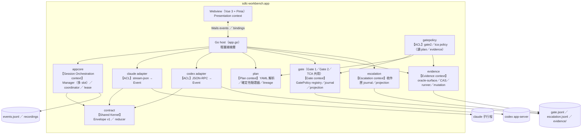
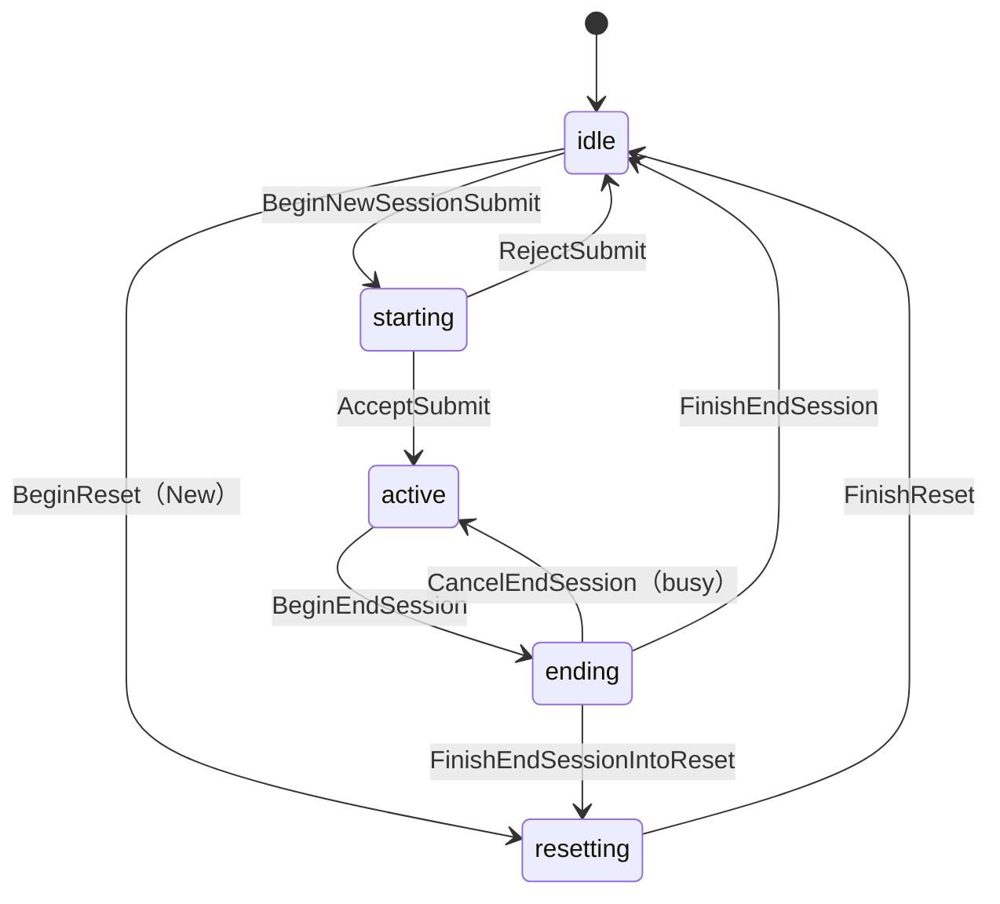

# SDLC Workbench 內部架構

從 [README](../../README.md) 拆出的開發者視角文件：模組結構、關鍵設計約束、稽核事件流機制與領域模型圖。
使用者視角的功能說明與快速開始請看 README；各里程碑經外部審核後凍結的執行計畫見同目錄的
`sdlc-workbench-*-plan.md`（`SHA256SUMS` 可驗證；本檔是隨實作演進的活文件，不在凍結範圍）。

## 模組結構

採用 ports and adapters（hexagonal architecture）架構，核心邏輯與通訊層、UI 隔離：

```
frontend/                Vue 3 + TS + Pinia（Wails webview）
  src/stores/session.ts    唯一事件入口 apply(envelope)：chat／timeline／totals／state 路由
  src/i18n/                vue-i18n：locale（zh-TW／en）、狀態 key 映射、非元件 t() 入口
  src/components/          ChatPanel／Timeline／StatusBar／FileTree／PreviewPane／
                           SettingsBar／ApprovalDialog／GateConsole／SpecWorkspace／DiagramPane
app.go                   輕量接線層：workspace／CLI 解析、Wails 事件出口、provider 接線、
                         Spec／Gate／SpecAssist 綁定、spec/ 遞迴監看器
internal/
  contract/              Envelope v1（凍結契約）：ULID、Wrap、state reducer、workspace event lane
  appcore/               可測試的核心邏輯：Manager（單一序列化 emit 入口）、submission coordinator、
                         session lifecycle 狀態機、RecordingLease、EmitWorkspace／EmitAssist
  spec/                  規格庫：canonical manifest、committed snapshot、git repo、兩階段 SpecCommit
  gate/                  Gate 引擎（Gate 1、Gate 2 與 TCA 共用）：GatePolicy registry、ApprovalRecord v2／
                         transition、projection reducer、gate_op 單交易 journal（append-only ＋ 檔尾修復）
  plan/                  Plan 領域（純核心）：YAML 解析、確定性驗證器（schema／cycle／依賴／risk floor）、
                         lineage 驗證、risk policy 重算
  gatepolicy/            Gate2／TCA policy（讀 plan／evidence 的 ACL）：bindings schema、decision
                         validator、STALE resolver
  evidence/              Test Contract 證據鏈：oracle-surface 宣告、CAS store、mutation 登記、
                         detached worktree runner、matcher／結果分類
  escalation/            阻擋事項收件匣：item journal、append-only transition、projection、
                         block_scope 查詢
  assist/                SpecAssist／PlanAssist 隔離的 one-shot（Claude／Codex，由 provider 強制禁止變更 workspace）
  wsregistry/            workspace session registry（workspace-sessions.json）：durable metadata
                         白名單、legacy 遷移 marker、tombstone
  replayindex/           per-WSID turn 索引：turn boundary、checkpoint、crash 三態修復、
                         損壞分級（尾端 truncate／中段 quarantine）、runtime 重建
  wirelog/               Codex connection-wide wire log：per-generation 寫入、可重建 frame index
  ports/                 由使用端定義的介面（Turns、Exit）
  claude/                Claude CLI adapter：stream-json decode、多輪 session、resume registry
  codex/                 Codex app-server adapter：JSON-RPC conn、ThreadRunner、wire log tee
  proc/                  子行程管理器（process group、TERM→KILL、stderr tail）
  approval/              Claude 核可 broker（unix socket、逾時 fail-closed）
  recorder/              wire log（ndjson／jsonl ＋ metadata）
```

## 關鍵設計約束

（更完整的規格與決策脈絡見同目錄的 [`sdlc-workbench-app-plan.md`](sdlc-workbench-app-plan.md)。）

- **單一序列化事件入口** — 所有 provider 事件都經過 `appcore.Manager.Emit`（在同一個 mutex 內完成
  wrap→totals→sink→emit→state_change），輸出的 event_id 嚴格遞增，稽核寫入失敗時立即在 UI 顯示錯誤；
  workspace 與 assist 事件走獨立出口，不佔用 provider slot
- **Submission coordinator** — 送出訊息採三段交易（Begin → 呼叫 provider → Accept／Reject）決定該輪由誰負責；
  provider 事件會在 Accept 之前先暫存在佇列中，確保 UI 與稽核紀錄裡都是使用者訊息先出現
- **用量語意雙軌** — Claude 每輪累加（`session_total`）、Codex 以 snapshot 覆寫（`provider_latest`）；
  UI 以 `*` 區分兩者，不把最新值標示為累計值
- **STALE 判定權威** — Gate 1 的失效以讀取時重算 spec manifest 為準，watcher 只是通知層；
  gate_op journal 只允許附加寫入，狀態一律由既有紀錄重新計算，轉為 STALE 後不會復活
- **收尾責任歸屬** — 多個來源同時要求收尾時，由 `RecordingLease` 確保只執行一次；
  Claude 收尾走 `CloseSequence`（關閉 stdin → 等待停止接受新工作並完成收尾 → 必要時終止程序 → 取得 exit 證據），
  無法確認程序結束狀態時，不會將結果記為 exit 0

## 稽核事件流與重啟恢復

- **Envelope v1 寫入順序** — event_id 為 ULID、嚴格遞增；每一輪的使用者訊息一定先於 provider 事件寫入，
  順序由 submission coordinator 負責排列（見上方關鍵設計約束）
- **wire log 收尾** — per-session 的 wire log（Claude ndjson／Codex jsonl）與 metadata
  （argv、cwd、exit code、stderr tail）收尾由 `RecordingLease` 確保只執行一次
- **replay index 損壞分級** — per-WSID 的 byte-offset turn 索引只是可重建的快取，`events.jsonl` 才是唯一權威來源。
  尾端損壞（torn write）就地截斷修復、不另行通知；中段損壞會隔離全部既有 turn index 檔
  （rename 為 `.quarantine-<timestamp>`，不刪除）、checkpoint 歸零並從 `events.jsonl` 全量重建、
  以 workspace notice 通知。已知限制：quarantine 檔目前沒有清理／保留期限策略

## 架構圖

依 SDLC v2 流程（BDD→DDD→TDD），每個里程碑的領域模型以 mermaid diagram-as-code 維護於
[`diagrams/`](diagrams/)、行為規格（Gherkin）於 [`features/`](features/)；圖與實作偏差同 PR 修正。

**Bounded Context Map**



**Session lifecycle（per session slot；M3b 起 slot 以 WSID 定址，每 provider 至多 4 個）**



其餘圖（C4 Context、Manager aggregate、SendMessage／provider 切換 sequence）見 [`diagrams/`](diagrams/) 目錄。
