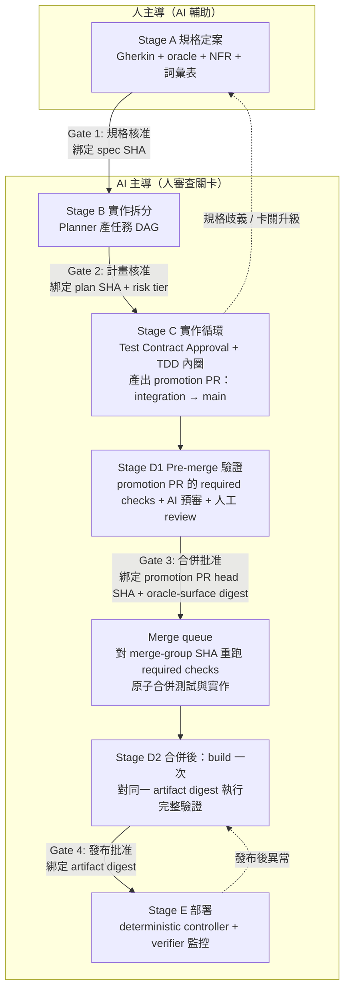

# AI Agent 協作自動化規劃：規格定案後的實作、驗證與部署流程

> 版本：v2.2（2026-09-01，治理修正——mutation acceptance table 預設 N/N 全跑門檻，新增 §6.7；同步校正 §4／§6.3／§11 的「抽驗」措辭以免與新規則矛盾）
> 前版：v2.1（2026-08-05）
> 狀態：架構規劃稿（第二輪審核：v2 可接受為架構規劃稿）；已依第二輪審核（3 P1 / 2 P2）修訂為 v2.1，目標升為 pilot-ready 執行契約前仍需完成 §12 的前置條件與實際演練。
> 配套文件：`sdlc-bdd-ddd-tdd-reference.md`（參考型 SDLC v2）
> 範圍：自動化 Phase 3（迭代開發）至 Phase 4（發布）；Phase 0–2 的需求分析、提問確認與定案仍由人主導，AI 僅輔助。

---

## 1. 設計前提與核心原則

### 1.1 核心前提（v2 修正）

**Gherkin 是可解析的意圖表示；經核准的測試綁定（step definition + fixture + 測試資料 + 環境設定）才是可執行的驗收契約。**

BDD + DDD + TDD 流程的產出對自動化的價值在於：

- Gherkin scenario：結構化、可解析的行為意圖 → agent 拆分任務與對齊目標的依據
- Ubiquitous Language 詞彙表 → agent 命名與溝通的受控詞彙
- 領域模型（Context Map、Aggregate 邊界）→ 任務拆分的結構依據
- **經獨立 review 核准的測試綁定** → agent「完成」與否的客觀判準

第四項是 trust boundary 所在：Gherkin 只有結構可解析，每個 step 的實際語意由 step definition、fixture、helper、mock、測試資料與環境設定決定。test binder 可能誤解規格，產生「能綠但驗錯東西」的測試。因此本文所有「以測試為準」的機制，前提都是測試綁定本身通過 §4 的核准內容與 §6.1 的 Test Contract Approval checkpoint。

### 1.2 核心原則

1. **人管意圖，AI 管執行**。人的關卡（gate）設在意圖決策點：規格核准、計畫核准、合併批准、發布批准。每個 gate 核准的是**不可變版本**（hash 綁定，見 §3），核准對象改變即失效。
2. **未核准的驗收契約變更進不了受保護分支**。保護範圍是完整的 test oracle surface（§6.3），強制手段是 branch protection / ruleset + required code owner review + 各角色獨立最小權限身分——不是單靠 CODEOWNERS（它只指定 reviewer，不阻擋合併、更不撤銷寫入能力）。注意這些控制保證的是「未核准變更無法進入 integration / main」，不是檔案系統層的唯讀；agent 仍可能在本機或 feature branch 修改檔案。需要更強保證時採 path-level 權限或獨立 test repo（§6.3）。
3. **完成必須綁定客觀驗證**。不接受 agent self-report；只承認可獨立重跑、hash 可追溯的證據：required checks 全綠的 CI run、指標達標的監控記錄。
4. **失敗有升級路徑，無法分類時 fail closed**。agent 重試達上限、遇規格歧義、需觸碰保護範圍、或風險無法分類時，停下並升級給人，附完整上下文；不允許無聲繞過或自行降級處理。

## 2. 全景：階段順序與人的關卡（v2 修正：CI 在合併之前）



關鍵順序：**未通過 required checks 的 code 不進 main**。Stage D1 對 promotion PR 的 CI 是第一道可信驗證；merge queue 對 merge-group SHA 重跑 required checks 後才合併；Stage D2 先 build 出唯一 artifact，再對**同一 digest** 執行完整驗證（驗證的就是要發布的那一份）。Gate 4 之後**不得重新 build**，部署的必須是被核准的同一 artifact digest。

| Gate | 決策內容 | 誰決定 | 可否自動化 |
|---|---|---|---|
| 1 規格核准 | 例子與 oracle 對不對、範圍對不對 | 業務方 + PO | 不可，唯一的意圖來源 |
| 2 計畫核准 | 拆分合理、風險分級可信 | Tech lead | 僅風險政策（人維護）判定為低風險者可預先授權；無法分類 fail closed |
| 3 合併批准 | code 品質、模型一致性、測試綁定未被竄改 | 人 review（AI 預審在前） | 導入初期全量人工；成熟後依人核准的風險政策縮減 |
| 4 發布批准 | 上線與否 | 依風險 / 法規決定 | 低風險依預核准政策自動 |

## 3. Gate 的 hash 綁定（P1 修正）

每個 gate 核准的是不可變對象；核准後任一綁定對象改變，該核准自動失效、必須重走：

| Gate | 核准的不可變對象 |
|---|---|
| 1 | spec SHA、NFR SHA、詞彙表版本 |
| 2 | spec SHA、plan SHA、risk tier、任務權限清單 |
| 3 | promotion PR head SHA、核准時的 main base SHA、oracle-surface digest、merge queue 產生的 merge-group SHA 與 required checks run |
| 4 | artifact digest、SBOM / provenance、deployment manifest、觀察與停止條件 |

四個意圖 gate 之外，Stage C 另有一個**必要技術 checkpoint**（不是第五個意圖 gate，但同樣 hash 綁定、可稽核）：

```
Test Contract Approval（P1 修正：登記測試綁定核准）
  核准人：QA / test owner（人；可由 reviewer agent 預審，核准權在人）
  綁定：base code SHA + oracle-surface digest
        + expected-red 證據（測試在 base SHA 上因預期原因失敗的 CI run）
        + negative-control 證據（測試在故意錯誤實作上會失敗）
  時機：implementer 啟動前；綁定對象改變即失效，implementer 必須停止並重走
```

> 術語說明：v2 的「test-tree hash」自本版起改稱 **oracle-surface digest**——保護與綁定範圍涵蓋 step definitions、fixtures、helpers、snapshots、runner config、CI workflow 等完整 oracle surface，不只測試檔樹。

## 4. Stage A：規格定案（人主導，AI 輔助）

AI 輔助範圍不變（草擬 Gherkin、歧義偵測、NFR 覆蓋檢查），Gate 1 的核准內容擴充（P0-3）：

- **業務關鍵 scenario 必附輸入輸出 oracle**：examples / decision table，讓測試綁定有明確的對錯判準，而非只有自然語言 step。
- **測試綁定需獨立 review**（在 Stage C 以 Test Contract Approval 執行，見 §3、§6.1）：Gate 1 核准的是意圖表示；可執行驗收契約在測試綁定被核准時才成立。
- **重要規則加入 negative control**：核准條件包含「測試在故意做錯的實作上會失敗」的證據；高風險功能採 mutation testing 或人工抽樣操作驗證測試辨識力。**但若 implementation plan 已為該 task 列出有限且逐項編號的 mutation acceptance table，適用 §6.7 的 N/N 全跑門檻，不得以抽樣替代。**

**產出**（進 version control，Gate 1 後以 branch protection 鎖定）：

```
spec/
  features/          # 已核准的 Gherkin + examples / decision table
  nfr/               # 非功能 acceptance criteria / checklist
  glossary.md        # Ubiquitous Language 詞彙表
  context-map/       # C4 + Context Map（diagram-as-code）
```

## 5. Stage B：實作拆分與風險分級

Planner agent 讀取規格庫（指定 spec SHA）+ 既有 codebase，產出：

1. **Scenario → 影響面分析**：對應的 Bounded Context / Aggregate / module、需要新增或修改的介面與契約。
2. **任務 DAG**：可獨立驗證的任務與依賴順序；粒度沿用拆票邏輯（單任務對應少數 scenario、單一 agent、混合性質必拆）。
3. **完成定義**：綁定「哪些 scenario 在哪個 oracle-surface digest 下轉綠 + 既有測試不得變紅」。
4. **風險標注**——依人維護的風險政策，不是 agent 自由裁量。

### 風險政策（P1 修正：拆除循環信任）

- 政策本體由人維護，採 deterministic rules（規則檔進 version control），不是 agent 判斷。
- **Agent 只能提高風險等級，不能降低**；規則未涵蓋、無法分類時 fail closed，進人工 Gate 2。
- 預設提高風險的類別（不限 schema / 對外契約）：權限與認證、金流、個資、刪除操作、CI / IaC 變更、依賴更新、feature flag、共用 library。
- Gate 2 核准結果綁定 spec SHA + plan SHA + risk tier + 該任務的權限清單（§9）。

**人的動作（Gate 2）**：review 計畫而非 code——拆分是否切錯 Aggregate 邊界、依賴順序、風險分級是否符合政策。便宜的 gate，擋最貴的錯誤（整批方向錯）。

## 6. Stage C：實作循環

### 6.1 紅燈測試的交接契約（P0-2 修正）

測試綁定與實作分離若要成立，必須有可執行的交接協定，而非只是角色名稱不同。採三個 PR 的明確拓撲（P1 修正：merge queue 接收的是以 main 為 base 的 PR，不是任意 branch）：

```
main（受保護；D1 + merge queue 守門）
 └─ integration/<task-id>（本任務的整合分支，同樣受 branch rules 保護）
     ├─ PR-1: test/<task-id> → integration/<task-id>（test binder）
     │    內容：驗收測試綁定
     │    出口條件：Test Contract Approval（§3）——核准人 QA / test owner，
     │    綁定 base code SHA + oracle-surface digest
     │    + expected-red 證據 + negative-control 證據
     │    → 核准後合併進 integration branch（main 不變紅）
     ├─ PR-2: impl/<task-id> → integration/<task-id>（implementer）
     │    前置條件：Test Contract Approval 已完成且綁定未失效
     │    記錄：同一 oracle-surface digest 下轉綠的 CI 證據
     └─ PR-3: integration/<task-id> → main（promotion PR）
          只有 PR-3 進 D1、Gate 3 與 merge queue；
          merge queue 對 merge-group SHA 重跑 required checks，
          並驗證 oracle-surface digest 與 Test Contract Approval 核准的一致
```

這回答四個問題：預期失敗的測試合併到 integration branch（main 不故意變紅）；implementer 何時能開始（Test Contract Approval 完成後）且取得的是 digest 已鎖定、經核准的測試版本；送進 main 的載體是標準的 promotion PR（PR-3），符合 merge queue 的實際運作模型；最終合併時驗證 oracle-surface digest 未變，確保進 main 的測試就是被核准的那一份。

### 6.2 單一任務的執行迴圈

```
1. 領取任務（綁定 plan SHA + 完成定義 + 權限清單），checkout integration branch
2. 確認 Test Contract Approval 已完成且未失效
   （expected-red 與 negative-control 證據存在、oracle-surface digest 與核准一致）
3. TDD 內圈：最小可觀察行為 Red → Green → Refactor
   ├─ 類別形狀依領域模型、命名查詞彙表
   └─ 發現模型不對勁 → 停止並升級（附具體矛盾點），不自行改模型
4. 目標 oracle-surface digest 下全綠 + 既有測試無回歸 → 提交 PR-2
5. 重試上限（預設 5 輪）→ 升級給人，附嘗試記錄
```

### 6.3 Test oracle surface 的保護（P0-4 修正）

保護範圍是**完整的 test oracle surface**，不只 Gherkin 與驗收測試檔：

- step definitions、fixtures / builders / 測試資料
- shared test helpers、snapshot / golden files
- test runner config、coverage / skip / 篩選條件
- CI workflow 定義

強制手段（缺一不可）：

1. **Branch protection / ruleset + required Code Owner review**：CODEOWNERS 只指定 reviewer，必須搭配這兩者才有阻擋合併的效力。
2. **各角色獨立身分與最小權限**：implementer 與 test binder 使用不同身分與 token；共用同一 token 的「不同 agent」不構成職責分離。權限清單由 Gate 2 綁定。
3. **CI 政策檢查**：實作 PR touch oracle surface 即失敗。
4. **辨識力驗證取代數量檢查**：「assertion 數量不得減少」偵測不了 assertion 被改弱；改用 §4 的 negative control / mutation testing 辨識力驗證（plan 若列有逐項編號的 mutation acceptance table，依 §6.7 為 N/N 全跑，不是抽驗）。

**保證強度的準確描述**（P2 修正）：以上 1–3 保證的是「implementer 無法讓未核准的 oracle-surface 變更進入受保護分支（integration / main）」，不是檔案系統層的唯讀——agent 仍能在本機或 feature branch 修改、commit、push 這些檔案。若需要「寫不進」等級的保證，另需 managed path allowlist、檔案系統權限或獨立 test repo；採用與否依風險在 Gate 2 政策決定。

### 6.4 Review 層（P2 修正）

PR 進人工 review 前先過 reviewer agents（code / silent-failure / test quality / security 四維度）。但明確定位：**AI 摘要是不可信輸入，不是 review 的替代**。

- 導入初期：全量人工 review，AI 預審只作為輔助標注。
- 成熟後：依人核准的風險政策縮減人工範圍（例如低風險任務抽查），縮減決定本身走 Gate 2 等級的核准。

### 6.5 平行化的實際邊界（P2 修正）

Worktree 只隔離檔案狀態，不隔離憑證、網路與共享外部環境（測試 DB、外部 sandbox），也不能避免語意衝突。因此：

- 平行任務搭配 merge queue（序列化合併點）+ 重疊檔案 / 契約偵測（Planner 在 DAG 階段標注潛在衝突對）+ 合併後 D2 重驗。
- 共享外部資源由環境配額管理，不假設 worktree 等於完全隔離。

### 6.6 上下文供給（P2 修正）

「最小充分上下文」限制的是**無關資料**（降低偏航、token 成本與 prompt injection 面），不是禁止探索：agent 保有查 immediate callers、shared utilities、外部契約的受控擴展能力；需要超出配給範圍時走升級，不是硬牆。

### 6.7 Mutation acceptance table 的執行門檻（v2.2 新增）

當 implementation plan 為某個 task 列出**有限且逐項編號**的 mutation acceptance table（形如「#N 變異植入處 → 預期轉紅的測試」），該表即為驗收契約的一部分，**預設必須 N/N 全跑**——不得以抽樣、少數代表項、或「範本可執行」替代。

每一項的完成定義（缺一即該項未完成）：

1. **套用**：mutation 已實際套用到 production 檔——`git diff`／`diff` 顯示變更存在，且檔案內容 hash 已改變（變異前後 `shasum`／`sha256sum` 不同）。
2. **紅在正題**：表中指定的測試（含 subtest 名）確實 FAIL，且失敗訊息是該測試自己的斷言訊息——不是撞到其他 guard，也不是由其他測試連帶失敗。
3. **還原**：還原後檔案與變異前 **byte-identical**（hash 相同）。不指定還原手段，但須留下比對證據。
4. **回綠**：該 task 的基準測試指令回綠。

**「可執行」不等於完成**：證明範本能編譯、測試能跑、或 mutation 能被套用，都只是前置條件，不構成該項已完成的證據。

**抽樣的例外條件**：只有當 plan **明確把該表定義為 sampling** 時才可抽驗，且必須記錄 (a) 抽樣依據（為何這幾項具代表性）、(b) 未執行項的完整清單、(c) owner 對此抽樣的核准。三者缺一，該表視同未完成。

**表與 checklist 的綁定**：acceptance table 必須有對應的 checkbox execution step，否則它只是敘述性文件，實作者跑完既有測試看到全綠即會結案，該表不會被執行。

## 7. Stage D：驗證（D1 pre-merge / D2 post-merge）

### D1：Pre-merge（第一道可信驗證，作用於 promotion PR）

PR-1 / PR-2 在 integration branch 層有各自的 CI（紅燈證據、轉綠證據）；**進 D1、Gate 3 與 merge queue 的是 PR-3（promotion PR：integration/<task-id> → main）**：

```
PR-3 → unit / component → contract → 本任務 acceptance
     → SAST + dependency scan + 政策檢查（oracle surface、風險規則）
     → AI 預審 → 人工 review → Gate 3（綁定 §3 對象）
     → merge queue 對 merge-group SHA 重跑 required checks
     → 驗證 oracle-surface digest 與核准一致 → 合併
```

### D2：Post-merge（先 build、再驗證同一 artifact）

P1 修正：完整驗證必須作用在**實際要發布的 artifact** 上，不是先驗證再 build：

```
merge SHA
  → build 一次 → 產生 artifact digest + SBOM + provenance
  → 將同一 digest 部署至驗證環境
  → 完整 acceptance 套件 → 效能基準（關鍵路徑） → 少量 full-stack E2E
  → Gate 4 核准該 digest
```

**D2 失敗的處理政策**（「main 永遠全綠」與「完整驗證在合併後」無法同時絕對成立，D2 紅燈時明訂）：

1. 阻擋 release candidate（該 digest 不得進 Gate 4）。
2. 暫停後續 merge queue 或標記 main 為 degraded（依政策擇一，避免在壞基礎上疊加變更）。
3. 依政策 revert 或 fix-forward（由 triage 分類 + 人決定）。
4. 修復後重走 D1、D2（新 merge SHA、新 digest）。

**CI 的定位（P2 修正措辭）**：CI 是 **required checks 的權威執行紀錄**——它裁定「是否符合已編碼的政策」，不能證明規格正確或覆蓋完整；後者依靠 Gate 1 的規格品質與 §4 的測試辨識力驗證。

**失敗分診（P2 修正：擴充分類）**：CI 紅燈時 triage agent 讀 log 與 diff，分類為：

| 分類 | 處置 |
|---|---|
| 實作缺陷 | 開回 Stage C 修復任務 |
| 測試缺陷（test defect） | 開給 test binder 修正，走獨立 review |
| 環境 / 基礎設施故障 | 開給平台 owner，該 run 不計入任務重試數 |
| 測試資料問題 | 修 fixture，走 oracle surface 保護流程 |
| 外部契約漂移 | 升級——契約變更需人決策 |
| 政策檢查失敗 | 依政策條目處置，不得繞過 |
| flaky | 受控重跑（有紀錄、有上限）；quarantine 必須有 owner、期限與風險批准，不是只開技術債票 |
| 規格與實作真實衝突 | 升級到 Gate 1 重新確認規格 |

分類附證據、人可抽查；無法分類 fail closed 升級。

## 8. Stage E：部署與發布後驗證（P1 修正：agent 退出控制迴圈）

**控制與觀察分離**：

- **Deterministic controller**（非模型）依 Gate 4 預先核准的門檻執行停止、擴大流量或 rollback。門檻定義包含：最小樣本量與最短觀察時間；**telemetry 缺失視為異常、預設 hold**，不視為正常。自動 rollback 路徑本身需經預演與核准；DB migration 無法安全 rollback 時，預先定義 fix-forward 路徑並在 Gate 4 一併核准。
- **Release verifier agent** 只做觀察與彙整：對照 SLO 與 guardrail metric 整理證據、寫發布報告、對人提出建議。**verifier 只持有監控讀取權，不持有 production deployment credentials**；它的建議進入人的判斷或 controller 的證據流，不直接觸發動作。

發布流程：Gate 4 核准 artifact digest → 部署同一 digest（不重 build）→ 漸進發布（canary / 分批上線，策略依風險選擇）→ controller 依門檻推進 → 觀察期間結束後 verifier 產出發布報告（指標對照、異常事件、遺留風險）回饋 backlog。

## 9. Agent 系統自身的威脅模型與權限矩陣（P1 新增）

Security reviewer 審應用 code；這套 agent 系統本身另需治理：

| 面向 | 控制 |
|---|---|
| Prompt injection | PR / issue / log / repo 內容都是不可信輸入，可能影響 agent 行為；**不得將「模型會忽略惡意指令」視為安全邊界**。以 tool allowlist、無 production credential、egress 限制、deterministic policy 與人工 gate 控制影響範圍——即使 agent 被誘導，可造成的損害也被結構性限制 |
| 資料外流邊界 | secrets、個資、受限原始碼送往模型供應商前的過濾政策；明定哪些 repo / 路徑可進 context |
| 執行環境 | ephemeral runner / sandbox，任務結束即銷毀；tool allowlist、network egress 白名單、套件安裝權限受控 |
| 身分與憑證 | 每個角色獨立身分、短效 token、最小權限；權限清單由 Gate 2 綁定並可稽核 |
| 可追溯性 | agent / prompt / model / 工具版本記錄；audit log 涵蓋每次工具呼叫與 gate 決策；artifact 附 SBOM 與 provenance |
| 資源上限 | token 與 CI 成本預算、最大重試數、最大並行數；超限 fail closed |

## 10. Agent 角色與權限總表

| Agent | 階段 | 職責 | 身分與權限邊界 |
|---|---|---|---|
| Spec assistant | A | 草擬 Gherkin 與 oracle、歧義與覆蓋檢查 | 只產草稿與問題；spec repo 寫入僅限草稿區 |
| Planner | B | 影響面分析、任務 DAG、完成定義、依政策標風險（只可升不可降） | 唯讀 code；產出計畫檔 |
| Test binder | C | 建立測試綁定、附紅燈與 negative-control 證據，送 Test Contract Approval | 獨立身分；只寫 test/<id> branch 的測試路徑 |
| Implementer | C | TDD 內圈至目標 oracle-surface digest 下轉綠 | 獨立身分；無法讓未核准的 oracle-surface 變更進入受保護分支（政策檢查強制；更強保證見 §6.3）；卡關必升級 |
| Reviewer 群 | D1 | 分維度預審 | 只評論；輸出視為不可信輔助 |
| Triage | D1/D2 | 失敗分診（8 類） | 不得無聲重跑；無法分類升級 |
| Exploratory | D2 | 探索性測試 release candidate | 產報告；不改規格與測試 |
| Release verifier | E | 觀察、彙整證據、建議 | 僅監控讀取權；無 deployment credentials；不在控制迴圈內 |

## 11. 誠實邊界：這套自動化做不到什麼

1. **規格與測試綁定的品質天花板即產出品質天花板**。AI 忠實實作已核准契約；規格漏想的邊界、測試綁定誤解的語意，流程不會自行發現（negative control 與 exploratory 只能補撈一部分）。
2. **領域建模判斷不可全自動**。Aggregate 邊界、一致性取捨可由 agent 提案，正確性需領域知識驗證；模型變更永遠過人。
3. **Reward hacking 風險降低但不消除**。oracle surface 保護 + 職責分離 + mutation 辨識力驗證（acceptance table 依 §6.7 為 N/N 全跑；抽樣僅限 plan 明確定義為 sampling 者）是縱深防禦，仍需定期人工抽查綠燈名副其實。
4. **導入必須漸進**：AI 預審（全量人工 review 仍在）→ 單任務 implementer → 平行化 → 依核准政策縮減人工 review → 低風險自動發布。每階段以實測指標決定是否前進。
5. **成本結構改變**。token / CI / 治理成本上升，換取人力轉向規格與審查；以 change lead time 與 change fail rate 前後對照實測，不假設必然更快。

## 12. Pilot 前置條件與待驗證假設

**升 pilot 前必須完成**（依審核意見）：

1. 選定低風險 repo，補齊地基：Gherkin 活文件進 CI、分層測試、branch protection / ruleset 實際啟用並驗證阻擋效力。
2. 風險政策規則檔 v1（人維護）與 gate hash 綁定的落地機制（CI 檢查實作）。
3. Red test 的三 PR 生命週期（test → integration、impl → integration、promotion → main）在該 repo 實際演練一輪，含 Test Contract Approval 與 merge queue 的 oracle-surface digest 驗證。
4. Agent 權限矩陣落地：各角色獨立身分、短效 token、egress 控制，並驗證「未核准的 oracle-surface 變更無法進入受保護分支」；若採 path allowlist / 獨立 test repo，一併驗證其實際效力。

既有 repo 的操作證據（如 go-ddd-adapters 的 spec → plan → task → review 證據鏈、獨立 reviewer 與分層 CI）可作流程假設的參考，但**不作為 pilot 目標**；該 repo 目前未啟用 branch protection、ruleset 為空，正說明前置條件 1 的必要性。

**待驗證假設**：

- Claude Code 的 plan mode、headless 執行、subagent 權限限制、hooks、worktree isolation 足以承載各角色（能力存在，但有版本差異——落地時固定最低版本並驗證實際設定，不憑文件宣稱）。
- 風險政策的類別清單與門檻值需依團隊實際事故成本校準，本文僅給框架。
- 本文所引用語檢查為 zhtw-mcp 的詞彙 lint，非 Markdown linter；reports 目錄目前非 git repo，無 commit / diff 可追溯（如需版本化請先 `git init`）。

## 13. 修訂記錄

### v2.2（2026-09-01）— mutation acceptance table 執行門檻（doc-only 治理修正）

起因：B6 implementation plan 的 Task 7 有完整 14 項 mutation 鑑別表，但 checklist 沒有任何 checkbox step 要求執行它，該表形同死文件；同 plan 的 Task 6b 雖有 execution step，門檻卻只要求「證明可執行、不要求逐項跑完紅綠」。owner 裁示把強門檻定為往後通則。

1. **新增 §6.7**：plan 若列出有限且逐項編號的 mutation acceptance table，預設 N/N 全跑；每項四步完成定義（套用且 hash 改變 → 指定測試紅在正題 → 還原 byte-identical → 基準測試回綠）；「可執行」不等於完成；抽樣僅限 plan 明確定義為 sampling 且記錄抽樣依據／未執行項／owner 核准；acceptance table 必須綁 checkbox execution step。
2. **同步校正措辭**：§4 negative control、§6.3 辨識力驗證、§11 誠實邊界三處的「抽驗」措辭補上與 §6.7 的關係，避免與新規則矛盾。§13 內 v2 條目的歷史措辭不改寫。

本次為文件治理修正，**不改變任何既有 gate 設計、角色權限或階段順序**，亦不追溯改寫任何已結案票的驗收裁定。

### v2.1（2026-08-05）— 依第二輪審核修訂

P1：

1. **登記 Test Contract Approval**：測試綁定核准由隱藏關卡改為 Stage C 的必要技術 checkpoint——核准人 QA / test owner、綁定 base code SHA + oracle-surface digest + expected-red 與 negative-control 證據、implementer 啟動前完成、綁定失效即停止（§3、§6.1、§6.2）。
2. **補上送進 main 的 promotion PR**：明確三 PR 拓撲（test → integration、impl → integration、promotion → main），只有 PR-3 進 D1 / Gate 3 / merge queue；Gate 3 綁定改為 promotion PR head SHA + 核准時 main base SHA + oracle-surface digest + merge-group SHA 與 required checks run；「test-tree hash」改名 oracle-surface digest（§2、§3、§6.1、§7）。
3. **D2 改為先 build 再驗證同一 artifact**：merge SHA → build 一次 → digest + SBOM + provenance → 同一 digest 部署驗證環境 → 完整驗證 → Gate 4 核准該 digest；新增 D2 失敗政策（阻擋 RC、暫停 merge queue 或標記 main degraded、revert / fix-forward、重走 D1-D2）（§7）。

P2：

4. **修正保證強度措辭**：branch rules + review + CI 保證的是「未核准變更無法進入受保護分支」，非檔案系統唯讀；更強保證需 path allowlist / 檔案系統權限 / 獨立 test repo（§1.2、§6.3、§10、§12）。Prompt injection 改為「不得將模型會忽略惡意指令視為安全邊界」，以結構性控制限制影響範圍（§9）。
5. **修正三處章節引用**：§1.1 指向 §4 + §6.1、§1.2 的 §5.3 改 §6.3、§4 的 §5.2 改 §6.1。另註記 go-ddd-adapters 僅作操作證據、不作 pilot 目標（§12）。

### v2（2026-08-05）— 依第一輪審核修訂

P0（結構性阻擋）：

1. **CI 移到合併之前**：全景改為 Stage C → D1（PR CI + 預審 + review）→ Gate 3 → merge queue 對預計合併 SHA 重跑 required checks → 原子合併 → D2（合併後整合測試 + 不可變 release candidate）→ Gate 4 → Stage E；D2 定位為縱深防禦非第一道防線；Gate 4 後不得重 build（§2、§7）。
2. **定義紅燈測試交接契約**：stacked PR / integration branch 協定，記錄基準 SHA、test-tree hash、紅燈與轉綠證據，merge queue 驗證 hash 一致後原子合併（§6.1）。
3. **修正核心前提**：Gherkin 為可解析意圖表示，經核准的測試綁定才是可執行驗收契約；Gate 1 增列 oracle（examples / decision table）、測試綁定獨立 review、negative control / mutation testing（§1.1、§4）。
4. **修正唯讀控制**：CODEOWNERS 僅指定 reviewer，改為 branch protection / ruleset + required Code Owner review + 各角色獨立最小權限身分；保護範圍擴至完整 test oracle surface（step defs、fixtures、helpers、snapshots、runner config、CI workflow、coverage / skip 條件）；assertion 數量檢查改為辨識力驗證（§6.3）。

P1（治理缺口）：

5. 風險分級改為人維護的 deterministic 政策，agent 只可升不可降、無法分類 fail closed；高風險類別擴充；Gate 2 綁定權限清單（§5）。
6. 新增四 gate 的 hash 綁定表（§3）。
7. Release verifier 退出控制迴圈：deterministic controller 依預核准門檻執行，verifier 僅監控讀取權；補最小樣本量、telemetry 缺失預設 hold、migration fix-forward、自動 rollback 需預演核准（§8）。
8. 新增 agent 系統威脅模型與權限矩陣：prompt injection、資料外流邊界、ephemeral runner、身分與短效 token、版本與 audit 記錄、資源上限（§9）。

P2：

9. AI 摘要定位為不可信輸入；導入初期全量人工 review，縮減需人核准（§6.4）。
10. Worktree 隔離範圍如實描述，補 merge queue + 衝突偵測 + 合併後重驗（§6.5）。
11. 最小上下文改為限制無關資料、保留受控擴展（§6.6）。
12. 失敗分診擴至 8 類；flaky 受控重跑 + quarantine 需 owner / 期限 / 風險批准（§7）。
13. 「CI 是唯一裁判」改為「required checks 的權威執行紀錄」（§7）。
14. 新增 §12 pilot 前置條件；Claude Code 能力標注版本差異待驗證；註明 lint 為 zhtw 詞彙檢查、目錄非 git repo。

### v1（2026-08-05）

初稿：Stage A–E 自動化架構、四 gate 設計、agent 角色表、防護欄與誠實邊界。
