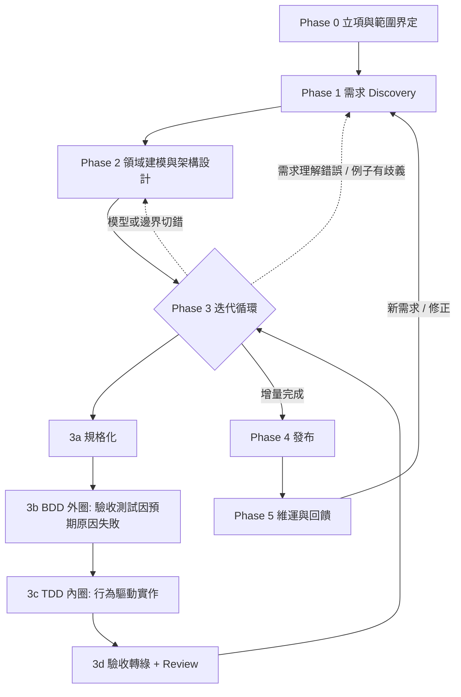

# 參考型 SDLC：以 BDD + DDD + TDD 串接的迭代式開發流程

> 版本：v2（2026-08-05）
> 狀態：參考型（reference）流程，非團隊定稿 SDLC。採用前依「方法裁適原則」（§9）刪減。
> 修訂記錄見文末。

---

## 1. 文件定位與適用範圍

本文描述一條以 BDD、DDD、TDD 串接的迭代增量式開發流程，涵蓋從商業語言定義規格、領域建模、實作驗證到發布回饋的完整生命週期，並標明各階段的表示物（圖與文件）與驗證機制。

**流程假設**：本文採迭代增量式流程，因為 BDD/TDD 的價值高度依賴短週期回饋；若套在需求前置凍結、驗證集中於末期的流程中，BDD 仍可用於改善需求釐清與驗收、TDD 仍可用於實作階段，屬局部可用，但難以發揮完整效益。

**這不是必選套餐**：BDD、DDD、TDD 是三個可獨立採用的方法論，本文描述的是三者都採用時的組合形態。實際採用範圍依 §9 的裁適原則決定。

## 2. 方法與表示法的角色釐清

以下名詞層次不同，不可互相代換：

| 名詞 | 層次 | 角色 |
|---|---|---|
| BDD | 工作方式 | 跨角色（業務/開發/測試）透過具體例子建立共同理解，並將確認後的例子轉為可執行規格。Cucumber 官方描述為 Discovery → Formulation → Automation 的快速小迭代 |
| Gherkin | 表示法 | Given-When-Then 的結構化語法，是 BDD 產出物的一種常見格式，不是 BDD 本身 |
| Cucumber | 工具 | 將 Gherkin 綁定自動化測試的執行器之一（同類還有 SpecFlow、Behave） |
| Event Storming | 工作坊方法 | 可搭配 DDD 與 Discovery 使用的建模工作坊，不是 BDD 的必經步驟 |
| DDD | 設計方法論 | 將業務領域轉為軟體模型與邊界（戰略 + 戰術設計） |
| TDD | 工程實踐 | 以最小可觀察行為驅動實作與設計的 Red → Green → Refactor 循環 |
| UML / C4 / Mermaid | 表示法與工具 | 溝通載體，與上述方法論正交；本文採 C4 + 少量 UML 記號（sequence/state），以 Mermaid 落地 |

三者的黏著劑是 **Ubiquitous Language**：BDD 例子、DDD 模型命名、TDD 測試名稱使用同一套業務詞彙，使需求 → 設計 → 實作 → 驗證之間不需翻譯。

## 3. 流程全景

虛線箭頭是常態回饋路徑：開發中發現需求誤解時回到 Phase 1 補例子，發現 Aggregate 或 Bounded Context 切錯時回到 Phase 2 修模型，不是只能在 Phase 3 內局部調整。

**橫切關注點**：資安、效能、可靠性與可維運性不是單一階段的工作，而是跨階段活動（NIST SSDF 的主張：安全實務整合進整條 SDLC，而非發布前加一道掃描）。各階段內文標註對應工作，§6 提供彙總表。

## 4. 各階段

### Phase 0：立項與範圍界定

- **做什麼**：確認商業問題、成功指標（KPI 與 guardrail metric，含觀察期間）、預算時程約束。
- **橫切工作**：資料分類（哪些是個資/敏感資料）、法規限制盤點、初步 SLO 目標。
- **產出**：一頁式 project brief + C4 System Context 圖（系統邊界、使用者角色、外部系統）。
- **驗證**：利害關係人對照 Context 圖確認邊界。這是最便宜的錯誤修正點。

### Phase 1：需求 Discovery（BDD 前段）

- **做什麼**：跨角色工作坊釐清需求。領域複雜時可採 Event Storming 跑業務事件流，暴露例外流程與詞彙歧義；簡單需求直接以 specification by example 落具體例子即可，不強制開完整工作坊。
- **產出**：
  - Ubiquitous Language 詞彙表（自此開始維護）
  - 高價值場景的例子清單（表格形式，尚非 Gherkin）
  - 工作坊原始產物（事件流照片 / board，不需整理成正式文件）
- **橫切工作**：識別涉及資安、隱私、法規的場景並標記，後續設計與測試需對應。
- **驗證**：三方會談中業務方直接對例子說對/不對。例子被否決 = 需求誤解在寫任何 code 前被抓到。

### Phase 2：領域建模與架構設計（DDD）

- **做什麼**：
  - **戰略設計**：從事件流切出 Bounded Context、畫 Context Map（上下游關係、整合方式）。
  - **戰術設計**：識別 Aggregate（transaction 一致性邊界）、Entity、Value Object、Domain Event。
  - **架構決策**：技術選型、部署形態，重大決策寫 ADR。
- **設計深度原則（避免一次做完設計）**：
  - 先完成影響重大、跨團隊或難以逆轉的設計（Context 邊界、整合契約、資料所有權）。
  - 目前迭代只深化即將實作的模型。
  - 其餘維持候選模型，透過實作回饋逐步修正。
- **產出**（diagram-as-code 進 version control）：
  - C4 Container 圖（可部署單元切分）
  - Context Map（Bounded Context 關係；注意 C4 Component 圖是**單一 container 的內部元件視圖**，不等於 Bounded Context 圖，且 C4 官方將其列為非必畫——多數團隊 Context + Container 兩層已足夠）
  - 即將實作的核心 Aggregate 輕量 class 圖、生命週期複雜物件的 state diagram
  - ADR 若干
- **橫切工作**：威脅建模（threat modeling）、容量假設與失敗模式分析、部署與復原設計。
- **驗證**：架構評審對照非功能需求。模型好壞的檢查有兩層：
  1. 必要條件——圖上每個名詞業務方都認得（詞彙一致性）；
  2. 充分性檢查——模型能表達 business invariants、資料 ownership、一致性邊界與生命週期規則。
- **性質**：本階段產物是草圖等級的起點，不是不可改的藍圖；後續迭代中模型演化，圖跟著改。

### Phase 3：迭代開發循環（BDD 外圈 + TDD 內圈）

每個迭代（1–2 週）從 backlog 取場景，對每個場景：

**3a. 規格化**：把 Phase 1 已確認的例子寫成 Gherkin scenario，QA/業務再確認措辭。

> **驗收範圍界定**：經確認的例子構成**功能行為**的可執行驗收規格；非功能、發布及營運要求（效能、容量、可用性、災難復原、資安、隱私、法規、UX、無障礙、資料遷移、相容性、可維運性與告警）保留適合它們的形式——acceptance criteria、quality attribute scenario 或 checklist，不硬塞進 Gherkin。

**3b. BDD 外圈**：scenario 綁定自動化測試，接在適當的業務邊界。先執行並**確認它因尚未具備的目標行為而失敗**；若一開始就通過，應查明是行為早已存在，還是測試缺乏辨識力（測不出缺失）。因環境、測試資料或 step definition 錯誤造成的失敗不算有效紅燈。互動複雜時先畫 sequence diagram 草圖釐清呼叫鏈。

**3c. TDD 內圈**：以**最小、可觀察的行為**走 Red → Green → Refactor；優先從穩定介面測試，只有當獨立物件的行為值得驗證時才新增對應單元測試，**不要求測試與類別一對一**（一對一容易綁死內部實作、過度 mock、重構時大量無意義測試破裂）。類別形狀依 Phase 2 模型設計、命名用詞彙表。實作中發現模型不對勁，回 Phase 2 修模型與圖——這是正常回饋不是失敗。

**3d. 收斂**：測試全綠 → code review（convention、模型一致性、測試品質）→ 合併。CI 全數通過才能進 main。

- **橫切工作**：SAST 與 dependency scan 進 CI、contract test 覆蓋對外契約、效能基準測試（關鍵路徑）、log/metric/trace 隨功能一起實作。
- **產出**：可運作的增量 + 全綠的活文件（Gherkin 報告即當前功能行為的準確描述）。

### Phase 4：發布

- **做什麼**：pipeline 疊加迭代內測不到的驗證——少量 full-stack E2E、完整效能/負載驗證、資安複掃（此時應是複驗，不是第一次掃）——構成發布門檻；發布後做 production verification。
- **驗收確認**：Product Owner / 業務代表在增量內**持續**確認 acceptance；是否需要正式 UAT、範圍多大，依發布風險、法規及組織治理決定，不一律當成固定關卡。
- **發布策略**：藍綠、canary release、rolling deployment、feature flag 皆為選項，依風險選擇。真正必要的是：
  - 可回復（rollback）或向前修復（fix forward）的方案
  - DB / event schema 向後相容
  - 發布後驗證
  - 明確的停止、rollback 或擴大流量條件
- **產出**：C4 Deployment 圖更新為實際部署拓撲。

### Phase 5：維運與回饋

- **做什麼**：監控告警、事故處理、漏洞回應；事故與漏洞的教訓回饋到 Phase 2 的失敗模式設計與 Phase 3 的測試。新需求回到 Phase 1（小需求走簡化路徑：補例子 → Gherkin → 迭代）。
- **文件維護**：活文件靠 CI 強制保鮮；C4 圖在結構改變的 PR 內順手改；詞彙表隨新概念更新。過期比缺少更有害——寧可少畫，畫了的必須是準的。

## 5. 測試層次

| 層次 | 驗證對象 | 備註 |
|---|---|---|
| BDD / acceptance tests | 業務行為 | 接在適當的業務邊界；直接測 use case 層雖快，但繞過 authentication、authorization、serialization、routing 與真實 adapter，不能單獨代表系統驗收 |
| Unit / component tests | 內部規則 | 快速回饋，TDD 內圈的主體 |
| Contract tests | API、事件與外部 adapter 契約 | 跨團隊 / 跨服務邊界的守門 |
| 少量 full-stack E2E | 整條 wiring | 只覆蓋關鍵路徑，不重複下層已蓋的邏輯 |
| Exploratory testing | 規格沒想到的風險 | 人工探索，補自動化測試的盲區 |

（分層組合的思路與 Cucumber 官方 testable architecture 建議一致：快速測試為主、contract tests 守邊界、full-stack tests 少量。）

## 6. 橫切關注點對照表

| 階段 | 資安 / 隱私 | 效能 / 可靠性 | 可維運性 |
|---|---|---|---|
| 0–1 | 資料分類、法規限制 | SLO / 成功指標定義 | — |
| 2 | 威脅建模 | 容量假設、失敗模式 | 部署與復原設計 |
| 3 | SAST、dependency scan | 效能基準、contract test | log / metric / trace 隨功能實作 |
| 4 | 資安複掃（發布門檻） | 完整負載驗證 | production verification、發布條件 |
| 5 | 漏洞回應與回饋 | SLO 監控、事故檢討 | 告警調校 |

## 7. 成效指標（三層）

測試通過率是品質**門檻**（gate），不是成效指標；Gherkin 場景數容易鼓勵堆數量，不代表需求覆蓋品質。判斷 SDLC 是否有效，分三層看：

| 層 | 指標 | 說明 |
|---|---|---|
| 商業成果 | Phase 0 的 KPI、guardrail metric、觀察期間 | 最終驗證：測試全綠只代表做對了規格 |
| 交付能力 | change lead time、deployment frequency、change fail rate、failed deployment recovery time（DORA metrics） | 流程健康度 |
| 品質與可靠性 | escaped defects、SLO 達成、事故數、測試不穩定率（flaky rate）、關鍵風險覆蓋率 | 品質趨勢 |

## 8. 各階段表示物與驗證對照

| 階段 | 方法 | 表示物 | 驗證機制 |
|---|---|---|---|
| 0 立項 | — | C4 Context、project brief | 利害關係人確認邊界 |
| 1 Discovery | BDD（例子；複雜時 Event Storming） | 詞彙表、例子清單 | 業務方對例子說對/不對 |
| 2 設計 | DDD | C4 Container、Context Map、必要的 class/state 圖、ADR | 架構評審、詞彙一致性 + invariant 表達力 |
| 3 開發 | BDD 外圈 + TDD 內圈 | Gherkin、sequence 草圖、code | 分層測試、code review、CI 掃描 |
| 4 發布 | — | C4 Deployment、pipeline | 發布門檻、production verification、（視風險）UAT |
| 5 維運 | 回饋至 1 / 2 | 更新既有文件 | CI 持續執行活文件、SLO 監控 |

## 9. 方法裁適原則

不是每項需求都必須做完整 Event Storming、DDD 戰術建模、C4 Component、Gherkin 與 UAT。採用強度依三個變數決定：

| 變數 | 低 → 做法 | 高 → 做法 |
|---|---|---|
| 領域邏輯複雜度 | 跳過 DDD 戰術模式，直接 CRUD + TDD | 完整 Bounded Context + Aggregate 建模 |
| 需求溝通失真頻率 | 例子清單 + 輕量確認即可 | 完整三方會談 + Gherkin 活文件 |
| 發布風險 / 法規要求 | PO 增量內確認即可，發布策略從簡 | 正式 UAT、嚴格發布門檻、完整審計軌跡 |

TDD 幾乎沒有不適用的場景，差別只在測試粒度。表示物同理：Context + Container 圖是多數團隊的合理上限，更深的圖只在需要溝通時才畫。方法是為了降低失真，一旦變成形式負擔就該裁掉。

## 10. 待驗證假設

- 本文假設團隊具備業務方可持續參與的協作條件；業務方無法參與時，BDD 的 Discovery 價值大幅下降，需改以 proxy（PO / BA）代位並揭露失真風險。
- 各階段工時與迭代長度（1–2 週）為通用預設，未針對特定團隊 throughput 校準。
- 工具選型（Cucumber 系、Mermaid、Structurizr）以生態成熟度為準，未評估特定團隊既有工具鏈的相容性。

## 11. 修訂記錄

### v2（2026-08-05）— 依審閱意見修訂

必須修改項：

1. **移除「瀑布式必然失效」的絕對敘述**：改為「迭代增量式為本文假設；長回饋週期流程中可局部使用但難以發揮完整效益」（§1）。
2. **區分 BDD / Gherkin / Cucumber / Event Storming / TDD 的角色**：新增 §2 角色釐清表；Event Storming 改為可選方法非必經步驟（§4 Phase 1）。
3. **Gherkin 驗收範圍限縮至功能行為**：非功能、發布及營運要求改用 acceptance criteria / quality attribute scenario / checklist（§4 3a）。
4. **Phase 2 移除「一次做完設計」傾向**：新增設計深度原則（難逆轉優先、迭代深化、候選模型）；更正 C4 Component 圖定義（單一 container 內部視圖、官方列為非必畫）；模型檢查標準補充 invariant / ownership / 一致性邊界 / 生命週期（§4 Phase 2）。
5. **TDD 敘述修正**：「逐一建出需要的類別」改為「最小可觀察行為驅動，不要求測試與類別一對一」（§4 3c）。
6. **紅燈定義修正**：「必然失敗」改為「因尚未具備的目標行為而失敗；一開始就通過需查明原因」（§4 3b）。
7. **資安 / 效能 / 可維運性改為跨階段活動**：各階段增列橫切工作，新增 §6 對照表（對齊 NIST SSDF）。

建議補強項：

8. 流程圖增加 Phase 3 → Phase 1 / 2 的回饋箭頭（§3）。
9. 測試層次補齊 contract tests、少量 E2E、exploratory testing，並標註 use-case 層測試的繞過風險（§5）。
10. UAT 改為依風險 / 法規 / 治理決定，非固定關卡；發布策略改為選項清單 + 必要條件（§4 Phase 4）。
11. 指標改為三層（商業成果 / DORA 交付能力 / 品質可靠性），測試通過率降為品質門檻（§7）。
12. 新增方法裁適原則（§9）與待驗證假設（§10）。

### v1（2026-08-05）

初稿：對話中產出的教學型全景描述（BDD + DDD + TDD 串接之迭代流程）。
