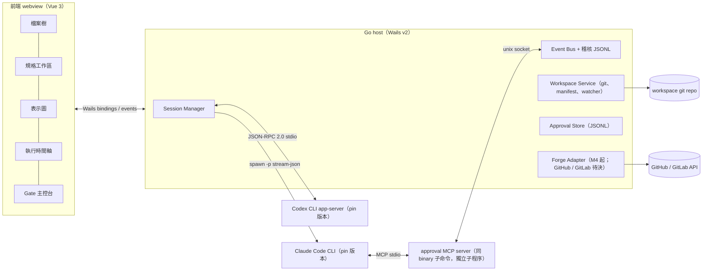

# SDLC 協作工作台 App 規劃：從問答終端機到人機協作 cockpit

> 版本：v1.14（2026-08-27）
> 版本原則（v1.14 起明文）：header 版本＝修訂記錄最新版（本檔為 **living** 文件）；核可綁定為 **frozen** 語意——下方「狀態」行的 digest 快照（app v1.10）不隨 living 修訂移動，兩者分離、不得互相推論。
> 狀態：**已核可（第十輪 plan gate APPROVED）**——核可綁定 app v1.10 快照 `4192f95dbbb25f71527e7f7a41da0f864d61e801c7f98d8f37c625d27201841e`、M0 v1.9 `6b3c4331…3dc6`；本版僅狀態標記。**M0 coding NO-GO 解除**，自 M0 計畫 Task 1 開始。方案 A（Go + Wails v2 + Vue 3）為 M0 基線；app 定位個人自用（scope 決策，非合規確認）。
> 配套文件：`sdlc-bdd-ddd-tdd-reference.md`（參考型 SDLC v2）、`sdlc-ai-agent-automation-plan.md`（AI agent 自動化規劃 v2.1）、`sdlc-workbench-m0-plan.md`（M0 spike 實作計畫 v1.10）
> 範圍：規劃一個桌面 app，承載兩份配套文件定義的人機分工介面（規格輸入、表示圖顯示、檔案結構視窗、AI 結果輸出、agent 執行過程）；host 語言限定 Python 或 Golang；AI provider 為 Claude 與 Codex（訂閱帳號，官方 login flow）。

---

## 1. 目標與定位

### 1.1 現況與問題

目前的協作載體是 better-agent-terminal（下稱 BAT）release 的 app。實際盤點（§2）顯示它在 **session 內**已有相當完整的觀測能力（task tree、diff、Mermaid 即時預覽），但互動單位仍是「一段對話」：缺的是**跨 session 的 SDLC 語意層**——規格作為第一級物件、gate 核可與 hash 綁定、任務 DAG 與證據鏈、多角色 agent 的編排檢視。

### 1.2 定位

**需求更新（2026-08-06）**：使用者要求同 BAT 以**訂閱帳號**使用 AI，預計支援 **Claude 與 Codex** 兩個 provider——本版起納入範圍；帳號與合規原則見 §5.5。**定位確認（同日）：本 app 為個人自用工具，無對外發布計畫**——訂閱路徑在自用範圍內成立，發布相關合規條款轉為條件款（§5.5）。

**本 app 是人這一側的操作台（cockpit）**：自動化規劃 §1.2 說「人管意圖，AI 管執行」，人的意圖決策點（Gate 1–4、Test Contract Approval、升級處理）需要一個把證據擺在眼前的介面。app 負責：

- 呈現：規格、表示圖、檔案結構、AI 產出、agent 執行過程、gate 待辦與證據。
- 記錄：每次核可綁定的對象與版本，append-only 稽核記錄（資料契約見 §5.3）。
- 編排：啟動與監看 agent session（問答模式與任務模式）。

**明確的非目標**：

- 不做 enforcement 層。branch protection、required checks、merge queue 的強制力在 repo / CI 平台側（自動化規劃 §6.3）；app 只呈現與記錄，不宣稱能「擋住」任何變更。
- 不重做 terminal aggregator。BAT 已把多終端機管理做得很好，本 app 不複製這塊；agent 執行過程以結構化事件時間軸呈現，不開互動式 PTY。
- 不做 remote / mobile；provider 範圍為 Claude 與 Codex 兩個（v1.3 依需求納入），第三個 provider 出現前不做更深的通用抽象——provider-neutral event contract（§5.2）以兩個實例為限收斂。
- 不做對外發布／散佈：app 定位為個人自用工具（2026-08-06 確認）；若未來改變定位，依 §5.5 條件款處理。

### 1.3 成功條件（可獨立驗證；v1.1 依 gate 完整性重排）

1. **SC1 規格工作流閉環**（M2 達成）：規格編輯 → AI 輔助 → 送核 → Gate 1 核可（綁 spec manifest digest + commit SHA）；核可後規格再變更會觸發 STALE 失效（§5.3）。
2. **SC2 執行過程可回答四個問題**（M1 達成）：任一 agent session 隨時能看出「在哪個任務、剛做了什麼工具呼叫、卡在哪、花了多少 token / 成本」。
3. **SC3 核可可稽核**（M2 起逐 gate 達成）：每筆核可含 approver、decision、reason 與完整 bindings，事後可重建「誰在何時對哪個版本核可、該核可現在是否仍有效」。
4. **SC4 單任務全程不切出 app**（M4 達成）：規格 → Gate 1 → 計畫 → Gate 2 → Test Contract Approval → 實作 → 證據鏈 → Gate 3 送核，全程在 app 內完成。v1 把此條放在 M2 並跳過 Gate 2 / Test Contract Approval，是流程漏洞，已修正。

## 2. 現有專案盤點：better-agent-terminal

外部開放原始碼專案（tony1223/better-agent-terminal，MIT 授權），v3 系為 Tauri-only（已移除 Electron）。實際架構（讀自 repo）：

| 層 | 技術 | 證據 |
|---|---|---|
| Shell | Tauri 2（Rust host），另有 headless `bat-server` binary | `src-tauri/Cargo.toml` |
| Renderer | React + Vite + TypeScript；xterm.js、highlight.js；session 內 Task / Agent / Workflow tree；inline / Git diff；Markdown 監看與 Mermaid 即時重渲染 | `renderer/src/lib/agent-task-tree.ts`、`renderer/src/components/ClaudeAgentPanel.tsx`、`renderer/src/components/MarkdownPreview.tsx`、`MarkdownPreviewPanel.tsx` |
| Agent 層 | **Node sidecar** 掛官方 TS Agent SDK（`@anthropic-ai/claude-agent-sdk` 0.3.220），以 JSON-RPC 橋接 Rust 與 SDK；自述 filesystem-backed handlers | `node-sidecar/package.json`、`node-sidecar/src/handlers/` |
| 資料 | JSON / JSONL 檔案為主；SQLite 僅局部功能（README 稱 snippet manager 使用；source 內未見 better-sqlite3 直接引用） | `node-sidecar/package.json` 描述、`package.json` |
| IPC 契約 | renderer 事件 `claude:message` / `claude:stream` / `claude:status` / `claude:result` / `claude:turn-end` 等，明定 additive-only | `AGENTS.md` |

### 2.1 已涵蓋 vs 缺口（v1.1 依實際程式收斂）

| 需求 | BAT 現況 | 真正缺口 |
|---|---|---|
| 檔案結構視窗 | ✅ file browser + 預覽 + 搜尋 | 缺 SDLC 狀態語意（規格核可狀態、oracle surface 範圍標示） |
| AI 結果輸出 | ✅ streaming、thinking 區塊、inline / Git diff（`ClaudeAgentPanel.tsx`） | 缺與 gate / 任務綁定的結構化報告呈現 |
| agent 執行過程 | ✅ session 內 Task / Agent / Workflow tree（`agent-task-tree.ts`）、permission modes、subagent 追蹤、token / 成本 statusline | 缺**跨 session** 的 SDLC 任務 DAG；事件不帶 gate / hash / evidence 語意 |
| 規格輸入 | ❌ 無 | Gherkin / NFR / 詞彙表工作區、AI 輔助草擬與歧義偵測 |
| 表示圖顯示 | ✅ Markdown 預覽含 Mermaid，監看檔案變更即時重渲染（`MarkdownPreviewPanel.tsx`） | 缺獨立圖層、圖 ↔ 規格 / 任務的點選導航；非 Markdown 來源（如計畫 DAG 資料）無視覺化 |
| （報告推導）gate 主控台 | ❌ 無 | Gate 1–4 與 Test Contract Approval 待辦、hash 綁定顯示、證據連結、升級收件匣 |

一句話收斂：**BAT 不缺 workflow tree、diff 或 live diagram；缺的是跨 session 的 SDLC 語意層（規格、gate、hash、證據）**。v1 的盤點低估了 BAT，已修正。

### 2.2 可帶走的三個架構教訓

1. **UI shell 與 agent runtime 分離，以事件契約銜接**。BAT 即使用 Rust shell，agent 層仍是獨立 sidecar process，透過 JSON-RPC / 事件溝通（sidecar 限定 **Claude SDK 路徑**：依其 `AGENTS.md`，Codex session 可由 Rust runtime 直接處理）。這使 shell 語言與 agent SDK 語言解耦——正是本規劃語言選型的自由度來源。
2. **renderer-facing 事件契約 additive-only**。BAT 把 `claude:*` 事件當相容性契約管理；本 app 的事件 schema（§5.2）沿用此紀律。
3. **session 的 runtime ownership 單一**。一個 session 生命週期由單一 runtime 擁有，避免混合回應；本 app 的 session manager 沿用。

## 3. 需求對映：五大功能 ↔ 兩份報告

| app 面板 | 使用者需求 | 報告依據 |
|---|---|---|
| 規格工作區 | 規格輸入 | 參考型 SDLC §4 Phase 1 / 3a（例子 → Gherkin）；自動化規劃 §4 Stage A、Gate 1 |
| 表示圖檢視 | 表示圖顯示 | 參考型 SDLC §8 表示物（C4 Context / Container、Context Map、state）；自動化規劃 §5 任務 DAG |
| 工作區檔案樹 | 檔案結構視窗 | 自動化規劃 §4 spec/ 目錄佈局、§6.3 oracle surface 範圍標示 |
| AI 輸出面板 | AI 結果輸出 | 自動化規劃 §6.4 預審報告、diff 審閱 |
| 執行時間軸 | agent 執行過程 | 自動化規劃 §6.2 執行迴圈、§7 失敗分診、§9 可追溯性 |
| Gate 主控台 + 升級收件匣 | （報告推導，使用者未列但必要） | 自動化規劃 §2 四 gate、§3 hash 綁定（含 Test Contract Approval）、§1.2 fail closed 升級 |
| 問答面板 | （保留 BAT 既有價值） | 現況問答協作模式 |

Gate 主控台是報告推導的新增項：兩份報告的流程核心是「人只出現在意圖決策點」，若 app 只有五大呈現功能而沒有 gate 操作面，人仍得切到 forge / CI 介面完成決策，cockpit 就不成立。

## 4. 資訊架構與畫面

```
┌──────────┬──────────────────────────────┬────────────────┐
│ 檔案樹    │ 中央分頁工作區                │ AI 面板         │
│ +狀態徽章 │ 規格編輯│表示圖│diff│檔案預覽 │ 問答 / 結果輸出 │
│          │ (CodeMirror / Mermaid 渲染)  │ (Markdown)     │
├──────────┴───────────────────┬──────────┴────────────────┤
│ 執行時間軸(session × 事件流)  │ Gate 主控台 / 升級收件匣    │
└──────────────────────────────┴───────────────────────────┘
```

- **規格工作區**：編輯 `spec/features/*.feature`、`nfr/`、`glossary.md`；AI 輔助動作（草擬 Gherkin、歧義偵測、oracle 覆蓋檢查）以按鈕觸發、產出進草稿區；「送核可」動作依 §5.3 建立 spec manifest 與 Gate 1 待辦（dirty tree 拒絕送核）。編輯器用 CodeMirror 6（Gherkin 語法標示；比 Monaco 輕，夠用）。
- **表示圖檢視**：獨立圖層（非只 Markdown 附帶），監看 `context-map/` 與計畫檔變更自動重渲染；任務 DAG 由 Planner 產出的計畫檔渲染，節點點選導航到對應規格 / 任務。
- **檔案樹**：git status + 工作流徽章（已核准規格、草稿、oracle surface 保護範圍——標示來源是設定檔宣告的 path pattern，僅視覺提示，不是 enforcement）。
- **執行時間軸**：每個 session 一條 lane；事件卡片＝工具呼叫、檔案變更、測試執行（紅 / 綠）、重試、升級、gate 請求、核可決定；可展開看原始輸出；顯示 token / 成本累計（BAT statusline 的資訊密度是好基準）。
- **Gate 主控台**：待辦清單涵蓋 Gate 1–4 與 Test Contract Approval，每項顯示 gate 種類、bindings（§5.3）、證據連結（expected-red run、CI checks）、核可 / 退回按鈕與理由欄；動作寫入 ApprovalRecord；綁定對象變更即標 STALE 並通知。
- **問答面板**：保留自由對話（探索、諮詢），與任務模式共用 session manager。

## 5. 系統架構（以推薦方案 A 描繪；B / C 差異見 §6）



### 5.1 Agent bridge——Claude 線（核心正確性面；v1.1 依官方文件收斂）

依據官方 [headless 文件](https://code.claude.com/docs/en/headless)與 [CLI reference](https://code.claude.com/docs/en/cli-reference)（2026-08-05 查證）：

- **啟動旗標**：`claude -p --input-format stream-json --output-format stream-json --verbose --include-partial-messages`。官方明載 token-level streaming 需要 `--verbose` 與 `--include-partial-messages` 兩者，不是只開 stream-json 就有。
- **MCP 設定**：`--mcp-config`（app 產生的設定檔）+ `--strict-mcp-config`（只載 app 指定的 server，隔絕使用者環境的其他 MCP 設定）。
- **權限互動**：`--permission-prompt-tool` 的值必須是已透過 `--mcp-config` 載入的 MCP tool；CLI 啟動時最多等該 server 連上 30 秒（`MCP_TIMEOUT`）。**MCP server 是獨立子程序**（stdio 面向 CLI），與 UI 的往返需明定 IPC 路徑：approval server（同一 binary 的子命令）→ unix domain socket → Go host → Wails event → UI 彈窗；決定沿原路回傳。逾時或 socket 斷線一律 deny（fail closed）。permission tool 的精確輸入 / 回傳 schema 以 pin 版本文件 + M0 錄流為準。
- **Session 與 cwd**：`session_id` 自 `system/init` 事件取得；`--resume` 的 session lookup scoped 到 project 目錄（含其 git worktrees），因此 session 一律以 canonical cwd 啟動與續接。
- **失敗偵測面**：`system/init` 的 `mcp_servers` / `mcp_server_errors` 欄位偵測 MCP 載入失敗；`system/api_retry` 事件呈現重試；以 `capabilities` 陣列做 feature detection（不比對版本字串）；CLI process 以 exit code 判定結束狀態。
- **版本 pin**：CLI 版本固定並隨 app 發布記錄；升級 CLI 視為一次變更，跑協定 contract test（用錄下的 stream-json 事件流 replay 驗證 parser）。ownership 與認證模式的產品決策見 §6.5。

### 5.2 事件 schema（UI 與 host 的解耦契約；v1.3 起 provider-neutral）

統一 envelope：`{event_id, ts, provider, session_id, role, task_id?, type, payload, bindings?}`；`provider ∈ {claude, codex}`（v1.3 新增），UI 不做 provider 特判分支、provider 欄位僅作標示；各 provider 的 wire format 由各自 adapter 映射進 envelope，原文一律保留。`type` 涵蓋 message / tool_call / tool_result / test_run / retry / escalation / gate_request / **approval_decision** / **binding_stale** / state_change。M0 的 `internal/contract` 是此契約的第一版實作（M0 計畫 Task 2）。稽核記錄即此事件流的 append-only JSONL（對齊自動化規劃 §9 可追溯性）。契約 additive-only（BAT 教訓 2）。

### 5.3 核可記錄與綁定的資料契約（v1.1 新增、v1.2 依第二輪審閱修正；UI 實作前凍結）

審閱指出 v1 無法可靠重建「誰核可哪個版本」，本節補正式契約，M2 開發前先凍結 schema：

**ApprovalRecord（決定本身 immutable，寫入後不再變更）**：

```
approval_id        ULID
gate               gate1 | gate2 | gate3 | gate4 | test_contract_approval
decision           approved | rejected
approver           {id, method}          # method: app-local（本機操作者）| forge（M4 起對應平台身分）
reason             string                # rejected 必填；approved 建議填
bindings           [{kind, ref, digest}] # 必填組合依 gate 而定（下表）；缺任一必填 kind 拒絕寫入
created_at         RFC3339
```

**各 gate 的必填 bindings（v1.2 新增：gate-specific schema，對齊自動化規劃 §3）**：

| Gate | 必填 binding kinds | 對應自動化規劃 §3 |
|---|---|---|
| gate1 | spec_manifest（涵蓋 spec/ 全樹：features + nfr + glossary）+ base_commit | spec SHA、NFR SHA、詞彙表版本 |
| gate2 | spec_manifest + plan + base_commit；另以欄位記 risk_tier 與任務權限清單 ref | spec SHA、plan SHA、risk tier、權限清單 |
| test_contract_approval | base_commit + oracle_surface + evidence_run（expected_red、negative_control 各一） | base code SHA、oracle-surface digest、紅燈與 negative-control 證據 |
| gate3 | promotion_head + main_base + oracle_surface | promotion PR head SHA、main base SHA、oracle-surface digest |
| gate4 | artifact + deployment_manifest + 觀察與停止條件文件 digest | artifact digest、SBOM / provenance、deployment manifest |

gate3 的核可與 merge queue 驗證是兩件事（v1.2 拆分）：核可綁定上表對象；enqueue 後平台對 merge-group SHA 重跑 required checks 屬**平台側驗證**，app 只收錄其結果作為證據，不併入核可本身。

**狀態與失效（v1.2 修正 append-only 與可變 status 的衝突）**：ApprovalRecord 不含可變 status。失效與取代以**另行 append 的 transition 事件**表達——`approval_transition {approval_id, to: stale | superseded, at, cause, evidence_ref}`；目前狀態（active / stale / superseded）是由 record + transitions 重算的 **projection**，UI 顯示 projection，稽核檔永遠只追加。STALE 觸發不變：workspace watcher 重算綁定 digest，不一致即 append `binding_stale` 事件與對應 transition；stale 核可不得作為後續 stage 的前置條件（對齊自動化規劃「核准對象改變即失效」）。

**Spec 綁定的 digest 定義**（回答 dirty tree / 多檔案問題）：

- canonical manifest ＝ 納管範圍（如 `spec/`）內檔案的**排序相對路徑 + 各檔 SHA-256**，序列化為 canonical JSON 後取 manifest digest；核可以 manifest 為單位，天然涵蓋多檔案規格。
- 同時記錄當時的 HEAD commit SHA。**納管範圍內若有未 commit 變更（dirty tree）則拒絕送核**——先 commit 才能綁定，確保 digest 可由 git 歷史重建。
- 其他 binding kind（plan、oracle_surface、artifact）沿自動化規劃 §3 的定義，digest 演算法相同。

**效力邊界**：以上是本機稽核契約，不是平台 enforcement；防竄改（如稽核檔簽章）不在目前 scope，需要時另議。

### 5.4 資料存放

- workspace 本身是 git repo（規格、圖、計畫檔都是檔案；digest 依 §5.3 定義計算，不是籠統的「hash 取自 git」）。
- app 狀態分三層（v1.2 修正）：**(1) raw sensitive**——錄流與含 payload 的稽核原文（可能有 prompt、程式碼、路徑、tool input），落 `.workbench/`（gitignored），**絕不 commit**；**(2) app state**——session 記錄、ApprovalRecord 與 projection、設定，同樣 gitignored；**(3) 可版本化證據**——digest、meta、去敏 fixtures、報告，落 repo 內 `docs/`、`testdata/`，可 commit 可審閱。JSONL 為主；SQLite 等查詢層等實際查詢需求出現再引入。
- Gate 核可在 M2–M3 只落本機記錄；M4 起 Gate 3 核可透過 forge adapter 轉為平台上的實際動作（PR / MR review），enforcement 仍由平台執行。

### 5.5 Provider 與帳號原則（v1.3 新增）

**帳號原則（兩個 provider 一體適用）**：訂閱帳號一律走**官方瀏覽器 OAuth／device flow**（`claude` 官方 login、Codex「Sign in with ChatGPT」）；**app 不收密碼、不讀取、不搬移、不自行保管任何 token**——credential 由各官方 CLI 自有機制保管，app 只喚起 login 流程與查詢登入狀態。

**Codex 線**：以 `codex app-server` 整合——官方明確定位為供第三方產品深度整合的介面（JSON-RPC 2.0 語意、wire 省略 `jsonrpc` 欄位；認證含 Sign in with ChatGPT、會話、核可、串流事件；`generate-json-schema` 可產出版本專屬 schema；實作開源於 openai/codex）。來源：[Codex App Server 官方文件](https://learn.chatgpt.com/docs/app-server)（developers.openai.com 舊址 308 轉址至此）、[OpenAI blog](https://openai.com/index/unlocking-the-codex-harness/)。訂閱登入屬官方支援路徑。

**Claude 線（合規不對稱，v1.3 關鍵邊界；v1.4 依自用定位收斂）**：Anthropic 公開規範（[legal-and-compliance](https://code.claude.com/docs/en/legal-and-compliance)）**不允許第三方產品提供 claude.ai login 或代使用者經 Free／Pro／Max 憑證路由請求，除非事先取得核准**；2026-03 起以法務與伺服器端手段 enforcement（[報導](https://www.theregister.com/software/2026/02/20/anthropic-clarifies-ban-on-third-party-tool-access-to-claude/5014546)）。本專案處置：

1. **App 定位為個人自用（2026-08-06 使用者確認；v1.5 措辭修正）**：本人、本機、自有帳號、經官方 CLI。這是 **scope 決策與風險承擔，不是合規確認**——官方文字未明確核可個人 wrapper，也未說僅發布才觸發限制；規範適用性未獲官方確認，連同 enforcement 漂移一併列 §8 已知風險。M0 完成的是「目標自用型態的技術驗證」，報告不得以「合規 ✔」表述。
2. **條件款（僅在未來改變定位時觸發）**：若要對外發布／散佈 Claude 訂閱路徑，**取得 Anthropic 書面核准後才可發布**；未核准的對外版本，Claude 僅提供 API-key 模式（Codex 訂閱路徑不受此限——app-server 本就是官方第三方整合面）。**BAT 能運作不構成發布情境的合規先例**。
3. enforcement 漂移列為常設風險（§8）：即使自用，未來伺服器端調整仍可能影響行為，M0 結果代表當下 pin 版本。

<a id="gate-decision-consistency"></a>

### 5.6 Gate 決議一致性（v1.13 新增，2026-08-18）

收件匣（escalation inbox）不是核可正確性的唯一來源。若讓 UI 先查 inbox、確認沒有 blocker 後才呼叫核可，「查詢」與「寫入」之間會有 TOCTOU 窗口讓新的 blocker 插進來。因此 `App.GateDecide` 把整段決議凍結成固定順序，並全段放在同一個 workspace-level 的 workflow mutex 底下。

**決議順序（依 `app.go` 目前 production 實作記錄）**

| # | 步驟 | 實作 | 失敗處置 |
|---|---|---|---|
| 1 | reconcile bindings | `reconcileLocked`（含 §3.8 的 stale／journal-degraded 補建） | 回傳錯誤，拒絕核可 |
| 2 | 執行硬性 validator 與 current-binding validation | `gate.Service.PrepareDecision`（gate-specific validator；`approved` 另做 current-binding validation，擋掉待核期間已過期的請求，§5.3） | 回傳錯誤，拒絕核可 |
| 3 | 核可修正版時，先由系統解除同 subject 的舊 stale blocker | 僅 `decision == "approved"` 執行：以 condition key `stale:<gate>:<subject>` 呼叫 `escResolveByKeyLocked`，resolution 記為 `superseded-by:<approval_id>` | **解除失敗即拒絕核可**（fail closed——escalation journal 寫不進去時 Gate 不得放行） |
| 4 | 檢查相同 scope 的 blocking 項目 | `escBlockingForLocked(scope)` → `escalation.BlockingFor` | 有 blocking 項目即拒；**projection 本身失敗也拒**（收件匣不可用不得降級成「視為沒有 blocker」） |
| 5 | append 核可決議 | `gate.Service.CommitDecision` | 回傳錯誤 |

步驟 3 的時點是刻意選定的：current-binding validation（步驟 2）通過，即代表同 subject 的 stale 條件已被這個修正版修復；stale 的 escalation 記錄本身是終態，修復載體是修正版的核可流程，所以解除必須發生在步驟 4 的 blocker 檢查**之前**，否則修正版永遠會被自己要修的那筆 stale blocker 擋住。

步驟 4 檢查的是**所有**尚未 `resolved` 的項目（`open` 與 `acknowledged` 都算——`acknowledged` 不解除阻擋），不分系統自動建立或使用者手動建立；只有 `block_scope == ""` 的純通知項目不阻擋。`block_scope == "workspace"` 覆蓋所有 scope。

**scope 對映**（`scopeForSubject`）：`gate1` → `workspace`；`gate2` 的 `plan:<id>` → `gate2:<id>`；`test_contract_approval` 的 `task:<plan>/<task>` → `tca:<plan>/<task>`。未知 gate 一律映到最寬的 `workspace`（fail closed）。

**workflowMu 範圍**

- 步驟 1–5 全部在同一次 `workflowMu` 持有期間內完成，中途不釋放。因此 blocker 只能在 `workflowMu` 之外排隊，不存在「檢查後、append 前」被插入的窗口。
- git identity 解析與 `ensureGate` 在取得 `workflowMu` **之前**執行（兩者都不生產 blocking 狀態，不需納入臨界區）。
- 同一把 `workflowMu` 也序列化了其餘所有 blocking 狀態生產路徑：escalation 收件匣的全部寫入（create／ack／resolve／list）、evidence run finalize 的自動來源接線（`wireEvidenceEscalation`）、以及 workspace watcher 觸發的 reconcile。

**Lock ordering 與重入規約**

- Lock ordering 固定為 `workflowMu` → gate journal（`gate.Service` 內部 mutex）→ escalation journal（`escalation.Service` 內部 mutex），避免兩個 journal 互鎖。
- `evidenceMu` 與 `workflowMu` **不巢狀**：`RunEvidence` 的 finalize 臨界區（`evidenceMu`）先完整結束，才另取 `workflowMu` 做 §3.8 的自動來源接線。
- 重入規約：public 的 `EscalationCreate`／`EscalationAck`／`EscalationResolve`／`EscalationList` 自行取 `workflowMu`；已持有 `workflowMu` 的路徑（`GateDecide` 編排、`reconcileLocked`、`wireEvidenceEscalation`）只准呼叫 `esc*Locked` 內部變體，否則同一把 mutex 重入即死鎖。

**與既有文件的關係（本節為 reader-facing 權威）**

`docs/superpowers/specs/2026-08-12-m3a-plan-test-contract-design.md` §3.10 是這段順序的原始設計，但**已落後於實作**，兩處差異以本節為準：

1. §3.10 只有四步，**缺少上表步驟 3**（修正版核可時的系統解除）——該步驟是後續實作補上的。
2. §3.10 寫「檢查同 scope 的**人工** blocking escalation」，但實作檢查的是所有帶 `block_scope` 的未解除項目，系統自動建立的項目同樣阻擋。

## 6. 語言與技術選型

### 6.1 先把制約攤開

**表示圖顯示決定了 UI 技術**：Mermaid 是 JS 函式庫（C4 / Context Map / DAG 渲染都靠它），Markdown 渲染與程式碼編輯器（CodeMirror / Monaco）同樣是 web 生態。純原生 GUI（Python 的 Qt widgets、Go 的 Fyne）都無法原生渲染這些，勢必內嵌 webview。**因此「Python 還是 Go 比較適合圖形化 IDE」的實際題目是：webview 前端固定，host / backend 用哪個語言。**

第二個制約：**官方 Claude Agent SDK 只有 TypeScript 與 Python**（[Agent SDK overview](https://code.claude.com/docs/en/agent-sdk/overview)；headless 文件同樣載明「available as a CLI …, or as Python and TypeScript packages」）；Go 只有一般 API client（anthropic-sdk-go），沒有 Agent SDK。BAT 的 Node sidecar 正是這個制約的產物：Rust shell 也得掛一個 Node process 才能用 SDK。

第三個制約（v1.3）：**Codex 的官方整合面 app-server 是 JSON-RPC 2.0 over stdio**——任何語言都能驅動，Go 無劣勢；因此雙 provider 需求不改變 host 語言的選型結論。

### 6.2 三個方案

| 面向 | A：Go + Wails v2 + Vue 3<br>bridge = CLI stream-json | B：Python + 官方 Agent SDK<br>GUI = pywebview / PySide6+QWebEngine | C：Go + Wails v2 + Node sidecar<br>（BAT pattern 移植） |
|---|---|---|---|
| Agent bridge | 自行實作 stream-json 協定 client + permission MCP server；**協定漂移風險自負**（以 pin 版本 + contract test 控制） | 官方 SDK 原生支援（permission callback、hooks、session 管理），維護成本最低 | 官方 TS SDK（BAT 的 Claude 整合以此路徑在 release 版本實際運作），但多養一個 Node runtime |
| GUI / 圖形能力 | Wails v2 stable；前端 Vue 3，Mermaid / CodeMirror 第一級支援 | pywebview 輕但橋接層陽春；QtWebEngine 成熟但打包 +150MB 級 | 同 A |
| 打包發布 | 單一 binary + webview，最乾淨 | PyInstaller / briefcase，體積大、簽章流程繁 | binary + 內嵌 Node runtime，體積中等、啟動鏈較長 |
| 並行與事件流 | goroutine + channel 天然貼合多 session 事件匯流 | asyncio 可行 | Go 同 A，但跨 process 邊界多一層 |
| 與既有技能對齊 | **高**：使用者主力後端 Go（gmp）、前端 Vue 3（backoffice2） | 低：現有專案組合中無 Python 主力使用證據 | 中：Go + Vue 對齊，另需維護 Node 層 |
| 主要風險 | stream-json 協定版本漂移；權限 round-trip 延遲需實測 | GUI 層與打包品質；技能不對齊拖慢迭代 | 三 runtime（Go + Node + web）維護面最寬 |

### 6.3 推薦與審閱裁決

**方案 A（Go + Wails v2 + Vue 3 + CLI stream-json bridge）經審閱條件核可為 M0 基線；第三輪審閱明示技術選型未被否決、仍成立。M0 通過後才正式定案。** spike 失敗且失敗歸因於 Claude CLI bridge 本身時轉方案 C，不轉 B（轉向規則見 §7 M0 與 M0 計畫）；Codex 線失敗不觸發方案 C，獨立評估 go / no-go。

理由：

1. **技能對齊是最大的交付速度槓桿**：Go 後端 + Vue 前端是使用者現有兩個主力專案的組合，B 方案等於同時換語言又做新產品。
2. **Wails v2 是 stable、v3 仍為 beta**（[wails.io](https://v3.wails.io/)、[Releases](https://github.com/wailsapp/wails/releases)）；本規劃採 v2，不賭 v3 時程。
3. **CLI headless 本來就是自動化規劃的既定依賴**（§12 待驗證假設列 headless 執行、hooks、權限限制），app 走同一介面等於順路驗證 pilot 前置條件，而非額外風險。
4. 協定漂移風險有明確的控制手段（pin + contract test + BAT 事件契約當參考形狀），且 fallback（方案 C）的 sidecar 路徑已在 BAT 的 release 版本實際運作（限其 Claude SDK 整合）。
5. 誠實註記：**若放寬語言限制，「web 前端 + TS Agent SDK」是生態最順的組合**——BAT 的 Claude 整合即為此路徑（其 shell 為 Rust，並非 TS 全端）。在 Python / Go 限制內，A 是風險最小的組合。

### 6.4 App 語言 ≠ agent 角色語言（重要解耦）

自動化規劃的 agent 角色（Planner、Test binder、Implementer⋯）未來若要腳本化，**可以用 Python Agent SDK 實作，不需要跟 app 同語言**：app 是 cockpit，角色 harness 是被編排的 process，兩者以 CLI / MCP / 事件契約為邊界。選 Go 做 app 不會封死「角色層用 Python SDK」的路。

### 6.5 CLI 發行與 forge 的產品決策（v1.1 新增，待決）

**CLI ownership 與認證 / 計費**（M0 實測後定案；v1.3 依新需求改寫）：

- **ownership**：兩個 CLI（claude、codex）都適用同一問題——app 隨附固定版（發布時綁定、auto-update 停用）vs 使用系統安裝版（啟動時檢查版本相容）。前者可重現性高、發布體積大；後者輕但版本漂移回到使用者身上。M0 一律用 repo 管理的 exact pin binary。
- **認證：訂閱為主（2026-08-06 需求定案）**：兩個 provider 都以訂閱帳號、官方 login flow 為主路徑（原則與合規見 §5.5）。Claude 的 `--bare` + `ANTHROPIC_API_KEY` 降為 fallback——用於 CI、以及未取得 Anthropic 核准前的對外發布版；官方註記 bare「will become the default for `-p` in a future release」，主路徑因此需長期盯 CLI 行為變化。訂閱 login 模式會載入使用者環境設定，以 `--strict-mcp-config` 等旗標部分隔離。API-key 實測 run 前須取得明確成本授權並使用隔離 credential profile（M0 計畫 A11 前置）。

**Pilot forge**（M4 前定案）：v1 硬編 GitHub / `gh`，但用來支撐技能對齊論點的兩個主力專案位於內部 GitLab 型平台。選項：(a) GitHub-first——pilot 在個人 / 新 repo 進行，GitLab 之後再加 adapter；(b) 直接做 GitLab adapter。架構上 forge adapter 一開始就介面化（§5 的 Forge Adapter），M4 才綁定第一個實作，兩案都不影響 M0–M3。

## 7. 分階段交付（v1.1 依 gate 完整性重排）

工時為粗估工程量（專注工作週），**未依實際 throughput 校準**；M3 之後的節奏依自動化規劃 pilot 的實際進展調整——app 不要跑在流程成熟度前面。

| 里程碑 | 內容 | 成功條件 / 驗證 | 粗估 |
|---|---|---|---|
| **M0 技術 spike** | 雙驗證線（詳見 `sdlc-workbench-m0-plan.md` v1.9）——**Claude 線** A0–A12：app 內官方登入、CLI bridge、streaming、allow / deny / 逾時 fail closed、MCP 載入失敗、未知與畸形事件、錄流 replay、canonical cwd + resume、Terminate、訂閱模式主測；**Codex 線** B0–B6：app 內 Sign in with ChatGPT、app-server handshake、turn 串流、核可往返、replay、session 持續性；**契約線** N1：provider-neutral contract 同一 UI 承載雙 provider；**韌性線** R1：Recorder 失敗可見性；封裝後 app 隔離雙 provider smoke | Claude 線全過 → 方案 A 定案（失敗**且歸因於 CLI bridge 本身**才轉方案 C；Wails / Vue / PoC bug 不構成轉向理由）；Codex 線獨立 go / no-go | 3 週 |
| **M1 MVP** | 問答面板 + 檔案樹 + Markdown / Mermaid 預覽 + 執行時間軸（單 session、**provider 切換（claude / codex）**、事件 schema v1、稽核 JSONL、**minimal task identity**：session 啟動時掛任務標籤，envelope 的 task_id 自 M1 生效） | SC2（四個問題可回答；「在哪個任務」由任務標籤承載）；BAT 問答等價 + 執行過程強化 | 3–4 週 |
| **M2 Stage A 閉環** | 規格工作區 + §5.3 資料契約實作（ApprovalRecord、canonical manifest、dirty-tree 拒核、STALE watcher）+ Gate 1 主控台 | SC1、SC3（Gate 1 範圍）；**只含 Stage A / Gate 1，不宣稱完整任務路徑** | 2–3 週 |
| **M3 計畫與測試契約** | 任務 DAG 圖 + Gate 2 + **Test Contract Approval 主控台**（綁 base commit + oracle-surface digest + expected-red / negative-control 證據連結）+ 升級收件匣 + 多 session 並看 | SC3 擴及 Gate 2 / TCA；STALE 對 plan / oracle-surface 綁定生效 | 3–4 週 |
| **M4 完整任務路徑** | 證據鏈檢視 + Gate 3 主控台（**人工核可與 enqueue 後的 merge-group 驗證分離呈現**，見 §5.3）+ forge adapter 第一個實作（依 §6.5 決策）；核可轉為平台動作 | **SC4（單任務全程不切出 app）**；Gate 3 核可與 merge-group 驗證結果均可於平台側追溯 | 2–3 週 |
| **M5 發布面板** | Gate 4、verifier 報告呈現 | 依 pilot 進展再定義，暫不排程 | — |

導入節奏對齊自動化規劃 §11 第 4 點的漸進原則：M1–M2 支撐「AI 預審 + 全量人工 review」期，M3–M4 才擴到多個任務的編排；每個里程碑以實際使用回饋決定是否前進。

### 7.1 主線完成後候選里程碑：ACP／多 Agent Runtime（2026-08-13 owner 定向）

**明確不納入 M3a.1、M3b、M4 已凍結範圍**——主線依凍結計畫完成後，再規劃成獨立版本功能（屆時走 spec → plan gate 流程）。定位：**新增選擇，不是重寫現有架構**。要點：

- 新增 **ACP client adapter**，OpenCode 為首個目標；**保留** Claude Code、Codex 原生 adapter。
- 現有 `contract`／`ports`／Envelope 維持 **canonical 相容層**——ACP event 映射進既有 Envelope，不以 ACP event 取代 Workbench 契約；原始 payload 保留（稽核證據）。
- 分離 `agent_id`／`transport`／`model_ref`（取代現行寫死的 claude｜codex 二值）。
- **Capability negotiation**：只統一真正共有語意（session start/resume/end、turn submit/cancel、streaming、tool use、approval、result/usage/error、recorder/replay）；差異能力以 capability 宣告（resume、interactive_question、approval、model_selection、usage、subagents、skills、hooks、subscription_auth），前端依 capability 停用＋說明、不靜默模擬——避免把所有 agent 降成最低共同功能，也不採 BAT 的 Claude-shaped façade。
- 前置 spike：`claude-agent-acp` 等價性驗證，再決定是否能取代部分原生 Claude 路徑；相容性測試套件（同組 session／核可／取消／resume／稽核案例跑三個實作）。抽象時機：等 OpenCode 成為第三個實作後再抽——抽的是真實共有契約。

## 8. 風險與待驗證假設

1. **stream-json 協定穩定度**：協定由 Claude Code 版本決定，pin + contract test 是緩解不是消除；M0 spike 是第一個驗證點。permission tool 的精確 payload schema 官方 CLI reference 未載明，以 M0 錄流確認。
2. **權限 round-trip 延遲**：`--permission-prompt-tool` 經 MCP stdio + unix socket 往返的互動延遲未實測；若體感差，需評估預授權清單（對齊自動化規劃的風險政策，低風險工具預先放行）。
3. **訂閱模式實測行為（v1.6 改寫：認證方向已定案）**：認證以訂閱為主已於 2026-08-06 定案（§6.5、§9）；仍待驗證的是訂閱 login 模式的實際行為（使用者環境載入、`--strict-mcp-config` 隔離效果、init 呈現）與 API-key fallback 對照——由 M0 A11 提供實測資料（選測，需成本授權）。
4. **多 session 資源上限**：並行 session 的 token / CPU 成本需設上限與視覺化（自動化規劃 §9 資源上限），MVP 先單 session 迴避。
5. **平台範圍**：macOS 優先（使用者環境），Windows / Linux 的 webview 差異未驗證。
6. **BAT 參考的邊界**：MIT 授權，參考架構與事件契約形狀無疑慮；但不 fork（Rust + TS 超出語言限制，且 SDLC 工作流是產品方向分歧，難以回饋 upstream）。
7. **工時未校準**：§7 粗估未依實際可投入時間校準；M0 結束後應重估。
8. **Gate 記錄的效力邊界**：M2–M3 的核可只是本機稽核記錄，不具平台強制力；對外宣稱時不得包裝成 enforcement（同自動化規劃 §6.3 的誠實描述原則）。
9. **Claude 訂閱 enforcement 漂移（自用定位下仍存在）**：app 定位自用，不觸發發布 gating；但個人 wrapper 與規範文字間有殘餘灰色地帶，且 Anthropic 已示範伺服器端 enforcement，未來調整可能影響本機行為。緩解：API-key fallback 常備、M0 錄流可快速重驗新版本行為；若未來改發布定位，依 §5.5 條件款申請核准。
10. **Codex app-server 協定漂移**：紀律同 stream-json——exact pin + 錄流 replay contract test；方法名與 payload 以 pinned 版本為準，不寫死於計畫。

## 9. 決策狀態

**已裁決**：

| 項目 | 裁決 | 輪次 |
|---|---|---|
| 方案 A | 條件核可為 M0 基線；M0 通過後正式定案 | 第一輪 |
| Repo | 核可 `/Users/eason_tseng/playground/sdlc-workbench`；第一版將已核可報告快照納入 `docs/architecture/` | 第一輪 |
| 前端框架 | Vue 3 核可 | 第一輪 |
| 「渲染」用詞 | 保留（「算繪」留給 2D / 3D graphics 語境） | 第一輪 |
| M0 coding | **GO**——第十輪 plan gate APPROVED（核可綁定 M0 v1.9 快照 `6b3c4331…3dc6`），自 Task 1 開始；各 Task gate 的實際執行驗證不可省略 | 第十輪 |
| 認證 / 計費 | 可等 M0 後定案；A11 API-key run 前須明確成本授權 + 隔離 credential profile | 第二輪 |
| CLI ownership | 可等 M0 後定案；**M0 的 exact test binary 不可延後**——已於 M0 計畫 Task 1 以 repo 管理 binary 固定（exact pin，下限 2.1.219） | 第二輪 |
| Pilot forge | 同意延至 M4 前決定 | 第二輪 |
| 訂閱帳號 + 雙 provider | 納入範圍（2026-08-06 需求）：Claude + Codex，M0 拆雙驗證線 + provider-neutral contract | 第三輪 |
| 帳號原則 | 一律官方瀏覽器 OAuth／device flow；app 不收密碼、不保管 token | 第三輪 |
| Claude 訂閱路徑 | 發布需 Anthropic 書面核准、未核准對外版僅 API-key（第三輪）；**v1.4 起因自用定位轉為條件款，非現行待辦** | 第三輪 + 使用者確認 |
| 方案 A（Go + Wails v2 + Vue 3） | 第三輪維持成立、未被否決 | 第三輪 |
| **App 定位** | **個人自用工具，無對外發布計畫**；發布相關條款全數轉為條件款（§5.5）——第四輪核可為 M0 scope，並要求措辭為「技術驗證完成、規範適用性未獲確認」 | 使用者確認 + 第四輪 |

**仍待決**：CLI ownership 最終形式（待 M0 實測）；forge 選擇（M4 前）。（原「Anthropic 核准申請」行動項因自用定位撤下，僅在未來改變定位時重新浮出。）

## 10. 修訂記錄

### v1.14（2026-08-27）— header 版本同步與 frozen／living 區分原則（Pre-M4 backlog A3）

外部審核（2026-08-27 核實）指出 header 停在 v1.11 而修訂記錄已至 v1.13，核可權威性語意不清。本版：header 同步至最新修訂版、header 新增 frozen（核可 digest 快照）／living（修訂記錄）區分原則一行。同型掃描 `docs/architecture/` 其餘規劃文件：僅本檔有此漂移（m1.5 計畫的版本嵌於標題行、其餘 header 與修訂記錄一致）。內容章節零變更；SHA256SUMS 同步更新本檔 hash。

### v1.13（2026-08-18）— 新增 §5.6 Gate 決議一致性（承接 README 移出的實作流程）

README 語言審查（owner 2026-08-18）判定 `GateDecide` 的判定順序屬實作流程，不該留在功能說明；本版以 additive 小節承接，並依 `app.go` 目前 production 實作記錄完整五步順序、`workflowMu` 覆蓋範圍、lock ordering 與重入規約。同時更正原始設計 `docs/superpowers/specs/2026-08-12-m3a-plan-test-contract-design.md` §3.10 的兩處落後：缺少「修正版核可時系統解除同 subject 舊 stale blocker」該步，以及誤寫成只檢查「人工」blocking escalation。README 改為保留一行行為摘要並連至本節 anchor。其餘章節零變更；SHA256SUMS 同步更新本檔 hash。

### v1.12（2026-08-13）— 新增 §7.1 主線後候選里程碑（ACP／多 Agent Runtime）

Owner 2026-08-13 定向：以 additive 小節記錄「ACP／多 Agent Runtime 支援」候選里程碑的方向結論（ACP client adapter／OpenCode 首個目標／保留原生 adapter／canonical 相容層／agent_id・transport・model_ref 分離／capability negotiation／前置 spike），並**明確標示不納入 M3a.1、M3b、M4 已凍結範圍**——避免讀者誤以為在近期交付範圍。README roadmap 同步加「後續候選」列。其餘章節零變更；SHA256SUMS 同步更新本檔 hash。

### v1.11（2026-08-06）— 第十輪 plan gate APPROVED（狀態標記）

無新 findings；核可綁定 M0 v1.9 `6b3c4331…3dc6`、app v1.10 `4192f95d…841e`。本版僅更新 header 狀態與 §9 M0 coding 裁決（NO-GO → GO），其餘內容零變更。

### v1.10（2026-08-06）— 依第九輪 plan gate（CHANGES_REQUIRED）修訂

核對快照：M0 v1.8 `e5274f25d8191cec61a3ea7c52a61c5ce41c4746f5351182b49cad0af73fa2d4`、app v1.9 `ca61324e1f81c9c8172ef9b1c92c12cf3ec17683501f29a28da602e70251112d`。第九輪 1 P0 落在 M0 計畫（升 v1.9：`Single.WithExclusive` 把 probe 整段 replacement 收進單一互斥交易、公開 API 移除 `Put`、新增 probe×Ensure barrier 測試——該檔修訂記錄詳列）。本檔僅同步版本指標（§7、§9 指向 M0 v1.9）。

### v1.9（2026-08-06）— 依第八輪 plan gate（CHANGES_REQUIRED）修訂

核對快照：M0 v1.7 `d7a26492732ff0c362e0cf9c52cc0d6479cbbcb2bcf112eda9225cda74a2571e`、app v1.8 `79506a9761a0e7377fcd750767d6bbc092e8e4c6bbbdeab45776dbf0780dd922`。第八輪 1 P0 + 1 P1 全數落在 M0 計畫（升 v1.8：Start 成功後 Handshake 成功前任何失敗——含 BeginRecording——一律 dispose + ownership 清空、probe 抽為 `codex.RunHandshakeProbe` 四階段失敗注入測試、ownership 抽為 `codex.Single` 並以 barrier 併發測試固定「只重啟一次」——該檔修訂記錄詳列）。本檔僅同步版本指標（§7、§9 指向 M0 v1.8）。

### v1.8（2026-08-06）— 依第七輪 plan gate（CHANGES_REQUIRED）修訂

核對快照：M0 v1.6 `82e4939f02759d8e2c3e6a63a72f0381a01730f82dc2b436aeae141afc595002`、app v1.7 `4652b6e4101b3fca1042b525c3ab4c8161dd170dd2d1a92fa5b22c13bd56f59c`。第七輪 2 P0 + 1 P1 全數落在 M0 計畫（升 v1.7：B1 probe 補 Begin → Handshake → Stop → CloseWith 完整生命週期與單一清理路徑、`Meta.ExitCode` 改 `*int` + omitempty（執行中省略／退出碼 0 保留）、`proc.Done()`／`Server.Done()` 非阻塞死亡判定與 `ensureAppServer` 單次重啟——該檔修訂記錄詳列）。本檔僅同步版本指標（§7、§9 指向 M0 v1.7）。

### v1.7（2026-08-06）— 依第六輪 plan gate（CHANGES_REQUIRED）修訂

核對快照：M0 v1.5 `78924dead69c36ec08060b96e53fe18151ccf9a25ff0a8ea24e987ee538644e3`、app v1.6 `49e78225a0fdbbf1792ed9381d11c62f0de2cb9c58016a78920208705401042d`。第六輪 3 P0 + 1 P1 全數落在 M0 計畫（升 v1.6：stdout 汲取契約收斂＋真 ctx 取消測試、B1 handshake 受控重啟 probe＋長駐 server 回合證據契約、Codex 錄流 session-scoped 化＋Recorder 並行與 caseName 驗證、官方列舉改「M0 支援子集」——`acceptForSession`／`serverRequest/resolved`／14 型 item union 依官方頁面回復，該檔修訂記錄詳列）。本檔僅同步版本指標（§7、§9 指向 M0 v1.6）。

### v1.6（2026-08-06）— 依第五輪 plan gate（CHANGES_REQUIRED）修訂

核對快照：M0 v1.4 `5f4acba34322763573bcb6a2cf62d9696fcf463425fa6be0856f5a40933e45b6`、app v1.5 `fabc3cc03e4c18d43045f9b9b8410d700e60e1650b7e546c9fa5f73986bc632b`。

1. **正文舊狀態清除（P1）**：§7 M0 列改指 M0 計畫 v1.5，驗收線補 A0／B0／R1（v1.5 正文漏列，只在修訂記錄）；§8.3「認證 / 計費模式未定」改寫為「方向已定案、待訂閱模式實測」；§9 M0 coding 列不再指向 v1.1。
2. 其餘四項第五輪 findings（process supervisor 重設計、Codex wire 對齊官方、replay／Recorder provider 閉合、登入方法定名與 Codex server ownership）落在 M0 計畫（升 v1.5，該檔修訂記錄詳列；Codex wire 與 account 方法已依官方文件與 openai/codex README 查證定名）。

### v1.5（2026-08-06）— 依第四輪 plan gate（CHANGES_REQUIRED）修訂

核對快照：M0 v1.3 `2b242c486424ae4233aaef003cfcb20e527f09bb904fbc477e63e84e8eb50a6c`。第四輪 8 類阻擋 findings 全數落在 M0 計畫（升 v1.4：Codex schema-first 拆循環、process-tree 終止、replay 非空與 provider 隔離、bundle 隔離 smoke、app 內官方登入 StartLogin／Logout、Recorder 錯誤全路徑、RawParams 全鏈 E2E——該檔修訂記錄詳列）。本檔對應修訂：

1. **合規措辭修正（P1）**：自用定位是 scope 決策與風險承擔、非合規確認；規範適用性未獲官方確認列已知風險；報告不得以「合規 ✔」表述（§5.5、§9）。
2. **Codex 引用更新**：官方文件正典網址改 learn.chatgpt.com（308 轉址）；補 wire 省略 `jsonrpc` 欄位與 `generate-json-schema` 事實（§5.5）。

### v1.4（2026-08-06）— 使用者定位確認

使用者確認 **app 為個人自用工具、無對外發布計畫**：

1. §1.2 記錄定位確認、非目標增「不做對外發布」；§5.5 Claude 線處置改以自用為基準情境，發布 gating 轉為條件款（僅未來改變定位時觸發）；殘餘灰色地帶與 enforcement 漂移仍如實列風險（§8.9 改寫）。
2. §9 新增「App 定位」裁決列；撤下「Anthropic 核准申請」現行行動項（轉條件性）。
3. M0 計畫同步升 v1.3（Global Constraints 合規段與報告模板同步改寫，驗收內容不變）。

### v1.3（2026-08-06）— 依第三輪 plan gate（CHANGES_REQUIRED）與新需求修訂

核對快照：app v1.2 `4915566e1bc7f93c25d0da4d62afcc1dd3121ebb1c905f0cd552a690e23818c6`、M0 v1.1 `c6c30c76497e9391707b09aa19d6a271d9ed6fd16da6d1b7b481ef9d30e8dc4b`。

1. **納入新需求**：訂閱帳號、Claude + Codex 雙 provider（§1.2、§5.5、§6.5、§7）。
2. **新增 §5.5 Provider 與帳號原則**：官方 OAuth／device flow、app 不保管 credential；Codex app-server 為官方第三方整合面（含 Sign in with ChatGPT，[官方文件](https://developers.openai.com/codex/app-server)）；Claude 訂閱合規不對稱——第三方 login／代路由需事先核准且已有伺服器端 enforcement（[legal-and-compliance](https://code.claude.com/docs/en/legal-and-compliance)），BAT 不構成先例；發布 gating：「取得 Anthropic 書面核准後才可發布」，未核准對外版僅 API-key。
3. **事件 schema 升級 provider-neutral**：envelope 增 `provider` 欄位、UI 無 provider 特判（§5.2）；架構圖加 Codex app-server 節點（§5）。
4. **選型補第三制約**：app-server 為 JSON-RPC stdio、Go 無劣勢，雙 provider 不改變 host 語言結論；方案 A 第三輪維持成立（§6.1、§6.3）。
5. **M0 重排**：拆 Claude 線（A1–A12）／Codex 線（B1–B6）／契約線（N1）+ 封裝後 app 雙 provider smoke，粗估 2 → 3 週（§7）；M1 增 provider 切換。
6. **風險新增**：Claude 訂閱合規與 enforcement 漂移（高）、Codex app-server 協定漂移（§8）。
7. **§9 彙整三輪裁決**；仍待決新增「Anthropic 核准申請」為使用者行動項。M0 計畫同步升 v1.2（自足化、雙驗證線、E2E deny 走完整 broker 鏈、readResult 不阻塞、runner 失敗路徑、Recorder 錯誤與完整 argv、封裝 smoke——該檔修訂記錄詳列）。

### v1.2（2026-08-05）— 依第二輪 plan gate（CHANGES_REQUIRED）修訂

審閱綁定快照：app plan `1ae420a56be207a4831b36319d68fd9d00cd7cb818eada54ca2a4701b80f7a95`、M0 plan `03c3c92207007004929b70b5f264c0160a22a069712dbbaad627a0b16205df90`（均與磁碟實測一致）。阻擋 coding 的 8 項 findings 落在 M0 計畫（升 v1.1，該檔修訂記錄詳列）；本檔處理非阻擋項與裁決：

1. **ApprovalRecord 改 gate-specific schema**：各 gate 必填 bindings 表（對齊自動化規劃 §3），缺必填 kind 拒絕寫入（§5.3）。
2. **解決 append-only 與可變 status 的衝突**：decision immutable，失效／取代以 append 的 `approval_transition` 事件表達，status 為 projection（§5.3）。
3. **Gate 3 拆分**：人工核可與 enqueue 後 merge-group 驗證分離呈現（§5.3、§7 M4）。
4. **M1 補 minimal task identity**：session 任務標籤 + envelope task_id 自 M1 生效，SC2 的「在哪個任務」有承載（§7）。
5. **BAT 斷言收斂**：sidecar 限定 Claude SDK 路徑（Codex 可由 Rust runtime 處理）；「production 驗證」改「release 版本實際運作」；「TS 全端」改「web 前端 + TS Agent SDK 組合」（§2.2、§6.2、§6.3）。
6. **`.workbench/` 三層分離**：raw sensitive（絕不 commit）／gitignored app state／可版本化證據（§5.4）。
7. **納入第二輪裁決**：M0 NO-GO 維持、A11 成本授權與隔離 credential、M0 exact binary 不可延後（本機實測 2.1.220 vs 審閱環境 2.1.205 的分歧即「未 pin」實證）、forge 延至 M4 前（§6.5、§9）。

### v1.1（2026-08-05）— 依審閱（CHANGES_REQUIRED）修訂

審閱對象快照 SHA-256 `633e612edcbb278a81b64b25f37b340c003a2f7982ec4d3beeb671f8d21aea22`（與修訂前檔案實測一致）。

Blocker：

1. **Gate 流程補完整**：成功條件重排為 SC1–SC4，完整任務路徑（含 Gate 2、Test Contract Approval）延至 M4；M2 限縮為 Stage A / Gate 1；M3 新增 Gate 2 + Test Contract Approval 主控台（§1.3、§7）。
2. **新增核可資料契約**：ApprovalRecord（approver / decision / reason / bindings / status 含 stale）、canonical manifest 與 dirty-tree 拒核規則、STALE 失效機制、envelope 增 approval_decision / binding_stale 事件；明定為 UI 實作前凍結的正式契約（§5.2、§5.3）。

P1：

3. **BAT 盤點依實際程式收斂**：補 `agent-task-tree.ts`（session 內 task tree）、`ClaudeAgentPanel.tsx`（inline / Git diff）、`MarkdownPreviewPanel.tsx`（監看重渲染）；資料層改述為 JSON / JSONL 為主、SQLite 僅局部；缺口重述為「跨 session 的 SDLC 語意層」（§2、§2.1）。
4. **CLI bridge 依官方文件收斂**：token streaming 需 `--verbose --include-partial-messages`；permission tool 必須是 `--mcp-config` 載入的 MCP tool（啟動等待上限 `MCP_TIMEOUT` 30 秒）、新增 `--strict-mcp-config`、明定 approval server 為獨立子程序與 unix socket IPC 路徑；session 查找 scoped 到 cwd；`system/init` 的 mcp_server_errors / capabilities 作失敗偵測與 feature detection；Agent SDK 引用改為官方 [Agent SDK overview](https://code.claude.com/docs/en/agent-sdk/overview)（§5.1、§6.1）。
5. **M0 補失敗路徑驗收**：deny、逾時 / 斷線 fail closed、MCP 載入失敗、未知 / 畸形事件、錄流 replay、canonical cwd 與明確 session_id；轉方案 C 的條件限縮為「失敗歸因於 CLI bridge 本身」（§7；詳見 M0 計畫）。

P2：

6. **新增兩個產品決策**：CLI ownership / exact version / auto-update / `--bare` 與認證計費模式（查證：bare 不讀訂閱 OAuth、需 API key、官方預告將成 `-p` 預設）；pilot forge 決策（GitHub-first vs GitLab adapter，主力專案實際位於內部 GitLab 型平台），forge adapter 介面化（§6.5、§9）。
7. 其他：§9 改為決策狀態（納入審閱裁決）；§5.4 資料存放去除 SQLite 預設（JSONL 為主、查詢層 YAGNI）；架構圖同步更新（Forge Adapter、approval MCP 子程序、unix socket）。

### v1（2026-08-05）

初稿：定位與非目標、BAT 盤點（stack 事實、缺口、三個架構教訓）、五大需求對映、資訊架構、系統架構（事件 schema、agent bridge、資料存放）、語言選型（三方案取捨、推薦 A + M0 spike gate、app 與 agent 角色語言解耦）、M0–M5 交付規劃、風險與待決事項。

外部事實查證（2026-08-05）：官方 Claude Agent SDK 僅 TypeScript / Python（v1.1 起引用 [Agent SDK overview](https://code.claude.com/docs/en/agent-sdk/overview)；platform.claude.com 舊路徑 307 轉址至此）；Wails v2 stable、v3 beta（[wails.io](https://v3.wails.io/)、[GitHub Releases](https://github.com/wailsapp/wails/releases)）；headless 旗標與 permission tool 契約（[headless](https://code.claude.com/docs/en/headless)、[CLI reference](https://code.claude.com/docs/en/cli-reference)）。BAT 架構事實讀自本機 repo（`package.json`、`node-sidecar/package.json`、`src-tauri/Cargo.toml`、`AGENTS.md`、`README.md`、`renderer/src/`）。
