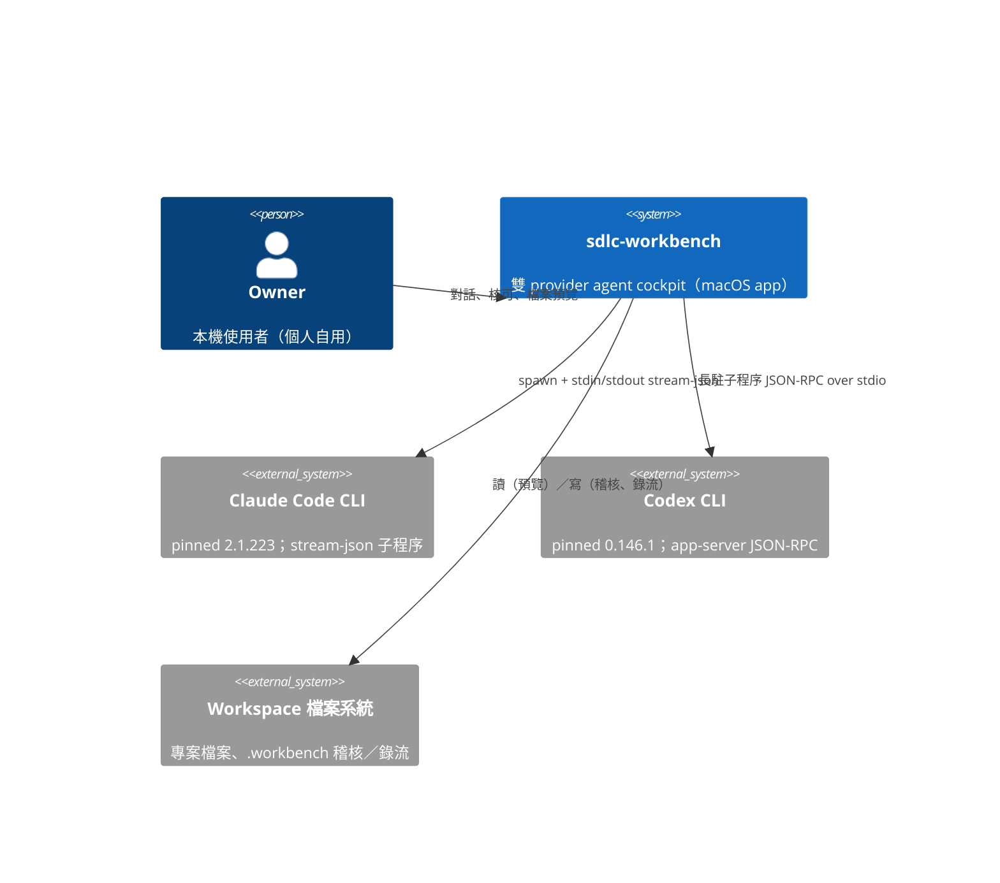
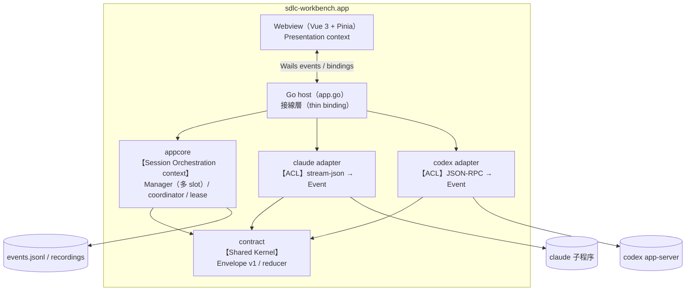
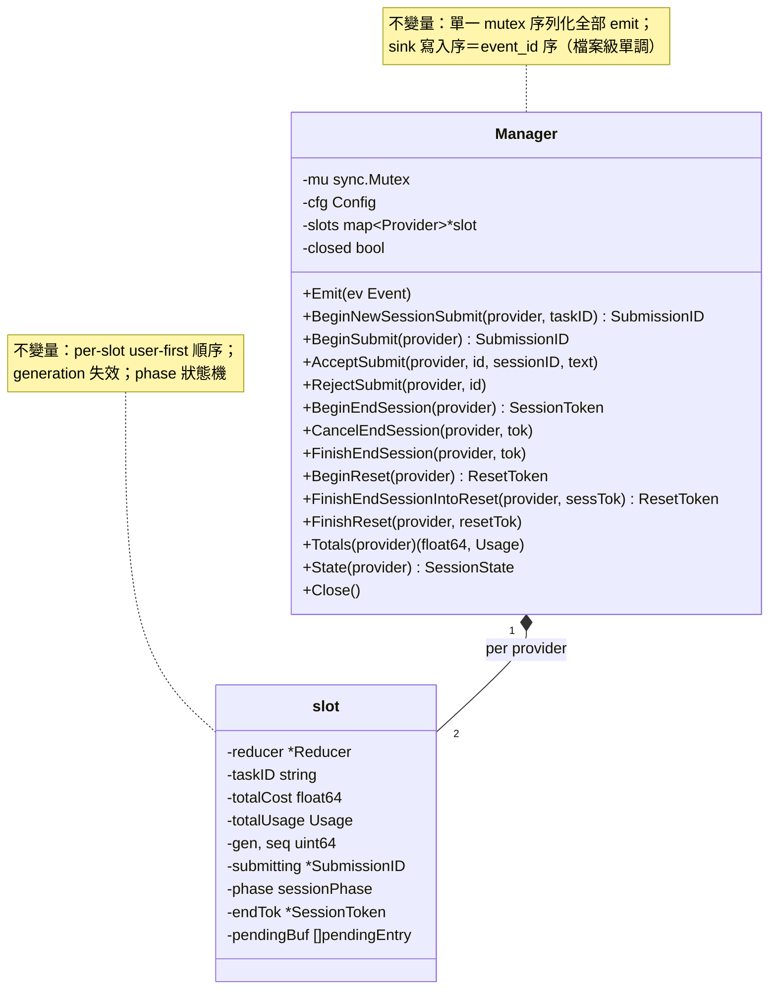
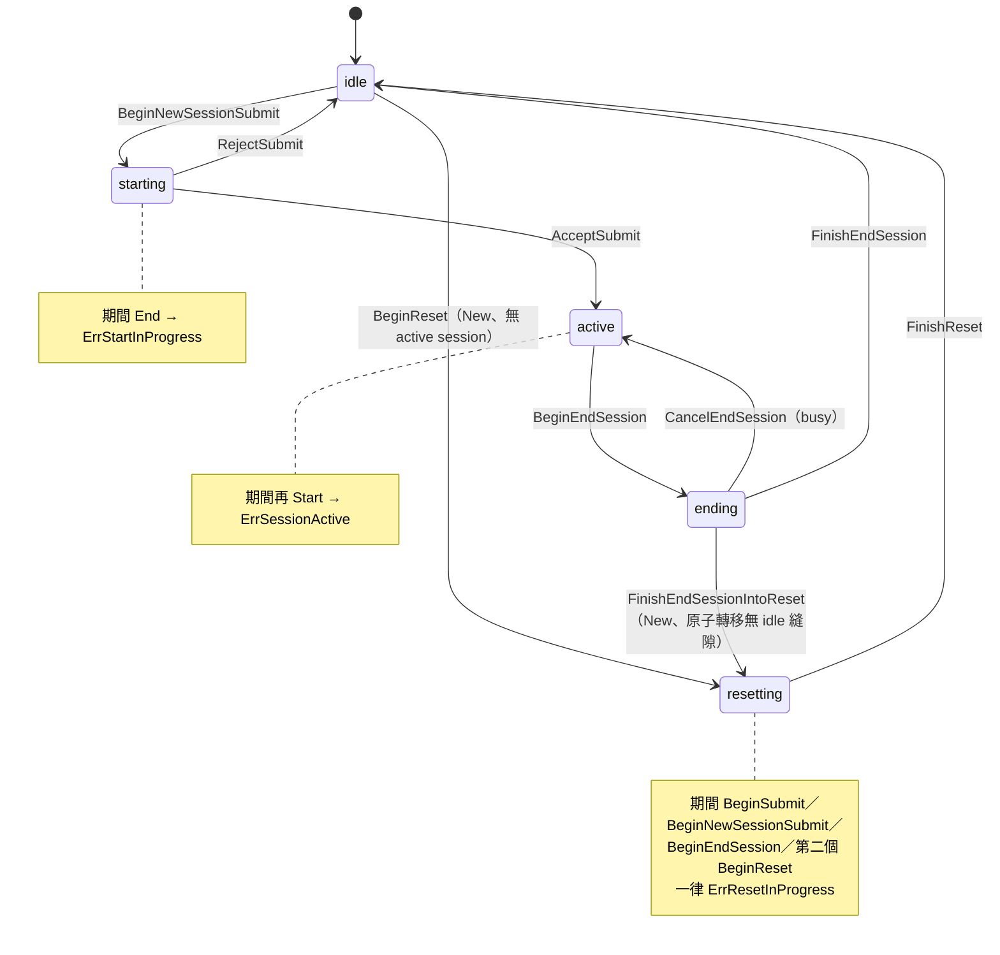
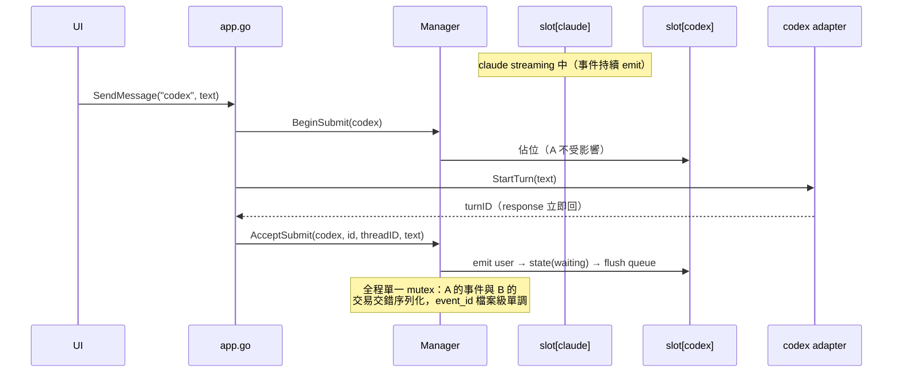
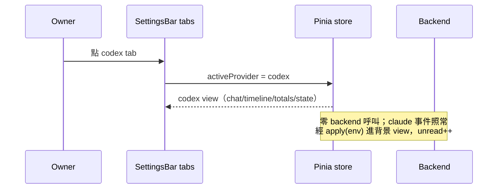

# sdlc-workbench M1.5 執行計畫（v6）

> 基線：repo `ai-software-engineering` main @ `9b3756b`（M1 merged `bd40cc3`）。
> M1 契約與驗收證據：`docs/architecture/sdlc-workbench-m1-plan.md`（v13）、`docs/spikes/m1-results.md`。
> 本文件為 M1.5 唯一執行依據；審核通過後快照至 `docs/architecture/` 並記入 `SHA256SUMS`。
>
> **流程宣告（owner 2026-08-10 指示）**：自 M1.5 起，開發依
> `sdlc-bdd-ddd-tdd-reference.md`（SDLC v2）的 **BDD → DDD → TDD** 流程執行——
> Phase 1 例子（§4）→ Phase 2 領域建模＋UML diagram-as-code（§5）→ Phase 3 迭代
> （BDD 外圈 Gherkin 驗收＋TDD 內圈，§7 任務分解）。app 本身的 Gate 工作流尚未建成
> （M2–M4 內容），流程以 BAT 協作環境人工執行；本文件的 mermaid 圖快照進 repo
> `docs/architecture/diagrams/`，M1.5 收尾時嵌入 README（T8）。

## 1. 目標

**主目標（owner 需求，2026-08-10）**：切換 provider 時對話視窗跟著切、session 保留——
claude 與 codex 各自的 session 可同時存活，切回某個 provider 時看到它原本的對話與狀態，
並可繼續互動；一個 provider 的 turn 進行中，另一個 provider 也能送訊息。

**次目標**：
1. Design token 層——色彩／間距／字體／基礎元件樣式抽成 CSS 變數與共用 class（owner 同意的兩層 UI 策略之第一層）。
2. 視覺 polish——三欄佈局質感、面板密度、深色主題細節（第二層，於 provider 切換佈局定案後執行）。
3. M1 遺留的 normative 小項：Timeline 拖高＋高度記憶、基本快捷鍵（M1 plan v9 明列後續 backlog）。

**成功條件（SC-M15）**：
- SC-M15-1：雙 provider session 並存——claude streaming 中切到 codex 送訊息，兩邊各自完成，
  事件流無交叉汙染（envelope 的 provider／session_id／usage 各自正確）。
- SC-M15-2：切換零丟失——任意時點切換 view，回來時 chat／timeline／totals／狀態與離開時一致
 （含切換期間抵達的事件）。
- SC-M15-3：SC2 不退化——StatusBar 永遠顯示**目前 view** 的 provider session 四問；
  非 active view 有未讀／等待核可的可見提示。
- SC-M15-4：M1 全部行為不退化（W0 迴歸 gate）。
- SC-M15-5：重啟恢復——app 重啟後未按 New 的 view 自動還原對話與任務標籤，
  下一輪自動 resume 接上 provider 前後文（owner 2026-08-10 定案）。

## 2. 範圍

**IN**：
- appcore Manager 多 session slot 重構（保留單一序列化 emit 入口與 event_id 檔案級單調）
- 綁定簽名 provider 化（`SendMessage`／`EndSession`／`TerminateSession` 增 provider 參數）
- 前端 store per-provider 視圖重構、provider tab 切換 UI
- Design token 層＋視覺 polish＋Timeline 拖高／高度記憶＋快捷鍵
- 驗收矩陣 W0（M1 迴歸）＋ W1–W6

**OUT（不在本里程碑）**：
- 原 roadmap M2–M4 的全部內容（規格工作區／Gate 1–3／TCA／forge adapter）——M1.5 是 owner
  提前的雙 session 需求插入項，**不改變 M2–M4 原定義**；M1.5 完成後接原 M2（Stage A 閉環）
- `turn/steer`（對進行中 codex turn 追加指示）——後續里程碑候選
- bundle 瘦身（873M）、errorsx coded taxonomy、shared turnstest suite（工程債，後續候選）
- 行動裝置／remote access、多 workspace（BAT 功能面，非本專案現階段目標）

## 3. M1 凍結契約的變更清單（本節即「需重過 plan gate」的理由）

| # | M1 凍結項 | M1.5 變更 | 不變的部分 |
|---|---|---|---|
| C1 | Manager 單 session（單 reducer/totals/phase/coordinator） | 改為 **per-provider session slot**（每 provider 一組 reducer/totals/phase/coordinator/submission 序號） | **單一 Manager、單一 mutex、單一 sink**——「wrap→totals→sink→emit→state_change 同鎖完成、輸出 event_id 嚴格遞增（檔案級）」不變量原樣保留 |
| C2 | 綁定簽名 `SendMessage(prompt)`、`EndSession()`、`TerminateSession()` | 增 provider 參數：`SendMessage(provider, prompt)`、`EndSession(provider)`、`TerminateSession(provider)`；新增 **`NewSession(provider)`**（New 專用原子流程，見 D4）與 `RestoreViews()`；shutdown 走內部並行 forced path（見 D4），不暴露 binding | `StartSession(provider, …)` 簽名不變；Envelope v1 全欄位不變 |
| C3 | 前端 store 單一 chat/timeline/totals/state | 改為 `views: Record<Provider, SessionView>` ＋ `activeProvider`；`apply(env)` 依 `env.provider` 路由 | `apply` 為唯一事件入口、user 氣泡只來自 host envelope、usage 覆寫語意——全部不變 |
| C4 | 「單一 active session；New 先收尾再開」 | 每 provider 各自「單一 active session」；跨 provider 並存。`New` 只作用於**目前 view** 的 provider | 同 provider 內的 lifecycle 狀態機（idle/starting/active/ending＋token）逐 slot 原樣沿用 |

Envelope v1、reducer 轉移語意（含 M1 後補的 init 中性）、usage 語意雙軌、RecordingLease／CloseSequence／
EndSessionFlow、approval fail-closed——**全部不變**。

## 4. Phase 1：需求 Discovery（BDD 前段）

### 4.1 Ubiquitous Language 詞彙表（M1 既有詞彙的正規化＋M1.5 新詞）

| 詞彙 | 定義 | 對應 code |
|---|---|---|
| Provider | agent 後端種類（claude／codex），envelope 的第一級路由鍵 | `contract.Provider` |
| Session | 一個 provider 的一段連續對話（claude=CLI 子程序生命週期；codex=thread） | `session_id`／thread id |
| Slot | Manager 內單一 provider 的 session 狀態容器（reducer、totals、phase、coordinator）——**M1.5 新詞** | `appcore.slot` |
| View | 前端單一 provider 的對話視圖（chat/timeline/totals/state）——**M1.5 新詞** | `SessionView` |
| Active View | 目前顯示中的 view；切換不影響任何 backend session——**M1.5 新詞** | `activeProvider` |
| Submission | 一次「使用者送訊息」的 ownership 交易（Begin→Accept/Reject） | `SubmissionID` |
| Turn | provider 的一輪回覆（user message 到 result） | codex `turn`／claude 一輪 |
| Envelope | 統一事件格式 v1（凍結） | `contract.Envelope` |
| Unread | 背景 view 累積的未讀完成 turn 計數（每個 result +1）——**M1.5 新詞** | `SessionView.unread` |
| Task Label | 使用者掛在 session 上的任務標籤（per slot） | `task_id` |

### 4.2 例子清單（Phase 1 產物；已於本輪與 owner 對話確認的行為）

| # | 情境 | 動作 | 預期結果 |
|---|---|---|---|
| E1 | claude session streaming 中 | 切到 codex tab | 畫面立即切為 codex view（空或既有對話）；claude 繼續在背景 streaming，無任何 backend 呼叫 |
| E2 | E1 之後 codex 未開 session | 在 codex view 送訊息 | codex 開新 session 並回覆；claude 不受影響 |
| E3 | 兩 view 都有 active session | 切回 claude tab | claude 對話完整呈現（含切換期間收到的內容）；可直接續聊 |
| E4 | 背景 view 完成一個 turn（result 抵達） | （無操作） | 該 provider tab unread +1（**每完成 turn 一次**，不逐訊息計）；切入後歸零；啟動重放不計 unread |
| E5 | codex 觸發工具核可、目前在 claude view | （無操作） | ApprovalDialog 彈出**並自動切到 codex tab**（避免彈窗內容與目前 view 對不上）；決定後兩 view 狀態各自正確 |
| E5b | ApprovalDialog 開啟中 | 按 Esc | **等同 Deny**（理由自動記 `esc`）；envelope 記 `approval_decision: deny` |
| E6 | claude view 按 New | — | 經 `NewSession(claude)` 原子流程：收尾成功才重置 claude view 的恢復視窗（`viewStartEventID` 前進、`resumeSessionID` 清空）；失敗則報錯且 view 不重設；codex session 與 restore entry 不受影響 |
| E7 | 兩 provider 各自 active、任務標籤不同 | 觀察稽核流 | events.jsonl 兩 session 事件交錯但 `provider`／`session_id`／`task_id` 無交叉汙染，event_id 檔案級單調 |
| E8 | app 關閉（quit） | — | 兩個 session 都走收尾（錄流 finalize、session:done），無殘留子程序 |
| E9 | app 重啟（前次兩 view 各有對話、未按 New） | 開啟 app | **兩個 view 的對話歷史自動恢復**（audited envelopes 範圍：chat/timeline/totals/任務標籤；純 UI 事件如 note／session:done 不重建）、unread 為 0；下一次送訊息自動以前次 session id resume（雙 provider 皆然），接上 provider 端前後文 |
| E10 | 前次在 claude view 按過 New 後關閉 | 開啟 app | claude view 空白（不恢復）；codex view 照 E9 恢復 |

反例（明確不做）：切換 tab 觸發任何 provider 呼叫；背景 view 的事件被丟棄或延遲到切入才處理；
恢復時自動重啟 provider 子程序（恢復只還原 view 與 resume 意圖，process 於下一次送訊息才 spawn）。

**驗證**：本表已於 2026-08-10 owner 確認——E1–E3 為原始需求語句具體化；E5／E5b／E9／E10 為
owner 四題問答定案（彈窗自動切 tab、Esc=Deny、預設恢復、New 才清）；E4／E6–E8 為衍生行為，
plan gate 審查時可否決或補充。**每 provider 同時一個 session** 亦於同輪定案（同 provider
多 session 維持原 M3）。

## 5. Phase 2：領域建模（DDD）與 UML

圖全部 diagram-as-code（mermaid），實作時快照至 `docs/architecture/diagrams/`；
M1.5 收尾（T8）嵌入 README。模型是草圖等級起點，實作回饋可修（改圖與改 code 同 PR）。

### 5.1 C4 Context（系統邊界；M1 既有，M1.5 無變更）



### 5.2 C4 Container 與 Bounded Context Map



Context 關係：`contract` 是 Shared Kernel（雙向凍結契約）；兩個 adapter 對外部 CLI 是
Anticorruption Layer（wire format 不外洩）；`appcore` 是核心域（Session Orchestration），
Presentation 透過 envelope 流下游訂閱（Conformist——UI 不做 provider 特判）。

### 5.3 核心 Aggregate：Manager 與 slot（M1.5 重構目標）



Aggregate 邊界：**Manager 是唯一 aggregate root**——slot 不對外暴露、所有操作經 Manager 帶
provider 參數進入同一 mutex。這是 D1 決策（見 5.5）的模型表述。

### 5.4 Session lifecycle state diagram（per slot；M1 既有機制逐 slot 沿用）



（reducer 的對話狀態機 idle/waiting/streaming/tool_running/awaiting_approval/done/failed
沿 M1 凍結語意，per slot 各自一份，不重繪。）

### 5.5 Sequence：SendMessage 與跨 provider 不阻塞（M1.5 關鍵行為）



### 5.6 Sequence：provider 切換（純前端）



### 5.7 架構決策（ADR）

### D1：雙 session＝單 Manager 多 slot（採 B，否決 A）

- **A（否決）**：每 provider 一個 Manager 實例、共用 JSONL sink。否決理由：兩個 Manager 各自的
  mutex 無法保證跨實例的 sink 寫入序＝event_id 序；`NewULID` 生成雖是全域單調（global mutex＋
  per-ms seq），但「檔案內 event_id 嚴格遞增」（M1 V6 驗收不變量）依賴生成與寫入在同一臨界區。
  拆兩個 Manager 會把 V6 不變量降級成「per-session 單調」，屬無必要的契約弱化。
- **B（採用）**：`Manager` 內部 `slots map[contract.Provider]*slot`，`slot` 持有 reducer、
  totalCost/totalUsage、phase/endTok、submitting/fromNewSession/seq、pendingBuf。
  `Emit(ev)` 在同一 mutex 內依 `ev.Provider` 取 slot；wrap→slot totals→sink→emit→state_change
  流程不變。跨 provider 的事件在單一 mutex 下天然序列化，V6 不變量原樣保留。

**slot 化的邊界情況（測試必須固定）**：
- 每 slot 獨立 generation（`gen`）：provider A 的 `NewSession` 只失效 A 的 SubmissionID／SessionToken，
  不影響 B 的 pending submit。
- `pendingBuf` per slot：A 在 submit pending 時，B 的事件**不入 A 的 queue**、直接 emit
 （跨 provider 不互相阻塞；user-first 順序保證是 per-provider 的）。
- `Close()`：對所有 slot 執行 abort+flush，之後才關 sink。
- `Totals()`／`State()` 改為 `Totals(provider)`／`State(provider)`。

### D2：taskID per slot

M1 的 `m.taskID` 是 Manager 級。M1.5 每 slot 一個 taskID（`BeginNewSessionSubmit(provider, taskID)`），
envelope 的 `task_id` 取自該事件 provider 的 slot——兩個並存 session 各自帶正確任務標籤。

### D3：前端 per-provider 視圖與切換

- store：`views: { claude: SessionView, codex: SessionView }`＋`activeProvider`；
  `SessionView`＝M1 的 chat/timeline/totals/usageSemantics/state/sessionId/taskId/busy/active/
  noiseGroup＋**輸入用 `taskLabel`／`recordCase`／`unread`（per view；P1-7——M1 的全域
  taskLabel 退場，E7／W6 的雙標籤隔離與恢復依此）**。
- `apply(env)` 依 `env.provider` 路由到對應 view（**與 activeProvider 無關**——背景 view 照常累積）。
- `submit(text)` 作用於 activeProvider 的 view（per-view busy；A busy 不擋 B 送訊息）。
- 切換（SettingsBar 的 provider tab）＝改 `activeProvider`，純前端視圖切換，不呼叫任何 backend 綁定。
- 非 active view 提示：view 有 `unread` 計數（**每完成 turn +1**＝result 抵達時；切入歸零；重放恢復不計）；
  `awaiting_approval` 時 tab 上顯示 ⚠。ApprovalDialog 維持全域 modal（兩 provider 共用，不受 view 影響）。
- `session:done` 事件 payload 已含 provider → `applyDone` 路由到對應 view。

### D4：app.go provider 化＋New／End 區分＋shutdown forced path

M1 的 `a.activeProv` 單值退場。claude 側欄位（sess/pumpDone/lease/sessionID/broker）與 codex 側
（runner/track/lease）本已分離——變更：
- `SendMessage(provider, prompt)`／`TerminateSession(provider)`：依參數路由。
- `EndSession(provider)`：只收該 provider 的 session；**不動 restore entry**（view 保留、
  之後仍恢復）。
- **`NewSession(provider)`（P1-2；New 專用原子流程，backend 可區分 New 與 End）**：
  1. 若該 provider 有 active session → `EndSessionFlow(provider)`；失敗（如 ErrProviderBusy）
     即返回錯誤，**不清 restore、UI 不重設**。
  2. 收尾以 **`FinishEndSessionIntoReset(provider, sessTok)`** 收束（取代 FinishEndSession；
     ending → `resetting` **原子轉移、無 idle 縫隙**——第三輪 P1-1 凍結入 Manager 契約，
     見 §5.3／§5.4）；本無 active session 時以 `BeginReset(provider)` 自 idle 進入。
     `resetting` 期間 `BeginSubmit`／`BeginNewSessionSubmit`／`BeginEndSession`／第二個
     `BeginReset` 一律回 `ErrResetInProgress`。
  3. 更新 restore entry 的 `viewStartEventID`＝當下最大 event_id、清 `resumeSessionID`；
     `FinishReset(provider, resetTok)` 回 idle（stale token 回 `ErrStaleReset` no-op）。
     清除／寫入失敗 fail loud 返回錯誤（仍 FinishReset 回 idle），UI 不重設。
  4. 另一 provider 的 session 與 restore entry 完全不受影響。
  前端「New」按鈕改呼叫此 binding，成功後才 reset 該 view。
  測試 `TestNewStartBarrier`：在步驟 1 完成與步驟 3 完成之間注入 `StartSession` →
  收到 `ErrResetInProgress`、且 reset 完成後開的新 session 的 restore identity 不被清除。
- **shutdown＝並行 forced path（P1-6；Q3 定案並行）**：正常 `EndSessionFlow` 在 codex turn
  busy 時會拒絕收尾，無法保證 E8——shutdown 走專用路徑：
  1. 對每個 active provider **並行**（goroutine）：先 interrupt／terminate active turn
     （codex `turn/interrupt`；claude `Terminate`）→ 再走收尾（CloseSequence／lease.Finalize）。
  2. **兩邊都必須被等待**（WaitGroup）；錯誤 `errors.Join` 保留，一邊失敗不跳過另一邊。
  3. 全部 lease finalize 之後才 `Manager.Close()`、終止 codex app-server。
  4. production barrier＋`-race` 測試：一邊卡死或回錯，另一邊仍完成、整體於界限內返回
     （單邊上限沿 CloseSequence 5s＋10s；並行總上限 ~15s）。
- Manager 呼叫全部帶 provider（`BeginSubmit(provider)` 等）。

### D5：Design token 層與 polish 順序

- T4（token）先行：`frontend/src/style/tokens.css`（CSS custom properties：色彩、間距、字級、
  圓角、邊框）＋`components.css`（`.btn`、`.input`、`.select`、`.panel` 基礎 class）；
  既有元件改引用 token（行為零變更、純樣式替換）。
- T7（polish）在 provider tab 佈局定案後：密度、hover/focus 態、視窗質感、深色主題細節；
  參考 BAT（pin `72dc4ba`，non-normative）的 statusline 與 agent panel 密度。

### D6：重啟恢復＝events.jsonl 以 view window 重放（不新增第二份對話事件格式）

owner 定案「除非按 New 否則預設恢復」。**view 邊界與 resume identity 分開**（plan gate
第一輪 P1-1）：claude 首輪 `AcceptSubmit` 的 session ID 為空（真 ID 等 init）、部分雜訊
事件無 ID、一般 End 不清 view 使同一 view 可橫跨多個 provider session——只用 session_id
過濾會遺漏與斷代。

**恢復索引** `.workbench/restore.json`：每 provider 一筆，欄位與更新時機——

| 欄位 | 更新時機 |
|---|---|
| `viewStartEventID` | **僅 `NewSession(provider)` 重設**（設為當下最大 event_id）；**entry 不存在時（升級／首次使用）以當下 audit high-watermark 初始化**——避免把既有 events.jsonl 全部歷史當成 view 重放 |
| `resumeSessionID` | **submission-scoped staged candidate（第二輪 P1-1）**：claude init／codex `EnsureThread` 只**暫存候選 ID**；`AcceptSubmit` 成功才 **commit** 進 restore entry；Reject／abort **丟棄候選**（不留指向未成立 session 的 stale entry）；late claude init（Accept 之後才到）只允許更新**目前 accepted generation** 的 entry |
| `taskID` | 隨 `resumeSessionID` 同批 commit（Accept 成功時） |

**重放規則**：`provider 相符 && event_id > viewStartEventID` 的**全部 audited envelopes**
（含空 session_id 的首輪 user/waiting 與無 ID 雜訊；End 後再 Start 的多個 session 同屬
一個 view、全數重放）。經新 binding `RestoreViews() → map[provider][]Envelope` 回傳，
前端逐筆 `apply(env)` 重建 chat／timeline／totals／usageSemantics。
**限定 audited envelopes**：`ui-note`／`session:done` 等純 UI 事件不在 events.jsonl，
不重建（E9 驗收據此表述）；重放不計 unread、重放事件**不回寫 audit**、恢復不 spawn 子程序。

**restore.json 並行 ownership 與耐久性（凍結；P1-3）**：
- 單一 restore store（app 層 struct）持有自己的 mutex——雙 provider 併發 Accept／init
  的 read-modify-write 序列化，兩筆 entry 都保留（barrier 測試）。
- 寫入 = temp file + atomic rename，權限 `0600`；寫入／清除失敗 **fail loud**
 （binding error 或 stream_error envelope，不得無聲）。
- 讀取容錯：trailing malformed JSON 跳過該檔重建（fail loud 記錄），不得讓全部恢復失敗；
  events.jsonl 的 trailing malformed 行跳過該行，不中斷重放。

**Accept 成功後 restore commit 失敗的語意（第三輪 P1-2 凍結）**：**session 保持 active、
`StartSession` 照樣回成功**；restore 失敗以 fail-loud `stream_error` envelope 呈現
（恢復功能降級：restore entry 維持舊值，下次重啟恢復到舊視窗）。**不得**「回 binding error
但留下 active session」（backend active／UI inactive 分裂）；也不做補償 teardown（本地磁碟
問題不該殺掉健康的 provider session）。測試 `TestRestoreCommitFailureKeepsSessionActive`：
restore store 注入寫入錯誤 → StartSession 成功、session active、stream_error 發出、
entry 未變。

**resume 意圖（含 End 後未重啟）**：view 未被 New 清除時，該 view 的**下一次**
`StartSession` 一律自動帶 `resumeSessionID`——重啟前後行為一致（一般 End 後直接續聊
也自動 resume）。恢復動作本身不 spawn 任何子程序。

已知成本：events.jsonl append-only 線性掃描，啟動一次；檔案隨長期使用增長，
視窗化／輪替維持 M3（§9 風險 4）。

### D7：approval FIFO queue＋自動切 tab；Esc=Deny

owner 定案：核可請求彈出時**自動切到該 provider tab**；`Esc` 等同 Deny（理由記 `esc`）。
fail-closed 逾時語意不變。

**雙 provider 併發請求＝FIFO queue（P1-5；M1 元件單一 `req` ref 會被後到覆蓋）**：
- ApprovalDialog 改持有請求佇列：顯示中的請求**不被覆蓋**；新請求入列。
- 輪到顯示（前一筆 resolve／deny／timeout 移除後 promotion）時才自動切到該 provider tab。
- dismiss／timeout 依 **ID** 移除正確項目（含佇列中未顯示的項——backend 逾時對佇列項
  同樣生效，前端收 `approval:dismiss` 按 ID 移除）。
- `Esc` 只 Deny **目前顯示**的項目（reason=`esc`），佇列中其餘不受影響。
- 測試（vitest）：雙 provider 同時請求→顯示第一筆且第二筆入列；第一筆 resolve→第二筆
  promotion＋自動切 tab；佇列中項目 timeout→按 ID 移除不影響顯示中項目。


## 6. Phase 3a：規格化（Gherkin 驗收場景）

Phase 1 例子（§4.2）的可執行化；每個 scenario 綁定的自動化測試列於右欄。
BDD 外圈紅燈規則：先確認因「目標行為尚未存在」而失敗（W0 既有行為除外）。
非功能項（效能、資源）不硬塞 Gherkin，維持 checklist（§8 風險 3、4）。

```gherkin
Feature: 雙 provider session 並存與切換

  Scenario: 切換 view 不中斷進行中的 session（E1/E3）
    Given claude session 正在 streaming 回覆
    When 我切換到 codex tab 再切回 claude tab
    Then claude 對話完整呈現且包含切換期間收到的內容
    And 切換過程沒有任何 provider 呼叫發生

  Scenario: 一個 provider 進行中，另一個仍可送訊息（E2）
    Given claude session 正在 streaming 回覆
    When 我在 codex view 送出訊息
    Then codex 開始自己的 session 並完成回覆
    And claude 的回覆不受影響地完成

  Scenario: 背景 view 的未讀提示（E4）
    Given 我在 claude view 而 codex session 在背景收到 result
    Then codex tab 顯示未讀計數
    When 我切換到 codex tab
    Then 未讀計數歸零

  Scenario: 背景 provider 的核可請求彈出並自動切 tab（E5）
    Given 我在 claude view
    When codex 觸發工具核可請求
    Then ApprovalDialog 立即彈出且畫面自動切到 codex tab
    When 我核可該請求
    Then codex 繼續執行且兩個 view 的狀態各自正確

  Scenario: Esc 等同拒絕（E5b）
    Given ApprovalDialog 開啟中
    When 我按下 Esc
    Then 該核可請求被拒絕且理由記為 esc
    And 稽核流記下 approval_decision 為 deny

  Scenario: New 只作用於目前 view 的 provider（E6）
    Given claude 與 codex 各有 active session
    When 我在 claude view 按 New
    Then claude session 收尾且 claude view 重置
    And codex session 與 view 完全不受影響

  Scenario: 稽核流無交叉汙染（E7）
    Given 兩個 provider 各自完成至少一輪且任務標籤不同
    Then events.jsonl 中每筆 envelope 的 provider、session_id、task_id 與其來源一致
    And event_id 全檔案嚴格遞增

  Scenario: 重啟後預設恢復（E9）
    Given 前次執行時兩個 view 各有對話且未按 New
    When 我重新開啟 app
    Then 兩個 view 的對話、totals 與任務標籤自動還原
    When 我在 claude view 送出訊息
    Then claude 以前次 session id resume 並能引用前次對話內容
    When 我在 codex view 送出訊息
    Then codex 以 thread/resume 接回前次 thread 並能引用前次對話內容

  Scenario: New 之後不恢復（E10）
    Given 前次執行時我在 claude view 按過 New 後關閉 app
    When 我重新開啟 app
    Then claude view 為空白
    And codex view 仍照前次內容恢復
```

| Scenario | 綁定測試 |
|---|---|
| E1/E3、E4 | vitest（store per-provider 路由／unread）＋ W2 live |
| E2 | Go app-level `TestDualSessionsConcurrently` ＋ W1 live |
| E5 | vitest（⚠ flag）＋ W3 live |
| E6 | Go `TestEndOneProviderLeavesOtherActive`／`TestNewSessionResetsViewWindow` ＋ W1 live |
| E7 | Go `TestFileLevelEventIDMonotonicAcrossProviders` ＋ W5 `jq` 驗證 |
| E8 | app shutdown 路徑（T2）＋ 封裝 smoke 程序檢查 |
| E5b | vitest（Esc handler → Deny）＋ W3 live |
| E9/E10 | Go `TestRestoreViewWindowReplay`／`TestNewSessionResetsViewWindow`／`TestRestoredResumeReachesProvider`／`TestRestoreViewsIsReadOnly`＋vitest（replay 重建 view）＋ W6 live |

## 7. Phase 3b/3c：Task 分解（BDD 外圈＋TDD 內圈；每 task 附驗證與 commit）

執行順序即 TDD 紅綠：每個 task 先寫失敗測試（含上表綁定的 scenario 測試）再實作；
實作中發現模型不對勁，回 §5 修圖（同 PR 內改），不視為失敗。

### T1：appcore Manager 多 slot 重構

**Files**：Modify `internal/appcore/manager.go`、`manager_test.go`；Modify `internal/appcore/pump.go`
（`EndSessionFlow(m, provider, …)`）。

**紅**（新增測試；既有 34 個 manager 測試改為單 provider slot 語意後全數保留）：
- `TestSlotsIsolateUsageAndState`：A=claude 累加、B=codex 覆寫，交錯 emit 後 `Totals(A)`／`Totals(B)`
  各自正確；`State(A)` streaming 時 `State(B)` 不受影響。
- `TestCrossProviderSubmitDoesNotBlock`：A `BeginSubmit` pending 中，B 的事件直接 emit（不入 A queue）、
  B 可完成整輪 `BeginSubmit→Accept`；A 的 user-first 順序仍成立（per-provider 斷言）。
- `TestPerSlotGenerationInvalidation`：A `NewSession` 後 A 的舊 SubmissionID stale；B 的 pending
  SubmissionID 仍有效可 Accept。
- `TestFileLevelEventIDMonotonicAcrossProviders`：8 goroutine × 兩 provider 交錯 emit，
  sink rows 的 event_id 嚴格遞增（檔案級不變量迴歸）。
- `TestCloseAbortsAllSlots`：兩 slot 各有 pending submit，`Close()` 對兩者 abort+flush、
  皆有 fail-loud 通知、sink 後續不可寫。
- `TestConcurrentDualSessionLifecycle`：A `BeginNewSessionSubmit`＋B `BeginEndSession` 併發，
  互不干擾（-race）。
- `TestResetPhaseTransitions`（第三輪 P1-1）：idle→`BeginReset`→resetting→`FinishReset`→idle；
  ending→`FinishEndSessionIntoReset`→resetting（原子、無 idle 縫隙——barrier 注入 Start 必得
  `ErrResetInProgress`）；stale reset token → `ErrStaleReset` no-op。
- `TestResetBlocksAllLifecycleEntries`：resetting 期間 `BeginSubmit`／`BeginNewSessionSubmit`／
  `BeginEndSession`／第二個 `BeginReset` 全部 `ErrResetInProgress`；另一 provider 的 slot
  完全不受影響。

**綠**：slot 化實作（D1 邊界全數落地）。**驗證**：`go vet ./... && go test -race ./internal/appcore/ -count=1`。
**Commit**：`feat(appcore): per-provider session slots under a single serialized manager`

### T2：app.go 綁定 provider 化

**Files**：Modify `app.go`、`app_test.go`；`frontend/wailsjs` 重新產生。

- `SendMessage(provider, prompt)`／`EndSession(provider)`／`TerminateSession(provider)`／
  `NewSession(provider)`；內部 Manager 呼叫全帶 provider。
- **shutdown＝D4 forced path 實作**（第二輪 P1-3；取代一般 EndAllSessions）：
  對每個 active provider 並行——先 interrupt／terminate active turn → CloseSequence／
  lease.Finalize → WaitGroup 等齊兩邊 → `errors.Join` → 全部 finalize 後才
  `Manager.Close()` → codex server Take/Terminate → broker close。
- 既有 3 個 production-path barrier 測試改簽名後保留；新增：
  - `TestDualSessionsConcurrently`（fake claude script＋fake codex wire 同時 active，
    各自 SendMessage 一輪、各自 End，事件 provider 隔離、錄流各自收尾）。
  - `TestEndOneProviderLeavesOtherActive`。
  - `TestShutdownForcedWaitsForBoth`（雙 active、其中一邊 turn busy——forced path 先
    interrupt 再收尾，兩邊 lease 都 finalize、session:done 都發出）。
  - `TestShutdownJoinsErrors`（一邊 teardown 回錯——另一邊仍完成、錯誤 errors.Join 保留）。
  - `TestShutdownHungProviderIsBounded`（一邊卡死（fake 不回應）——`-race` 下整體於
    ~15s 界限內返回、另一邊正常 finalize）。

**驗證**：`go vet ./... && go test -race ./ -count=1`；`wails generate module`。
**Commit**：`feat(app): provider-scoped bindings for concurrent dual sessions`

### T3：前端 store per-provider 視圖

**Files**：Modify `frontend/src/stores/session.ts`、`session.test.ts`、`frontend/src/types.ts`。

- 紅：`routes events to per-provider views`、`switching provider preserves both views`、
  `background view counts unread per completed turn`、`unread clears on switch`、
  `per-view busy: A busy does not block B submit`、`applyDone routes by payload provider`、
  `awaiting_approval flags the owning view`、
  `taskLabel is isolated per view`（A 設標籤不影響 B、submit 各帶各的）、
  `recordCase is isolated per view`；既有 14 個 store 測試改為 view 語意後保留。
- 綠：D3 實作；`submit` 改呼叫 `SendMessage(activeProvider, text)`（active）或
  `StartSession(activeProvider, …)`（該 view 未 active）。

**驗證**：vitest 全綠。**Commit**：`feat(ui): per-provider session views with zero-loss switching`

### T4：Design token 層＋provider tab

**Files**：Create `frontend/src/style/tokens.css`、`components.css`；Modify `App.vue`、`SettingsBar.vue`
（provider select → tab，含 unread badge 與 ⚠）、各元件樣式改引 token。

- Token 定義（inline 於本 plan 附錄 A，審查對象）；元件替換為純樣式 diff（行為零變更）。
- tab 切換 vitest：`tab click switches active view without backend calls`（mock bindings 斷言零呼叫）。

**驗證**：vitest＋frontend build＋`wails dev` 手動：切 tab 對話保留、unread badge。
**Commit**：`feat(ui): design tokens and provider tabs`

### T5：Timeline 拖高／高度記憶＋快捷鍵

**Files**：Modify `App.vue`、`Timeline.vue`；Create `frontend/src/lib/persist.ts`（localStorage 包裝）。

- Timeline 面板拖曳調高、高度存 localStorage（重啟恢復）；摺疊狀態一併記憶。
- 快捷鍵：`Cmd+1/2` 切 provider tab、`Cmd+K` 聚焦輸入框、`Esc`＝對**目前顯示**的核可
  請求執行 Deny（reason=`esc`，呼叫 `ResolveApproval(id, false, "esc")`；D7／E5b 定案，
  不是只關 UI）。
- vitest：persist 讀寫、快捷鍵 handler 單元測試。

**Commit**：`feat(ui): resizable timeline with persisted height; keyboard shortcuts`

### T6：重啟恢復（E9／E10；D6）＋NewSession binding（D4）

**Files**：Modify `app.go`（restore store：mutex＋atomic rename＋0600、`RestoreViews()`、
`NewSession(provider)`）、`app_test.go`；Modify `frontend/src/stores/session.ts`
（重放恢復＋resume 預填）、`App.vue`（onMounted 重放）、`SettingsBar.vue`（New 改呼叫
`NewSession`）、`session.test.ts`。

- 紅（Go）：
  - `TestRestoreViewWindowReplay`：view window 重放——含**首輪空 session_id 的 user/waiting**、
    無 ID 雜訊、End 後第二次 Start（同 view 兩個 session 全數重放）、按 event_id 序。
  - `TestNewSessionResetsViewWindow`：`NewSession` 後 `viewStartEventID` 前進、
    `resumeSessionID` 清空、重放為空；另一 provider entry 不受影響；無 active session 時
    仍能執行；restore 寫入失敗時返回錯誤且不改 entry。
  - `TestResumeCandidateStagedThenCommitted`：claude init／codex EnsureThread 只暫存候選；
    `AcceptSubmit` 成功後 restore entry 才出現 committed 值（staged→commit 語意，
    非立即更新）。
  - `TestLateClaudeInitCannotOverwriteNewGeneration`：舊 generation 的 late init（Accept 之後、
    NewSession 之後才到）不得覆寫新 generation 的 restore entry。
  - `TestRestoreCommitFailureKeepsSessionActive`：見 D6——commit 失敗 session 仍 active、
    StartSession 回成功、stream_error fail loud、entry 未變。
  - `TestRestoreStoreConcurrentWrites`（barrier）：雙 provider 併發更新，兩筆 entry 都保留。
  - `TestRestoreToleratesMalformedTail`：restore.json 壞尾／events.jsonl 壞行不整體失敗、
    fail loud 記錄。
  - `TestRestoredResumeReachesProvider`（production path）：恢復後首次 submit——claude 以
    **fake CLI argv 斷言真正帶入 `--resume <id>`**（非僅 StartSession 參數層）；codex 以
    fake wire 斷言送出 `thread/resume`（method＋threadId）。
  - `TestResumeCandidateCommitOnAccept`（production barrier）：claude init 先於 Accept 抵達
    ＋ Accept 失敗（Manager closed）→ restore entry **不**寫入候選 ID。
  - `TestEnsureThreadThenStartTurnFailure`（production barrier）：codex `EnsureThread` 成功
    但 `StartTurn` 失敗 → 候選丟棄、restore entry 不變。
  - `TestFreshRestoreInitializesHighWatermark`：既有 events.jsonl＋無 restore.json →
    `viewStartEventID` 初始化為當下 high-watermark、重放為空（不把歷史當 view）。
  - `TestRestoreViewsIsReadOnly`：`RestoreViews()` 全程 provider starter **零呼叫**、
    audit row count 不變（重放不回寫）。
- 紅（vitest）：`replays envelopes to rebuild view`（totals／usageSemantics／taskLabel 重建、
  **unread 為 0**）、`restore prefills resume id`、`New resets only its own view after binding success`。
- 綠：D6／D4 實作。恢復不 spawn 子程序、重放不回寫 audit。

**驗證**：`go vet ./... && go test -race ./ -count=1`＋vitest。
**Commit**：`feat(app): view-window restore from audit stream; atomic NewSession binding`

### T7：視覺 polish（佈局定案後）

**Files**：各元件 scoped style；不動任何 `<script>` 邏輯。

- 密度／hover／focus／active 態、視窗與面板層次、捲軸樣式、深色主題細節；
  截圖前後對照存 `docs/spikes/evidence/`。
- gate：vitest／build 全綠（樣式 diff 不得改行為——以測試零修改為證）。

**Commit**：`style(ui): visual polish pass over tokenized components`

### T8：驗收（W0–W6）＋最終 gate＋m1.5-results

**W0 M1 迴歸 gate**（單 provider 行為不退化）：V0.1–V0.9 重跑（V0.8 沿 waiver）＋V1–V6 抽驗
（claude 3 輪、codex 3 輪、稽核不變量）。

**W1 雙 session 並存**：claude 開 session 送長任務 → streaming 中切 codex tab → codex 開 session
送訊息完成一輪 → 切回 claude（對話完整、後續輪正常）→ 兩邊各自 End。
錄流：兩 provider 各一檔、meta 各恰一份。events.jsonl：兩 session 事件交錯但 event_id 檔案級單調、
provider／session_id／task_id 無交叉汙染。

**W2 切換零丟失**：背景 view 累積事件（含 result）後切入——chat／timeline／totals／state 完整；
unread 計數正確且切入歸零。

**W3 SC2 per view**：StatusBar 隨 tab 切換顯示對應 session 四問；codex `awaiting_approval` 時
在 claude view 可見 ⚠ 提示；approval dialog 全域彈出、resolve 後兩 view 狀態正確。

**W4 UI 行為**：token 化後 M1 V3 全項重驗（follow-tail／tool 卡片／摺疊）；Timeline 拖高＋重啟恢復；
快捷鍵三組。

**W5 稽核**：W1 全程 events.jsonl `jq` 驗證（單調、per-provider user-first、雙 task_id 正確）。

**W6 重啟恢復**：W1 之後不按 New 關閉 app → 重啟 → 兩 view 對話／totals／標籤還原
（audited envelopes 範圍）、**unread 為 0**；claude 續聊引用前次內容＋**codex 續聊引用前次
內容（`thread/resume` live 證據——以 JSON-RPC 錄流（recordCase）佐證 request 實際抵達
wire；events.jsonl 不足以證明）**；一般 End 後
未重啟直接續聊亦自動 resume（抽驗一例）；claude view 按 New 後重啟 → claude 空白、codex 仍恢復。

**最終 gate**：`go vet ./...`、`go test -race ./... -count=1`、vitest、frontend build、`wails build`、
`scripts/bundle-clis.sh`＋封裝 smoke（雙 provider **並存**各一輪）、clean tree。

**文件收尾（流程宣告的落地）**：
- §5 全部 mermaid 圖（依實作結果修訂後）快照至 `docs/architecture/diagrams/`
 （`c4-context.mmd`、`c4-container.mmd`、`manager-slots.mmd`、`session-lifecycle.mmd`、
  `seq-send-message.mmd`、`seq-provider-switch.mmd`）——app 自己的 PreviewPane 可渲染（狗糧）。
- README 新增 **Architecture Diagrams** 節嵌入上述圖（GitHub 原生渲染 mermaid）；
  Gherkin feature 檔一併進 `docs/architecture/features/dual-session.feature`。
- **m1.5-results.md**：證據表、偏差、殘餘風險＋「圖與實作一致性」核對聲明。

**Commit**：`docs(m1.5): acceptance results, domain diagrams, feature specs`

## 8. 驗證策略總表

| 層 | 手段 |
|---|---|
| 單元（Go） | slot 隔離／跨 provider 不阻塞／per-slot generation／檔案級 event_id 單調／Close 全 slot abort／雙 lifecycle 併發（-race）；app 層 fake claude＋fake codex 雙 active barrier；restore（view window／併發寫／malformed 容錯／resume 進 production path）；shutdown forced path（單邊卡死仍界限內） |
| 單元（TS） | per-provider 路由／切換零丟失／unread（completed-turn）／per-view busy／per-view taskLabel／tab 零 backend 呼叫／approval FIFO（覆蓋、promotion、按 ID 移除、Esc=Deny）／重放恢復／persist／快捷鍵 |
| 整合 | W0（M1 迴歸）＋W1–W6（live，dev 模式 Playwright 驅動＋封裝 smoke owner 執行；W6 含雙 provider resume 證據） |

## 9. 風險與待決問題

**已決（owner 2026-08-10 四題問答）**：session 模型＝每 provider 一個；重啟預設恢復
（New 才清）；approval 彈窗自動切 tab；Esc＝Deny。原 Q1 關閉。

**已決（plan gate 第一輪 reviewer 同意＋修正）**：
- Q2 unread＝計數 badge，**每完成 turn +1**（result 抵達時；非逐訊息）。
- Q3 shutdown 並行收尾（D4 forced path）。
- Q4 切回 view 自動跳到最新（follow-tail 重置）。
- Q5 不做合計成本（StatusBar 只顯示 active view；合計看 events.jsonl）。

**風險**：
1. **Manager slot 化的測試遷移量**：M1 的 34 個 manager 測試全數要改簽名；風險是遷移時弱化斷言。
   對策：遷移 diff 逐條對照（斷言只增不減），review checklist 列明。
2. **雙 session 資源**：claude 子程序＋codex 長駐 server 並存的記憶體／CPU 為既有量之和，無新增
   機制；不做限流（M1 已各自存在，只是不再互斥）。
3. **切換期間的 streaming 渲染成本**：背景 view 照常累積（不 mount UI）——Pinia state 更新無 DOM
   成本；風險低。
4. **恢復重放成本（D6）**：events.jsonl append-only 線性掃描，啟動一次；檔案隨長期使用增長，
   事件量視窗化／輪替維持 M3。恢復重放亦受此限（過大時啟動變慢——W6 記錄實測時間）。
5. **claude resume 語意**：恢復後 resume 的是「已結束的 CLI session」——M0/M1 已驗證
   `--resume` 接前後文，但「恢復 view＋resume」組合為新路徑，W6 live 驗證。
6. 工時粗估：Go 層 1.5–2 週（含 T6 恢復）、前端 1.5 週、polish＋驗收 4 天。未依 throughput 校準。

## 附錄 A：Design tokens（T4 審查對象）

```css
/* tokens.css — 深色主題 v1（現值取自 M1 既有樣式的正規化） */
:root {
  --bg-app: #1b2636;      --bg-panel: #1e2a38;    --bg-inset: #101820;
  --bg-bubble-user: #2d5a88;  --bg-bubble-assistant: #263444;
  --border: #3a4a5a;
  --text: #e6edf3;  --text-muted: #9db2c5;  --text-faint: #66788a;
  --accent: #7aa2c4;  --ok: #80cbc4;  --warn: #ffd54f;  --err: #ff8a80;
  --radius-s: 4px;  --radius-m: 8px;  --radius-l: 10px;
  --space-1: 4px;  --space-2: 8px;  --space-3: 12px;  --space-4: 16px;
  --font-ui: ui-sans-serif, system-ui, sans-serif;
  --fs-s: 11px;  --fs-m: 13px;  --fs-body: 14px;
}
```

`components.css`：`.btn`（含 `.btn-primary`/`.btn-danger`）、`.input`、`.select`、`.panel`、
`.badge`（unread）——具體樣式於 T4 實作時以 token 組合，不引入新色值。

## 修訂記錄

### v6（2026-08-10）— 依 plan gate 第三輪（2 lifecycle P1）修訂
1. **resetting phase 凍結入 Manager 契約（P1-1）**：§5.4 state diagram 增
   idle→resetting（`BeginReset`）／ending→resetting（`FinishEndSessionIntoReset`，原子無
   idle 縫隙）／resetting→idle（`FinishReset`，stale → `ErrStaleReset`）；§5.3 class diagram
   增三個 reset API；D4 改用正式 API；T1 增 `TestResetPhaseTransitions`／
   `TestResetBlocksAllLifecycleEntries`（Manager 單元層），T6 保留 production
   `TestNewStartBarrier`。app.go 不需觸碰私有 slot。
2. **Accept 後 restore commit 失敗語意凍結（P1-2）**：採「session 保持 active、StartSession
   回成功、fail-loud stream_error、entry 維持舊值」；明文禁止「回錯但留 active session」；
   不做補償 teardown。T6 增 `TestRestoreCommitFailureKeepsSessionActive`、
   `TestLateClaudeInitCannotOverwriteNewGeneration`；
   `TestRestoreEntryUpdatesOnInitAndThread` 改名 `TestResumeCandidateStagedThenCommitted`
   （staged→commit 語意）。

### v5（2026-08-10）— 依 plan gate 第二輪 closure review（4 P1＋P2）修訂
1. **Resume identity 改 submission-scoped staged candidate（P1-1）**：init／EnsureThread 只
   暫存候選、Accept 成功才 commit、Reject／abort 丟棄、late init 只更新 accepted generation；
   restore entry 不存在時以 audit high-watermark 初始化 `viewStartEventID`。新測試：
   `TestResumeCandidateCommitOnAccept`、`TestEnsureThreadThenStartTurnFailure`、
   `TestFreshRestoreInitializesHighWatermark`。
2. **NewSession 與 StartSession 互斥（P1-2）**：D4 引入 slot `resetting` phase 涵蓋
   「teardown → restore reset」整段（期間 Start 回 `ErrResetInProgress`）；新測試
   `TestNewStartBarrier`（兩步中間注入 Start）。
3. **T2 shutdown 更新（P1-3）**：改列 D4 forced path 實作＋具名測試
   `TestShutdownForcedWaitsForBoth`／`TestShutdownJoinsErrors`／`TestShutdownHungProviderIsBounded`。
4. **BDD／production resume 綁定同步（P1-4）**：E9 Gherkin 補 codex `thread/resume` 步驟；
   綁定表改用現行測試名；claude production 測試改以 fake CLI argv 斷言 `--resume`；
   補 `TestRestoreViewsIsReadOnly`（starter 零呼叫、audit row count 不變）。
5. **P2**：D5 polish 編號 T7；D6 標題改「不新增第二份對話事件格式」；最終 gate 寫
   `scripts/bundle-clis.sh`；W6 codex resume 以 JSON-RPC 錄流佐證；T3 補具名
   taskLabel／recordCase per-view 隔離測試。

### v4（2026-08-10）— 依 plan gate 第一輪（CHANGES_REQUIRED，7 P1＋P2）修訂
1. **Restore 改 view window（P1-1）**：D6 重寫——`viewStartEventID`（僅 NewSession 重設）與
   `resumeSessionID`（init／EnsureThread 更新）分離；重放依 provider＋event window（含首輪
   空 session_id 與無 ID 雜訊；End 後多 session 同 view 全數重放）；限定 audited envelopes
  （note／session:done 不重建）；E9 對應改寫。T6 測試補首輪空 ID／雜訊／End 後第二次 Start／
   雙 provider 交錯。
2. **NewSession binding（P1-2）**：C2 增 `NewSession(provider)` 原子流程（收尾成功才清
   restore、失敗不重設 UI、無 active session 仍可清、另一 provider 不受影響）；D4 明列四步。
3. **restore.json ownership（P1-3）**：單一 mutex store、temp file＋atomic rename＋0600、
   fail loud、malformed tail 容錯、重放不回寫 audit／不 spawn；barrier 測試雙 entry 保留。
4. **Codex resume 驗收補齊（P1-4）**：W6 增 codex `thread/resume` live 證據＋
   `TestRestoredResumeReachesProvider`（雙 provider production path）；明定一般 End 後未重啟
   的下一次 submit 也自動 resume；重放後 unread=0。
5. **Approval FIFO queue（P1-5）**：D7 重寫——顯示中不被覆蓋、promotion 才切 tab、
   dismiss／timeout 按 ID、Esc 只 Deny 顯示中項；vitest 四案例。
6. **Shutdown forced path（P1-6）**：D4 明列——interrupt／terminate 先行、並行收尾、
   errors.Join、全部 finalize 後才 Manager.Close()；barrier＋-race 單邊卡死測試；Q3 定案並行。
7. **taskLabel per view＋T5 Esc 殘留（P1-7）**：D3 的 SessionView 明列 taskLabel／recordCase／
   unread；T5 快捷鍵 Esc 改為呼叫 Deny(reason=esc)，刪除與 D7 衝突的舊敘述。
8. **P2**：基線更新 `9b3756b`；T7／T8／W6 編號殘留修正；`go vet ./...` 明寫；unread 凍結
   「每完成 turn +1」；恢復範圍限定 audited envelopes；Q2–Q5 全部定案（§9 待決清空）。

### v3（2026-08-10）— 依 owner 四題問答定案
1. Session 模型定案：每 provider 一個（同 provider 多 session 維持原 M3）。
2. **重啟預設恢復（scope 擴大）**：新增 SC-M15-5、E9／E10、D6（events.jsonl 重放＋
   restore.json 索引、New 才清、恢復不 spawn 子程序）、任務 T6（原 polish／驗收後移為
   T7／T8）、驗收 W6、Gherkin 兩場景；風險增恢復重放成本與 resume 組合路徑。
3. Approval 彈窗定案：彈出時自動切到該 provider tab（D7）；E5 改寫。
4. Esc 定案：等同 Deny（理由記 `esc`）；新增 E5b＋Gherkin 場景；原 Q1 關閉。
5. 待決問題改列 Q2–Q5（unread 形式／關閉並行收尾／切回捲動／合計成本），各採預設寫入。

### v2（2026-08-10）— 依 owner 流程指示改版
依 `sdlc-bdd-ddd-tdd-reference.md`（SDLC v2）重組為 BDD→DDD→TDD 結構：
新增 §4 Phase 1（Ubiquitous Language 詞彙表＋例子清單 E1–E8＋反例）、
§5 Phase 2（C4 Context／Container＋Bounded Context Map、Manager-slot aggregate class 圖、
session lifecycle state 圖、SendMessage 與 provider 切換 sequence 圖，全部 mermaid
diagram-as-code；原架構決策 D1–D5 併入為 §5.7 ADR）、§6 Phase 3a（Gherkin 六場景＋
測試綁定表）；T7 增 diagrams 快照至 `docs/architecture/diagrams/`、feature 檔進
`docs/architecture/features/`、README 嵌入圖（app 尚無 Gate 工作流，流程以 BAT 協作
環境人工執行）。任務分解與驗收矩陣內容不變（編號 §7／§8／§9）。

### v1（2026-08-10）
初版：範圍、M1 凍結契約變更清單（C1–C4）、架構決策（D1–D5，單 Manager 多 slot）、
T1–T7 任務分解、W0–W5 驗收矩陣、待決問題 Q1。原名 M2 plan，依 owner 指示改編號
M1.5（roadmap M2–M4 維持原定義）。
