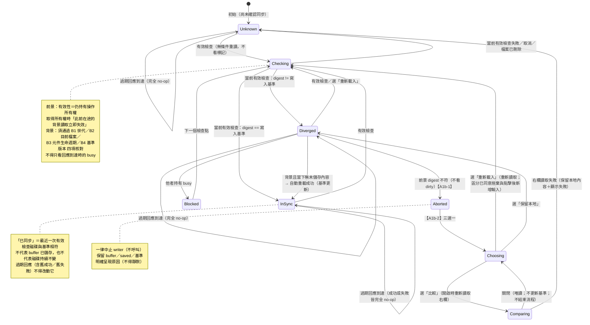
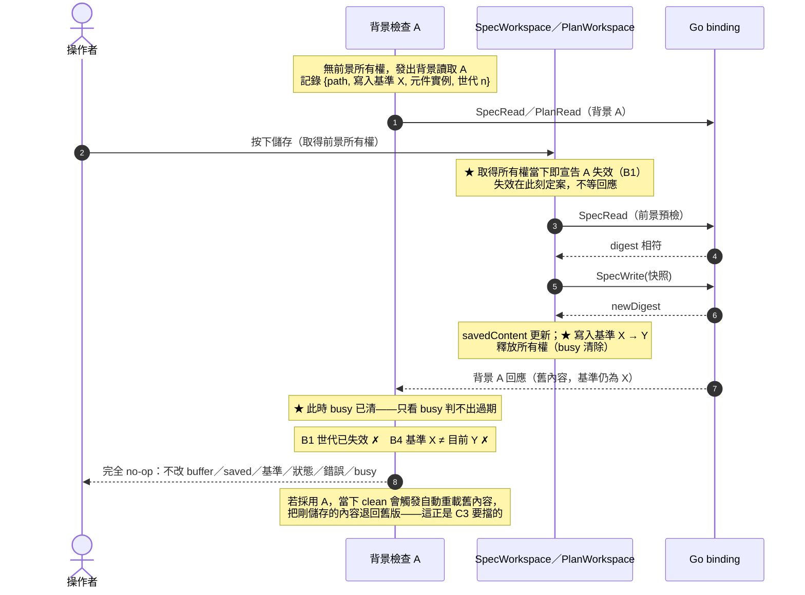
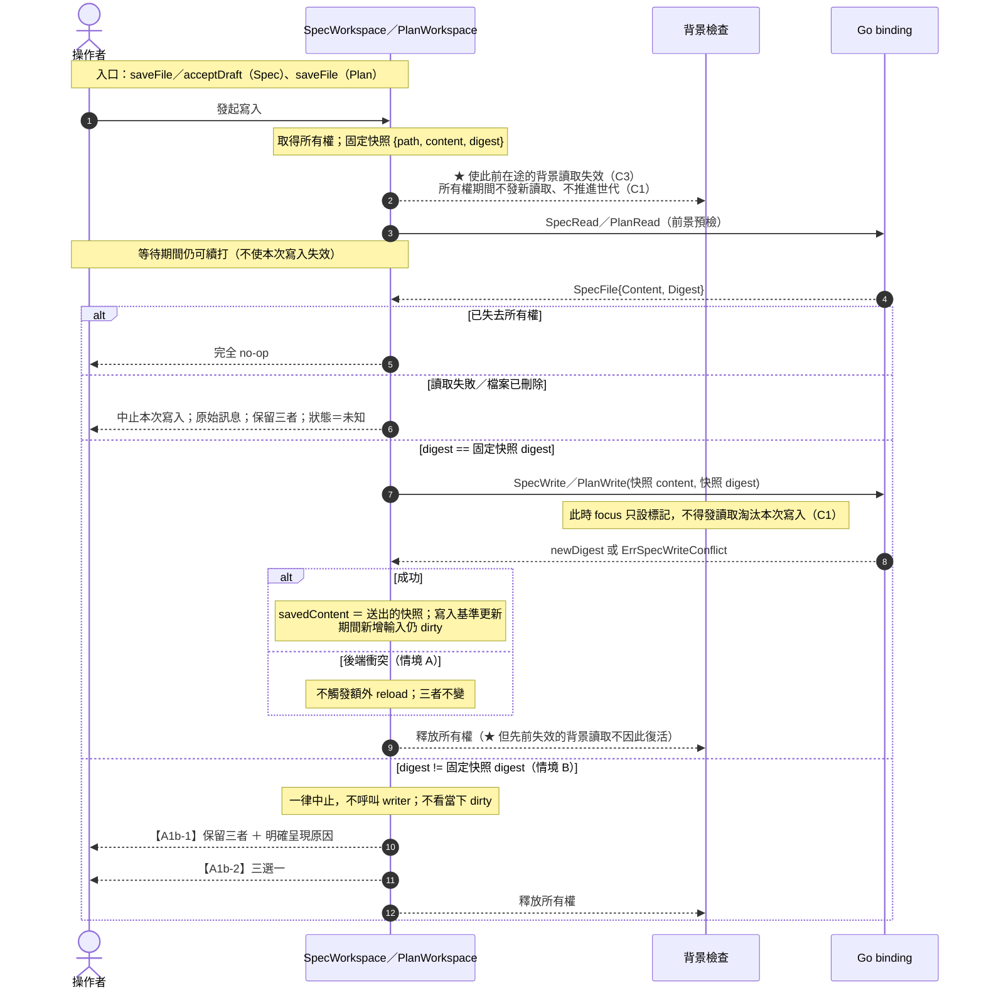

# A1b 外部檔案變更 reload／compare／保留本地 Design Draft

> 版本：**rev7**（2026-09-14）。歷史綁定：rev5 `44e6b0d7…50d9`（design gate）、
> rev6 `5fa515e3…1325`（第六輪修訂，**保留為歷史綁定**）。
> 本版依 owner 第七輪裁定更正 §2.11 的契約敘述，**須重新計算並綁定 hash**。
> A1b-1 實作中，**獨立 review 已對 rev6 快照回報 PASS，但 A1b-1 尚未驗收完成**。
> 票源：`docs/architecture/pre-m4-readiness-backlog.md` A1 驗收條件 **(5)**。
> A1 其餘條件 (1)(2)(3)(4)(6) 已由 A1a 完成關票（main `f9e2524`）。
> 基準：main `b7ed90b62cbf14c9463609a4adf700037f333f1c`（A2 合併後）。

---

## 〇、Owner 裁定

### 0.1 第一輪（2026-09-09）

1. 偵測**沿用既有 `spec:changed`／`plan:changed`，不新增 watcher、不新增事件種類**；事件只表示「需要重新確認」。
2. 檢查點：**回到工作區、視窗取得焦點、寫入前**。
3. **寫入時的 optimistic locking 保留。**
4. compare 第一版：左＝目前編輯器內容、右＝重新讀取的磁碟內容，**清楚標示來源，唯讀、不自動合併**；不做行對齊、高亮或逐段套用；**不沿用 commit 預覽的 unified diff**。
5. **「保留本地」不代表授權覆蓋外部修改**，不得更新寫入基準。

### 0.2 第二輪（2026-09-09）

6. **檢查不得依賴事件標記**。
7. **檢查點保留「回到工作區」**；**寫入前須盤點所有實際寫檔入口**。
8. 自動重載須**在讀取完成時重新確認**；**讀取失敗不得視為「沒有外部變更」**。
9. **「保留本地」須定義操作如何結束**；不暗中續寫；compare 不更新任何基準。
10. 估點逐項加總、不得進位。
11. 關窗／退出另列候選，措辭限於「未實測、未窮舉」。

### 0.3 第三輪（2026-09-09）

12. **拆票定案**。 13. **Spec 跨卸載狀態本票不新增**。
14. **分開「背景檢查」與「寫入前檢查」**；寫入按下時固定 `path`／`content`／`digest`；**區分本次操作持有的 busy**。
15. **以請求世代及基準版本**防止舊成功／舊失敗覆蓋新狀態；reload 須區分「已同意捨棄的內容」與點擊後新增的輸入。
16. **修正狀態圖**；區分「沒有進行中的操作」與「已確認內容同步」。
17. **Compare 開啟時重新讀取右欄**。 18. **T9 相容限定為行為契約**。
19. **A1b-1 必須能獨立驗收**。 20. 新檔排除須補後端真正保護；`confirmCommit`／`confirmBump` 須沿呼叫端查清楚。

### 0.4 第四輪（2026-09-09）

21. **A1b-1 1.76 pt／A1b-2 0.99 pt 核定為規劃估點**；合計 2.75 pt **是規劃值而非上限**。
22. **A1b-1 邊界**＝偵測、背景安全重載、寫入預檢、「中止＋保留＋原因呈現」，**可獨立驗收**。
23. **同步三值僅為內部判定**，**不新增常駐 UI 狀態或 badge**；
    **「已同步」僅代表最近一次有效檢查的磁碟與基準相符，不代表 buffer 已儲存或磁碟持續不變**。
24. **背景檢查不得淘汰進行中的寫入**（反例 **C1**）。
25. **舊回應丟棄必須完全不改狀態**（反例 **C2**）。
26. **前景發現分歧必須先中止，不能先看當下 dirty**。
27. 估點差額改列兩票已核對小計，**勿重複計算移項**。

### 0.5 第五輪（2026-09-09，rev5 據以補正）

28. ★ **尚未處理「前景開始前已送出的背景讀取」**（反例 **C3**）：

    > 背景讀取 A 尚未返回 → 使用者儲存，預檢及寫入成功，`saved`／`digest` 更新 → **A 才返回舊內容**。
    > 若背景世代沒有失效，**此時 busy 已清除**，A 仍可能被採用，
    > **甚至因當下 clean 而自動重載舊內容**（把剛儲存的內容退回舊版）。

    **rev3 的「基準版本核對」在 rev4 §2.4／§2.6 中漏掉了。** 須補明：
    - **前景取得所有權時，使此前所有背景讀取失效。**
    - **背景回應仍須核對目前檔案、元件生命週期及基準版本**；
      **切檔、卸載或基準更新後，舊成功／舊失敗皆完全不改狀態。**
    - **補反例 C3：舊背景讀取在儲存完成後返回，成功與失敗各一案。不能只在回應時看 busy。**

29. **測試落點裁定**：
    - **C1／C2／C3**：以**可控制 Promise 完成順序**的**元件層 vitest** 驗證；
      **Spec／Plan 各自覆蓋**；**Spec 的 `save` 與 `accept` 兩個寫入入口也須有對應保護證據**。
      **核對內容、`saved`／寫入基準、錯誤及 busy，不能只計算呼叫次數。**
    - **條款「dirty 變 false 反例」**：**元件測試必做，另加一條 feature scenario**——
      使用者可見行為：「預檢等待期間回復原內容，外部衝突仍中止寫入，不自動重載」。
    - **C1 可加一條行為層 feature scenario**：「儲存等待期間重新聚焦後仍正確反映寫入結果」。
    - **C2／C3 的世代細節留在測試，不必各寫一條 feature。**

> 裁定 28 為**恢復既有回應失效契約，沒有新增功能**——rev5 **維持已核定估點不變**。

### 0.6 第六輪（2026-09-13，code review 後；rev6 據以修訂）

30. **中止訊息統一為獨立元素。** Spec 改用 `external-abort`，與 Plan 一致；
    **預檢中止與預檢讀取失敗都在此呈現**，既有 `save-error`／`accept-error`
    **保留給實際寫入失敗**。**新操作與切檔時清除對應訊息**，避免殘留。
    **測試仍須斷言 writer 未被呼叫，不能只靠 DOM 區分原因。**
31. **移除 A1b 專用的事件訂閱與只寫不讀旗標**——**修正裁定 1／條款 1 先前保留輔助標記的決定**。
    既然沒有消費端、也不影響檢查行為，**就不應為它新增診斷介面或 UI**。
    三個檢查點維持**無條件讀取**；**A2 在 `App.vue` 的既有事件訂閱不動**。
    ★ **不得把未測過的訂閱成功路徑寫成已驗證**（jsdom 下 `window.runtime` 不存在，
    該路徑從未被測到）。
32. **Spec 的 B3 尚未成立**（正確性缺口）：背景回應判定缺少 `guard.isActive()`；
    **`dispose()` 不改變 snapshot 的 `instanceId` 與世代**，四欄比較因此仍可能通過，
    卸載後返回的回應可能被採用。Plan 已有 active 檢查。
    須補**「背景讀取在途 → 卸載 → 成功／失敗返回」兩案**。
33. **兩側背景檢查須處理既有 `load`／`bump` busy**（正確性缺口）：
    `canStartBackgroundRead()` 只辨識**新 guard 的前景所有權**；
    既有載入（`loadFile`，`busy='load'`）與 Plan 的基準調整（`confirmBump`，`busy='bump'`）
    **並未取得該所有權**，因此可能在這些操作期間**發出**或**套用**背景讀取。
    須補**發出時**與**返回時**的保護，並讓**操作開始前已在途的背景回應失效**；
    **不能只等返回時看 busy**（操作可能已結束、busy 已清）。**這是既有優先序契約，不擴充功能。**
34. **`isDeletedError` 暫接受為訊息分類的啟發式**，保留限制與一般讀取失敗的退路，
    **不新增後端 API**。

> 裁定 30–33 為**既有安全契約的修正**，34 為明示接受限制——**估點維持已核定值不變**。

### 0.7 第七輪（2026-09-14；rev7 據以更正）

35. **§2.11「行為敘述全部維持」不成立，須更正並拆為兩條 scenario**（見 §2.11）。
    註明這是 **A1b 引入預檢後的契約修訂**，**保留 A1a 當時的驗收紀錄**。
36. **Spec 的「B2」元件測試改名為「切檔後過期背景回應不得套用」**，
    移除「只有 B2 能擋下」等**已失效**的註解；**Plan 補對稱整合測試**。
    測試須明確確認**背景讀取已發出**、**回應確實延遲到切檔完成後才返回**——
    避免可選呼叫 `focusHandler?.()` 未執行仍通過。
37. **Ledger 分開記錄三項證據**，不得混為一談：
    (i) **模組測試**獨立驗證 **B2 比較規則**；
    (ii) **程式碼審查**確認**呼叫端傳入即時路徑**；
    (iii) **元件測試**驗證**切檔整體保護**。
    「B2 隔離不可構造」須**限縮**為「**目前正式切檔路徑均同步推進 B1，
    單獨移除 B2 不會使此整合測試失敗**」。
    ★ **模組測試不能替代呼叫端正確性的證據。**
38. **舊 N1 成功紀錄保留**，但**明載其鑑別性已被後續實作改變**；
    **目前 N1 存活的結果也須封存**。
39. **卸載失敗案仍屬部分驗證**；**Go 沿用、`EventsOn` 未測、備份未確認**三項標示維持。

---

## 一、已確認事實（2026-09-09 唯讀核對；★ 為後續 rev 新增）

### 1.1 後端

- 讀取：`SpecRead(rel) (SpecFile, error)`（`app.go:3683`）、`PlanRead`（`app.go:4419`）；
  `SpecFile{Content, Digest}`（`app.go:3676-3678`）。**讀取已回傳 digest。**
- digest：`specDigestOf(raw) = "sha256:" + spec.HashBytes(raw)`（`app.go:3619`），涵蓋整份檔案原始 bytes。
- 寫入樂觀鎖：`specWrite` `app.go:3766`／`planWrite` `app.go:4478`，不符回
  `ErrSpecWriteConflict`（`app.go:3624`）／`ErrPlanWriteConflict`（`app.go:4446`）；
  前端以子字串 `write conflict: expected_digest` 辨識（`frontend/src/lib/writeConflict.ts:5-8`），
  契約由 `app_write_conflict_message_test.go` 鎖定。
- 既有 watcher 涵蓋兩棵樹：`watchSpecTree`（`app.go:2522`）、`watchPlanTree`，
  fsnotify、200 ms debounce（`app.go:2503`），emit `spec:changed`（`:2639`）／`plan:changed`（`:2782`）。
  文件明載為 **NOTIFICATION 層、非權威**（`app.go:2508-2510`、`2634-2638`）。
- ★ **沒有 stat-only 介面**：`FileNode` 只有 `{Name, Path, IsDir}`（`app.go:3509-3513`）。
  **每次檢查＝整檔 `os.ReadFile` ＋ sha256。**

### 1.2 前端

- buffer／dirty **不對稱**：Spec 元件內 ref（`SpecWorkspace.vue:46`／`:54`／`:55`）；
  Plan 用 Pinia store（`stores/plan.ts:12`／`:14-17`；`PlanWorkspace.vue:73`）。
- busy：單一 `busyReason`（`SpecWorkspace.vue:56`、`PlanWorkspace.vue:74`），emit 至 App（`App.vue:103`）。
- A1a 守衛優先序（`App.vue:106-115`）：**busy 硬擋 → dirty 跳保留／捨棄確認 → 放行**。
- ★ 兩個編輯器**都不訂閱** `spec:changed`／`plan:changed`；訂閱者只有 `App.vue:353-354` 與 `DiagramPane.vue:63`。
- ★ 分頁用 `v-if`，切走即卸載（`App.vue:403-404`）；`PlanWorkspace.onMounted` 會 `loadFile()`（`:283-289`），Spec 同構。
- ★ 離開工作區時不可能帶著未儲存內容：`guardedNav` 要求 dirty 時先保留或捨棄。
- ★ 只有 Plan 有 `focus` listener（`PlanWorkspace.vue:279-289`），綁 `checkBump()`，與檔案內容無關；Spec 無 focus listener。
- 「已儲存快照」既有定義（`spec-plan-editing.feature:5`）：**最近一次成功寫入所送出的內容**。
- ★★ **既有所有權／版本核對 precedent**：`confirmBump()`（`PlanWorkspace.vue:193-231`）
  發出前凍結 `frozen`（`:197`）、以 `busyReason='bump'` 持有所有權（`:198`）、
  回應到達時**三重比對** `effectivePath`／`plan.currentPath`／`plan.currentContent`（`:204`）、
  `finally` 釋放（`:230`）。**A1b 的所有權與基準版本核對沿用此 pattern。**
- ★ A1a 既有世代守衛（`spec-plan-editing.feature`）已鎖：
  「延遲的載入回應不得覆蓋後來選取的檔案」「同一檔案的舊世代回應不得覆蓋最新一次載入」
  「載入進行中不得讓回應覆蓋新輸入」——**A1b 的 C3 屬同族，須擴及「寫入完成後」的時點**。

### 1.3 ★ 寫入入口盤點（裁定 7、20）

| 元件 | 函式 | 呼叫點 | 寫入前檢查 |
|---|---|---|---|
| Spec | `saveFile()`（`:323`） | `SpecWorkspace.vue:327` | **需要** |
| Spec | **`acceptDraft()`（`:297`，接受 AI 草稿）** | `SpecWorkspace.vue:300` | **需要** |
| Spec | `createNewFile()`（`:225`） | `SpecWorkspace.vue:229` | 排除，理由見下 |
| Plan | `saveFile()`（`:416`） | `PlanWorkspace.vue:418` | **需要** |
| Plan | `createNewFile()`（`:344`） | `PlanWorkspace.vue:347` | 排除，理由見下 |

★ **不對稱**：Plan 的 `applyDraft()`（`PlanWorkspace.vue:402`）**只改 buffer 不寫檔**；
Spec 的 `acceptDraft()` **會實際寫檔**。

**新檔入口排除理由**：後端有**對稱且真正的保護**（`app.go:3766-3772`）——
目標**已存在**時空 `expectedDigest` 與非空 `sha256:…` **必然不匹配 → 拒絕**；
目標**不存在**時非空 `expectedDigest` 同樣拒絕。驗收須**以測試證明該拒絕路徑**。

**`confirmCommit`／`confirmBump` 盤點（已完成）**：
`ConfirmSpecCommit`／`ConfirmPlanCommit` → `internal/spec/commit.go:219,222` 只做 `git add`／`git commit`，
**不回寫編輯檔**；`ConfirmAnalysisBaseBump`（`app.go:4945`）doc 明載**不寫檔、不 commit**，
前端 `confirmBump()` 只更新 `plan.currentContent`（`PlanWorkspace.vue:219-220`），
**不呼叫 writer**，落地走 `saveFile()`。→ **入口盤點完整為上表 5 處。**

---

## 二、行為定義

### 2.1 兩層職責（rev6：標記層已移除）

| 層 | 觸發 | 行為 |
|---|---|---|
| **檢查層** | 三檢查點 | **無條件**重讀並比對 digest |
| **處置層** | 檢查層判定已變更 | 依 2.6 分流（**前景與背景不同路**） |

★ **rev6 移除 A1b 專用的事件訂閱與標記**（裁定 31）。原設計保留 `spec:changed`／`plan:changed`
訂閱作為「輔助標記」，但實作後該標記**只寫不讀、沒有消費端**，既非稽核也非診斷；
owner 裁定**不應為它新增診斷介面或 UI**，故整個移除。

檢查行為不因此改變——三個檢查點本來就**無條件重讀**，理由不變：
事件可能**漏送**（`app.go:2508-2510`）、被 **200 ms debounce 合併**（`app.go:2503`）、
發生在**元件未掛載期間**（`v-if`，`App.vue:403-404`）。

★ **限制（不得寫成已驗證）**：jsdom 下 `window.runtime` 不存在，
**Wails `EventsOn` 訂閱成功時的行為從未被測試涵蓋**。這正是移除的另一個理由——
留著等於留一條沒有測試、也沒有消費端的路徑。
**`App.vue` 的 A2 既有訂閱（重載 escalation 收件匣）不在本票範圍，維持不動。**

### 2.2 三個檢查點

| 檢查點 | 類型 | 處置 |
|---|---|---|
| **回到工作區**（重新掛載） | 背景 | **既有 `onMounted → loadFile()` 即滿足**；不新增跨卸載狀態（裁定 13） |
| **視窗取得焦點** | 背景 | 依 2.6 背景路徑 |
| **寫入前** | **前景** | 涵蓋 §1.3 全部需檢查入口；**digest 不符一律中止**（裁定 26） |

### 2.3 背景檢查 vs 寫入前檢查（裁定 14）

| | **寫入前檢查（前景）** | **背景檢查** |
|---|---|---|
| 快照 | 按下寫入時**固定 `path`／`content`／`digest`** | 發出讀取時記錄 `path`＋**當時寫入基準**＋元件實例 |
| 期間續打 | **允許**，且**不使該次寫入失效** | 允許 |
| 磁碟基準相符 | **寫入固定的那份快照** | 不寫入 |
| 寫入成功後 | `savedContent` ＝ 送出的快照內容；期間新增輸入**仍為 dirty** | 不適用 |
| 期間新增輸入 | 不得被寫入結果覆寫 | **不得被背景重載覆寫** |
| digest 不符 | **一律中止 writer ＋ 呈現原因**（**不看當下 dirty**） | 依當下內容狀態決定是否自動重載 |

★ **自身 busy 的區分**：寫入前檢查是**該操作自己**設的 busy，不得以 `busyReason !== ''` 自判失效；
判定須用**操作所有權**（2.4），只有**他者**持有時才算衝突。

### 2.4 前景操作所有權、背景讀取失效與基準版本核對（裁定 15、24、28 — rev5 補正）

#### 2.4.1 兩個必須同時成立的方向

rev4 只處理了**前景開始「之後」**不再發背景讀取，
**漏了前景開始「之前」已在途的背景讀取**（裁定 28）：

> **反例 C1**（rev4 已處理）：寫入已送出 → `focus` 觸發新讀取 →
> 寫入成功回應被丟棄 → **磁碟已更新但 `saved`／`digest` 未更新**。
>
> ★ **反例 C3**（rev5 新補）：**背景讀取 A 尚未返回** → 使用者儲存，預檢及寫入成功、
> `saved`／`digest` 已更新 → **A 才返回舊內容**。此時 **busy 已清除**，
> 若背景世代未失效，A 仍可能被採用——**甚至因當下 clean 而自動重載舊內容，
> 把剛儲存的內容退回舊版**。
> ★ **不能只在回應時看 busy**：寫入完成後 busy 已清，看 busy 判不出 A 已過期。

#### 2.4.2 規則

- **前景操作所有權**：`saveFile`／`acceptDraft` 按下時取得，
  涵蓋 **預檢 → 寫入 → 結果套用整段**，完成或中止才釋放。
- **前景回應的有效性只由「該操作是否仍持有所有權」決定**，**不被背景讀取淘汰**。
- ★ **取得所有權時，使此前所有在途的背景讀取立即失效**（裁定 28）——
  失效判定**在取得所有權當下就定案**，不依賴回應到達時的 busy 狀態。
- **所有權存在期間，背景檢查一律延後或略過**：不發出讀取、**不推進任何使該寫入失效的世代**；
  期間收到事件只設輔助標記，待釋放後的下一個檢查點處理。
- **背景世代**只在無前景所有權時遞增，只用於背景讀取彼此淘汰。

#### 2.4.3 ★ 背景回應的四項核對（裁定 28；rev3 遺漏、rev5 恢復）

背景回應**除了世代之外**，套用前**必須全部通過**下列核對，任一不符即依 2.5 完全 no-op：

| # | 核對項 | 失敗情境 |
|---|---|---|
| B1 | **當前有效背景世代** | 被較新背景讀取取代；**或被前景取得所有權時失效**（C3） |
| B2 | **目前檔案**（`path`／文件識別） | 期間切檔 |
| B3 | **元件生命週期**（仍為同一掛載實例） | 期間卸載／重新掛載 |
| B4 | ★ **基準版本**（發出時的寫入基準 == 目前寫入基準） | **期間寫入成功使基準更新**（C3 的關鍵；此時 busy 已清） |

> **B4 是 rev4 遺漏的一項。** 只靠 B1 也能擋住 C3（前景取得所有權即失效），
> 但 B4 提供**與世代無關的第二道防線**：即使世代機制有漏（例如未來新增其他寫入路徑忘了取得所有權），
> 基準版本比對仍能擋下「發出時基準 X、返回時基準已是 Y」的過期回應。**兩者皆為必要條件。**

#### 2.4.4 ★ 不走 guard 所有權的既有 busy（rev6 新增，裁定 33）

`canStartBackgroundRead()` 只辨識**新 guard 的前景所有權**。既有的
**`loadFile`（`busy='load'`，兩側）**與 **`confirmBump`（`busy='bump'`，Plan）**
**沒有** `acquire()`，因此原設計會在這些操作期間**發出**或**套用**背景讀取。

兩道保護缺一不可：

| 時點 | 規則 |
|---|---|
| **發出時** | 背景檢查除 `canStartBackgroundRead()` 外，**另須 `busyReason === ''`**——這些操作進行中不得發出新的背景讀取 |
| **操作開始時** | `loadFile()`／`confirmBump()` 開頭呼叫 **`guard.invalidateBackground()`**，使**此前已在途**的背景回應立即失效 |

★ **不能只等返回時看 busy**：操作可能已結束、busy 已清，回應才到（與 C3 同形）。
★ `confirmBump` 特別重要：它**只改 buffer、不改寫入基準**，
**B4 擋不住**它造成的錯位，只能靠世代失效。
★ `invalidateBackground()` **不取得所有權**——這些操作不是 A1b 的前景寫入，
不應阻擋後續背景檢查重新發出。

**明確 reload 的額外要求**（裁定 15）：點擊「重新載入」當下凍結**使用者已同意捨棄的 buffer 快照**；
回應到達時若 buffer **已不等於該快照**（點擊後又打字），
**不得捨棄點擊後新增的輸入**——須重新提示。

### 2.5 過期回應：完全 no-op（裁定 25）

> **反例 C2**：新讀取已確認同步 → **舊失敗回應後到** →
> 若導向 `Unknown` 就會把**新的有效結果清掉**。

**過期回應**（前景：已失去所有權；背景：B1–B4 任一不符）**一律完全 no-op**：

- **不改同步狀態**（不得從已同步降為未知）
- **不改錯誤**（不顯示其錯誤、不清除既有訊息）
- **不改標記**
- **不改 busy**
- ★ **不改 buffer／`savedContent`／寫入基準**

**只有仍有效的當前檢查**失敗／取消，才依 2.7／2.8 更新狀態。
★ **舊成功與舊失敗一視同仁**——C3 須成功、失敗**各一案**驗證（裁定 28）。

### 2.6 處置分流與操作結束（裁定 9、19、26）

**前景（寫入前檢查）——digest 不符一律中止，不看 dirty：**

```
取得所有權（★ 同時使此前在途的背景讀取失效）→ 固定快照 {path, content, digest} → 讀取
├─ 已失去所有權 → 完全 no-op（2.5）
├─ 讀取失敗／已刪除 → 中止本次寫入；保留 buffer／saved／基準；狀態＝未知（2.7）
├─ digest == 固定快照 digest → 寫入該快照
│   ├─ 成功 → savedContent ＝ 送出的快照內容；★ 寫入基準更新（B4 的比較基準隨之改變）
│   │          期間新增輸入仍 dirty；釋放所有權
│   └─ 後端衝突（情境 A）→ 不觸發額外 reload；三者不變；釋放所有權
└─ digest != 固定快照 digest（情境 B）
    → **一律中止 writer（不呼叫）＋保留三者＋明確呈現原因**
      ★ 不看當下 dirty——即使等待期間 buffer 改回 saved 使 dirty 變 false，
        仍是中止，不轉為自動重載（裁定 26）
    → 【A1b-2】在中止提示上加三選一
```

**背景（回到工作區／視窗聚焦）——才依當下內容狀態決定：**

```
★ 無前景所有權 **且 busyReason === ''** 時才發出（2.4.4）
  → 記錄 {path, 當時寫入基準, 元件實例, 背景世代} → 讀取
├─ ★ 元件已卸載（`guard.isActive()` 為假）→ 完全 no-op（B3，裁定 32）
├─ ★ B1–B4 任一不符（含「期間寫入成功使基準更新」、「load／bump 開始時已失效」）→ 完全 no-op（2.5）
│    ★ 不得只看回應到達時的 busy——寫入完成後 busy 已清（C3）
├─ 讀取失敗／已刪除（且 B1–B4 通過）→ 保留三者；狀態＝未知（2.7）
├─ digest == 目前寫入基準 → 狀態＝已同步；清除標記
└─ digest != 目前寫入基準（狀態＝已分歧）
    ├─ 他者持有 busy → 不提示；下一檢查點處理
    ├─ **當下無未儲存內容** → 自動重載為磁碟版本 ＋ 非阻斷告知
    └─ **當下有未儲存內容** → 不覆寫；【A1b-1】呈現變更提示；【A1b-2】加三選一
```

**三選一的結束語意（A1b-2）**：
**重新載入** → 重新讀取磁碟（不套用舊快照）→ 再過 2.4 捨棄範圍區分；
**比較** → 開啟時重新讀取右欄（2.9）；不更新任何基準；關閉回到三選一；
**保留本地** → 保留編輯內容；基準不變；**不暗中續寫**；提示關閉，**操作結束**。

「後續儲存仍受樂觀鎖保護」是**後端契約**，**不代表 UI 應每次故意送出已知會衝突的寫入**。
**A1b-1 的中止必須有提示**（裁定 19）。

### 2.7 讀取失敗與檔案已刪除（裁定 8）

- 讀取失敗：**保留 buffer、savedContent、寫入基準三者不變**，顯示原始訊息（不吞、不判為衝突）；
  前景則同時**中止本次寫入**。
- 檔案已刪除：同上保留三者，明確告知「檔案已不存在」，**不清空編輯內容**。
- **失敗不得視為「沒有外部變更」**：同步狀態記為**未知**。
- ★ 前提：該失敗須來自**仍有效的當前檢查**（前景仍持有所有權；背景通過 B1–B4）；
  **過期失敗依 2.5 完全 no-op**。

### 2.8 同步狀態三值（裁定 16、23 — 僅內部判定）

| 狀態 | 意義 | 進入條件 |
|---|---|---|
| **已同步** | **最近一次有效檢查**的磁碟 digest == 寫入基準 | 有效檢查通過 |
| **未知** | 同步狀態尚未確認 | 初始；**仍有效的當前檢查**失敗／取消／檔案已刪除 |
| **已分歧** | 已確認磁碟 digest != 寫入基準 | 有效檢查判定變更；**含「保留本地」之後** |

- ★ **「已同步」僅代表最近一次有效檢查的磁碟與基準相符**，
  **不代表 buffer 已儲存**，**也不代表磁碟持續不變**（裁定 23）。
- **過期回應完全不改狀態**（2.5）。
- **「沒有進行中的操作」不得推論為已同步。**
- ★ **僅內部判定**：**不新增常駐 UI 狀態或 badge**；使用者只看見
  **變更提示、讀取失敗、操作中止原因**三類必要訊息。

### 2.9 檢查中／提示中／compare 中的再次變更

| 階段 | 使用者再次編輯 | 磁碟再次變更 |
|---|---|---|
| **前景檢查中** | **不影響本次寫入**；成功後新輸入仍 dirty | 由樂觀鎖把關（TOCTOU 窗口仍在） |
| **背景檢查中** | 回應**不得覆寫新輸入** | 回應可能已過期；下一檢查點再讀 |
| **提示中** | 提示**維持有效**；不因 dirty 改變而自動關閉 | 快照已過期；「重新載入」**必須重新讀取** |
| **compare 中** | 左欄為**開啟當下的 buffer 快照（凍結）** | 右欄為 **compare 開啟時重新讀取**的磁碟內容（凍結） |

★ **compare 右欄讀取失敗**：**保留本地內容並顯示讀取失敗**，
不得把舊右欄當成本次成功結果，也不得推論同步或更新任何基準。

### 2.10 與 A1a 保護的銜接

- 優先序不變：**他者 busy 硬擋 > 外部變更提示**；外部變更提示**不取代**未儲存導覽確認。
- 寫入前檢查是**額外一層**，**不取代**後端樂觀鎖。
- ★ C3 是 A1a 既有「延遲回應／舊世代不得覆蓋」族的延伸，**時點擴及「寫入完成之後」**。

### 2.11 既有回歸測試的相容方式（裁定 18）

- T9-S（`SpecWorkspace.test.ts:498-525`）的 `SpecRead` **總次數等於 1** 與新增預檢**不相容**；
  **允許改計次方式**。
- 須改為證明**兩個分開的情境**：
  - **情境 A**：寫入前檢查**成功**後才發生的**後端衝突** → **不觸發額外 reload**，三者不變。
  - **情境 B**：**預檢已發現外部變更** → **根本不呼叫 writer**（呼叫次數 0）。
★ **（rev7 更正，裁定 35）`spec-plan-editing.feature` 的舊情境並非「全部維持」。**
rev6 以前寫「`spec-plan-editing.feature:73-80` 的行為敘述全部維持」——**字面不成立**。
舊情境「儲存失敗——digest 衝突」的 Given 是「**按下儲存之前**磁碟已被改動、持有的 digest 已過期」，
Then 是「依 **sentinel 文字契約**辨識為 digest 衝突」。A1b 加入寫入前預檢後，
**該 Given 必然先被預檢攔截、根本到不了 sentinel**。

依 owner 2026-09-14 裁定，該情境**拆為兩條**（已落地於 `spec-plan-editing.feature`）：

| 時序 | writer | 呈現 |
|---|---|---|
| **預檢讀到過期 digest**（按下前已被改動） | **呼叫次數 0** | `external-abort`／`externalChange.writeAborted` |
| **預檢通過後、實際寫入前才變更（TOCTOU）** | **被呼叫**，由後端樂觀鎖拒絕 | 依 **sentinel** 辨識為 digest 衝突 |

**共同保護（兩條皆須成立）**：編輯器內容與受控 buffer 不被覆蓋、
已儲存快照與持有的 digest 都不被更新、系統不會自動重新載入該檔。

**A1a 當時的驗收紀錄不因此變更**——A1a 關票時預檢尚不存在，原情境在當時為真；
這是 **A1b 引入預檢後的契約修訂**，不是對 A1a 的追溯否定。

---

## 三、狀態圖與序列圖

### 3.1 同步狀態（`docs/architecture/diagrams/a1b-sync-state.mmd` 候選）



### 3.2 ★ C3：前景開始前已在途的背景讀取（`a1b-seq-c3.mmd` 候選）



### 3.3 寫入前檢查序列（`a1b-seq-precheck.mmd` 候選）



---

## 四、驗收條件（草案，待 owner 核定）

1. ★（rev6 改寫，裁定 31）**不新增任何 A1b 專用的事件訂閱或標記**；不新增 watcher、不新增事件種類；
   **不得為沒有消費端的標記新增診斷介面或 UI**。`App.vue` 的 A2 既有訂閱不動。
   **不得把未測過的 `EventsOn` 訂閱成功路徑寫成已驗證**（jsdom 下該路徑從未被涵蓋）。
2. **檢查點無條件重讀並比對 digest**；三個檢查點的行為**不依賴任何事件**，須由測試證明（**無任何訂閱仍偵測得到**）。
3. 檢查點為**回到工作區／視窗取得焦點／寫入前**；回到工作區以既有 `onMounted → loadFile()` 滿足，**不新增跨卸載狀態**。
4. 寫入前檢查涵蓋 §1.3 全部需檢查入口（Spec `saveFile`／`acceptDraft`，Plan `saveFile`）。
5. **新檔入口排除**須以測試證明後端拒絕路徑：目標已存在時空 `expectedDigest` 被拒；不存在時非空 `expectedDigest` 被拒。
6. **背景／寫入前檢查分離**：按下時固定 `path`／`content`／`digest`；等待期間續打**不使本次寫入失效**；
   成功後 `savedContent` ＝送出快照，**期間新增輸入仍 dirty**；**背景檢查不得覆寫期間新增的輸入**。
7. **自身 busy 不得自判失效**：僅**他者**持有時才算衝突，以操作所有權區分。
8. **前景所有權優先於背景世代**（反例 **C1**）：所有權期間**背景檢查延後或略過、不推進使該寫入失效的世代**；
   **前景回應有效性只由所有權決定**。
   須驗：**寫入已送出 → `focus` 觸發 → 寫入成功回應仍被套用**（`savedContent`／寫入基準確實更新）。
9. ★ **取得所有權時使此前在途的背景讀取失效**（反例 **C3**）：
   失效**在取得所有權當下定案**，**不得只在回應到達時看 busy**（寫入完成後 busy 已清）。
   須驗**舊背景讀取在儲存完成後返回，成功與失敗各一案**，皆完全不改狀態。
10. ★ **背景回應四項核對**（B1 當前有效背景世代／B2 目前檔案／B3 元件生命週期／**B4 基準版本**）：
    任一不符即完全 no-op。**B4 須以「期間寫入成功使基準更新」的情境驗證**，
    且**與 B1 並列為必要條件**（互為第二道防線）。
    ★（rev6，裁定 32）**B3 必須以 `guard.isActive()` 明確判定**——
    `dispose()` **不改變** snapshot 的 `instanceId` 與世代，僅靠四欄比較**擋不住卸載**。
    須有**「背景讀取在途 → 卸載 → 成功／失敗返回」兩案**，證明無任何後續套用。
    **Spec 與 Plan 各自覆蓋。**
10a. ★（rev6，裁定 33）**既有 `load`／`bump` busy 的交錯保護**：
    背景檢查**發出時**除 `canStartBackgroundRead()` 外另須 `busyReason === ''`；
    **`loadFile()`／`confirmBump()` 開始時**呼叫 `invalidateBackground()`，
    使**此前已在途**的背景回應失效。**不得只等返回時看 busy。**
    須驗：(i) `load` 交錯（含「`loadFile` 已結束、busy 已清後回應才到」）；
    (ii) Plan 的 `bump` 交錯——**`confirmBump` 只改 buffer 不改基準，B4 擋不住，
    須證明是世代失效擋下的**；(iii) `bump` 期間不得發出新的背景讀取。
11. **過期回應完全 no-op**（反例 **C2**）：**不改同步狀態、錯誤、標記、busy、buffer／`savedContent`／寫入基準**；
    **不得把已同步降為未知**。須驗：**新檢查成功（已同步）後，舊失敗回應返回，狀態仍為已同步且不顯示其錯誤**。
    **舊成功與舊失敗一視同仁。**
12. **前景 digest 不符一律中止**：**不看當下 dirty**——即使等待期間 buffer 改回 saved 使 dirty 變 false，
    仍**中止 writer（呼叫次數 0）＋保留三者＋明確呈現原因**，不得轉為自動重載。
    **背景檢查才依當下內容狀態決定是否自動重載。**
13. **讀取失敗／檔案已刪除**（限**當前有效檢查**）：保留 buffer、savedContent、寫入基準三者；
    原始訊息不吞不誤判；前景同時**中止本次寫入**；狀態記為**未知**。
14. **同步三值僅內部判定**，**不新增常駐 UI 狀態或 badge**；使用者只看見**變更提示、讀取失敗、中止原因**。
    **「已同步」不代表 buffer 已儲存或磁碟持續不變**；**「沒有進行中的操作」不得推論為已同步**；
    **「保留本地」後仍為已分歧**。
15. 【A1b-1】偵測到外部變更時**中止該次寫入＋保留內容與基準＋明確呈現原因**，**不得留下無提示的中止**。
15a. ★（rev6，裁定 30）**中止訊息統一為獨立元素 `external-abort`**（Spec 與 Plan 一致）：
    **預檢中止與預檢讀取失敗／檔案已刪除都在此呈現**；
    既有 `save-error`／`accept-error` **只保留給實際寫入失敗**（writer 已被呼叫後才失敗，含後端 digest 衝突）。
    **新操作開始時與切檔時都要清除**對應訊息，不得殘留。
    ★ 測試**仍須斷言 writer 未被呼叫**（`expect(write).not.toHaveBeenCalled()`），**不能只靠 DOM 區分原因**。
16. 【A1b-2】三選一疊加於上述提示；**「保留本地」不更新基準、不暗中續寫、提示關閉即結束**；
    **「重新載入」一律重新讀取磁碟**；**compare 不更新任何基準、不結束流程**。
17. **T9 相容**：行為契約維持；允許調整計次方式，須分別證明**情境 A** 與**情境 B**。
18. compare：左＝開啟當下 buffer 快照（凍結）、右＝**開啟時重新讀取**的磁碟內容（凍結），
    兩欄標示來源與擷取時點，唯讀、不自動合併；**右欄讀取失敗時保留本地內容並顯示失敗**；
    不做行對齊、高亮或逐段套用；不沿用 commit 預覽的 unified diff。
19. 優先序：他者 busy 硬擋 > 外部變更提示；外部變更提示不取代未儲存導覽確認。
20. 寫入時 optimistic locking 保留；寫入前檢查不得取代或放寬之。
21. Spec 與 Plan 皆實作，沿用各自既有放置慣例。
22. 測試落點須符合 §4.1。

### 4.1 ★ 測試落點（裁定 29 — 已由 owner 裁定）

| 對象 | 落點 | 要求 |
|---|---|---|
| **C1**（背景淘汰進行中寫入） | **元件層 vitest**（可控制 Promise 完成順序）**＋一條行為層 feature scenario** | feature 敘述：「**儲存等待期間重新聚焦後仍正確反映寫入結果**」 |
| **C2**（新成功後舊失敗返回） | **元件層 vitest**（可控制完成順序） | 世代細節留測試，**不寫 feature scenario** |
| **C3**（舊背景讀取在儲存完成後返回） | **元件層 vitest**（可控制完成順序）；**成功與失敗各一案** | 世代細節留測試，**不寫 feature scenario** |
| **條款 12**（dirty 變 false 反例） | **元件測試必做 ＋ 一條 feature scenario** | feature 敘述：「**預檢等待期間回復原內容，外部衝突仍中止寫入，不自動重載**」 |

**C1／C2／C3 的共同要求**：

- **Spec 與 Plan 各自覆蓋**（不得只做一邊）。
- ★ **Spec 的 `saveFile` 與 `acceptDraft` 兩個寫入入口都須有對應保護證據**。
- ★ **斷言須核對內容、`savedContent`／寫入基準、錯誤訊息及 busy** ——
  **不得只計算呼叫次數**。

---

## 五、界線（本票不做）

- 不新增 file watcher、不新增事件種類、不改既有 watcher 的 emit 形狀。
- **不新增 Spec 跨卸載狀態**（裁定 13）；**不新增常駐同步狀態 UI 或 badge**（裁定 23）。
- ★（rev6）**不新增任何 A1b 專用事件訂閱或標記**，也不為其新增診斷介面（裁定 31）。
- ★（rev6）**不新增後端 API**：`isDeletedError` 維持以錯誤文字判定的**啟發式**（裁定 34）——
  後端訊息格式若改變只會退回顯示一般讀取失敗（`readFailed`），
  **不影響「保留 buffer／savedContent／寫入基準三者」的核心契約**；此限制明列、不視為已解決。
- 不做差異行對齊、語法高亮、逐段套用或任何自動合併。**逐行對齊／高亮的成本未估算。**
- 不改後端：不新增 stat-only／digest-only binding。
- 不對 `createNewFile` 新檔入口加前端檢查（後端已覆蓋）。
- **不處理關窗／退出 app 的未儲存保護**：**指定檔案未找到相關 hook，原生關閉行為尚未實測**，
  退出路徑未窮舉。已登記為**候選另案**（§八）。

---

## 六、估點（0.1 pt ＝ 1 hr；逐項加總，不進位）

**A1b-1 1.76 pt／A1b-2 0.99 pt 已由 owner 核定為規劃估點（裁定 21）；合計 2.75 pt 為規劃值而非上限。**
rev4 的三項與 rev5 的一項修正皆屬**既有安全契約釐清／恢復、不增功能**（裁定 24–26、28），
**估點不變**。

### 6.1 A1b-1 偵測、檢查與安全中止（無依賴；**可獨立驗收**，裁定 22）

| # | 項目 | hr |
|---|---|---|
| 1 | 設計定案＋feature scenario（偵測／檢查／中止面，含 C1 與條款 12 兩條 scenario） | 0.9 |
| 2 | 事件訂閱與輔助標記（兩份，非閘控，含「移除標記不改行為」可測性） | 1.0 |
| 3 | 三檢查點比對邏輯 × 2 元件 | 2.0 |
| 4 | 寫入前檢查覆蓋全部需檢查入口 | 1.0 |
| 5 | 背景／寫入前檢查的語意分離（固定快照、續打不失效、成功後新輸入仍 dirty） | 1.5 |
| 6 | **前景所有權＋背景讀取失效＋B1–B4 四項核對**（C1／C2／C3 守衛） | 2.0 |
| 7 | 讀取失敗／檔案已刪除規則＋同步狀態三值（內部判定） | 1.0 |
| 8 | 背景且無未儲存內容時自動重載＋非阻斷告知＋i18n | 1.0 |
| 9 | 中止寫入＋保留內容與基準＋明確呈現原因（獨立可驗收所需） | 1.2 |
| 10 | busy／dirty 優先序整合與既有守衛回歸 | 1.0 |
| 11 | T9 相容改造與情境 A／B 兩項證明 | 1.2 |
| 12 | 測試（C1／C2／C3 兩元件、Spec 雙入口、條款 12 反例、失敗路徑、新檔後端拒絕） | 3.0 |
| 13 | mutation／review／修正緩衝 | 0.8 |
| | **小計** | **17.6 hr ＝ 1.76 pt** |

逐步加總：0.9→1.9→3.9→4.9→6.4→8.4→9.4→10.4→11.6→12.6→13.8→16.8→**17.6**。

### 6.2 A1b-2 選擇流程與 compare（依賴 A1b-1）

| # | 項目 | hr |
|---|---|---|
| 1 | 設計定案＋feature scenario（選擇／compare 面） | 0.7 |
| 2 | 三選一 UI（疊在 A1b-1 的中止提示上）＋i18n | 1.3 |
| 3 | 「保留本地」不變式與結束語意 | 0.5 |
| 4 | 「重新載入」重新讀取＋區分已同意捨棄內容與點擊後新增輸入 | 1.2 |
| 5 | 並列兩欄唯讀 compare（開啟時重新讀取右欄；失敗保留本地並顯示失敗；兩欄凍結、標示來源與時點） | 2.2 |
| 6 | 提示中／compare 中再次編輯或磁碟再變更的處理 | 1.0 |
| 7 | 測試 | 2.2 |
| 8 | mutation／review／修正緩衝 | 0.8 |
| | **小計** | **9.9 hr ＝ 0.99 pt** |

逐步加總：0.7→2.0→2.5→3.7→5.9→6.9→9.1→**9.9**。

### 6.3 aggregate、排程與差額說明（裁定 27）

**17.6 ＋ 9.9 ＝ 27.5 hr ＝ 2.75 pt**；排程 ≈ **4.58 個工作天**（throughput 0.6 pt/day，與工時是不同維度）。

**相對 rev2 的差額——以兩票已核對小計直接列出，不重複計算移項：**

| 票 | rev2 | rev3–rev5 | 差額 |
|---|---|---|---|
| A1b-1 | 13.5 hr | 17.6 hr | **＋4.1 hr** |
| A1b-2 | 8.5 hr | 9.9 hr | **＋1.4 hr** |
| **aggregate** | **22.0 hr** | **27.5 hr** | **＋5.5 hr** |

**A1b-1 ＋4.1 hr 對應工作項**（加總 ＝ ＋4.1）：

| 變動 | hr |
|---|---|
| 移除跨卸載寫入基準保存（裁定 13） | −1.0 |
| 三檢查點項縮減（回到工作區改用既有 `loadFile`） | −0.5 |
| 到達時重新確認 2.0 → 拆為「背景／前景分離 1.5 ＋ 所有權與核對 2.0 ＋ 失敗與三值 1.0」 | ＋2.5 |
| T9 相容改造與情境 A／B 證明（新增項） | ＋1.2 |
| **中止＋保留＋原因呈現（自 A1b-2 移入，非 aggregate 新增）** | ＋1.2 |
| 測試增量（C1／C2／C3、條款 12 反例、新檔拒絕） | ＋0.5 |
| 設計與緩衝微調 | ＋0.2 |

**A1b-2 ＋1.4 hr 對應工作項**（加總 ＝ ＋1.4）：

| 變動 | hr |
|---|---|
| **三選一 UI 縮減（中止提示已移入 A1b-1）** | −0.2 |
| compare 2.0 → 拆為「重新載入重讀＋捨棄範圍區分 1.2 ＋ compare 開啟時重讀右欄 2.2」 | ＋1.4 |
| 測試增量 | ＋0.2 |

★ **移項不重複計算**：中止項 ＋1.2 在 A1b-1、對應 −0.2 在 A1b-2，**aggregate 淨 ＋1.0**，
該淨額**不是搬移本身的成本**，而是**讓中止在第一票即可獨立驗收**所需的提示與原因呈現增量。
aggregate 差額仍以 **＋5.5 hr** 為準。

★ A1b-1 為 **1.76 pt**，距 2.0 pt 門檻 0.24 pt；依裁定 21，**範圍或工時重新跨過門檻時再檢視**。

---

## 七、待 owner 裁定

1. **驗收條件二十二條**（rev5 新增條款 9、10，改寫 8、11，新增 §4.1 測試落點）。

---

## 八、候選另案（登記，未授權）

- **關窗／退出未儲存保護**：**指定檔案（`main.go`／`app.go`／`wails.json`／`frontend/src/`）未找到
  `beforeunload`／`OnBeforeClose`／`WindowClose` 相關 hook；原生關閉行為尚未實測，退出路徑未窮舉。**
  **不併入 A1b、不授權實作或測試重現。** 估點未提。

---

## 九、修訂記錄

- **rev7（2026-09-14）**：依 owner 第七輪裁定更正 §2.11——
  **刪除「`spec-plan-editing.feature:73-80` 行為敘述全部維持」這句不成立的敘述**，
  改為「**預檢攔截（writer 0／external-abort）**」與「**預檢後 TOCTOU（writer 被呼叫／sentinel）**」
  兩條時序不同的情境＋三項共同保護，並註明**A1a 當時的驗收紀錄不變更**。
  `spec-plan-editing.feature` 已同步拆為兩條 scenario。新增 §0.7（裁定 35–39）。
  **估點不變**；**rev6 hash `5fa515e3…1325` 保留為歷史綁定**，本版須重新計算並綁定。
- **rev6（2026-09-13）**：依 owner 第六輪 code-review 裁定修訂**四項契約**，**估點不變**
  （既有安全契約修正與限制明示，不增功能）。**hash 綁定須更新**（rev5 綁定 `44e6b0d7…50d9` 失效）。
  (a) **移除 A1b 專用事件訂閱與只寫不讀標記**（裁定 31）——§2.1 由三層改為兩層、條款 1／2 改寫；
  明列「`EventsOn` 訂閱成功路徑在 jsdom 下從未被測到，**不得寫成已驗證**」；`App.vue` 的 A2 訂閱不動；
  (b) **中止訊息統一為 `external-abort`**（裁定 30，新增條款 15a）；
  (c) **Spec 的 B3 補 `guard.isActive()`**（裁定 32，條款 10 增補）——`dispose()` 不改 `instanceId`／世代，
  僅靠四欄比較擋不住卸載，須補卸載成功／失敗兩案；
  (d) **新增 §2.4.4 與條款 10a：既有 `load`／`bump` busy 的交錯保護**（裁定 33）；
  (e) §五補列 `isDeletedError` 啟發式限制（裁定 34）。
- **rev5（2026-09-09）**：依 owner 第五輪補正。**估點不變**（屬恢復既有回應失效契約、不增功能）。
  (a) **新增反例 C3**（前景開始**前**已送出的背景讀取，在儲存完成、busy 已清後才返回，
  可能被採用甚至因當下 clean 自動重載舊內容）；
  (b) **§2.4 補「取得所有權時使此前在途的背景讀取立即失效」**，失效**在取得所有權當下定案**，
  **不得只在回應到達時看 busy**；
  (c) **恢復 rev3 遺漏的基準版本核對**，明列背景回應四項核對
  **B1 世代／B2 目前檔案／B3 元件生命週期／B4 基準版本**，B4 與 B1 **並列為必要條件**（互為第二道防線）；
  (d) §2.5 明示過期回應**亦不得改動 buffer／`savedContent`／寫入基準**，**舊成功與舊失敗一視同仁**；
  (e) §2.6 背景分流加入 B1–B4 前置核對；新增 **§3.2 C3 序列圖**，§3.3 加入失效與「不因釋放所有權而復活」；
  (f) 驗收條款新增 **9（所有權即時失效／C3 成功與失敗各一案）**、**10（B1–B4 四項核對）**，
  改寫 8、11，條款由 21 增為 **22**；
  (g) **新增 §4.1 測試落點**（依裁定 29）：C1／C2／C3 走**可控制 Promise 完成順序的元件層 vitest**、
  **Spec／Plan 各自覆蓋**、**Spec `save` 與 `accept` 兩入口皆須證據**、
  **核對內容／saved／基準／錯誤／busy，不得只計呼叫次數**；
  **C1 與條款 12 各加一條 feature scenario，C2／C3 不寫 feature**。
  **未通過 design gate，尚未授權實作。**
- **rev4（2026-09-09）**：依第四輪收斂——前景操作所有權（C1）、過期回應完全 no-op（C2）、
  前景 digest 不符一律中止不看 dirty、差額改列兩票小計。估點 17.6／9.9／27.5 hr。
  **該版仍漏「前景開始前已在途的背景讀取」與基準版本核對，rev5 補正。**
- **rev3（2026-09-09）**：依第三輪收斂（拆票定案、移除跨卸載狀態、背景／前景分離、世代與基準版本、
  狀態三值、compare 重讀右欄、T9 行為契約、中止移入第一票、新檔後端保護、入口盤點完成）。
  **該版差額說明有誤（列項 5.6 vs 實際 5.5、把移項計為 aggregate 新增），rev4 已更正。**
- **rev2（2026-09-09）**：依第二輪修正收斂。估點 22.0 hr／2.20 pt。
- **rev1（2026-09-09）**：初稿。估點 0.6 → 1.5 pt（**該版加總有誤：列項 15.5 hr 卻寫 15 hr**）。
