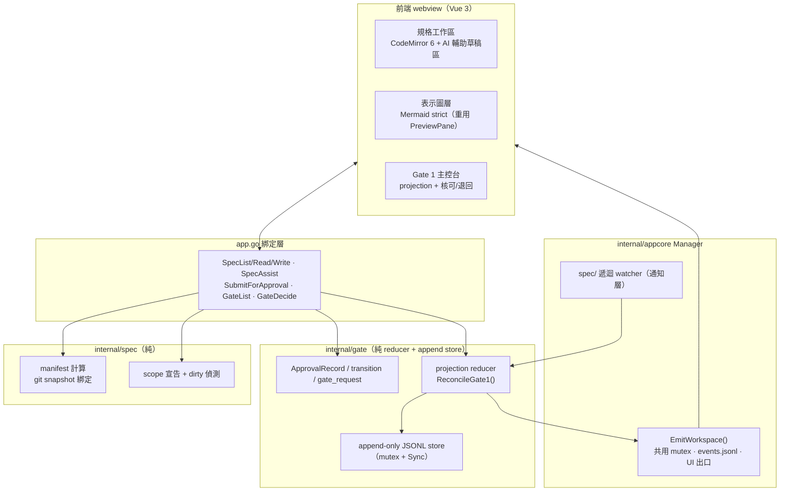

# M2 — Stage A 閉環設計

- 日期：2026-08-11
- 狀態：設計定稿（待 writing-plans 展開實作計畫）
- 上游依據：`docs/architecture/sdlc-workbench-app-plan.md` §4、§5.2–5.4、§7（M2 列）；`docs/architecture/sdlc-ai-agent-automation-plan.md` §3–4
- 前置里程碑：M0 ✅、M1 ✅、M1.5 ✅（雙 provider session 並存、重啟恢復、單 Manager 多 slot、檔案級 `event_id` 單調不變量）

---

## 1. 目標與成功條件

M2 交付 **Stage A 閉環**：規格編輯 → AI 輔助 → 送核 → Gate 1 核可（綁 spec manifest digest ＋ base commit）→ 核可後規格變更觸發 STALE 失效。

- **SC1 規格工作流閉環**：在 app 內編輯規格 → 送核 → Gate 1 核可；核可後規格再變更觸發 STALE。
- **SC3（Gate 1 範圍）核可可稽核**：每筆核可含 approver、decision、reason 與完整 bindings，事後可重建「誰在何時對哪個版本核可、該核可現在是否仍有效」。

**明確不含**（維持 plan 邊界，不宣稱完整任務路徑）：Gate 2、Test Contract Approval、Gate 3/4、forge adapter、任務 DAG。這些延至 M3+。

### 1.1 本輪三個 scope 決策（owner 2026-08-11 拍板）

1. **UI 改版不進 M2**：memory 兩張截圖的視覺改版排成 Stage A 落地後的獨立 polish pass。理由：Stage A 閉環是可獨立驗收的確定性資料流，混入視覺改版會把兩種性質包成一張票、藏起不確定性。
2. **三個 AI 輔助動作全進 M2**（照 plan）：草擬 Gherkin、歧義偵測、oracle 覆蓋檢查。
3. **context-map/ 納進 manifest**：`spec_manifest` 涵蓋 `spec/` 納管全樹 = `features/` + `nfr/` + `glossary.md` + `context-map/`；不新增 `context_map` binding kind，仍由單一 `spec_manifest` 綁定。這修正 app-plan §5.3 gate1 binding 的漏列措辭（漏列，非排除）。表示圖採獨立圖層但只做瀏覽／監看／重渲染，不擴成圖形編輯器。

---

## 2. 架構與模組分解

沿用既有 `internal/` ports & adapters 佈局（`contract`、`ports`、`appcore`、provider adapters）。新增兩個純確定性 domain package，與一組 app.go 綁定。



- **`internal/spec`**：canonical manifest 計算、納管 scope 宣告、dirty-tree 偵測。核心為純函式（給定 file bytes → digest），I/O 邊界薄。
- **`internal/gate`**：`ApprovalRecord`（immutable）、`approval_transition`、`gate_request`、projection reducer（`ReconcileGate1()`）、append-only JSONL store。reducer 純函式。
- **`internal/appcore` Manager 擴充**：`EmitWorkspace()` 走既有 mutex／`events.jsonl`／UI 出口，維持檔案級 `event_id` 順序；spec/ 遞迴 watcher（通知層）。
- **app.go 綁定**：`SpecList/SpecRead/SpecWrite`、`SpecAssist`、`SubmitForApproval`、`GateList`、`GateDecide`。

owner 已確認**不需再改整體模組分層**。

---

## 3. 資料契約（實作前凍結）

沿用 app-plan §5.3，並納入本輪 4 個 P1 契約補強。

### 3.1 記錄型別

**ApprovalRecord**（決定本身 immutable）：

```
approval_id   ULID（重用 contract.NewULID）
gate          gate1
decision      approved | rejected
approver      {id, method:"app-local"}
reason        string（rejected 必填；approved 建議填）
bindings      [{kind, ref, digest}]  # gate1 必填：spec_manifest + base_commit
created_at    RFC3339
```

**gate_request**（pending 擁有權，P1-4）：`{approval_id, gate:"gate1", spec_manifest, base_commit, created_at}`。SubmitForApproval 先配置 `approval_id`、append `gate_request`，並以同一 ID 發 envelope。

**approval_transition**（失效／取代，append-only）：`{approval_id, to: stale | superseded, at, cause, evidence_ref}`。目前狀態（active / stale / superseded）一律由 record + transitions 重算的 projection，UI 只顯示 projection，稽核檔永遠只追加。

### 3.2 P1-1：STALE 必須「重算後持久化」，非僅回傳衍生狀態

Watcher 與 GateList 共用唯一入口 **`ReconcileGate1()`**：

1. 重算目前 `spec_manifest`。
2. 在 gate store mutex 內重新確認該核可仍為 active。
3. digest 不同時，**只允許 append 一次** `(approval_id, stale)` transition。
4. transition durable（append + `Sync()`）成功後，才經統一事件出口發布 `binding_stale`。
5. digest 即使改回原值，已 stale 的核可**不復活**。

因此 **GateList 是「讀取並 reconciliation」，不是純 read**。Watcher 漏事件時，下一次讀取仍補齊 transition 與稽核閉環；兩者併發時**必須只有一筆 transition**（mutex 內 active 檢查保證）。

**凍結補充**：
- Gate 1 **只比較 `spec_manifest`**；`base_commit` 是歷史重建錨點，**不與目前 HEAD 持續比較**（否則任何後續實作 commit 都會誤觸 Gate 1 STALE）。
- manifest 重算失敗時 **fail closed**：不得回 active；但**暫時性 I/O 錯誤不得直接永久 append stale**（區分 digest-mismatch 與 read-error：前者才 append stale，後者回錯誤讓 UI 顯示「無法判定」）。
- watcher 錯誤**只影響即時通知**，不影響權威判定。

### 3.3 P1-2：Gate event 必須有 workspace event lane

`approval_decision` 已存在於 `event.go`（`KindApprovalDecision`），目前語意是 **provider 工具核可決定**，不可當新 kind 重複加入。且目前前端 `providerOf()`（session.ts）把所有**非 codex** envelope 路由到 Claude view——gate event 無 scope 會汙染 Claude timeline。

**凍結**：
- Envelope **additive 新增 `scope: session | workspace`**；舊事件缺值視為 `session`。
- workspace event **不進** session reducer／totals／provider view，改進獨立 gate store。
- gate event 帶 **typed payload ＋ bindings**（additive 欄位），**不得**把 approval ID／decision／reason 塞進 `Text`。
- 由 **`Manager.EmitWorkspace()`** 共用既有 mutex、`events.jsonl` 與 UI 出口，維持檔案級 `event_id` 順序。
- Gate 1 沿用 `approval_decision`，靠 `scope=workspace` ＋ payload 區分（貼近已凍結文件，不另加 `gate_decision`）。
- 至少一條 **`TestWorkspaceGateEventDoesNotEnterProviderViews`**。

### 3.4 P1-3：Manifest snapshot 與 scope 防 TOCTOU

**Manifest 規則**：
- path 用 **repo-relative `/`**、**byte-order 排序**、對 **raw bytes 取 SHA-256**、canonical JSON **不含時間欄位**。
- **`scope_version` 與實際 path patterns 必須進 canonical 內容**；否則改 scope 就能排除檔案而不觸發 STALE。
- **M2 固定 scope**（`spec/` 全樹，不做使用者自訂）；若未來採設定檔，**設定檔本身必須無條件納管**。
- symlink、submodule、非 regular file **拒絕**，不追蹤到 workspace 外。

**送核從同一 Git snapshot 建 manifest**：
1. 讀 `HEAD₁`。
2. 確認納管範圍 staged／unstaged／untracked 皆乾淨（dirty 則拒送）。
3. 從 `HEAD₁` tree 讀檔計算 manifest。
4. 再讀 `HEAD₂`，不同則重試或拒絕。

如此 `spec_manifest` 與 `base_commit` 不會來自兩個瞬間。

### 3.5 P1-4：Gate request 的 durable ownership

- `SubmitForApproval` 先配 `approval_id`、append `gate_request`、以同一 ID 發 envelope。
- `GateList` 以「有 request、尚無 ApprovalRecord」重建 pending（重啟後仍在）。
- `GateDecide` 只能對 pending ID **寫入一次** ApprovalRecord；雙擊／併發只有一個成功。
- `rejected` 必填 `reason`。
- 新的 approved Gate 1 決定成立時，先前仍 active 的 approved record **必須 append `superseded`**，維持每個 workspace **至多一個 active Gate 1 approval**。
- Store 寫入：**單一 mutex、完整一行 append、`Sync()`、錯誤 fail loud**。

---

## 4. STALE 策略（雙層：權威重算 ＋ watcher 通知）

- **權威層**：任何讀 Gate projection 的動作走 `ReconcileGate1()`，當場重算納管樹 manifest digest 與 active 核可綁定 digest 比對——projection **永不信任快取的 active**。保證 watcher 漏事件時 STALE 契約仍成立。
- **通知層**：fsnotify **遞迴**監看 `spec/` 全樹（含 `context-map/`），debounce 後觸發 `ReconcileGate1()` 並推 UI 徽章即時亮。**只重用 `watchDiagram` 的概念，不複製**——現有版本只監看單一 parent、吞掉 watcher/add/read 錯誤、無 shutdown close；M2 watcher 需處理新增目錄遞迴、rename/remove、debounce、close lifecycle 與 fail-loud。

替代方案（只做 watcher／只做 on-open）皆被否決：前者漏事件即漏 STALE，後者不即時。雙層把正確性交給讀取重算、即時性交給 watcher。

---

## 5. 前端三面 ＋ 邊界處置

### 5.1 規格工作區
- **CodeMirror 6**（新增前端相依）編輯納管檔，Gherkin 語法標示。
- **SpecWrite**（P1 補充）：**不沿用 `resolveInWorkspace()`**（其 `EvalSymlinks` 對不存在新檔會失敗）。改為**驗證 canonical parent → atomic rename 寫入**，並帶 **`expected_digest`** 防止覆蓋編輯期間的外部變更。
- **SpecAssist**（P1 補充，correlation 契約）：M2 用**目前選定 provider 的正常、可稽核 turn**，busy 時**拒絕**；以 additive **`correlation_id` / `purpose=spec_assist`** 把串流輸出導向草稿區。**此 turn 會進 provider context，spec 明寫**；獨立隱藏 session 會擴大 M1.5 session 模型，不放 M2。三個動作（草擬 Gherkin／歧義偵測／oracle 覆蓋檢查）皆走此契約。
- **AI 輔助邊界**：輸出一律進草稿區、**不直接寫檔**，由人 accept 才落檔。

### 5.2 表示圖層
獨立圖層，重用 PreviewPane 的 Mermaid ＋ `securityLevel:'strict'`（既有設定可直接延續），監看 `context-map/` 自動重渲染。M2 只瀏覽／監看／重渲染。

### 5.3 Gate 1 主控台
待辦（gate 種類、bindings、證據連結）、核可／退回 ＋ 理由欄、STALE 徽章 ＋ 通知，動作寫 ApprovalRecord，顯示 projection。

### 5.4 其他邊界
- **git identity 取不到時拒絕核可並提示設定**，不生成假 approver ID。
- approver：`id` 預設取 git `user.name`/`user.email`，`method="app-local"`。

---

## 6. 資料存放（§5.4）

- ApprovalRecord + transitions + gate_request → `.workbench/` 內 append-only JSONL（第 2 層 app state、gitignored）。
- manifest 可由 git 歷史重建，不落庫。
- 效力邊界：本機稽核契約，**非平台 enforcement**；防竄改（稽核檔簽章）不在 M2 scope。

---

## 7. 驗證策略

**確定性核心**走嚴格 oracle 單元測試：
- manifest 演算法（排序、raw bytes SHA-256、canonical JSON 無時間欄、scope_version 進 canonical、symlink/submodule 拒絕）。
- dirty-tree 拒送、同一 snapshot 綁定（TOCTOU 重試）。
- projection reducer（active/stale/superseded 重算、stale 不復活）。
- binding 必填驗證、pending 至多一次寫入、每 workspace 至多一 active、supersede。

**併發／重啟／fail-closed（P1 補充三條）**：
- watcher 與 GateList barrier 併發 → **只產生一筆 stale transition**。
- 重啟後 **pending request 與 stale projection 都能重建**。
- 人為漏掉 watcher 通知後呼叫 GateList → **仍 fail closed 並補齊 durable transition**。

**routing 隔離**：`TestWorkspaceGateEventDoesNotEnterProviderViews`。

**AI 輔助**只驗「草稿正確產進草稿區、可編輯、由人決定」，**不驗 AI 內容對錯**（AI 輸出品質無法確定性驗收）。

**live 閉環驗收**：編輯 → 送核 → Gate 1 核可 → 改檔觸發 STALE，一路在 app 內完成並可稽核重建。

---

## 8. 風險與待驗證假設

1. **fsnotify 跨編輯器行為**：atomic save／rename 可能產生 remove+create；debounce ＋ 遞迴 re-add ＋ 讀取重算為權威，緩解但需 macOS 實測。
2. **CodeMirror 6 整合成本**：新前端相依與打包體積未實測。
3. **SpecAssist turn 進 provider context**：會佔用當前 session context window，busy 拒絕已緩解，但長規格可能吃 context；M2 接受此取捨並明寫。
4. **git snapshot 綁定的實作路徑**：從 `HEAD` tree 讀檔（`go-git` 或 `git cat-file`）vs 工作區讀檔的取捨，於 writing-plans 定案；工作區讀檔須配 clean 檢查 ＋ HEAD₁/HEAD₂ 一致確認。
5. **效力邊界**：Gate 記錄為本機稽核，不具平台強制力，對外描述不得包裝成 enforcement（同 §5.3、自動化規劃 §6.3）。
