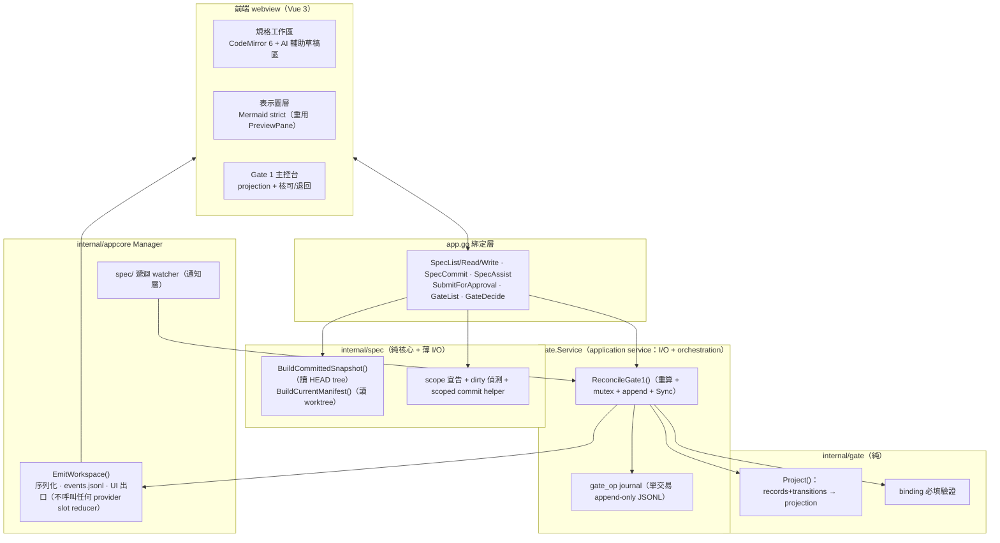

# M2 — Stage A 閉環設計

- 日期：2026-08-11
- 狀態：設計定稿 rev2（納入第二輪 closure review 的 4 個 P1 ＋ 5 個 P2；待短 closure review 後進 writing-plans）
- 上游依據：`docs/architecture/sdlc-workbench-app-plan.md` §4、§5.2–5.4、§7（M2 列）；`docs/architecture/sdlc-ai-agent-automation-plan.md` §3–4
- 前置里程碑：M0 ✅、M1 ✅、M1.5 ✅（雙 provider session 並存、重啟恢復、單 Manager 多 slot、檔案級 `event_id` 單調不變量）

---

## 1. 目標與成功條件

M2 交付 **Stage A 閉環**：規格編輯 → AI 輔助 → **scoped commit** → 送核 → Gate 1 核可（綁 spec manifest digest ＋ base commit）→ 核可後規格變更觸發 STALE 失效。

- **SC1 規格工作流閉環**：在 app 內編輯規格 → **在 app 內對納管路徑 commit** → 送核 → Gate 1 核可；核可後規格再變更觸發 STALE。**全程不離開 app** 成立，因為 commit 動作內建（見 §3.4a）。
- **SC3（Gate 1 範圍）核可可稽核**：每筆核可含 approver、decision、reason 與完整 bindings，事後可重建「誰在何時對哪個版本核可、該核可現在是否仍有效」。

**明確不含**（維持 plan 邊界，不宣稱完整任務路徑）：Gate 2、Test Contract Approval、Gate 3/4、forge adapter、任務 DAG。這些延至 M3+。

### 1.1 本輪三個 scope 決策（owner 2026-08-11 拍板）

1. **UI 改版不進 M2**：memory 兩張截圖的視覺改版排成 Stage A 落地後的獨立 polish pass。理由：Stage A 閉環是可獨立驗收的確定性資料流，混入視覺改版會把兩種性質包成一張票、藏起不確定性。
2. **三個 AI 輔助動作全進 M2**（照 plan）：草擬 Gherkin、歧義偵測、oracle 覆蓋檢查。
3. **context-map/ 納進 manifest**：`spec_manifest` 涵蓋納管全樹；不新增 `context_map` binding kind，仍由單一 `spec_manifest` 綁定。修正 app-plan §5.3 gate1 binding 的漏列措辭（漏列，非排除）。表示圖採獨立圖層但只做瀏覽／監看／重渲染。

### 1.2 納管範圍（path pattern，凍結）

M2 固定 scope，不做使用者自訂。納管四組 pattern：

```
spec/features/**
spec/nfr/**
spec/glossary.md
spec/context-map/**
```

`scope_version` 與上述 pattern 清單一律進 canonical manifest 內容（見 §3.4）。全文「spec/ 全樹」一律指上述四組 pattern 的聯集。

---

## 2. 架構與模組分解

沿用既有 `internal/` ports & adapters 佈局。新增：**純 domain package `internal/spec`、`internal/gate`（`gate.Project()` 為純函式）**，與**帶 I/O／orchestration 的 application service `gate.Service`（或置 `internal/appcore`）**，加一組 app.go 綁定。



- **`internal/spec`**：manifest 計算（純：file bytes → digest）＋兩個明確分開的 I/O 入口（§3.4）＋ dirty 偵測 ＋ scoped commit helper。
- **`internal/gate`（純）**：`ApprovalRecord`／`approval_transition`／`gate_request` 型別、`Project()`（records+transitions → projection）、binding 必填驗證。**無 I/O**。
- **`gate.Service`（application service）**：`ReconcileGate1()` 等有 I/O 與 orchestration 的動作，透過 injected ports 存取 manifest 計算與 journal store。**P2 修正：`ReconcileGate1()` 不是 pure reducer**，故不放純 package。
- **`internal/appcore` Manager 擴充**：`EmitWorkspace()` 走既有 mutex／`events.jsonl`／UI 出口、維持檔案級 `event_id` 順序，**不呼叫任何 provider slot reducer**；spec/ 遞迴 watcher（通知層）。
- **app.go 綁定**：`SpecList/SpecRead/SpecWrite/SpecCommit`、`SpecAssist`、`SubmitForApproval`、`GateList`、`GateDecide`。

owner 已確認**不需再改整體模組分層**。

---

## 3. 資料契約（實作前凍結）

### 3.1 記錄型別

**ApprovalRecord**（決定本身 immutable）：

```
approval_id   ULID（重用 contract.NewULID）
gate          gate1
decision      approved | rejected
approver      {id, method:"app-local"}
reason        string（rejected 必填；approved 建議填）
bindings      [{kind, ref, digest}]  # gate1 必填：spec_manifest + base_commit
created_at    RFC3339
```

**gate_request**（pending 擁有權，P1-4）：`{approval_id, gate:"gate1", spec_manifest_digest, base_commit, created_at}`。

**approval_transition**（失效／取代，append-only）：`{approval_id, to: stale | superseded, at, cause, evidence_ref}`。目前狀態一律由 `gate.Project(records, transitions)` 重算的 projection，UI 只顯示 projection，稽核檔永遠只追加。

### 3.2 P1-4：GateDecide 單一 journal transaction（crash consistency）

一個 approved Gate 1 決定需同時：(a) 寫新 ApprovalRecord、(b) 把舊 active approved 標 `superseded`。兩筆分開寫、process 中途退出會留下兩個 active 或先失效舊核可卻無新決定。**凍結為單一交易**：

```
gate_op {
  op_id        ULID
  at           RFC3339
  records      [ApprovalRecord | approval_transition, ...]   # 本次操作的所有記錄
}
```

- 整個 operation 以**單一 JSONL line、單次 lock／write／`Sync()`** 提交；**只有 `Sync()` 成功後 `GateDecide` 才回成功**。
- **載入容錯**：僅容忍 **malformed final line** 並 fail loud（視為未完成的最後一筆、忽略）；**中段 malformed 必須拒絕載入**（fail loud，不猜測）。
- `SubmitForApproval` 亦以一筆 `gate_op`（含 `gate_request`）提交。
- `GateDecide` 對 pending ID 只能成功一次；雙擊／併發只有一個成功（op 在 lock 內先確認 pending 仍存在且無對應 ApprovalRecord）。`rejected` 必填 `reason`。
- 維持每個 workspace **至多一個 active Gate 1 approval**。

### 3.3 P1-1：STALE 必須「重算後持久化」

Watcher 與 GateList 共用唯一入口 **`ReconcileGate1()`**：

1. `BuildCurrentManifest()` 重算目前 worktree 的 `spec_manifest`（§3.4b）。
2. 在 gate journal mutex 內重新確認該核可仍為 active。
3. digest 不同時，**只允許 append 一次** `(approval_id, stale)` transition（以一筆 `gate_op` 提交、`Sync()`）。
4. transition durable 成功後，才經 `EmitWorkspace()` 發布 `binding_stale`。
5. digest 即使改回原值，已 stale 的核可**不復活**。

因此 **GateList 是「讀取並 reconciliation」，非純 read**。Watcher 漏事件時，下一次讀取仍補齊 transition 與稽核閉環；兩者併發時**必須只有一筆 transition**（mutex 內 active 檢查保證）。

**凍結補充**：
- Gate 1 **只比較 `spec_manifest`**；`base_commit` 是歷史重建錨點，**不與目前 HEAD 持續比較**（否則任何後續實作 commit 都會誤觸 Gate 1 STALE）。
- **fail-closed 分流**：digest-mismatch → append stale；**read-error（暫時性 I/O）→ 回傳錯誤、UI 顯示「無法判定」，不得回 active、不得永久 append stale**。
- **P2：transition durable 後 `EmitWorkspace()` 失敗的語意**——gate journal 仍為權威、projection 仍 stale、`ReconcileGate1()` 回傳 fail-loud error；workspace envelope 是通知／統一事件鏡像，**不回滾 transition**。
- watcher 錯誤**只影響即時通知**，不影響權威判定。

### 3.4 P1-3 / P1-2：Manifest snapshot 與 workspace event（防 TOCTOU、凍結 JSON）

#### 3.4a 送核 snapshot：一律讀 committed HEAD tree（P1-2 修正）

**送核的 manifest 一律從 Git object database 的 `HEAD` tree 讀取，不讀 worktree**——只做 clean check ＋ HEAD₁/HEAD₂ 無法防止外部編輯器在 clean check 後改 worktree（HEAD 不變）。兩個 API 明確分離：

- **`BuildCommittedSnapshot(head)`**：從 `HEAD` tree（Git object DB）讀納管檔算 manifest ＋ base_commit。**送核只用此 API**。
- **`BuildCurrentManifest()`**：讀目前 worktree 算 manifest。**只有 STALE 重算用此 API**。

`SubmitForApproval` 流程：
1. 讀 `HEAD₁`。
2. 確認納管範圍 staged／unstaged／untracked 皆乾淨（dirty 則拒送，導使用者先走 `SpecCommit`）。
3. 從 `HEAD₁` tree（object DB）讀檔算 `spec_manifest`。
4. 再讀 `HEAD₂`，不同則重試或拒絕。
5. 以一筆 `gate_op`（含 `gate_request`）提交，並發 workspace envelope。

writing-plans 只決定 **go-git 或 `git cat-file`** 讀 object DB，**不得再選 worktree 讀檔**。

**SpecCommit（P1-1 解，app 內閉環）**：新增明確的 scoped commit 動作——**只處理 manifest 納管路徑**（§1.2 四組 pattern），先回傳 diff、由使用者於 app 內確認後才 commit。這涉及 Git 寫入權限與使用者可見流程，故在 spec 凍結、不留給 writing-plans 猜測。commit 訊息由 app 產生、可含使用者輸入摘要。

#### 3.4b Manifest 演算法（凍結）

- path 用 **repo-relative `/`**、**byte-order 排序**、對 **raw bytes 取 SHA-256**、canonical JSON **不含時間欄位**。
- **`scope_version` ＋ §1.2 path pattern 清單必須進 canonical 內容**；否則改 scope 就能排除檔案而不觸發 STALE。
- symlink、submodule、非 regular file **拒絕**，不追蹤到 workspace 外。

#### 3.4c Workspace event lane（P1-2，凍結 JSON shape）

`approval_decision` 已存在（`KindApprovalDecision`），語意為 **provider 工具核可**，不可當新 kind 重複加入。前端 `providerOf()`（session.ts）把所有非 codex envelope 路由到 Claude view——gate event 無 scope 會汙染 Claude timeline。**凍結**：

- Envelope **additive 新增 `scope: "session" | "workspace"`**；舊事件缺值視為 `session`。
- **`scope=session`**：`provider` 必須為 `claude|codex`（維持現狀）。
- **`scope=workspace`**：`provider` 與 `session_id` **省略（omit）**。
- **`App.vue` 必須先依 `scope` 分流**：`scope=workspace` → gate store，**不得**進 `s.apply()`／`providerOf()`。
- gate event 帶 **typed payload**（additive `payload` 欄位，`json.RawMessage`），**不得**把 approval ID／decision／reason 塞進 `Text`。
- **`correlation_id`／`purpose` 為 Envelope 頂層 additive 欄位**（`omitempty`），用於 `scope=session` 的 SpecAssist 串流關聯（見 §5.1）；gate event 不使用。
- 由 **`Manager.EmitWorkspace()`** 共用既有 mutex、`events.jsonl`、UI 出口，維持檔案級 `event_id` 順序，**不呼叫任何 provider slot reducer**。

三種 workspace event 的完整 JSON（頂層省略 `provider`/`session_id`；`kind`/`payload` 必填）：

```jsonc
// 1) 送核請求
{ "event_id":"01J...", "ts":"2026-08-11T06:42:00Z", "scope":"workspace",
  "kind":"approval_decision",
  "payload":{ "sub":"gate_request", "approval_id":"01J...", "gate":"gate1",
              "spec_manifest_digest":"sha256:...", "base_commit":"abc123",
              "bindings":[{"kind":"spec_manifest","ref":"spec/","digest":"sha256:..."},
                          {"kind":"base_commit","ref":"HEAD","digest":"abc123"}] } }

// 2) 核可決定
{ "event_id":"01J...", "ts":"...", "scope":"workspace",
  "kind":"approval_decision",
  "payload":{ "sub":"decision", "approval_id":"01J...", "gate":"gate1",
              "decision":"approved", "approver":{"id":"eason_tseng","method":"app-local"},
              "reason":"", "bindings":[ ... ] } }

// 3) 綁定失效
{ "event_id":"01J...", "ts":"...", "scope":"workspace",
  "kind":"binding_stale",
  "payload":{ "approval_id":"01J...", "to":"stale", "cause":"spec_manifest changed",
              "evidence_ref":"sha256:<new-digest>" } }
```

**bindings 驗證**：`kind ∈ {spec_manifest, base_commit}`；gate1 兩者皆必填、**各至多一筆**（重複 kind 拒絕）；`digest` 格式 `sha256:<hex>`（base_commit 為 commit SHA）。

### 3.5 P1-4：Gate request 的 durable ownership

- `SubmitForApproval` 先配 `approval_id`、以 `gate_op` append `gate_request`、以同一 ID 發 envelope。
- `GateList` 以「有 `gate_request`、尚無對應 `ApprovalRecord`」重建 pending（重啟後仍在）。
- `GateDecide` 對 pending ID **寫入一次** ApprovalRecord（§3.2 交易語意）。
- 新 approved 成立時，先前 active approved **必須於同一 `gate_op` append `superseded`**（原子維持至多一 active）。

---

## 4. STALE 策略（雙層：權威重算 ＋ watcher 通知）

- **權威層**：任何讀 Gate projection 的動作走 `ReconcileGate1()`，`BuildCurrentManifest()` 當場重算並與 active 核可綁定 digest 比對——projection **永不信任快取的 active**。保證 watcher 漏事件時 STALE 契約仍成立。
- **通知層**：fsnotify **遞迴**監看 §1.2 納管樹（含 `context-map/`），debounce 後觸發 `ReconcileGate1()` 並推 UI 徽章。**只重用 `watchDiagram` 的概念，不複製**——現有版本只監看單一 parent、吞掉 watcher/add/read 錯誤、無 shutdown close；M2 watcher 需處理新增目錄遞迴 re-add、rename/remove、debounce、close lifecycle 與 fail-loud。

替代方案（只做 watcher／只做 on-open）皆被否決：前者漏事件即漏 STALE，後者不即時。

---

## 5. 前端三面 ＋ 邊界處置

### 5.1 規格工作區
- **CodeMirror 6**（新增前端相依）編輯納管檔，Gherkin 語法標示。
- **SpecWrite**（P1）：**不沿用 `resolveInWorkspace()`**（其 `EvalSymlinks` 對不存在新檔會失敗）。改為**驗證 canonical parent → atomic rename 寫入**，並帶 **`expected_digest`** optimistic concurrency，防止覆蓋編輯期間的外部變更。
- **SpecCommit**：見 §3.4a——只 commit 納管路徑、先顯示 diff、使用者確認。
- **SpecAssist correlation 生命週期（P2，凍結）**：
  - M2 用**目前選定 provider 的正常、可稽核 turn**，busy 時**拒絕**。
  - **配置時機**：`SpecAssist` 呼叫時配 `correlation_id` ＋ `purpose="spec_assist"`。
  - **繼承範圍**：該 turn 的 `init`/`delta`/`message`/`result` envelope（`scope=session`）皆帶同一 `correlation_id`。
  - **清除時機**：`result` 或 abort 到達時清除 correlation 綁定。
  - **可見性**：此 turn 是真實可稽核 turn，**照常進一般 Chat／Timeline**（不隱藏）；草稿區**額外**依 `correlation_id` 鏡像同一串流輸出。獨立隱藏 session 會擴大 M1.5 session 模型，不放 M2；此 turn 佔用當前 session context，spec 明寫。
- **AI 輔助邊界**：輸出一律進草稿區、**不直接寫檔**，由人 accept 才落檔（accept 後走 SpecWrite）。

### 5.2 表示圖層
獨立圖層，重用 PreviewPane 的 Mermaid ＋ `securityLevel:'strict'`（既有設定可直接延續），監看 `context-map/` 自動重渲染。M2 只瀏覽／監看／重渲染。

### 5.3 Gate 1 主控台
待辦（gate 種類、bindings、證據連結）、核可／退回 ＋ 理由欄、STALE 徽章 ＋ 通知，動作寫 ApprovalRecord，顯示 projection。

### 5.4 其他邊界
- **git identity 取不到時拒絕核可並提示設定**，不生成假 approver ID。
- approver：`id` 預設取 git `user.name`/`user.email`，`method="app-local"`。

---

## 6. 資料存放（§5.4）

- `gate_op` journal（含 ApprovalRecord／transition／gate_request）→ `.workbench/` 內 append-only JSONL（第 2 層 app state、gitignored）。
- manifest 可由 git 歷史重建，不落庫。
- 效力邊界：本機稽核契約，**非平台 enforcement**；防竄改（稽核檔簽章）不在 M2 scope。

---

## 7. 驗證策略

**確定性核心**走嚴格 oracle 單元測試：
- manifest 演算法（排序、raw bytes SHA-256、canonical JSON 無時間欄、`scope_version`＋pattern 進 canonical、symlink/submodule/非 regular 拒絕）。
- `BuildCommittedSnapshot` 只讀 object DB；dirty-tree 拒送、HEAD₁/HEAD₂ 一致重試。
- `gate.Project()`（active/stale/superseded 重算、stale 不復活）、binding 必填 ＋ 重複 kind 拒絕。

**併發／重啟／crash（P1 barrier 測試）**：
- watcher 與 GateList 併發 → **只產生一筆 stale transition**。
- 兩個 `GateDecide` 併發 → **恰一個成功**，重啟後**至多一個 active approval**。
- 重啟後 **pending request 與 stale projection 都能重建**；中段 malformed journal line **拒絕載入**、final malformed line 容忍 ＋ fail loud。
- 人為漏掉 watcher 通知後呼叫 GateList → **仍 fail closed 並補齊 durable transition**。

**routing 隔離**：`TestWorkspaceGateEventDoesNotEnterProviderViews`。

**AI 輔助**只驗「草稿正確產進草稿區、可編輯、由人決定」，**不驗 AI 內容對錯**。

**live 閉環驗收**：編輯 → **SpecCommit** → 送核 → Gate 1 核可 → 改檔觸發 STALE，一路在 app 內完成並可稽核重建。

**writing-plans 最終 gate（P2）**：除 M2 新測試外，必須含既有 **Go `-race` 全套**、**前端 44 個 vitest**、**frontend/Wails build**，避免回歸。

---

## 8. 風險與待驗證假設

1. **fsnotify 跨編輯器行為**：atomic save／rename 可能產生 remove+create；debounce ＋ 遞迴 re-add ＋ 讀取重算為權威，緩解但需 macOS 實測。
2. **CodeMirror 6 整合成本**：新前端相依與打包體積未實測。
3. **SpecAssist turn 進 provider context**：佔用當前 session context window，busy 拒絕已緩解，長規格可能吃 context；M2 接受此取捨並明寫（§5.1）。
4. **committed-snapshot 讀取實作**：go-git vs `git cat-file` 讀 HEAD tree 的取捨於 writing-plans 定案；**不含 worktree 讀檔選項**（§3.4a 已凍結）。SpecCommit 的 Git 寫入以既有 workspace 為 repo，權限與失敗處置於 writing-plans 細化。
5. **效力邊界**：Gate 記錄為本機稽核，不具平台強制力，對外描述不得包裝成 enforcement（同 §5.3、自動化規劃 §6.3）。
