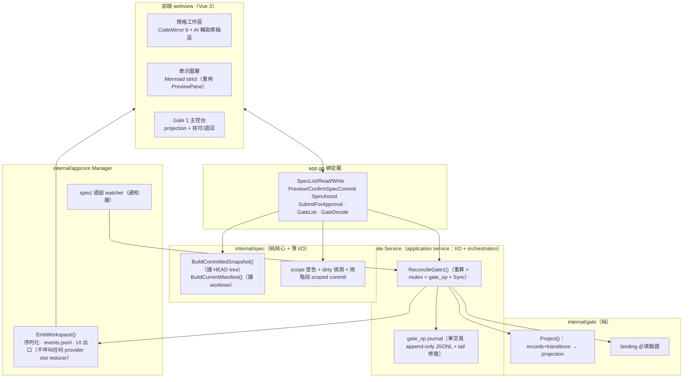

# M2 — Stage A 閉環設計

- 日期：2026-08-11
- 狀態：設計定稿 rev3（第三輪 closure review：閉合 workspace event kind／SpecCommit 兩階段／journal tail 修復／SpecAssist no-tools）
- 上游依據：`docs/architecture/sdlc-workbench-app-plan.md` §4、§5.2–5.4、§7（M2 列）；`docs/architecture/sdlc-ai-agent-automation-plan.md` §3–4
- 前置里程碑：M0 ✅、M1 ✅、M1.5 ✅（雙 provider session 並存、重啟恢復、單 Manager 多 slot、檔案級 `event_id` 單調不變量）

---

## 1. 目標與成功條件

M2 交付 **Stage A 閉環**：規格編輯 → AI 輔助 → **scoped commit** → 送核 → Gate 1 核可（綁 spec manifest digest ＋ base commit）→ 核可後規格變更觸發 STALE 失效。

- **SC1 規格工作流閉環**：在 app 內編輯規格 → **在 app 內對納管路徑 commit** → 送核 → Gate 1 核可；核可後規格再變更觸發 STALE。**全程不離開 app** 成立（commit 動作內建，§3.4a）。
- **SC3（Gate 1 範圍）核可可稽核**：每筆核可含 approver、decision、reason 與完整 bindings，事後可重建「誰在何時對哪個版本核可、該核可現在是否仍有效」。

**明確不含**（維持 plan 邊界）：Gate 2、Test Contract Approval、Gate 3/4、forge adapter、任務 DAG。延至 M3+。

### 1.1 本輪三個 scope 決策（owner 2026-08-11 拍板）

1. **UI 改版不進 M2**：memory 兩張截圖的視覺改版排成 Stage A 落地後的獨立 polish pass。
2. **三個 AI 輔助動作全進 M2**（照 plan）：草擬 Gherkin、歧義偵測、oracle 覆蓋檢查（受 §5.1 no-tools 前置條件約束）。
3. **context-map/ 納進 manifest**：`spec_manifest` 涵蓋納管全樹；不新增 `context_map` binding kind，仍由單一 `spec_manifest` 綁定。表示圖採獨立圖層但只做瀏覽／監看／重渲染。

### 1.2 納管範圍（path pattern，凍結）

M2 固定 scope，不做使用者自訂。納管四組 pattern：

```
spec/features/**
spec/nfr/**
spec/glossary.md
spec/context-map/**
```

`scope_version` 與上述 pattern 清單一律進 canonical manifest 內容（§3.4b）。全文「spec/ 全樹」一律指上述四組 pattern 的聯集。

---

## 2. 架構與模組分解

沿用既有 `internal/` ports & adapters 佈局。新增：**純 domain package `internal/spec`、`internal/gate`（`gate.Project()` 純函式）**，**帶 I/O／orchestration 的 application service `gate.Service`**，加一組 app.go 綁定。



- **`internal/spec`**：manifest 純計算 ＋ 兩個明確分開的 I/O 入口（§3.4）＋ dirty 偵測 ＋ 兩階段 scoped commit。
- **`internal/gate`（純）**：型別、`Project()`、binding 必填驗證。**無 I/O**。
- **`gate.Service`（application service）**：`ReconcileGate1()`、journal 交易與 tail 修復；透過 injected ports 存取 manifest 與 store。`ReconcileGate1()` 非 pure reducer，故不放純 package。
- **`internal/appcore` Manager 擴充**：`EmitWorkspace()` 走既有 mutex／`events.jsonl`／UI 出口、維持檔案級 `event_id` 順序，**不呼叫任何 provider slot reducer**；spec/ 遞迴 watcher（通知層）。
- **app.go 綁定**：`SpecList/SpecRead/SpecWrite`、`PreviewSpecCommit/ConfirmSpecCommit`、`SpecAssist`、`SubmitForApproval`、`GateList`、`GateDecide`。

owner 已確認**不需再改整體模組分層**。

---

## 3. 資料契約（實作前凍結）

### 3.1 記錄型別

**ApprovalRecord**（immutable）：

```
approval_id   ULID（重用 contract.NewULID）
gate          gate1
decision      approved | rejected
approver      {id, method:"app-local"}
reason        string（rejected 必填；approved 建議填）
bindings      [{kind, ref, digest}]   # gate1 必填：spec_manifest + base_commit
created_at    RFC3339
```

**gate_request**（pending 擁有權）：`{approval_id, gate:"gate1", spec_manifest_digest, base_commit, created_at}`。

**approval_transition**（append-only）：`{approval_id, to: stale | superseded, at, cause, evidence_ref}`。目前狀態一律由 `gate.Project(records, transitions)` 重算的 projection。

### 3.2 P1-4(rev2)：GateDecide 單一 journal transaction ＋ tail 修復

一個 approved Gate 1 決定需同時 (a) 寫新 ApprovalRecord、(b) 舊 active approved 標 `superseded`。**凍結為單一交易**：

```
gate_op {
  op_id    ULID
  at       RFC3339
  records  [ ApprovalRecord | approval_transition | gate_request, ... ]   # union 三型
}
```

- 整個 operation 以**單一 JSONL line、單次 lock／write／`Sync()`** 提交；**只有 `Sync()` 成功後 `GateDecide` 才回成功**。
- `SubmitForApproval` 亦以一筆 `gate_op`（含 `gate_request`）提交。
- `GateDecide` 對 pending ID 只能成功一次；併發只有一個成功（op 在 lock 內先確認 pending 仍存在且無對應 ApprovalRecord）。`rejected` 必填 `reason`。維持每 workspace **至多一個 active Gate 1 approval**。

**tail 修復流程（P1-3(rev3)，凍結）**——載入時容忍 malformed **final** line、拒絕 **中段** malformed；但「忽略 final」後不得直接 append（否則壞行變中段、下次啟動整份被拒）：

1. 保存／quarantine 壞掉的 tail 作證據。
2. `truncate` 回最後一個有效 JSONL offset。
3. `Sync()` 修復後才允許新 append。
4. 修復過程 fail loud；修復失敗 → journal 進 **read-only degraded mode，不得寫入**（UI 顯示降級、核可動作停用）。

### 3.3 P1-1(rev2)：STALE 必須「重算後持久化」

Watcher 與 GateList 共用唯一入口 **`ReconcileGate1()`**：

1. `BuildCurrentManifest()` 重算目前 worktree 的 `spec_manifest`（§3.4b）。
2. 在 gate journal mutex 內重新確認該核可仍為 active。
3. digest 不同時，**只允許 append 一次** `(approval_id, stale)` transition（一筆 `gate_op` ＋ `Sync()`）。
4. transition durable 成功後，才經 `EmitWorkspace()` 發布 `binding_stale`。
5. digest 即使改回原值，已 stale 的核可**不復活**。

**GateList 是「讀取並 reconciliation」，非純 read**。Watcher 漏事件時下一次讀取補齊；併發時**必只一筆 transition**（mutex 內 active 檢查保證）。

**凍結補充**：
- Gate 1 **只比較 `spec_manifest`**；`base_commit` 是歷史重建錨點，**不與目前 HEAD 持續比較**。
- **fail-closed 分流**：digest-mismatch → append stale；**read-error（暫時性 I/O）→ 回錯誤、UI 顯示「無法判定」，不得回 active、不得永久 append stale**。
- **`BuildCurrentManifest()` 掃描期間偵測到檔案集合或內容變動 → 回 `ErrConcurrentModification`，走 read-error 分支**，不以混合快照永久標 STALE（掃描前後各取一次納管檔清單＋mtime/size 指紋比對，不一致即重試或回錯）。
- **transition durable 後 `EmitWorkspace()` 失敗**：gate journal 仍權威、projection 仍 stale、`ReconcileGate1()` 回 fail-loud error；workspace envelope 是通知鏡像，**不回滾 transition**。
- watcher 錯誤**只影響即時通知**，不影響權威判定。

### 3.4 Manifest snapshot、SpecCommit 與 workspace event

#### 3.4a 送核 snapshot ＋ 兩階段 SpecCommit（P1-2(rev2)、P1-2(rev3)）

**送核 manifest 一律從 Git object database 的 `HEAD` tree 讀取，不讀 worktree**。兩 API 分離：

- **`BuildCommittedSnapshot(head)`**：從 `HEAD` tree（object DB）讀納管檔算 manifest ＋ base_commit。**送核只用此 API**。
- **`BuildCurrentManifest()`**：讀 worktree 算 manifest。**只有 STALE 重算用此 API**。

`SubmitForApproval`：讀 `HEAD₁` → 確認納管範圍 staged／unstaged／untracked 皆乾淨（dirty 則拒送、導向 SpecCommit）→ 從 `HEAD₁` tree 算 manifest → 再讀 `HEAD₂`，不同則重試或拒絕 → 以一筆 `gate_op`（含 `gate_request`）提交並發 workspace envelope。writing-plans 只選 **go-git 或 `git cat-file`** 讀 object DB，**不得選 worktree 讀檔**。

**兩階段 SpecCommit（P1-2(rev3)，凍結）**——保證「確認的 diff 就是實際 commit」，且 scope 外 index/worktree 完全不變：

- **`PreviewSpecCommit()`** → 回 `commit_token`，至少綁定 **HEAD object ID ＋ scoped diff digest**（僅 §1.2 納管路徑），並回傳 diff 供 app 內確認。
- **`ConfirmSpecCommit(token, message)`** → 重新驗證 token；**內容或 HEAD 改變即拒絕**（不得 commit 新內容）。
- 成功與失敗都必須保持 **scope 外的 index/worktree 完全不變**；既有 staged changes 不得被帶入、unstage 或改變。
- **若實作無法保證 index 隔離，則在任何 staged change 存在時 fail closed**（要求使用者先自行處理 staged 變更）。

#### 3.4b Manifest 演算法（凍結）

- path 用 **repo-relative `/`**、**byte-order 排序**、對 **raw bytes 取 SHA-256**、canonical JSON **不含時間欄位**。
- **`scope_version` ＋ §1.2 pattern 清單進 canonical 內容**。
- symlink、submodule、非 regular file **拒絕**。

#### 3.4c Workspace event lane（P1-2(rev2)、P1-1(rev3)，凍結 JSON）

前端 `providerOf()` 把非 codex envelope 路由到 Claude view——gate event 需 scope 隔離。**凍結**：

- Envelope **additive 新增**：`scope: "session" | "workspace"`；**`bindings`（頂層，對齊 app-plan §5.2 頂層 `bindings?`）**；`payload`（`json.RawMessage`）；`correlation_id`／`purpose`（`omitempty`，§5.1 用）。舊事件 `scope` 缺值視為 `session`。
- **`scope=session`**：`provider` 必為 `claude|codex`。
- **`scope=workspace`**：`provider` 與 `session_id` **省略**。
- **`App.vue` 先依 `scope` 分流**：`scope=workspace` → gate store，**不得**進 `s.apply()`／`providerOf()`。
- **三種 workspace event 各為明確 kind**：`gate_request`、`approval_decision`（沿用既有 kind 承載 workspace 決定，靠 `scope=workspace` 與現有 provider 工具核可區分）、`binding_stale`。**不再用 `payload.sub` 當 discriminator**。
- **`bindings` 放 Envelope 頂層**，`payload` 不重複保存 bindings。
- **digest 格式凍結**：`spec_manifest.digest = sha256:<64 hex>`；`base_commit.digest = git:<algorithm>:<完整 object id>`（如 `git:sha1:<40hex>`），**不得用短 SHA**；`ref` 為人類可讀參照（如 `spec/`、`HEAD`）。
- 由 **`Manager.EmitWorkspace()`** 共用既有 mutex、`events.jsonl`、UI 出口，維持 `event_id` 順序，**不呼叫任何 provider slot reducer**。

三種 event 的完整 JSON（頂層省略 `provider`/`session_id`；`bindings` 為頂層欄位）：

```jsonc
// 1) 送核請求（獨立 kind）
{ "event_id":"01J...", "ts":"2026-08-11T06:42:00Z", "scope":"workspace",
  "kind":"gate_request",
  "bindings":[ {"kind":"spec_manifest","ref":"spec/","digest":"sha256:<64hex>"},
               {"kind":"base_commit","ref":"HEAD","digest":"git:sha1:<40hex>"} ],
  "payload":{ "approval_id":"01J...", "gate":"gate1" } }

// 2) 核可決定（沿用 approval_decision，scope=workspace）
{ "event_id":"01J...", "ts":"...", "scope":"workspace",
  "kind":"approval_decision",
  "bindings":[ ... 同上兩筆 ... ],
  "payload":{ "approval_id":"01J...", "gate":"gate1", "decision":"approved",
              "approver":{"id":"eason_tseng","method":"app-local"}, "reason":"" } }

// 3) 綁定失效（獨立 kind）
{ "event_id":"01J...", "ts":"...", "scope":"workspace",
  "kind":"binding_stale",
  "payload":{ "approval_id":"01J...", "to":"stale", "cause":"spec_manifest changed",
              "evidence_ref":"sha256:<new-digest>" } }
```

**bindings 驗證**：`kind ∈ {spec_manifest, base_commit}`；gate1 兩者皆必填、**各至多一筆**（重複 kind 拒絕）。

### 3.5 Gate request 的 durable ownership

- `SubmitForApproval` 先配 `approval_id`、以 `gate_op` append `gate_request`、以同一 ID 發 envelope。
- `GateList` 以「有 `gate_request`、尚無對應 `ApprovalRecord`」重建 pending（重啟後仍在）。
- `GateDecide` 對 pending ID 寫一次 ApprovalRecord（§3.2 交易）。新 approved 成立時，先前 active approved **必須於同一 `gate_op` append `superseded`**（原子維持至多一 active）。

---

## 4. STALE 策略（雙層：權威重算 ＋ watcher 通知）

- **權威層**：任何讀 Gate projection 走 `ReconcileGate1()`，`BuildCurrentManifest()` 當場重算並比對——projection **永不信任快取的 active**。
- **通知層**：fsnotify **遞迴**監看 §1.2 納管樹，debounce 後觸發 `ReconcileGate1()`。**只重用 `watchDiagram` 概念**——現有版本只監看單一 parent、吞錯、無 shutdown close；M2 watcher 需遞迴 re-add 新目錄、處理 rename/remove、debounce、close lifecycle、fail-loud。

---

## 5. 前端三面 ＋ 邊界處置

### 5.1 規格工作區
- **CodeMirror 6**（新前端相依）編輯納管檔，Gherkin 語法標示。
- **SpecWrite**：**不沿用 `resolveInWorkspace()`**（`EvalSymlinks` 對不存在新檔失敗）。改為**驗證 canonical parent → atomic rename**，帶 **`expected_digest`** optimistic concurrency。
- **SpecCommit**：見 §3.4a 兩階段。

**SpecAssist（P1-4(rev3)，凍結；含前置可行性 gate）**：
- **no-tools 不變量**：`purpose=spec_assist` 一律以 **no-tools 能力**執行——**不能只靠 prompt 約束**。正常 turn 可能執行工具，僅「輸出進草稿」無法阻止 provider 改檔。
- **fail closed**：provider 無法對目前 session 套用 per-turn no-tools 時，SpecAssist **必須 fail closed，不得退回一般可寫工具權限**。
- **前置可行性（已知現況，需 live probe）**：現行 claude session（`internal/claude/session.go` `Config.args()`）**無** `--disallowed-tools`/`--allowed-tools` plumbing，且 session 是啟動時定 flag 的持久 multi-turn process；codex turn 僅帶 `approvalPolicy`（≠ no-tools）。**因此 M2 早期須先 live probe：同一 session 能否強制 per-turn no-tools**。**probe 失敗 → 回 plan gate 決定是否採隔離 one-shot session；writing-plans 不得自行擴張 M1.5 session 模型**。
- **correlation 生命週期**：`SpecAssist` 呼叫時配 `correlation_id` ＋ `purpose="spec_assist"`；**涵蓋該 turn 全部事件**（`init`/`delta`/`message`/`result`/**`state_change`/`stream_error`/abort**）；`result` 或 abort 時清除。
- **可見性**：此 turn 是可稽核 turn，照常進 Chat／Timeline；草稿區**額外**依 `correlation_id` 鏡像。佔用當前 session context，spec 明寫。
- **AI 輔助邊界**：輸出一律進草稿區、**不直接寫檔**，人 accept 後才走 SpecWrite。

### 5.2 表示圖層
獨立圖層，重用 PreviewPane 的 Mermaid ＋ `securityLevel:'strict'`，監看 `context-map/` 自動重渲染。只瀏覽／監看／重渲染。

### 5.3 Gate 1 主控台
待辦（gate 種類、bindings、證據連結）、核可／退回 ＋ 理由欄、STALE 徽章 ＋ 通知，動作寫 ApprovalRecord，顯示 projection。degraded mode（§3.2）時停用核可動作並顯示原因。

### 5.4 其他邊界
- **git identity 取不到時拒絕核可並提示設定**，不生成假 approver ID。
- approver：`id` 預設取 git `user.name`/`user.email`，`method="app-local"`。

---

## 6. 資料存放（§5.4）

- `gate_op` journal（含 ApprovalRecord／transition／gate_request）→ `.workbench/` append-only JSONL（第 2 層 app state、gitignored）。
- manifest 可由 git 歷史重建，不落庫。
- 效力邊界：本機稽核契約，**非平台 enforcement**；防竄改不在 M2 scope。

---

## 7. 驗證策略

**確定性核心 oracle 單元測試**：
- manifest 演算法（排序、raw bytes SHA-256、canonical JSON 無時間欄、`scope_version`＋pattern 進 canonical、symlink/submodule/非 regular 拒絕）。
- `BuildCommittedSnapshot` 只讀 object DB；dirty-tree 拒送、HEAD₁/HEAD₂ 一致重試。
- `BuildCurrentManifest` 掃描期間變動 → `ErrConcurrentModification` → read-error 分支（非永久 STALE）。
- `gate.Project()`（active/stale/superseded 重算、stale 不復活）、binding 必填 ＋ 重複 kind 拒絕、digest 格式。

**併發／重啟／crash barrier 測試**：
- watcher 與 GateList 併發 → **只一筆 stale transition**。
- 兩個 `GateDecide` 併發 → **恰一個成功**，重啟後**至多一 active**。
- 重啟後 pending request 與 stale projection 重建；**中段 malformed 拒載**、**final malformed 容忍 → truncate 修復 → append 新 gate_op → 再重啟仍可完整 projection**。
- 人為漏 watcher 通知後呼叫 GateList → **仍 fail closed 並補齊 durable transition**。

**SpecCommit barrier 測試**：preview 後外部改檔／移動 HEAD **均不得 commit**；已有 scope 外 staged change **不得進新 commit**（或 fail closed）。

**SpecAssist 安全測試**：惡意 **fake provider 嘗試 tool/write** → 斷言 **workspace 零變更**。

**routing 隔離**：`TestWorkspaceGateEventDoesNotEnterProviderViews`。

**AI 輔助**只驗「草稿正確產進草稿區、可編輯、由人決定」，**不驗 AI 內容對錯**。

**live 閉環驗收**：編輯 → SpecCommit → 送核 → Gate 1 核可 → 改檔觸發 STALE，全程 app 內、可稽核重建。

**writing-plans 最終 gate**：除 M2 新測試外，必須含既有 **Go `-race` 全套**、**前端 44 個 vitest**、**frontend/Wails build**。

---

## 8. 風險與待驗證假設

1. **SpecAssist no-tools 可行性（最高優先，前置 gate）**：現行 plumbing 無 per-turn no-tools（§5.1）；M2 早期 live probe 決定同 session 可否強制 no-tools，否則 fail closed 回 plan gate。此項可能改變 SpecAssist 交付形態，須在建 SpecAssist 前先驗。
2. **fsnotify 跨編輯器行為**：atomic save／rename 可能 remove+create；debounce ＋ 遞迴 re-add ＋ 讀取重算為權威，需 macOS 實測。
3. **CodeMirror 6 整合成本**：新前端相依與打包體積未實測。
4. **committed-snapshot 讀取實作**：go-git vs `git cat-file` 讀 HEAD tree 於 writing-plans 定案；**不含 worktree 讀檔選項**（§3.4a 凍結）。SpecCommit 的 index 隔離實作若無法保證則 fail closed。
5. **效力邊界**：Gate 記錄為本機稽核，不具平台強制力，對外描述不得包裝成 enforcement。
