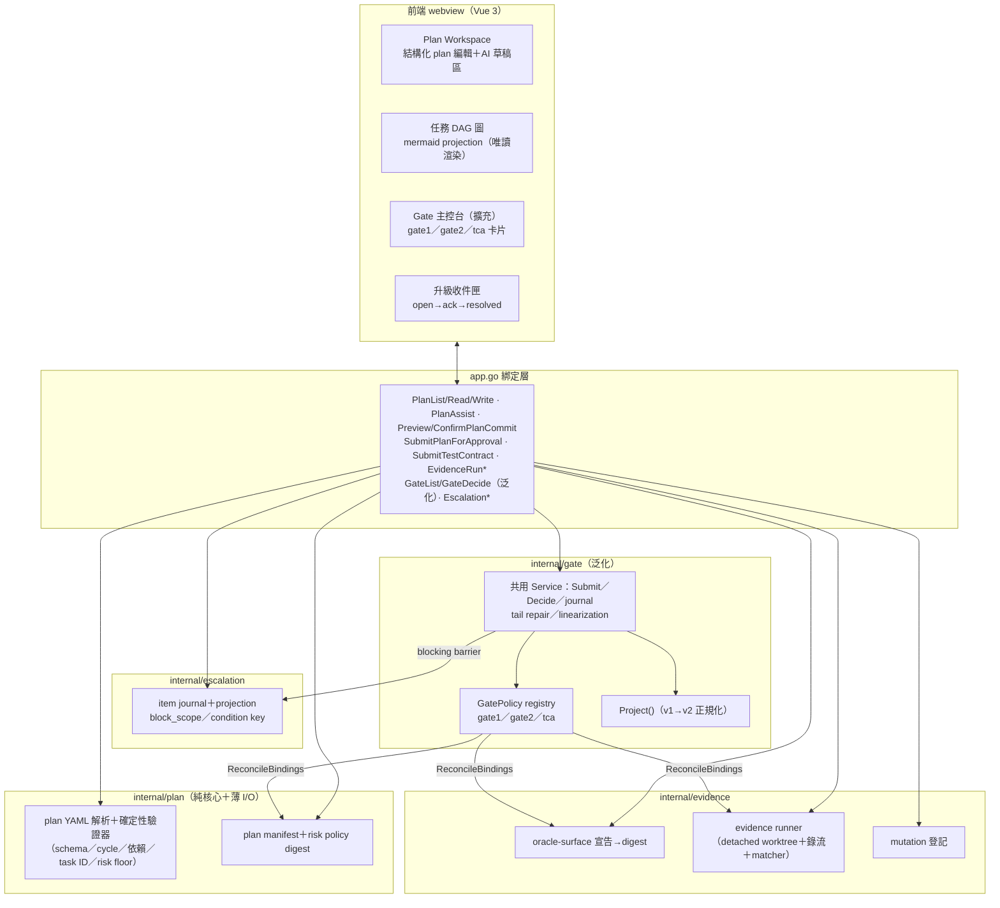

# M3a — 計畫與測試契約閉環設計

- 日期：2026-08-12
- 狀態：設計定稿 rev4，closure review APPROVED 2026-08-12（第一輪審閱 7 P1：supersession scope／binding role／test commit 快照／STALE 分類／核可權威順序／risk tier 三層／runner 安全邊界；第二輪審閱 7 P1：commit 身分三分／oracle-surface 宣告時機前移／TCA subject 含 plan_id＋gate2_approval 綁定／ApprovalRecord v2＋rejected 終態／risk_decisions[] 基數／evidence 一致性 validator＋落盤順序／workflow mutex 全覆蓋；第三輪審閱 4 P1＋1 P2：plan_commit lineage 封閉／risk decision 單一權威／gate2_approval 確定性重建／CAS durable 順序／輸出超限＝error；第四輪：plan validator 與 Gate 2 decision validator 的 risk 職責徹底分離、rejected 免 risk 輸入）
- 上游依據：`docs/architecture/sdlc-workbench-app-plan.md` §5.2–5.4、§7（M3 列）；`docs/architecture/sdlc-ai-agent-automation-plan.md` §3–§6（Stage B／C、Gate 2、Test Contract Approval、升級路徑）
- 前置里程碑：M0 ✅、M1 ✅、M1.5 ✅、M2 Stage A ✅（Gate 1 引擎、canonical manifest、兩階段 scoped commit、SpecAssist 隔離 one-shot）、i18n ✅

---

## 1. 目標與成功條件

M3a 交付**計畫與測試契約閉環**：Gate 1 生效的規格 → PlannerAssist 草擬計畫 → 人編修 → 確定性驗證 → scoped commit → **Gate 2 核可**（綁 plan＋risk policy＋權限清單）→ 測試綁定 → 本機 evidence runner 產 expected-red／negative-control 證據 → **Test Contract Approval（TCA）核可**；全程失效可偵測、fail-closed 有升級出口。

- **SC3 擴及 Gate 2／TCA**：每筆核可含 approver、decision、reason 與完整 bindings，事後可重建「誰在何時對哪個版本核可、該核可現在是否仍有效」。
- **STALE 為必要契約**（非附加項）：plan、risk policy、權限清單、oracle-surface、mutation、evidence 綁定依 §3.9 的分類判定失效並持久化；stale 核可不得作為後續 stage 的前置條件。
- **Fail-closed 閉環可驗證**：問題產生 → 升級收件匣可見 → 人修復／決策 → 系統重新驗證 → 解除阻擋，全程 append-only 稽核。
- **誠實邊界**：M3a 的核可與證據是**本機可重建、可稽核的記錄**，不具 branch protection／CI enforcement；自動化規劃所稱「CI run」的平台權威性要到 M4 forge 整合後才成立（同 app plan §8 效力邊界原則）。

**明確不含**（M3a 邊界）：多 session 並看（延至 **M3b 多 session 工作區**：同 provider 多 session、資源上限、事件重放視窗化）、forge／CI 整合與 `source=forge_ci` 證據（M4）、多角色 agent 編排與 `source=agent` 升級（M4）、收件匣的派工／留言串／SLA／snooze／多角色 routing。驗收聲明一律寫「M3 核心閉環完成，多 session 並看延後」，不宣稱凍結計畫中的完整 M3 已完成。

### 1.1 本輪四個 scope 決策（owner 2026-08-12 拍板）

1. **範圍切分**：M3a＝任務 DAG＋Gate 2＋TCA＋升級收件匣＋STALE 契約；「多 session 並看」為獨立且成本較高的擴張（牽動 session identity、資源上限、事件視窗化），切出為 M3b。
2. **TCA 證據模型**：App 內受控本機 evidence runner（隔離 worktree、精確 base_commit checkout、失敗特徵匹配），**不宣稱等同 CI**；「本機執行不管 checkout」不可採用（無法證明在核可綁定的 base SHA 上執行）；「外部證據 ref 登記」留作 M4 的 `source=forge_ci` adapter。
3. **Plan 來源**：比照 spec 工作區模式——read-only PlannerAssist 產結構化草稿進 Plan Workspace、人編修、確定性驗證、套用草稿才寫檔、兩階段 Preview／Confirm commit；Gate 2 只接受 committed HEAD 中的 plan artifact。
4. **收件匣來源**：系統自動（限定 §3.8 列舉的結構化 fail-closed 條件）＋手動建立（必帶來源 ref）；不把 provider session 事件自動灌入（一般對話重試／工具錯誤留在 Timeline）。

---

## 2. 架構與模組分解

沿用 ports & adapters 佈局。新增三個 domain package 與一次 gate 引擎泛化：



- **`internal/plan`**：plan YAML 解析、確定性驗證器（純函式）、plan canonical manifest；不含 I/O 的部分維持純 package。
- **`internal/evidence`**：oracle-surface 宣告與 digest、mutation 登記、evidence runner（worktree 生命週期＋執行＋matcher＋錄流）、evidence journal。
- **`internal/escalation`**：escalation item、append-only transition、projection、block_scope 查詢。
- **`internal/gate`（泛化）**：共用 Journal／Project／Submit／Decide／tail repair／concurrency linearization；gate 差異全部收進 **GatePolicy registry**（§3.1），不複製 journal/service。

### 2.1 GatePolicy registry（方案 A 定形）

```go
type GatePolicy interface {
    ValidateRequest(req GateRequestV2) error        // gate-specific bindings schema（cardinality／role／ref／digest 格式）
    ValidateDecision(rec ApprovalRecordV2) error    // 硬性 validator（含 §3.4 TCA evidence 一致性）
    SupersessionKey(rec ApprovalRecordV2) string    // "gate1|workspace"、"gate2|plan:<plan_id>"、"tca|task:<plan_id>/<task_id>"
    ReconcileBindings(rec ApprovalRecordV2) ([]StaleCause, error) // §3.9 分類重算；讀取錯誤回 error（fail closed，不寫永久 STALE）
}
```

Gate 1、Gate 2、TCA 各自註冊 policy；單一 `gate.jsonl` 保留全流程總序、共用 crash repair 與 projection。

---

## 3. 資料契約（實作前凍結）

### 3.0 Commit 身分（凍結詞彙，全文遵用）

三種 commit 身分明確分離，不得混用單一 `base_commit` 詞彙：

| 身分 | 定義 | 出現位置 |
|---|---|---|
| `analysis_base_commit` | PlannerAssist 實際分析的 code commit | 寫在 plan YAML 內（§3.5） |
| `plan_commit` | ConfirmPlanCommit 產生的 commit（plan 檔已入 HEAD） | Gate 2 的 `base_commit` binding 值（§3.3） |
| `test_commit` | 測試綁定 commit，**必須以 `plan_commit` 為祖先**；`plan_commit..test_commit` 只能修改 oracle-surface 路徑 | TCA 的 `oracle_surface.ref`（§3.4） |

TCA 的 `base_commit` binding 必須**精確等於**其 `gate2_approval` 所綁 Gate 2 記錄的 `base_commit`（即 plan_commit）。plan YAML 內寫 `analysis_base_commit` 而非自身 commit OID，避免「檔案內容包含自身 commit」的循環。

**Lineage 封閉（凍結；與 test_commit 規則對稱）**：`analysis_base_commit` 必須是 `plan_commit` 的祖先，且 `analysis_base_commit..plan_commit` **只能修改 `plan/**` 路徑**——等價保證 Gate 2 綁定的 code tree 就是 Planner 實際分析的 code snapshot（PlannerAssist 分析後、Confirm 前若 HEAD 混入其他 code commit，送核即拒絕）。此規則同時支援 Gate 2 退回後的多次 plan 修訂 commit（每次仍只動 `plan/**`）。ConfirmPlanCommit 的 **Preview token 綁定 `analysis_base_commit`、Preview 時 HEAD 與 candidate tree digest**；Confirm 時任一不符（含 HEAD 前移）即拒絕。

### 3.1 GateRequest v2／ApprovalRecord v2 與 supersession scope

新 `gate_request`／`approval_record` 皆寫 `schema_version: 2`，泛化為 bindings 陣列＋穩定 subject：

```
GateRequestV2 {
  _type: "gate_request", schema_version: 2,
  approval_id: ULID, gate: gate1|gate2|test_contract_approval,
  subject: string,            # gate1→"workspace"；gate2→"plan:<plan_id>"；tca→"task:<plan_id>/<task_id>"
  bindings: [Binding],
  created_at: RFC3339
}

ApprovalRecordV2 {
  _type: "approval_record", schema_version: 2,
  approval_id, gate, subject,
  decision: approved|rejected, approver: {id, method}, reason,
  bindings: [Binding],
  metadata: {}                # gate-specific：gate2 放 risk_decisions[]（§3.3）
  created_at: RFC3339
}
```

- **subject 是穩定 identity，不得以 digest 代替**：`plan_id` 跨版本不變（plan 檔內宣告，驗證器保證唯一且不可與既有衝突）；task subject 一律帶 plan 前綴 `task:<plan_id>/<task_id>`，避免不同 plan 的同名 task 互相衝突或 supersede。
- **Decide() 不接受呼叫端提供的 bindings，也不接受任意 metadata**：核可時從 journal 中的 `GateRequestV2` 複製 `gate`／`subject`／`bindings` 進 ApprovalRecordV2；呼叫端只提供 decision、approver、reason 與 gate-specific 的**受限決議輸入**（gate2＝per-task `{task_id, selected_risk_tier, override_reason?}`，§3.3），`metadata` 由後端從綁定的 committed plan 組出，不由呼叫端直接寫入。
- **Supersession scope**：新核可只 supersede 相同 `(gate, subject)` 的 active 核可。現行 `Decide()` 掃全部 active 的行為（`service.go` 泛化前為 gate1-only 故等價）改為以 `SupersessionKey` 過濾。
- **Rejected 終態**：projector 新增 `rejected` 終態（現行實作 rejected record 停留在 pending，泛化時修正）；v1 rejected 記錄 replay 後同樣落 rejected 終態。
- **舊資料相容**：projector 讀到 v1 記錄（含 `spec_manifest_digest`／`base_commit` 欄位、無 subject／schema_version）時正規化為 v2 形狀（gate1、subject=workspace、bindings 展開），**不回寫舊 journal**；以真實 M2 `gate.jsonl` fixture（含 approved 與 rejected）做重啟相容測試。

### 3.2 Binding role（P1-2）

`Binding` additive 新增選填 `role`；唯一性由 `kind` 改為 `(kind, role)`：

```
{"kind":"evidence_run","role":"expected_red",     "ref":"evidence:<ULID>","digest":"sha256:..."}
{"kind":"evidence_run","role":"negative_control", "ref":"evidence:<ULID>","digest":"sha256:..."}
{"kind":"mutation",    "ref":"mutation:<ULID>",   "digest":"sha256:..."}
```

舊 Gate 1 binding 的 `role=""` 維持相容。gate-specific schema（GatePolicy.ValidateRequest）驗 cardinality、role、ref 與 digest 格式。

### 3.3 Gate 2 必填 bindings 與 risk tier 三層

**必填 bindings**：`spec_manifest`（active Gate 1 所綁）＋ `plan`（plan manifest digest）＋ `base_commit`（值＝`plan_commit`，§3.0）＋ `risk_policy`（版本化政策檔 digest）＋ `permission_manifest`（**所有 task permission refs 的 canonical manifest digest**，非單一檔案）。

**Risk tier 三層與單一權威（凍結：selected 不入 plan、人在決議時選定）**：

| 欄位 | 決定者 | 權威來源 | 不變量 |
|---|---|---|---|
| `minimum_risk_tier` | deterministic policy 計算 | committed plan（§3.5） | policy floor |
| `planner_risk_tier` | AI 建議 | committed plan（§3.5） | ≥ minimum |
| `selected_risk_tier` | 人在 Gate 2 決議時選定 | ApprovalRecordV2.metadata（唯一出處） | ≥ minimum；可低於 planner 建議（防 AI 一律標最高造成阻斷），降回需 override_reason |

「Agent 只能提高、不能降低」解讀為**不得低於 policy floor**。Plan 是多 task，risk 決定的基數是 per-task：`Decide()` 只接收 per-task `{task_id, selected_risk_tier, override_reason?}`，後端從 `plan_commit` 的 committed plan 讀出 minimum／planner、組出**依 task_id 排序的完整** `risk_decisions[]` 寫入 metadata：

```
risk_decisions: [{task_id, minimum_risk_tier, planner_risk_tier, selected_risk_tier, override_reason?}]
```

**Gate 2 decision validator（硬性）**：受限 risk 輸入**僅 `decision=approved` 時必填**（rejected 只要求 reason，同既有慣例）；approved 時驗——決議輸入的 task 集合與 committed plan 的 task 集合**完全一致**（不缺、不多、task_id 唯一）；minimum／planner 與 committed plan 及綁定的 risk policy 重算結果相符；`selected < planner` 時該 task 的 `override_reason` 必填；`selected < minimum` 一律拒絕。整組 risk_decisions 與 `risk_policy` digest 一同凍結於核可記錄。

### 3.4 TCA 必填 bindings、測試快照重建與 evidence 一致性

**必填 bindings**：`gate2_approval`（所依 Gate 2 ApprovalRecordV2 的 ref＋digest）＋ `base_commit`（＝該 Gate 2 的 plan_commit，§3.0）＋ `oracle_surface` ＋ `evidence_run×2`（role=expected_red／negative_control）＋ `mutation`。

**`gate2_approval` 的確定性重建（凍結）**：

- `ref = approval:<ULID>`。
- `digest` ＝ 完整 immutable `ApprovalRecordV2` 的 **canonical JSON SHA-256**（含 `metadata` 的 risk_decisions；**不含**後續 transitions——transitions 是另行 append 的事件，不屬 record 本體）。
- Resolver 同時驗兩件事：digest 與 journal 中該 record 重算相符（內容定址），且 projection **仍為 active**（核可鏈）；Gate 2 STALE／superseded 時對應 TCA 一併 STALE（否則 plan 已失效、舊 TCA 仍顯示 active）。
- §3.4 validator 7 的 test contract descriptor **一律從該 record 綁定的 `plan_commit` 讀 committed plan**，禁止讀目前 worktree。

**測試快照重建規則（凍結）**：

1. `oracle_surface.ref` 必須是**完整的 test commit OID**（`git:<algo>:<oid>`）；digest 為 oracle-surface 路徑集的 canonical manifest digest（演算法同 app plan §5.3）。
2. Runner 驗證 test commit 以 `plan_commit` 為祖先。
3. `plan_commit..test_commit` 只能修改已核可宣告的 oracle-surface 路徑（超出即拒絕）。
4. expected-red 直接 checkout **test commit**（＝base code＋紅燈測試）；negative-control 在同一 snapshot 上套用 mutation。
5. Mutation patch 不得修改 oracle-surface 路徑，且 runner 必須驗證 patch 確實成功套用。
6. `EvidenceRun` 記錄 `test_commit`，由記錄可完整重建當時執行內容。

**Evidence 一致性硬性 validator**（TCA `ValidateDecision`，任一不符拒核；防止拿兩筆不相干的 evidence 送核）：

1. binding role 與 `EvidenceRun.kind` 相符。
2. 兩筆 `result` 皆為 `passed`。
3. 兩筆使用相同 `base_commit`、`test_commit`、`oracle_surface_digest`。
4. `oracle_surface.ref` == `test_commit`。
5. negative-control 的 `mutation_digest` == TCA 的 `mutation` binding digest。
6. expected-red **不得**攜帶 mutation。
7. `command`／`matcher` 精確等於已核可 Gate 2 plan 中該 task 的 test contract descriptor（§3.5）。

### 3.5 Plan artifact（YAML 單一權威來源）

`plan/` 目錄納管於 workspace git（納管 pattern：`plan/**`，涵蓋 plan 檔、oracle-surface 宣告、risk policy、權限清單檔，全數進 plan manifest；`scope_version` 同 M2 慣例）。單一結構化 YAML 為權威，DAG 圖是解析後的 projection，**不另外維護 mermaid 權威副本**：

```yaml
plan_id: M3A-001               # 穩定 identity，跨版本不變
analysis_base_commit: git:sha1:...   # Planner 分析的 code commit（§3.0；非自身 commit）
spec_manifest: sha256:...
risk_policy: sha256:...
tasks:
  - id: T1                     # 穩定 identity（TCA subject＝task:M3A-001/T1）
    title: 建立 evidence runner
    scenarios: [E1, E2]        # 對應 Gate 1 規格 scenario
    depends_on: []
    impact: {contexts: [test-contract], modules: [internal/evidence]}
    completion:
      - expected-red 可重建
      - negative-control 可辨識
    minimum_risk_tier: medium   # selected_risk_tier 不入 plan——由人在 Gate 2 決議時選定（§3.3）
    planner_risk_tier: medium
    permissions_ref: permissions/T1.yaml
    test_contract:             # descriptor 於 Gate 2 一併核可（§3.4 validator 7、§3.6）
      command: {executable: go, argv: [test, -run, "TestEvidenceRunner", ./internal/evidence/...]}
      expected_failure: {test_ids: [TestEvidenceRunner], matcher: "FAIL: TestEvidenceRunner"}
```

**確定性驗證器**（純函式，違反即拒絕套用草稿／送核）：YAML schema、DAG 無環、依賴皆存在、task ID 唯一且穩定、**risk 欄位只驗 plan 內兩層**——依綁定 risk policy 重算 `minimum_risk_tier`、驗 `planner_risk_tier ≥ minimum`（`selected_risk_tier`／`override_reason` 不屬 plan schema，由 Gate 2 decision validator 負責，§3.3）、scenario ref 存在於 active spec manifest。一般 schema 錯誤顯示在編輯器旁，**不**建立升級項目（§3.8 邊界）。

### 3.6 Oracle-surface 宣告（時機：Stage B、Gate 2 前）

以版本化設定檔宣告 path patterns（例 `plan/oracle-surface.yaml`，納入 plan manifest 範圍），涵蓋 step definitions、fixtures、helpers、snapshots、runner config 等完整 oracle surface；digest＝匹配檔案的 canonical manifest digest。

**宣告時機凍結**：oracle-surface path patterns、每 task 的測試命令與 matcher（test contract descriptor，§3.5）、執行權限**全部在 Stage B、Gate 2 送核前完成並 commit**，隨 plan 一併被 Gate 2 核可。Stage C 只依已核可宣告撰寫測試、登記 mutation 與執行 evidence runner——若宣告留到 Stage C 才寫，寫檔即改動 `plan/**` manifest、Gate 2 立即 STALE，時序矛盾。

### 3.7 EvidenceRun 與 mutation 登記

```
EvidenceRun {
  evidence_id: ULID
  kind: expected_red | negative_control
  source: local_app                      # M4 起 additive 新增 forge_ci
  base_commit / test_commit / oracle_surface_digest
  mutation_digest                        # negative_control 必填
  command: {executable, argv[]}          # 結構化，不接受 shell 字串
  cwd                                    # 隔離 worktree 的邏輯識別
  started_at / finished_at / exit_code
  expected_failure: {test_ids[], matcher}
  observed_failure
  stdout_digest / stderr_digest / recording_ref
  runner_version
  result: passed | failed | error        # passed＝證據成立
}
```

- **不可只以 exit code 非零判定成功**：expected-red 必須匹配預期失敗的 test ID／錯誤特徵；編譯失敗、缺相依、環境錯誤判為 `error` 並進收件匣。negative-control 必須確認同一組目標測試抓到 mutation。
- 原始 stdout／stderr 寫入不可變錄流檔（`.workbench/recordings/` 慣例）；evidence journal 只追加。
- Mutation 登記：patch 內容存檔＋digest；TCA 綁定 mutation digest。
- `command`／`expected_failure` 必須取自已核可 Gate 2 plan 的 test contract descriptor（§3.5），不接受臨場輸入。
- **Content-addressed 儲存與落盤順序（凍結）**：mutation patch 與 EvidenceRun artifact 存於 `.workbench/` 下的 content-addressed（CAS）路徑。順序固定為：**同目錄 temporary file → 寫入並計算 digest → file `Sync()`＋Close → atomic rename 至 CAS 路徑 → directory `Sync()` → append 並 `Sync()` evidence journal**——journal 內的 digest 永遠指向已 durable 且位於最終路徑的內容，任一 crash boundary 重啟後不會出現「journal 指向不存在檔案」。啟動時清理 orphan temp file；各 crash boundary 需有重啟測試。

### 3.8 升級收件匣（escalation）

**定位**：需要人做決定或修復阻擋條件的**例外佇列**，不是通知中心，也不是多角色 agent 信箱。

**系統自動來源（限定清單；condition key 去重**只對尚未 resolved 的項目**生效——同一條件再次發生時建立新 occurrence／generation，不因舊項目已 resolved 而漏報；啟動／讀取時依權威條件補建遺漏項）**：

1. Planner 風險無法依政策分類（fail closed）
2. plan／權限清單／risk policy 缺必要 binding
3. Gate 2 綁定（spec／plan／risk policy／權限清單）變更而 STALE
4. TCA 綁定（base commit／oracle surface／mutation／evidence）失效
5. evidence runner 逾時、環境錯誤、輸出超限或結果無法判定
6. expected-red 因錯誤原因失敗（如編譯失敗而非指定測試紅燈）
7. negative-control 未被測試抓到
8. journal degraded／持久化失敗／read error 致核可狀態無法安全判定
9. PlannerAssist read-only enforcement 失敗

**手動來源**：Plan Workspace／DAG 節點、Gate 2 項目、TCA 項目、evidence run 詳情、Timeline 事件皆可「建立升級項目」；**必帶來源 ref**（plan_id／task_id／approval_id／evidence_id／event_id），不能只有無法追溯的文字。

**處置語意（三態）**：`open → acknowledged → resolved`，append-only transition＋projection。resolved 必填 `resolution`、`reason`、`actor`、`resolved_at`，可附 evidence ref。不做派工／留言串／SLA／提醒／snooze／routing。

**阻擋規則**：每項有 `block_scope ∈ {workspace, gate2:<plan_id>, tca:<plan_id>/<task_id>, evidence:<evidence_id>}`；未 resolve 的 blocking 項目禁止對應核可；`acknowledged` 不解除阻擋。STALE、缺 binding、journal degraded 等**硬性不變量項目使用者不能手動 resolve**——只能修復後由系統重新驗證通過時 resolve，不能靠 waiver 解鎖；需要人取捨的項目可用 `accepted_risk` resolution（必填理由），但不能取代必要證據、不能解鎖硬性條件。

### 3.9 STALE 分類（P1-4）

依 binding 性質分三類，各 gate 以 `ReconcileBindings` 註冊自己的 resolver：

| 類別 | Binding kinds | 失效條件 |
|---|---|---|
| 持續重算 | spec_manifest、plan、risk_policy、permission_manifest、oracle_surface | 目前內容 digest ≠ 核可綁定 digest |
| 內容定址驗證 | evidence_run、mutation | ref 遺失或內容 digest 不符（**建立新 evidence run 不使舊 TCA 失效**；新版 TCA 送核時才 supersede 同 task 舊核可） |
| 歷史錨點 | base_commit | 不隨 HEAD 前移失效（否則建立 test commit 後 Gate 2 立刻 STALE）；只驗 commit 仍存在於 repo |
| 核可鏈 | gate2_approval | 所綁 Gate 2 記錄不再 active（STALE／superseded）→ 對應 TCA STALE（§3.4） |

讀取錯誤維持 M2 語意：**fail closed（拒絕核可），但不寫入永久 STALE**。Watcher 仍為通知層，讀取時重算為權威。

### 3.10 核可權威順序與 workflow mutex

收件匣不是核可正確性的唯一來源（避免「查 inbox 沒 blocker → 核可」的 TOCTOU）。`GateDecide` 固定順序：

```
GateDecide
  → reconcile bindings（§3.9）
  → 重新執行硬性 validator（gate-specific）
  → 檢查同 scope 的人工 blocking escalation
  → append approval
```

**Workflow mutex 覆蓋所有 blocking 狀態生產路徑**：`GateDecide`、reconcile（含 watcher 觸發）、escalation create／resolve、evidence run finalize 都必須先取得**同一個 workspace-level workflow mutex**；lock ordering 固定（workflow mutex → gate journal → escalation journal），避免兩個 journal 互鎖。

系統硬性條件以 validator 為權威；收件匣只是 durable 通知與處置介面。**escalation journal 寫入失敗時 Gate 仍必須拒絕核可**。

---

## 4. Evidence runner 安全邊界（P1-7，正式決策）

M3a 凍結以下邊界；「不做 shell 展開」只防一類注入，測試本身仍是任意程式碼，故**明示 M3a 不限制測試程式的網路與檔案系統能力、不宣稱 sandbox**：

1. 命令採結構化 `executable + argv[]`，不接受 shell 字串。
2. 固定 cwd（worktree 內）、清理敏感環境變數、限制輸出大小；**輸出超限＝`result: error`**（不完整輸出不得作為有效證據）並建立升級項目（§3.8 條件 5）。
3. Timeout 後終止整個 process group（沿 `internal/proc` TERM→KILL pattern）。
4. 每次執行使用唯一 **detached worktree，建在系統暫存目錄**（非主 workspace 的 `.workbench/` 內，避免巢狀 worktree、fsnotify watcher 與 git status 互相干擾）；`.workbench/` 只存錄流、metadata 與清理 registry。
5. 同一 evidence run 恰一次 finalize（沿 RecordingLease pattern）。
6. 啟動時依清理 registry 回收 crash 遺留 worktree。

---

## 5. PlannerAssist（read-only AI 草稿）

比照 SpecAssist 隔離 one-shot，但輸入面更寬（需讀 code）、寫入面同樣為零：

- **輸入**：active Gate 1 的 spec_manifest（committed snapshot）、精確 `analysis_base_commit` 的 code tree（記入 plan，§3.0）、人維護的版本化 risk policy。
- **Provider enforcement**：Claude 以唯讀工具白名單（pin `2.1.223` 旗標行為列 §9 待驗證，live probe 後定案）、Codex `sandboxPolicy=readOnly`；enforcement probe 失敗 → 該 provider 的 PlannerAssist fail closed＋收件匣項目（§3.8 條件 9）。
- **輸出**：結構化 plan 草稿（影響面分析、任務與依賴、完成定義、建議 risk tier、建議權限清單）進 Plan Workspace 草稿區，**不直接寫入正式 plan**；人套用草稿才寫檔。AI 建議的 risk tier 只能 ≥ minimum（§3.3）。
- 輸出不進一般對話、不污染 provider 用量（同 SpecAssist 慣例）。

---

## 6. 前端

| 元件 | 內容 |
|---|---|
| **PlanWorkspace** | 結構化 plan 編輯（CodeMirror 6，YAML）＋AI 草稿區（accept 才寫檔）＋驗證錯誤 inline 顯示＋Preview／Confirm commit（重用 SpecWorkspace pattern） |
| **DagPane** | plan 解析→mermaid flowchart projection（唯讀）；節點顯示 task／risk tier／狀態，點選導航至任務與對應 gate 項目；plan 檔變更自動重渲染（重用 DiagramPane watcher pattern） |
| **GateConsole（擴充）** | gate1／gate2／tca 卡片：gate 種類、subject、bindings（含 role）、證據連結（evidence run 詳情／錄流）、STALE 標示、核可／退回＋理由欄；blocking escalation 提示 |
| **EscalationInbox** | 佇列（open／acknowledged 分區）、來源 ref 導航、ack／resolve（resolution code＋理由）、blocking 標示 |
| **i18n** | 全部新 UI 進 zh-TW＋en 雙 locale，維持 key parity 慣例 |

---

## 7. 關鍵流程

**Stage B（計畫）**：Gate 1 active → PlannerAssist 分析 `analysis_base_commit` 產草稿 → 人編修（增刪拆任務、調依賴／完成定義／權限）→ **完成 oracle-surface 宣告＋每 task test contract descriptor＋執行權限（§3.6）** → 確定性驗證 → 套用草稿寫 `plan/` → Preview／Confirm scoped commit（產生 `plan_commit`，dirty-tree 拒核）→ 送核 Gate 2（subject=plan:<plan_id>，base_commit=plan_commit）→ §3.10 順序核可（含 per-task risk_decisions）。

**Stage C 前段（測試契約）**：依已核可宣告撰寫測試並 commit（`test_commit` 以 plan_commit 為祖先、僅動 oracle-surface 路徑）→ 登記 mutation → evidence runner 跑 expected_red＋negative_control（§3.4／§4）→ matcher 判定 → TCA 送核（subject=task:<plan_id>/<task_id>，綁 gate2_approval）→ 核可（§3.4 一致性 validator）。

**STALE／升級閉環**：綁定變更（§3.9）→ `binding_stale`＋transition＋（如 blocking）收件匣項目 → 人修復（如重跑 evidence、重送核）→ 系統重新驗證 → resolve → 解除阻擋。

---

## 8. 測試策略與驗收矩陣

依 SDLC v2（BDD→DDD→TDD）；Gherkin features 進 `docs/architecture/features/`（`plan-gate.feature`、`test-contract.feature`、`escalation.feature`），mermaid UML（context map 更新、plan aggregate、TCA sequence）進 `docs/architecture/diagrams/`，收尾嵌 README。

- **Go `-race`**：plan 驗證器（cycle／依賴／ID／minimum 重算＋planner≥minimum；**不含** selected／override，該欄位入 plan schema 即拒絕）、Gate 2 decision validator（task 集合一致、selected floor、selected<planner 時 override_reason 必填、rejected 免 risk 輸入）、plan manifest、GatePolicy registry、**多 gate supersession 隔離**（核可 TCA 不動 Gate 1／不同 subject 互不影響；**不同 plan 都含 T1 時 TCA 不互相 supersede**）、**commit 身分 lineage**（analysis_base_commit／plan_commit／test_commit 三分，祖先與路徑範圍驗證；`analysis_base_commit..plan_commit` 混入非 plan/** 變更拒核；**Preview／Confirm 間 HEAD 前移拒絕的 barrier 競態**）、**gate2_approval canonical digest 重建**（record 竄改偵測；descriptor 從 plan_commit 讀取而非 worktree）、**真實 M2 gate.jsonl fixture 的 v1→v2 replay 相容（含 rejected）**＋**rejected 終態 projection**、**GateDecide × blocker 建立的 barrier 競態**、**Gate 2 STALE → 所屬 TCA 連動 STALE**、**Gate 2 核可後進入 Stage C（test commit 前移）不觸發 STALE**、evidence runner（fixture 命令：紅燈特徵匹配、錯誤原因分類、**兩種 evidence role 完整性**、**兩筆 evidence snapshot 不一致拒核**、**timeout 後 worktree／process group 零殘留**、crash 遺留清理、落盤順序）、**CAS 落盤順序的各 crash boundary 重啟測試＋orphan temp 清理**、escalation projection（condition key 只對未 resolved 去重、occurrence 重建、**硬性項目無法由 UI 手動 resolve**）、journal tail 修復。
- **vitest**：PlanWorkspace／DagPane／GateConsole 擴充／EscalationInbox、i18n key parity。
- **E2E 驗收矩陣（實機）**：完整 Stage B→C 閉環一輪；STALE 情境（spec 變更→Gate 2 STALE；oracle-surface 變更→TCA STALE；HEAD 前移**不**STALE；Gate 2 STALE→TCA 連動）；fail-closed 情境（編譯失敗誤紅燈→收件匣→修復→重驗→解除阻擋）。
- **最終 gate（合併前完整套件）**：`go vet ./...`、`go test -race ./... -count=1`、`npm --prefix frontend run test`、`npm --prefix frontend run build`、`wails build`。

---

## 9. 風險、誠實邊界與待驗證假設

1. **Claude pin `2.1.223` 唯讀工具白名單旗標行為**（PlannerAssist）：live probe 後定案；probe 失敗則該 provider PlannerAssist fail closed，不改架構。
2. **git worktree 於系統暫存目錄的建立／清理行為**（含 crash 遺留、`git worktree prune` 語意）：實作前 spike 驗證。
3. **Evidence runner 效力**：本機可重建、可稽核，非 sandbox、非 CI enforcement；對外描述不得包裝成平台權威（app plan §8 誠實描述原則）。
4. **Risk policy 最小形狀**：M3a 以人維護的版本化 YAML 起步（tier 判定規則 deterministic）；政策內容本身不在本里程碑設計範圍。
5. **核可效力邊界**：M2–M3 核可只落本機記錄，不具平台強制力（沿 app plan 既有邊界）。

## 10. 實作分段（估 3–4 週工程量）

1. **契約凍結＋gate 引擎泛化**：GateRequest v2／ApprovalRecordV2＋subject＋(kind,role)＋rejected 終態＋GatePolicy registry＋Decide 從 request 複製 bindings＋v1 正規化＋replay 相容測試（含 rejected）。
2. **Plan 資料層＋Plan Workspace＋PlannerAssist＋DAG＋Gate 2 主控台**。
3. **Oracle-surface＋mutation＋evidence runner＋TCA 主控台**。
4. **升級收件匣＋阻擋 barrier＋E2E 驗收＋diagrams／README 收尾**。
